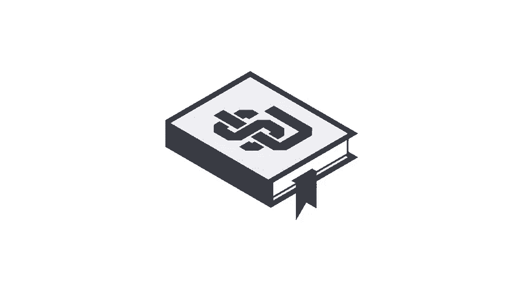

# 2024年亚马逊跨境电商开店教程，零基础亚马逊运营课程【合集】Amazon亚马逊跨境电商入门到精通教程（纯干货，超详细！） - P17：5.5、了解我们的上传准则 - 蛋哥说亚马逊 - BV1Ux2ZYPEFB

。

某些产品严禁任何卖家在亚马逊上销售，买家相信他们可以始终在亚马逊上放心的购物。我们的网站上所提供的产品需要遵守所有法律和法规，以及亚马逊政策，严禁销售非法、不安全或其他受限产品。😊，属于受限类别的商品。

通常是您可能期望的商品。未经FDA批准销售的产品，可能认为有危险的武器或其他产品有毒物质，具备攻击性的产品，召回的产品不符合FCC规定的电子产品等。😊，您可能尚未接触过的其他寿险产品。抱歉。

如果您打算贩卖海洋哺乳动物，那您别指望了。好消息是，您可以节省运费。😊，如需完整的列表，请在卖家平台中快速搜索收限产品，点击链接并向下滚动，以查看当前列表。如果您需要任何说明，请单击特定的受限产品类型。

以查看可销售产品和不可销售产品的事例。😊，从同一页面中，您可以单击查看我们的整个受限产品政策。您需要定期检查这两个页面。因为他们经常会有新信息更新。在发布产品之前，每个卖方都有责任仔细查看我们的政策。

并确保每个产品都遵守所有适用的周及联邦法律。即使我们的政策中没有列出。😊，销售寿限产品可能会导致除其他要求以外，立即终止您的销售权限或者销毁运营中心库存，而无任何赔偿。因此，在发布产品之前。

仔细查看我们的政策至关重要。以下是您可以遵循的一些最佳实践，有助于确保您避免任何麻烦。不要仅仅因为某产品未被列入我们的严禁销售产品清单，或具备现有ASINRE段该产品允许销售。

确定一个或多个对产品、行业以及适用法律有最新了解的员工，对您销售的每个产品进行审核。定期仔细查看我们的受限产品政策，严禁销售产品清单以及您自己的产品目录。如果不是从制造商处购买。

请务必了解产品的来源以及可能销售产品的法律框架。如果您要销售药物或补充剂，请了解他们的成分，并调查是否准许销售。🎼最后，为了保险起见，如果您不确定某产品是否准许销售，请不要发布该产品。

