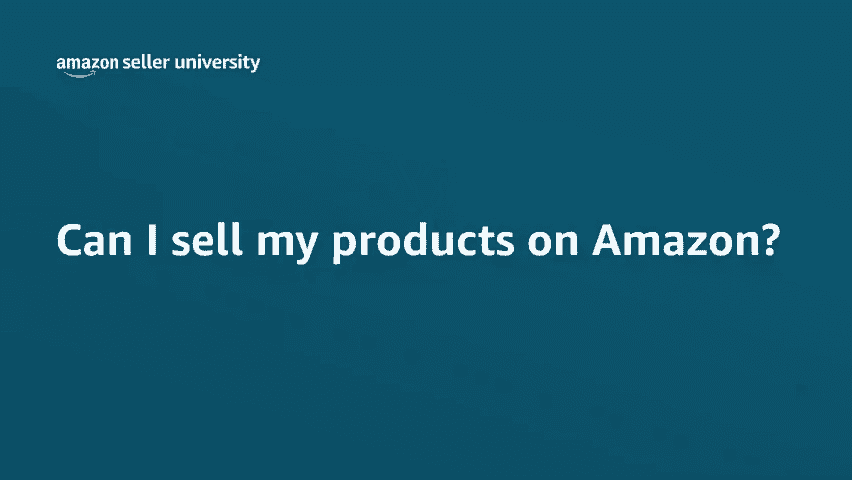
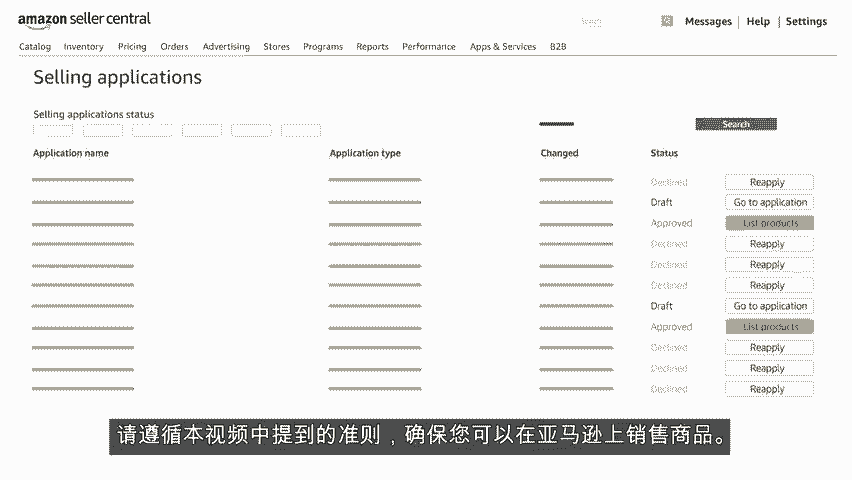

# 2024年亚马逊跨境电商开店教程，零基础亚马逊运营课程【合集】Amazon亚马逊跨境电商入门到精通教程（纯干货，超详细！） - P18：6.6、需要批准的商品 - 蛋哥说亚马逊 - BV1Ux2ZYPEFB

🎼欢迎观看视频，我能在亚马逊上销售商品吗？🎼在亚马逊，我们致力于成为全球最重视客户的公司。🎼我们希望客户相信他们始终可以放心的在亚马逊上购物。🎼亚马逊上销售的商品必须遵守法律法规以及亚马逊的政策。

我们的受限商品政策是我们确保卖家遵守标准的方式之一。🎼要了解我们的受限商品政策，请在卖家中心主页的搜索栏中输入受限商品。您会找到受限商品的列表和包含更多信息的链接。🎼一定要查看这些链接。

以确定您的商品是否可以在亚马逊上销售。🎼将无法在亚马逊上销售的商品上架，可能导致您的销售特权被取消。🎼如果找不到要查看的受限商品部分，最好转到inventory库存，选择ad product。

添加新商品，然后搜索要销售的类似商品。🎼检查是否受到上架限制，单击listing limitations上架限制，就可以了解销售该商品的要求。可以在亚马逊上销售的受限商品。

通常需要一个账户才能通过审批流程。🎼可以在类别、子类别或ASIN级别上进行审批。🎼亚马逊希望卖家了解销售其打算提供的商品，需遵守哪些法律、认证和法规。无论这些商品是卖家拥有的，还是来自其他品牌。

🎼账户必须提供以下内容，才能通过审核。🎼发票商品图片。🎼确保商品符合包装标准和准则。🎼证明商品符合安全准则的证书或检测文件。

🎼亚马逊也可能限制销售特定品牌或某个品牌家族中的特定ASIN品牌审批通常需要以下信息。您打算销售的品牌商品的有效货源提供的发票。🎼品牌拥有者的授权书，您打算销售的品牌商品的图片。

转到catalog目录选项卡，并选择view selling applications，查看销售申请。🎼可以跟踪受限商品和品牌商品的审批情况。您的状态将列为approved批准。

declined拒绝或in draftra正在起草。请遵循本视频中提到的准则，确保您可以在亚马逊上销售商品，非常感谢祝您销售愉快。

