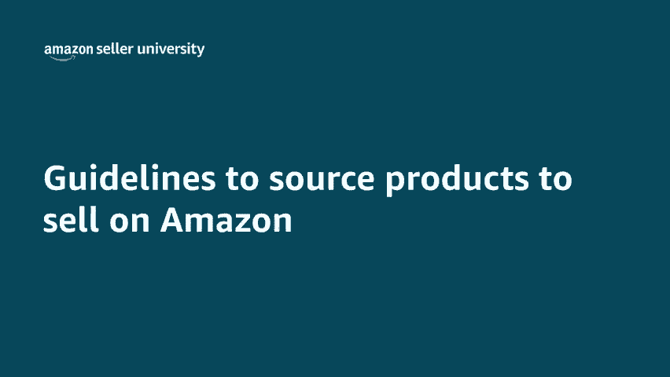
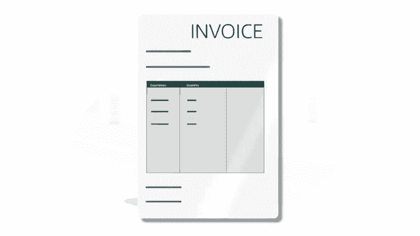

# 2024年亚马逊跨境电商开店教程，零基础亚马逊运营课程【合集】Amazon亚马逊跨境电商入门到精通教程（纯干货，超详细！） - P19：7.7、采购需要在亚马逊上面销售的商品 - 蛋哥说亚马逊 - BV1Ux2ZYPEFB

🎼欢迎观看有关在亚马逊上销售上架商品的准则的视频。😊。

🎼在考虑将在亚马逊上销售何种商品时，了解亚马逊的准则很重要。作为亚马逊卖家，您可以销售来自第三方品牌的商品或您自有品牌的商品。🎼如果您选择成为亚马逊卖家，了解我们对上架商品的期望和政策很重要。

🎼亚马逊尊重他人的知识产权。作为卖家，您有责任确保您在亚马逊上销售的商品。🎼遵守所有适用的法律法规，以获得销售或转售授权。🎼并且不会侵犯版权。🎼专利、商标和宣传权等知识产权。

🎼以下是在亚马逊上销售上架商品时要考虑的5条重要准则。🎼一、确认您的供应商。🎼作为卖家，您有责任采购并销售正品。🎼如果您要销售品牌商品，直接从品牌商获其直接分销商或批发商。🎼采购商品始终是最好的做法。

🎼如果您通过分销商或批发商购买品牌商品，您需要确认他们与该品牌的关系。🎼怎么做？以下这些信息来源可帮助您验证供应商的可靠性。🎼，🎼他们的营业执照。🎼品牌授权书、办公和仓库地点。

🎼商务局评级以及可以证明供应商信誉的其他信息来源等。🎼如他们在网上和社交媒体上的形象。🎼他们供应特定品牌或商品的时长、新闻文章。🎼以及可能更多的其他信息，查阅公司网站上的关于我们部分。

也是一个不错的主意。这样可以了解他们的发展历史、当前业绩计划以及未来计划。🎼2、与品牌商建立关系。尽管您可能能够从值得信赖的供应商购买商品，但对于某些商品，您可能仍然需要获得品牌商的明确许可。

才能在亚马逊上销售其商品。🎼因此，与品牌商建立关系非常重要，这样可以确保您符合销售这些品牌商品的所有品牌要求和亚马逊政策。🎼3、保留交易发票。🎼亚马逊可能邀请您提供发票等单据。🎼以表明您的商品是正品。

或您拥有上架销售他们的授权。🎼采购打算在亚马逊上销售的商品时。🎼一定要保留所有发票。🎼发票有助于证实您从有效的供应商处购买了相关产品。🎼发票包含关键信息。🎼如供应商的名称、地址和详细联系信息。

在将这些单据提供给亚马逊时，您可以删除价格信息，但单据的其余信息必须清晰可见。🎼该单据应逐项列出您购买的商品的介绍和数量。🎼对于打算以新品new状态销售的商品，单据开具日期还应在过去的365天内。

4、了解亚马逊的直送政策。🎼亚马逊允许卖家根据我们的直送政策，对商品进行直送。🎼可以在卖家平台的搜索栏中输入直送政策，jorop shipping policy来找到该政策。🎼要正确实施直送。

卖家必须首先确认直送方是他们所要销售商品的有效供应商。🎼在确定供应商有效后，一定要签署标有日期的服务级别协议。在您与直送供应商之间正式建立关系。🎼要遵守亚马逊的直送政策，您必须是商品的登记卖家。

🎼在所有装箱单发票。🎼外包装以及其他与之相关的信息中注明自己是商品卖家。🎼在配送订单前，请删除所有标识第三方直送方的装箱单、发票、外包装或其他信息。🎼负责接受和处理所售商品的客户退货。🎼需要指出的是。

亚马逊严禁零售商间的直送。🎼5、拍卖或拍卖式环境不能算作正当的货源。🎼严禁在亚马逊上转售，打算销毁。🎼处置的商品或者被制造商、提供商、供货商或零售商规定不得销售的商品。如果您是品牌所有者，该怎么做？

如果您拥有自己的商标，您可以作为品牌所有者销售商品注册商品的品牌所有者可以充分利用亚马逊品牌注册计划所提供的所有权益保护和计划。亚马逊上也允许销售自有商品手工或定制商品。

🎼您有责任确保您在亚马逊上销售的商品，遵守所有适用的法律法规。🎼已获得销售或转售授权。🎼并且不会侵犯版权、专利、商标和宣传权等知识产权，保留单据很重要，这样可以证实您与自己的商品的关系。

🎼原材料或成品的发票就是一个例子。🎼他们应包含供应商的名称、地址和联系信息。🎼以及您的公司名称、地址和联系信息。🎼发票应逐项列出所购买商品的介绍和数量。🎼在将这些单据提供给亚马逊时，您可以删除价格信息。

但单据的其余信息必须清晰可见。我们的视频介绍到此结束，非常感谢，祝您销售愉快。😊。

