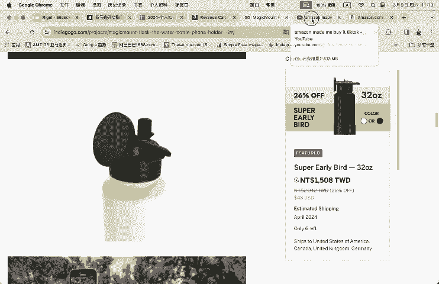
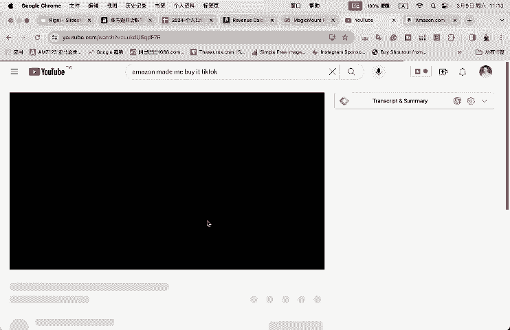
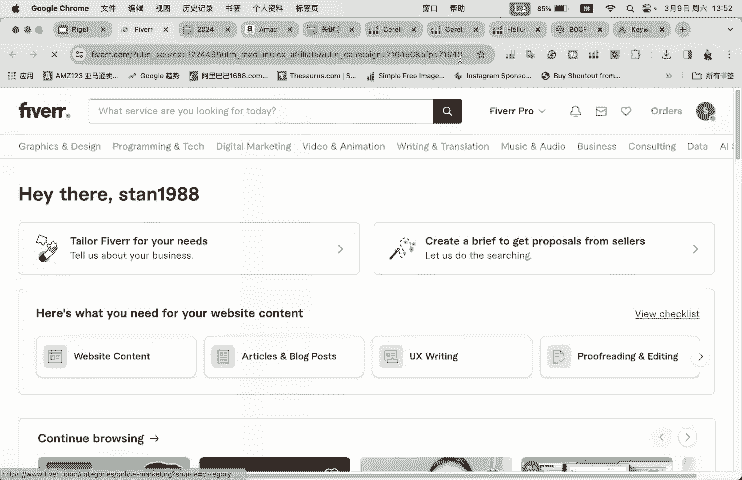
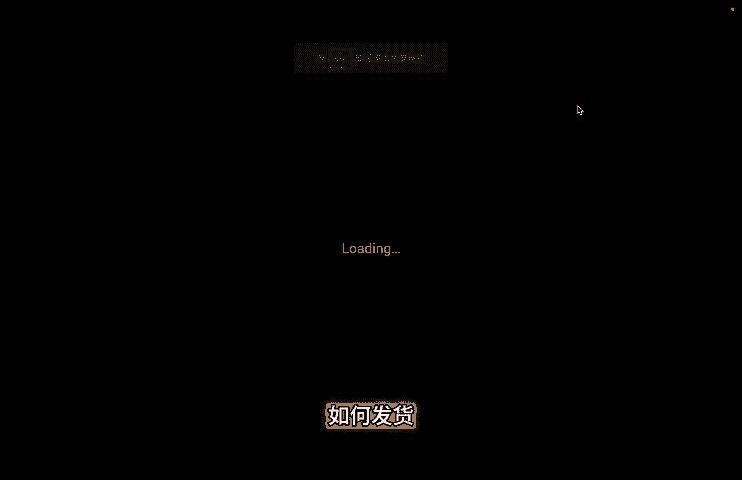
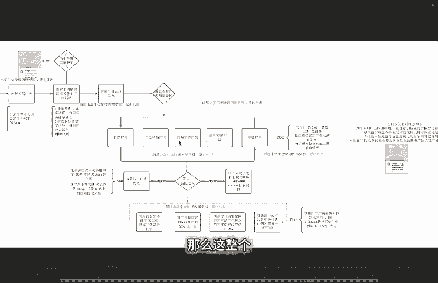

# 2024年亚马逊跨境电商开店教程，零基础亚马逊运营课程【合集】Amazon亚马逊跨境电商入门到精通教程（纯干货，超详细！） - P1：最新亚马逊跨境电商新手零基础入门到精通实操视频教程 - 蛋哥说亚马逊 - BV1Ux2ZYPEFB

今天这期视频我将跟大家分享2024个人如何从零开始做跨境电商亚马逊。那么今天视频将主要分为九大部分。那么他们分别是第一个呢跟大家介绍一下亚马逊的FBA生意模型现状如何。那么这里面呢以美亚为例。

第二部分来跟大家分享如何进行店铺的注册。第三部分呢，如何进行亚马逊的选品。相信呢这一部分也是很多小伙伴非常关注的地方。第四部分，那么如何寻找供应商及交谈时应注意的要点？

第五部分来跟大家分享如何创建亚马逊销售链接listing。第六部分如何发货？第七部分来跟大家分享一下我们的产品生产完以后，在投程阶段呃，在产品入仓到亚马逊AB仓库之前呃，那么我们还没有正式开售的时候。

这段时间应该做哪些动作？我要不要把对应的时间白白浪费掉。第八部分，那么产品到货以后，我们应该如何开启我们的亚马逊广告。第九部分后续店铺运营的时候，亚马逊卖家应该关注的要点有哪些。

那我们今天的视频呢有很多新的内容呃，然后还有配套的一些表格。大家现在可以看到。那么现在视频中展示的我们有利润统计表格流量垄断程度、产品差异化啊，list性打造checklist竞品横向比较。

那么这5个表格基本上囊括了我们在呃我们这些视频主要的重点内容啊，跟我们的这些视频呢是配套使用的。如果有需要的小伙伴呢，可以一键三连点赞关注投币留言需要我就会发你。好的，那么接下来呢我们就正式开始吧。

开始我们的第一部分。亚马逊FBA生意模型现状是如何的啊？2024还是否值得做啊，那么这里面呢我基于的这部分内容。

基于的一个数据上的来源呢是呃rangoscott在2023年底做了一个有关亚马逊是否还值得做的一个分析报告。那么大家呢从中可以看到，现在呃亚马逊啊它的一个现状是怎么样的。好。

那么这个报告的网址呢就如下方所示，大家如果有需要呢，也可以自己啊在网上去搜索一下，看一下全文啊。那么这里边呢我会摘录一些里面啊比较重要的点来跟大家分享一下。

首先呢就是2022年亚马逊的收入是5140亿美元，高于2021年的4690亿美元。那么其中第近4分之1的它的这个销售额呢是由第三方卖家推动的。

那么也就是像我今天跟大家分享了这个我们做的FBF亚马逊FBA这种生意模呃，生意生意的方式啊。呃，我们第三方的卖家中呢有86%使用的亚马逊FBA的物流来履行其亚马逊业务中的一个订单。也就是刚刚提到的。

我们使用的这种amazonFBA的这种这个生意模型啊。那么也可以看到呃，整体来讲，虽然亚马逊和其他电子商务平台的竞争在加剧，但是线上的购物需求也随之增加，有一半的消费者啊在互联网上开始。

购布的时候呢会选择亚马逊为主要的入口啊，那么这是呃相当于一个总览。我们来看一下亚马逊平台目前的呃一个整体的一个现状。啊，可以说还是在以美亚为例呢，还是在美国的这个线上呃电子商务领域的话。

还是头部的那么一个存在啊。第二部分来跟大家分享一下，那么亚马逊卖家他们的销售额的分布区间在什么呃位置啊。我们首先可以看到有25%的亚马逊卖家呃，他们的月均销售额在1000到25000美金之间。

那么45%的卖家，他们的销售额在25000到25万美金之间，17%的亚马逊卖家，他们的销售额呢是少于500美金每个月的啊。那么下一方要有更详细的各个卖家，他们在亚马逊上面的一个呃销售额的一个分布区间。

那么大家可以看到，其实大部分的啊卖家他们呃在亚马逊上面的一个销量呢都能够达到啊1万美金以上。这是目前呃呃亚马逊卖家他们在上方的一个，你可以理解为呃，实际上这些卖家呃他们的一个销售表现啊。

那么我们看完销售表现以后，其实我们要看一下他们的盈利状况是怎么样了，对吧？那么我们可以看到。嗯。73%的亚马逊卖家，他们的利润率是高于10%的，35%的亚马逊卖家，他们的利润率是高于20%的。

那么47%的亚马逊卖家，他们整个的就是全生命周期啊，也可以理解为它的生意模型的，全生命周期，他们的一个利润是超过这个10万美金的啊。嗯。这是一个平均的一个数值嘛，对吧？啊，然后下方呢也有更详细的。

大家可以看到呃，在各个利润区间啊，它所占了亚马逊卖家的一个比例。整体来讲呢，亚马逊的规模和收入每年都在持续增长，推动了其实他其对第三方卖家的一个需求。我们可以看到亚马逊每年对于亚马逊卖家的一个招商。

其实呃都是每年都在层蹭递进的啊。那么第二点呢，就是虽然竞争在加剧，亚马逊网上购物的整体需求呢也确实是在增加的那个状态。可以说呃线上的购物需求还是一直存在。那么不管是亚马逊还是其他电商平台。

它只不过是一个你渠道上的选择。只不过目前亚马逊的这个渠道仍是一个头部的一个呃一个这个排名吧啊，那么最后呢就统计数据也显示很多亚马逊卖家能够保持盈利，收入也不错。那么我可以说呃。整体来讲呢。

卖家在这个平台上还是能够获得一定的经济利润啊，那么基于上方的三点呃，我再呃结合一下我自己的一个看法啊。那么毫无疑问的，亚马逊这个平台呢还是在不断成长的过程中。呃，随着其他平台。

那么大家知道的所有这个我们中国呃品牌的一个出海了一些大的平台啊，比如说特项特目啊，比如说像谁那比如说像dkt shop啊这些平台，那么存在的竞争在加剧，这也是事实啊，但为什么说参与的卖家变多。

这里面我指亚马逊卖卖家啊，那么竞争变激烈，也在另一个侧侧面说明呢这个平台还是能够给卖家带来实实在在的一个经济收益的啊，就像刚刚提到的。呃，我不知道其他同学有没有什么反馈，但是基于基于我来讲。

因为会在互联网上做一些内容上的一个分享。其实近半年来我分享的内容其实并不是特别的频繁，但是每天还是有不同的人来加我来询我亚马逊这个生意如何能否去做啊。

而且呃以我所在的城市、深圳为例啊呃我感觉周围入局的卖家，这几年给我的感受就是只增不减。那么大家关注我朋友圈的话，可以可以看到啊，我经常会发一些朋友圈。比如说我去这个楼下的停车场。

还会看到有一些这个亚马逊卖家在发货啊，周围的也有很多人呃，比如说出来呃，哪怕去喝一杯咖啡，都能听到别人在讨论这个亚马逊啊快捷电商这些东西啊。那么但是有一个我觉得啊2024呃有新入手的卖家。

我可能务必要去明确的一点，就是2024大家做亚马逊的。这个呃想法或者说一直以来呢，我也提倡大家，大家做亚马逊要拿出12分的精力去好好经营，这不是一个被动收入。我强调一下，这不是一个被动收入。

那很多人觉得是不是我在亚马逊上，他不需要克服，我把我的链接上去以后就不用管了啊。那么这里要强调一下，这不是一个被动收入。你在亚马逊上投入的精历，金钱和汗水呢，跟你在线下实体经营的难度是一样的啊。

但是平均来讲，亚马逊的回报确实是要高出传统的生意模型。而且呢对于我个人来讲，他对人时间上的一个解放，我觉得是很多其他生意模型所不能够比比拟的。比如说不受地域限制啊，你可以在世界上任何一地方去敬你的生意。

做自己时间的主人。我相信这一优势呢就值得大家去好好研究亚马逊黑BA的这个生意模型。好的啊，这是。我们的一个前景啊，那么接下来呢开始我们的第二部分。啊，来到我们亚马逊店铺如何进行注册这部分啊。

这里面以美国站为例啊，需要准备的材料和注意事项有哪些？好，那么我们接下来看一下提前准备的材料包括哪些。我们需要提前准备的材料有啊第一个公司营业执照的彩色扫描件啊，这里面跟大家讲啊。

亚马逊要求提供了所有的扫描件啊复印件啊，或者是他提到你可以发送照片，但是我还是建议大家用扫描件的方式去提供啊，那更清晰，而且更不容易出现问题。因为它很多注册的过程中是不可逆的。

如果说你的照片拍摄的有问题啊，或者是不清晰啊，或者是什么呃显示的这个呃文件不完整啊，这都容易导致你后期的这个呃注册的过程中受阻啊。第二个呢是法定代表身份证件的身份证或护照彩色扫描件或照片。

第三部分呢可以进行付款的信用卡啊，那当然它需要是那种外币的啊多多币种的信用卡啊，你要用vissa或者万事达都OK那么这里面呢还是建议大家使用vissa。然后这里也提到就是你呃销售多国了。

比如说你可能还要注册欧洲的店铺的话，那么你的visa卡一定是可以注册呃，可以可以支付相应地区的呃不同国家的货币的啊。第二个呢，确认一下你的信用卡呃，没有过期，而且具有充足的额度。

而且对网购或者邮购付款没有任何限制，这个呢需要去你跟你的发卡行来进行一个确认。然后还要去呃申请一个单独的电子邮箱地址，然后你的法人的电话号码。公司的地址联系电话啊。

那么有关地址这部分有很多小伙伴会呃比较这个迷茫啊，因为有的时候会亚马逊会收到一些，比如说什么二审呐，而些地址上的一个验证。那有些同学可能会讲这个地址。我没有办法去提供水电煤气账单啊。

那么这部分呢啊其实这里提前跟大家说一下，就是这个地址呢，你可以去主要是能用你名下的，不一定是你实际的这个公司的地址，你可以去经营的地址也OK啊，能够去使啊能够去证明啊，你的这个名称。

你自己的法人的这个地址跟你的这个这个实际使用能够证明一致就OK了啊，不一定非得说让你营业执照上的地址。呃，第四部分呢用于接收货款的呃银行账户。那么现在呢你可以直接使用国内银行账户你可以使用海外账户啊。

然后你还可以使用第三方的这个收款软件上提供的一些账户啊。这是我们提前大家需要准备的一个材料啊，那么我们将这些材料准备好以后，我们再去看呃亚马逊实际上啊对应的一个注册上的一个要求啊。

亚马逊其实它本身呢在它的亚马逊全球开店的呃官方网站上面有详细的账户注册的流程。那么呃大家可以看到我现在PPT展示的啊，这一页，那么就是它的一个注册的一个指导的网页啊，大家这里对应像不同站点。

它会有一个相应的1个PDF文档给到大家一步一步你去操作下来，其实是非常简单的。所以说这也是为什么讲我在这一部分呢没有跟大家啊特别啰嗦的详细去落每一步了。你看到这个注册文档。

其实每一步它写的都非常非常清晰的，而且是最新的一个指导文件，大家可以在亚马逊全球开店呃的这个官方网址上没找到。那么这里最后呢再跟大家强调一下注册的一个注意事项。这也是亚马逊呃。

我这部分截图呢是通过他的这个官方的这个指导文件上面截图看到的啊。首先跟大强跟大家强调的话呢，就是啊它的每一步注册的时候是不可逆的啊，所以说你在注册的时候，你可以中间中断。

倒是不能回到上一环节去完成注册啊。然后呢，你要去认真的检查一下你所填的信息。啊，亚马逊注册的阶段呢，大家还是要去呃自己呃踏实下心来去呃注册，去填写相关的资料。不用着急啊，你可以中断。

你可以回过头来再去填写啊。但是呢每一步填写的信息一定确保准确无误啊。然后呢就是呃除文档中特别要求的地方，其他部分呢都要求各位填写的是拼音或者是英文来进行填写啊。啊，第四步呢是保证你的资料的真实性和完整。

第五步呢，确保你提交的这个邮件的地址啊，电话号码啊，能够亚马逊随时找到你啊。而且你要确认一下，不能是呃你你接下来要过要换的这种手机号啊啊，这个比较麻烦啊。第六部分呢就是你的信用卡和借记卡。

那都建记使用你的法人的卡啊。啊，这样的话得后续比如说你提供一些账单的时候时候呢，验证的时候就方便多一些啊。然后呢，就是提到你的注册时的一个网络的环境。那么不建议你使用VPNVPS。超级浏览器啊。

当然这部分呢大家也可以按照你自己实际的对风险的预估去自行一行判断啊。呃，然后接下来是你的发票啊，比如说后面他有的时候会要求你在某些类目上面啊，或者是说你呃受到亚马逊的审核的时候，这需要去提供啊。

然后运营合规这是必须的了啊。然后后面是呃三个啊，咱们这个呃不同非大陆地区的这个国这个卖家，他们的这个呃在注册的时候，地区的选择这不赘述了啊。然后最后呢就是呃在注册过程中呢。

大家经常可以看到有取消注册的按钮，一般都是在你填写上述资料的时候呢，会看到你右下方会有一个或者是旁边有个出现一个小字，要你取消注册啊，那么这些呢呃不是说啊你你退出的时候，你直接把网页关掉就好了啊。

你不用点击这个取消注册。如果点击取消注册，有可能会导致你后续的无法继续啊啊。好的，那么这部分呢就是呃我要跟大家分享的有关店铺注册的部分啊，整体来讲呢还是比较简单的啊，主要把几个资料啊准备好。

准备呃齐权以后再去进行下一步的申请工作。然后在申请的过程中呢，严格按照亚马逊的建议的文档去执行。最后呢再注册的时候呢，有些注意事项啊提前知晓就OK了啊。好的，那么我们完成了我们的选品以后。

完成我们的这个账号注册以后呢，就会来到啊我们的下一份的呃部分，就是有关亚马逊的选品了啊。那么说到亚马逊的选品工作呢，是很多卖家比较头疼的部分，很多卖家都卡在了这里。啊，包括我自己在开始的阶段也是这样啊。

目前来看呢，我觉得选品的工作也是一个需要量的积累，才能达到最终想要的结果的的一个过程吧。啊。那么你比如说很多卖家呃，如果说你真的没有思路，你也要要强制着自己啊，比如说一天选出十几二十个产品出来。😊。

你累积到一定量，对产品对选品的感觉就会有啊。啊，然后但是今天呢呃我在2024跟大家选品的时候呢啊想要去跟大家强调的是呃有两个点要把握住。第一个呢，不要做杂货铺的亚马逊店铺了啊。

第一款产品选定时呢啊尽可能或者是一定要有一个长远的打算，要有做垂直，做品牌的一个想法。第二个呢是不要做mewo一类的产品。就不要做平台上面现有的完全一模一样的一个产品啊啊。

这两部分是我想再跟大家分享啊具体的在选品部分的内容的时候呢，呃想跟大家强调的两点啊，就要大家呢能够记住啊，有这样的话，你在选品开始的阶段啊，对这个数据上有一个比较准确的把握啊。

整体的方针上有一个准确的把握以后，你后面好多事情就好做了啊。好的，然后呢我们今天选品部分呢将主要分为两部分。它们分别是第一个呢是产品灵感的一个收集。第二部分的一个产品灵感的一个验证啊。

你可以理解为产品条件的验证啊。然后呢，我们这次呃分享的过程中呢，会涉及到很多的表格数据。然后刚刚在开篇视频开发刚刚大家提到了。呃，是跟我们这个视频配套使用的。

大家可以把在视频描述栏下方添加上你的邮箱地址，然后呢会系统会自动发送给你的这个表格，好吧嗯。好，我们接下来正式开始有关产品灵感收集的部分啊。那么在产品灵感收集的部分呢，我会跟大家提供三种渠道啊。

里面涉及到了啊我看应该有6种的验证6种方法吧啊。第一种渠道呢是亚马逊卖家常用的软件的使用方法。这里面我会跟大家从三个不同软件举例。第一个呢是黑林ton的一个关键字选品。第二部分呢是战功的一个产品筛选。

第三部呢是一个卖家精灵的ABA选品啊，这三种软件呢都是我在日常工作中经常用到的啊，我们在产品灵感收集的阶段的渠道尽可能的多广。因为我们这部分其实你是不太明白自己将来要做什么样的产品。

所以说在灵感上的收集上啊，保持一个比较开放的一个状态。然后呢尽可能灵感的来源啊渠道多一点啊。那么第二个渠道呢跟大家分享的是一个站外的众筹网站的一个灵感的一个收集的一个举例啊，我会跟大家详细的讲。

第三部分呢是youtube视频的一个灵感的收集啊。好的，那么接下来呢就来到我们选品灵感收集的第一个啊方法介绍。那么使用halinton的啊black box里面的这个关键字选品的方法啊。

那么这个black box里面有多种的选品渠道和选品方法。那么这里面我跟大家这次介绍了，主要是这个s关键字的啊，有关linton的使用教程更详细呢，大家可以在我的这个频道主页里面去找到啊。

那么曾经我曾经录制过一个完整的linton怎么使用的一个教程。今天这部分呢主要聚焦黑inton啊黑盒子选品里面的一个关键字啊的一个选品方法的一个分享啊，那么很多同学啊。

那么可能不太了解为什么要使用关键字来进行选品啊，那比如说我们现在来到亚马逊的前台，我想购买一款产品啊，比如说我想购买一个这个烧烤手套，对吧？啊，那么我可能会去搜索BBQ啊gs啊。

那可以说这个搜索框是很多消费者在亚马逊上面进行购物的第一个环节，对不对啊？那么这个关键字就代表着一个潜在的销量和一个产品转化的可能。啊，大家可以看到不同的关键字，它对应着不同的一个搜索热度啊。

也对应着不同的消费者的一个搜索诉搜索需呃这个诉求，也就是他购买这个产品的一个诉求，对吧啊？那么这也是我们为什么来第一点来跟大家介绍啊，我们使用黑联特的这个关键字来进行选品的一个原因啊，你可以这么理解吧。

我们选产品其实就是在选关键字啊，对于亚我们的亚马逊卖家来讲，对吧？OK那么这里面呢我会按输入几种条件啊，来跟大家呃来让这个黑林特来帮我抓取一些适合我想要售卖的产品的信息啊。好的。

那么首先呢我会去搜索一个，比如说这个关键字啊。我会要求他至少啊每个月有1000的搜索热度，就是这近一个月有1000次的搜索呃数搜搜索热度啊。那么月均的销售额呢，我会要求了。

比如说每个月至少有7000的销售额啊，然后产品的一个售价区间，这个关键字的售价区间呢，我会以要求它比如说是在20美金啊，到啊55美金之间啊。然后嗯接下来呢这个review review count呢。

它代表着一个竞争程度的呃一个这个指标吧啊，那么我这里面就啊这一块呢就不做过多的一个限制了啊。那么reviewwriting部分呢啊，我想要去跟大家说一下呢，就是比如说啊亚马逊比如说我输入这个关键字啊。

那么亚马逊带出来很多产品，对吧？啊。我们想要的这个产品机会是什么呢？就是说目前呃广大消费者对这个产品啊不是特别的满意啊，不是不带不是特别的满意的一个指引是什么啊，那就说它的一个星级评价啊。

那星级评价我想要它不想太多。比如说这个目前是4点5分，对不对啊啊，或者是我们直接打开黑linton的这个Crome浏览器插件，我们能够看到大致的啊它的一个这个目前的类目中的一个表现啊。

大致大家是一个什么样的一个状态啊，比如说它的销售额平均的售价啊，那么这里面我想要的，比如说它可能我不想让它啊它的一个星级太高。那比如说这里面就设置一个最多不超过4点3分啊。

然后what count呢这部分代表着它的呃这个产品关键词是由几个单字组成的啊，那么这里面我选择最少有两个单词组成啊。好的啊，然后接下来下方呢是更详尽的一些这个过滤条件啊。

但是我们在初期的灵感收集的时候呢，我们尽可能不把条件设设置的太死，就设置的太详细。如果你设置的过于详细的，就很多产品机会你可能会错过。上面这些其实就已经足够了啊。好了，然后接下来我们点击search啊。

然后可以看到黑林特呢就会去抓啊，能够符合我们恰方提到的这些关键字啊，要求的这些关键字是哪些的？帮我们抓出来啊。OK那么大家可以看到现在。黑呢就帮我们抓出来啊很多这种词了，对吧？看到了对吧？啊。

那比如说我就看第一个词啊，第一个词。这什么？这是给狗狗这个洗脚的，对不对啊？我们看一下啊。好了，那么大家可以看到啊，这就带出来的这些呃产品啊，是什么样的一个产品啊？

然后呢呃我们可以如果说你有意向的感兴趣的，你就可以把啊这个产品啊呃点击一个这个收藏啊，它就会收藏到你的产品啊列产品的这个呃这个这个列表里面了，或者是你自己啊重新再开一个这个excel表格啊。

把这个ason记录下来啊。那么这个呢就是我们使用hainton的呃这个关键字选品选出来一些呃这个意向的产品词出来啊，那么大家呢就可以去啊把它收集一下。

然后我们通过呃今天呢像在这个产品灵感收集部分呢跟大家把这个几个产品收集完了以后啊，我们演示完了以后呢，我们再到这个产品灵感验证的环节啊。

O那么现在呢我们就完成了helinton blackack box黑盒子里面的关键字的选品灵感的一个收集。接下来呢我们来到第二个渠道啊。

使用GS啊jungle Scottcott的它的里面的一个啊产品数据库的一个过滤啊。OK啊，那么在这部分呢呃我们进入到啊我重新进一下，给大家重新演示一下啊。啊，比如说现在我把全部的条件都删除掉啊。

那么刚刚在呃linton的这个blackb黑盒子部分，我们完成的是使用关键字来设是进行产品的收集。啊接下来呢我们来做的就是让jungle Scottcott经在现有的产品数据库里面去帮我们筛选出来符合我们需求的产品信息啊。

那这里面它有很多的啊这个选项可以共选择来跟大家介绍一下啊，那么首先左边的这个啊肯定就是你的你想要在选的这个产品的市场。那可以当可以看到这个呃glescott这里面支持这些美国、欧洲啊。

南美以及日本站的站点，对吧？啊那么下方呢是你想要去做的一个类目啊，然后我建议大家一般可能选择2到3个啊，最多不超过5个类目来去筛选产品啊，比如说这里面选择baby啊，然后再选择啊这个花园啊运动啊。

然后宠物我选择了这4个类目来。然后接下来呢啊我会做产品的一个筛选啊，那么这里面我会选择产品是标准尺寸啊，然后卖家的种类呢，亚马逊自营亚MFBA啊，FBM亚马逊自发货都OK啊。

然后下方呢就有一个filter啊。那么这个部分就是对于产品它的一个过滤吧，就是你想要做什么样的产品。这也没有会想到啊我想要去做的，比如说呃这个产品本身啊它的这个消费者呃这个卖家呃的质量一般啊。

这里面有个LQS啊，那么这里面就是一个listing的质量得分啊。里面就会涉及到，比如说他的星级评价啊，还有他的文案啊，是不是特别的优秀的啊，我选择这这是一个呃指标啊。不超过6分。

然后pro products啊就是这个产品星级很差啊，只有3。6分啊，固ROI呢就是我的投产比啊，或者是我的利润期间相对高一点。那么选择这三个啊，它已经帮我预设好的参数来进行选择。

当然大家在这部分呢也可以去按照你自己的想法去设置啊。那比如说可以把价格设置到35美金以上啊，然后它的一个这个啊单个的一个啊这个净利润大致是多少？这里是15美金，最低对不对？然后它的星级最多不超过3。

6分，那么这里面可以可以比如说稍稍放高一点啊，4点3分啊，O啊，那么我按照这种参数。设置好以后啊，那么我去点击设置啊，当然这里面呢还会有一些，比如说你呃排除一些关键字啊啊，专注一些关键字啊。

那么这个呢我们在产品流感收集的部分，我们不做呃过多的限制。我们点击设置。OK那么我们点击测试完以后啊，那么这啊GS就会帮我们把这些数据呢都啊抓出来啊，然后呢大家去啊按照我们想要的这个产品呢的这个要求。

你去比如说你去把它啊这个啊逐一的筛选过来啊，因为看现在它的这个灵感呢还是比较多的，对不对啊？我发现这个有很多户外的衣服是吧？我可能会把这个spo到的这个我直接给它勾掉啊，把这个搜索结果稍稍再放少一点。

啊，同样的道理，我比如说这里面我发现一些。这个产品呃诉求呢我比较感兴趣的啊，那么我是可以一个是点击到啊亚马逊的前台去看一下。另外呢我们也可以去啊呃把它这个asen记录下来啊。OK啊，这是做什么的？啊。

这个这个这个这个。植物的一个保护的铁架子对吧啊？O啊，那么大家呢就可以按照这种方式把你想要去意向的产品记录下来。然后我们到第二个环节，产品验证灵感。合适我们再详细的跟大家讲，我们去如何去参考这些灵感啊。

好的，接下来呢我们到我们的第三个渠道使用卖家精灵啊的ABA搜索词啊来进行产品的一个选取。好的啊，那么接下来呢我们来到卖家零大数据选品里面的ABA数据选品。那么这个ABA数据选品呢。

你可以把它理解为啊我们后台啊亚马逊在检索整个啊，比如说一段时间它分比如说周月季度的时候呢，像这些40 term就是搜索词在整个亚马逊站内搜索词排名的一个变化。那么我们使用啊这个ABA数据选品呢。

就是为了筛选出来，这里面有一些这个词的异动的啊的这个产品的机会啊。那比如说现在它其实卖家精灵呢，帮我们归纳。出来了几种参数。那么这里面刚刚我选择了这个快速飙飙升的市场啊。

那么这里面想到这个增长量近一周内，那比如说这里面它的这个增长的这个。呃，值那比如说我们可以比它比如说把它去设置1个1000啊2000啊等等，都okK然后排名增长率啊是多少，50%啊。

然后呢我们点击开始筛选。这样的话，它就相当于我们能够看到最近一段时间啊，亚马逊站内它的搜索词排名啊比较啊靠前增长的比较快的啊，这些词分别是什么？然后呢。

我们从这些词上面就能够找到啊哪些相应的一个产品机会啊出来啊啊，当然这个呢大家要去呃更实际的去呃现啊现场去看，就是来到产品页面去看一下啊。这些词我们收集完了以后啊啊，其实我们还有另外的一个部分。

我们要去做一个这个呃它的一个产品灵感的验证。这是我们呃呃下一个下一环节的一个工作啊O啊，那么这是呃卖家精灵使用ABA呃来进行选品的一个方法啊啊这个方法呢，好在它是呃直接对接的亚马逊后台的数据啊。

就更准确更快一些啊，前面这两个呢我们都是通过黑林ton还有GS他们的一个自己的算法筛现出来的一个产品啊。啊，那么我们介绍完前面三个啊通过工具来进行亚马逊产品灵感的收集的方法以后呢。

我们来到我们的第四个啊，我们通过站外的网站啊，众筹网站音碟勾go来搜集一下。潜在的亚马逊产品灵感啊，那么像印迪gogo这种众筹网站呢，网站还有很多。这里面我只举例一个啊，那么像这种众筹网站。

它对于呃消费者的呃这个痛点和诉求是调研的比较清楚的。那么我们可以在这上面找一些呃相应的呃关键词产品之类的。我们来去看一下，在亚马逊上没有类似的产品存在。然后呢，我们去找相应的这个产品出来啊。

找这样的机会啊。那比如说啊比如说这里面可能看你像这个啊，那可能说像这是一个在慈溪的水壶，对不对啊？那么我可能会呃把一些比如说这个关键字啊复制过来啊。我们来到亚马逊前台。啊。

这里面我随便啊去打开一个亚马逊前台。那我去搜寻一下。啊，来看一下啊，那可以看到。呃，这里面有呃这个卖家已经在做这类似的产品出来了，对不对啊？啊，这个产品灵感就是一个呃我们通过这种方式找到的啊。啊。

当然了这个呃有很多的这些灵感，如果说我们是通过数据上，可能它比较新的产品，我目前啊是找不到是提炼不出来的对吧？那后就有通过类似这种正筹网站能够找到类似产品啊啊，这是一种方式。你还有可以。

比如说像kickstar，还有很多这种类似的众筹网站，大家都可以在这上面去找一些啊产品出来啊。好，接下来我们来到第五个方式啊。第五个方式呢是呃我们使用啊youtube来搜寻一下相关的一个产品灵感。

那么其实呢我习惯性的在youtube上面去找一些啊这个呃。

我们在youtube去找一些什么tktok上面一些产品灵感的合集啊，为什么这么说呢？就是呃亚马逊上面的就是很多产品啊呃。就tkt上面啊，那非常大的一个流量池，对吧？那么有很多的网红在这里面进行带货啊。

他们会做一些相应的传播量高的视频呢，就会有一些youtube上面的啊比如说像这个频道，他会把它做一个合集啊，来给大家展示youtube最近一段时间。哎，卖的比较好的啊产品。

或者是大家浏览量比较多的这个产品分别是什么啊？然后呢，大家逐一的去翻看一下啊，来看一下目前这些产品在亚马逊上面的机会如何啊。好的，那么以上呢这5点呢，就是来跟大家分享的。

我们通过5种方法来收集我们的亚马逊产品灵感。啊，那么收集完我们的亚马逊产品灵感以后，其实我面对的呃问题就是我们的第二步进行一个产品的一个验证了，对吧啊？好的，那么完成了我们产品灵感的收集工作以后呢。

第二步呢就到了我们的一个产品灵感的验证阶段了。那么在产品灵感验证的阶段呢，我跟大家提供了三个表格，分别是利润率的统计，流量垄断程度的判断产品差异化潜力和竞争程度的一个计分项。

那么这些呢呃大家呢可以通过描述栏下方的这个呃视频描述栏下方啊填写自己的邮箱地址。然后呢，系统会自动发送给你啊。我们来看一下这几个三个表啊，它分别验证的是哪些东西啊。

首先呢这个第一个呢我们进行验证的是我们的一个利润率的一个统计。第二个呢是流量垄断程度的统计。第三个是我们产品差异化潜力和竞争程度的一个呃分析吧。啊，那么首先呢利润率的统计。

我觉得是我们整个产品验证灵感第一环非常重要的一步。我们来看一下这个产品啊，我们做下来经济能不能赚钱。那么这里面呢，我以烧烤手套里面的这款产品为例，大家可以看到这款产品啊，它的一个毛利润。大致是多少？

26。07%是吧？大家在这里面要填写相关的数据以后呢，系统会自动带出来。那么我们要去填写的数据分别是什么生产成本。这里面呢我包含了这个产品的设计费用，包装费用，产品主体的生产的费用啊，以及头程啊。

主要是这四大项。那么我预估的一个费用呢，大致是4美金。然后就是亚马逊的一个费用。那么在亚马逊的费用这里面呢，我添加了，比如说类目类目的费用。B配送费仓储费退换货费用汇率损失。然后PPC广告费呢。

目前是没有添加的啊。然后这部分我们来看一下，像这个产品生产成本呢啊，大家就自己啊去预估一下，添加上就好啊。你可以上1688上面看一下采购价在上面它标签的价格上面上浮个15%左右。

基本上就是这个产品的一个生产，你大致的一个采购的一个啊主体的一个费用了啊。然后亚马逊的费用，那这里面呢我们可以来到亚马逊官方有一个利润计算器，就是这个利润计算器。

大家把这个as那么这里面我以这个产品为例的话，会把这个添加进去。这里面我们可以看到我们的这个亚马逊的类目的。费用佣金费用。尾城的配送费用，然后还有仓储费用啊，然后呢。

我们把这些费用呢都一一的添加到这里面啊，然后呃添加完这三项以后，还会有退换货费用和汇率损失这三项啊。那么这部分的时候呢，我们会有一个比例。那么呃退换货比例一般是3%，汇率损失可能是1%啊。

然后呢我们来呃都带进去以后，就会把相应的一个利润和RI计算出来啊，那么我建议大家呢选择产品的时候，今年啊至少要在一个35%到45%之间的一个毛利利润期间进行选择啊，因为我这里大家可以看到。

其实少了非常重要的一项，就是PPC广告的花费，对吧？啊，那么你一般情况下，你的广告花费。😊，你在你的整体的产品售呃售价成本呢可能占10%左右。那么我们有35%的毛利润区间的话。

你可能还能剩个25%的净利啊，那么这才可能啊，你做的可能是这个做起来还比较啊有这个收益，对吧？啊？所以说呢这个毛利润率啊，大家呃重点关注一下啊，OK那么这是第一个表格的一个使用啊。

第二个流量垄断程度部分。那么比如说我们现在啊呃在亚马逊上输入相关的文字，我就以这个产品为例啊，那可以看到。啊，搜索结果首页上面有很多产品出来，对不对啊？对于亚马逊上来讲。

很多产品就大部分产品他们的转化都会在发生在搜索结果的首页位置啊，嗯很少部分发生在第二页第三页啊，那第四页就更不用想了啊，那么这些部分才是形成转化了一个主力。我们通过去计算呃。

我们主要的asen它有多少词啊，在它在这些词下面排名能够排在首页啊，然后呢再计算另外一个数据，它占有这些词流量大致是多少。我就能看一下全景的来看一下这个类目的一个竞争情况是怎么样的啊。嗯。

然后呢我会实操来跟大家演示一下我们这个表格是怎么做出来的啊。比如说现在呢我就以这个为例吧啊，我们以这个为例来跟大家演示我们是怎么计算啊它的一个数据上的一个这个呃比比值的啊。

那么这个我会用到heinten的呃black blackack box啊。而会使用黑联色的black box啊来查头部的10个竞品啊。我们点击。啊，hington X3啊。我们来抓一下主要的10个A。

啊，然后呢我们这时候呢会我会把这个广告位的产品啊都过滤掉啊，我只要这个自然味的啊，我会选择10个啊，最主要的产品出来啊，来反差一下啊他们的一个流量上的占比的情况啊。

那比如说现在呃我是呃是这个产品这个产品形式啊，大家注意一定要选择呃你的这个呃相似程度高的啊这种产品啊。啊。啊，这是一个啊没关系啊，我跟大家举例啊，有些可能他的这个。呃，产品形式可能还呃不太像啊。

那我就少选几个啊。那刚刚给大家演示的那个表格里面看到的是10个as。那么我们看我们这个产品，如果说它太少了，那么我就有多少as来就选多少asin啊，大家能够看呃，这里面公式我怎么去呃选择的就OK了啊。

怎么去编辑的啊啊，这也是这也是一个对吧？啊，O啊，那只有5个是吧？没关系啊，那么尽可能呢大家呢以10个作为一个标准。那么今天演示呢，我们这个产品只有是只有5个啊相对比较新的那么一个产品。

我们点击reable。然后系统呢去把这5个asen嗯，它的被收录的关键字啊来进行一个反查啊，数据呃跑出来。好啊，那么我们可以看到。这5个as目前一共有4550个1个关键字，对吧？啊。

然后呢我会去筛选一下，比如说这是一个比较新的产品啊，我会对关键字的过滤呢来做一个筛选。比如我只看月经搜索热度大于100的关键字有多少个。我们点击ly filter。啊，大家可以看到目前是3134个。

对吧？我们把数据导出来CSV文件。好的，那么刚刚啊我们就相当于是把我们要做要分析的数据呢下载下来了啊。然后呢，这个数据里面这个呃列里面的一些数据很多，我们是用不到的啊，我们把哪些删掉呢，跟大家说一下啊。

首先这个关键字呢，我们是要留下的对吧？啊，然后呢，我们这个是要删掉的。啊，我们只留1个40valueum这一行要留下，然后这些都删掉。删掉啊，删到这个位置。清楚啊。然后呢。

这个position rank我们留着，然后这些呢我们删掉啊，那么我就能够啊呃竞品了，这个也删掉啊。那么刚刚跟大家看到是吧，我们刚刚呢在ton这里面其实是看到了我们用到了是5个asen，对不对啊？

那么我这5个asen呢，其实这里面这个position rank这一列其实就是这个F8B结尾的第一个它的在这些词下面的一个排名啊，那么这5个数据。

比如说这个F8B在这个词下的排名是排在搜索结果里排在第一名啊，后面呢只是排在第二啊一次大家都能够看到对吧？O啊，那么这5个就是我们接下来要去分析的来分析一下啊这些词啊，这些son啊。

在收录了这些词下面他们的这个流量的垄断程度是一个什么样的范围啊那么首先呢我们要做的第一个操作呢是来测试一下来来来计算一下这些as。呃，跟这些词啊，他们的一个相关度啊，这里面相关度指的是什么？

指的是全部的啊这些5个as在这个词下搜索结果排名越靠前，说明它跟它跟这个词的联系的紧密程度越高啊。然后这个部分呢我会有用到一个公式叫count if。啊，看 off。c死这个啊。

然后呢范围就是这个范围啊，然后呃全部的在这些词下面搜索结果排名啊，呃我们看到这个呢就是呃区间的一个限制，对吧？我们把它呢排在搜索结果首页，代表它的排名的这个呃紧密程度就越高来计数，看有几个asyn啊。

是不是这个词下面越多的as森这些这在这个词下排名在首页，说明它跟啊这个as森的紧密程度越高啊，对不对？啊，那么我们回到搜索结果的部分来够看到其实呢呃。作为一个产品，在搜索结果首页的时候，我们抛去自然位。

一般情况下在首页能有30个平均的一个展示位啊，但是不同词下面它带出来的搜索结果数量是不同的。有的可能就有16个，对吧？但平均下来可能就在30个是左右啊。

都能够比如说你在这个词下能够排在呃前30都能确保你在首页的位置。然后这样的话呢，我们在这个部分的一个参数的选择就是30啊，所有呢这5个as在这些词下面啊排名小于30呢，我们就计数就计成一个一啊。

那么我可以看到啊，这里面没放这个。呃，小于30啊。啊，小于30啊。所有小于30所有小于30的啊，我们计数呢记承啊记一个一，你看只有55个，对不对？它是D25排名分别是这个。

那说明就是啊技数紧密成了就是5，那么最高就是5了，对吧？因为我们只有5个A，对不对啊？然后呢，相关度这里面我按照由高到低的顺序进行一个排列啊。好的，那么相关度我们确认完了。接下来呢我们去计算它的比例啊。

然后在这上方呢，我插入呃几行啊，插入四行。OK啊，那么我先计算第一个呃总的热度是多少啊。总热度这里面呢我是指啊只要有一个啊相关度唯一啊，都计算成一个总的热度啊啊，对，然后这里面数据要进行一个整理。

就是可以看到这里面有一些呃出现到零的啊，那么在计数的部分呢，也会给它记记录进来啊。那么这个呢我们就要去只有单单纯的这一列需要我们额外的去关注一下筛选啊，把全部的零的这些数据呢给它删掉啊。OK啊。

OK那这样就就哦OK了啊。好的，那么接下来呢我们来做这个呃排布啊。走热度。我总总热度的其实就等于相关度，只要大于一的，我们大于等于一的，我们都算到这个热度里面啊，那么等于我用一个sm函数s。好的。

然后呢我们去呃把全部的这些流量。多少计算一下啊。向下这。好，那么我们算出来了，大致是11万多，对吧？然后呢，我们去计算另外的一个参数就是。那么我们知道啊就是我们回还是回到这一页里面啊，对于消费者来讲。

😊，它是不是你搜索结果排名越靠前的，它购买的概率就越高，对不对啊？那么这个部分呢我们就有两个参数，一个是10名和30名呃，来做一个参数区间的统计啊。那回到这里面，我看一下。

各个aen在排名搜有结果排名呃，排在前十0名的它的流量的总和是多少啊？啊，歼十。啊，关键字热量总和。啊，然后呢。啊，还有一个是前30。关键质两组合。然后呢，前十流量占比。前30流量占比。OK啊。

那么我们就。嗯，来公式来看一下。我看一下前十关键字呃流量总和。这个时候呢我会用到一个叫sumif的函数啊。3X函数啊，然后呢区间呢就是这个啊我会将所有的。啊，呃这个。呃，相关度唯一的啊，都把它添加过来。

下面。我们来看来索引呃，第一个asson啊，他在。这个。搜索结果啊排在前十的有多少啊？我来算一下。嗯。okK啊，那么这个区间呢我们也。再现完了啊。然后呢，逗号。我们来设置一个区间，对吧？

我这个区间设置的就是。啊。Xiaoy。嗯。等于。10啊。啊，这是。10350搜索热度前十流量关键组合啊，然后这里对要强调一下，就是我要把这流量这一列40 volume这一列固定住啊。啊，这里固定住。啊。

因为我们后面的其他的那几个as呢，我们直接一拉就好了，把它固定上。嗯。固定一下啊。好，然后呢我们把这公式复制啊，那么前三0呢，我们把这参数改一下就OK了。啊，这里面有我们要调一下。😔，调笑。好。

前30呢就是2万呃2万2万26000，对吧？啊，OK那么接下来我们看看占比。就是他。前十流量占比啊。啊，同样我们把这一列给它给锁定。OK啊，那么。这个占比是多少啊？

那么这部分呢我们把它做成一个百分比的形式，对吧啊。单元格我们去把它选择。百分比。百分比。啊啊，然后呢我们这样把后面的这些呢一拉，我们就都过来了啊。哎，我们可以看到。呃，前十的啊部分呢可能就这个卖家啊。

他是比较优秀的。我们可以看一下，他在很多词下面都已经有了相应的这个占比了。那前。前呃，前30它占比占80%啊，前1榴万占比占19%啊，那么其他一些竞品还OK对吧？我们看一下这个卖家是谁呀啊。

他的这个产品还是挺强的，对不对啊？啊，但是我们目前看了这是5个asen，对不对啊？那么大家看10个asen，它数据上可能又不太一样了。啊，就是这个A3。啊，给它的销量。

还有它的这个数据呢啊相对都是好一点。啊，占比这相对比较多一点啊啊那么大家呢啊您可以看一下其他的竞品啊，它可能就。啊，没有那么强，对吧？啊，那么我们想要的呢就是尽可能的像这种呃，其实他前十也不算垄断了。

对不对啊？也就是只有一家，它的表现还是比较强悍的。那么像其他竞品的时候呢，其实还是有机会。如果说这个新进的产品，在流量上面我们这么去判断的话呢，就能够知道哎啊那这是符合我们去进入的一个判断标准的啊。

就是没有超过比如说前十流量占比有3个以上的卖家，他在前十流量占比超过50%。啊，同样在切30的没有超过3个以上的卖家，占比超过50%。那么都是啊一个呃信号，我们是可以去判断下来，可以去可以去进入的啊。

当然呢是以10个A森总数为基数的时候的一个标准啊。这步呢就是我们刚刚啊在表格里面跟大家提到的啊流量占比的分析的这一块啊，就这一块是怎么弄？流量垄断程度，我们是怎么分析的啊。好好的。

然那么接下来呢我们就来到了这个产品差异化潜力和金融程度分析这一块啊，那么我们看一下第一个呢啊它是一个计分项啊，那么一共是10个10个选项啊，那么我们统计的一个标准呢，就是。啊，大于6。

那么相对来讲就是一个比较好的一个信号。就是我们可以去进入。因为产品力，说明了还是有区间来让我们去进行提升和差异的啊。那比如说第一个呢就是产品星级，那么可以看到这个竞品，它的产品星级是。4点8分啊。

那么我们就没有办法去勾选，它不是小于4点5分，对吧？啊，那么消费者痛点，那么消费者痛点我们能够去点击进去。

我们可以用到的工具呢啊同样我们可以用hiinten的啊这个我们可以用hiinten它的里面有一个review insight功能啊啊比如说我们我们要来到啊这个产品页面啊，我们点击进去。啊。

我们点击去以后呢，在这里面点击review insight size功能。review insight size呢就是去分析产品痛点的部分啊。那么你看它的平均评分，这里面是4点6分啊，然后呢。

我们来看一下这里面呃呃Qs关键字里面啊，所有的涉及到的这里面它的呃所谓的这个差评啊有哪些，对吧？啊，啊出现的频率比较高的啊。那么越多这种参数代表我们可以去改良的方向就越多啊。

那我可以看到这里面是啊有存在着一定的痛点的对吧？那么我们可以去把它勾选了啊，产品功能待完善呢，也是我们在呃它这个呃我们的一个黑linten它这个reincent功能里面呢就看到的啊。

那比如说呃当然这整个的过程的分析呢，就要大家花时间去看的啊。那比如说这里面我就看，比如说id't啊，没有完善的什么啊，比如说它有的说这个厚度啊啊隔热能力啊啊，或者是没有。达到他消费者的预期啊。

那么我们去看啊，出现越多这种没有满足消费者预期的词句，我们把它记录下来啊，那么就代表着说我们有能够看到产品功能待完善的点啊啊，产品是否可申请专利啊，我相信这个可能就没有什么专利了。

除非你是在功能上有更进一步的完善啊。产品站外是否存在不同设计啊，那么这个呢大家可以去呃，比如说你是呃呃谷歌上面搜索BBQg这个词啊，那比如说我就可以再搜索一个所谓的这个newdes啊啊啊。啊。

那么我们去看一下。有没有一些不同样式的产品设计理念啊，那么我们在搜索搜索结果里面去看一下。同样你可以把这些词，比如说放到呃呃这个抖音里面啊，或或者是youtu里面去搜一下啊。

那么有了这就说明呢我们是能够形成差异化的啊，这是一个一个判断啊。当然相信这个烧烤手套应该是够呛，应该是没有，对吧？然后主要竞品有没数量小于1000的卖家数小于3个。那么我们回过头来，我们看一下呃。

在这里面我们在BBQg这个词呃。我们同样打开。I插件啊，我们来看一下，这里面有一列啊它的这个review数量的计算。啊，大家可以看一下啊，review你看啊小于1000的啊。

其实我们要去看一下搜索结果里面啊，我们还要去，比如说我们去把销量啊。啊，我按照由高到低的顺序排布啊，我们把它的这个广告的部分都给它去除掉。OK那么我们去看一下这里面呃搜索结果小于1000的有几个啊一个。

啊，其是这两个这。呃，后面这些基本上就已经不在我们的考虑范围内了。我们只考虑我们球部的10个主要竞品，给12345678。90啊，那么可能只有一个啊，它的review数量是小于呃3个的啊，那么。

我们我我们可以看到那这一量也不符合大部分的声明，大部分的卖家review商都很高啊。然后首页数量小于呃占比小于60%的，有小于3个的啊，那么刚刚呢这个就是我们在呃流量这垄断程度这里面去判断的啊。

那么可以看到这个呢是当时做的事例啊，里面是前十流量占比小于60%的，还真的是不多，对不对啊？那么这个呢我们就可以把它啊作为一个勾选项放到里面啊，产品平均售价是否高于25美金。那么这个呢我们也是在。呃。

这里面能够看到helinton的这个black box插件啊啊这个这X ray插件能够看到这平均数量是在15美金，对不对啊？那么它也是没有办法勾选的对吧？啊，然后变体数量少于两个。

那么这个啊我们可以去看一下。那大部分的卖家他们呃在这个呃主要的也就是10个啊这几个啊产品，他们的呃变体数量是几个啊，那比如说我们就点进去挨个其大家去看一下啊。

这个呢大部分的烧烤手套这里面大部分的卖家他们在变体的数量啊呃都要是多于两多于两个的啊啊，这也没有办法勾选啊，优质图片设计少于3个啊。啊，比如说我们去看一下它的图片。啊，他的图片里面设计的时候。

这个卖家做的是不错的对吧啊？啊，逐一的去看一下，比如说它的主图是不是P的呀，还是实际上啊，他自己以实操图片去拍的。你看这个卖家很多都是实操来拍的，是吧，真实性就好很多。啊，那么我们有些产品啊。

他可能啊做的呢就。呃，就全部完全是这种批的。真实程度就一般对吧？啊。啊，有些可能强调的痛点，他有没有办法去把它提提交出来啊。那么我在listing文案如何编辑那部分呢，有一个专门的对比的表格。

到时候大家可以做一个判断的一个标准啊。那像刚刚我们看到的这个。呃，的效果大家可以看一下啊，那么呃我们能够去看一下它的呃呃我们我们我们这个呃目前的这个呃这这个功能啊啊目前这个是不支持的那我们大家每个呢自己去上前台啊它全部的这个主图啊。

荡下来也好，或者截图也好，然后做一个横向的比较来看一下啊，哪个asson做的相对比较好一点啊，那么优质图片设计少于三个也都不太行。因为这是一个比较成熟的类目啊。那么通过这十项，我们就能判断出来。

在产品力这一块呃，主要的烧烤手套的卖家，他们的这个呃在产品力上面的啊差异化对于新手卖家来讲有不友好了啊，可以看到其实是比较困难的对吧啊？好的。

那么以上呢就是完整的我们在呃如何选品这一块跟大家演示的有关产品灵感的收集以及产品灵感验证的步骤了。啊，我们接下来看我们的下一部分内容。好的，那么完以上呢我们完成了我们的选品工作。完成选品工作以后呢。

我们下一步呢就是寻找供应商啊，打样做大货了，是吧？那么关于这部分呢，我想跟大家分享的是这样，我们的这个嗯要点主要有以下三点啊。那么核心要点第一个呢还是保护好自己的产品信息。

尤其是你在基于现有的找过的产品以后啊，你要做一个呃功能上或者是这个产材质上的一些创新啊。那么你在询价的阶段寻找供应商的阶段呢，注意保护好自己的产品信息，不要把自己的设计文件呢全盘呢都给工厂啊。

你也不想你花费好多心思，开发出来的产品啊，然后轻易的那么呃泄露出去，对吧？你可以提供一个相似的产品尺寸，相似的材质和材料，以及相似的内部结构的这样的产品出来。给到啊，你去询价的供应商。

看他们啊给一个什么样的答复。然后呢，第二个呢与供应商交流的时候呢，我们应该询问了几点啊，尤其是我们现在做外贸，做跨境电商，对吧？那么我要看一下，第一个要确认一下你们工厂是这个工厂啊还是贸易商。第二个呢。

你们有哪些产品线一般来讲呢，如果说它这个产品线比较杂的话呢，它产品质量可能就没有太好的保证。第三个你们出口的这个国家主要是多少呃，我还记得之前最早的时候去看展会啊，那么有些比如说像小家电的工厂。

有些是专门做亚菲拉的啊，那么的可能就不太适合我们去做一些欧美发达市场啊，他们的这个产品品质的要求。第四个呢是你们工厂在哪里有多少人呢？这个的话其实我们能够看出来这个一个工厂它的实力，对吧？

然后接下来的还有一个最后一个就是尽可能的，那么能不能啊可以去实地的去拜访一下。嗯，那么第三点就是到产品打样的阶段。产品打样阶段，你可以根据你的呃给提供的这些产品信息，对方打样出来啊，你能预估一下啊。

第一个就是你要询问一下啊，最低采购量能够确定到多少。第二个呢是根据打样信息来推算一下你最终的这个单个产品的采购成本啊后呢再看一下这个材质啊，通过拿到样品，能知道到底是一个什么样的质感，跟你想要做的竞品。

有没有什么优势啊。最后呢看一下，确认一下有什么额外的一个费用啊。呃，然后接下来呢我跟才跟大家呃展示一下我们如何去找到呃供应商啊，那么找到供应商的方式呢，我们呃总体的流程呢其实还是。

我们通过阿里巴巴的国际站，然后倒推找到这个产品，国内1688上面的一个呃这个工厂，然后再去询问我刚刚上述提到的这个三点啊，我们这么做的一个原因呢，就是阿里巴巴国际上上面大部分的商这个工厂啊。

它是有做外贸的经验啊，产品的一些涉及到的认证和质量，要比我们啊直接从1688上面找效率呢能过滤出的这个合格的工厂呢更多一些啊。然后我们接下来来到网页端啊。实操演示一下啊啊。

那还是我们以刚刚的这款产品为例啊，就是一个磁吸的运动水壶，对吧？啊，就是这款产品啊，那这款产品我们把。这个产品的关键字啊，我们复制过来，然后呢来到1688国际站上面，我们直接在这里面去输入点击设试。

然后呢，1688国际站就会带出来。相应的啊这些搜索结果对吧？啊，然后呢我建议大家啊选择一下侧面的filter的部分呢，就是你的产品的这个呃要求啊一些。比如说像我去选择，比如说认证的供应商啊。

他们现在有两个呃不同的认证的呃规则，有的是第三方，还有一个就是在这个业内啊，从事时间在5年以上的啊。然后后面还有啊，比如说像review的数量啊，产品的特征啊啊售价区间等等啊。

那么这些都是啊你可以去呃呃筛选的啊啊，当然这里面有一些相应的，比如说它出口的国家啊，它也也能都能筛选出来啊。那么我们按照这种方式筛选出来我们相应的啊，符合我们需求的。

但是我建议大家呢最早最先呢还是把一些认证的这个工厂给它选择一下啊，OK啊，然后我们选择完以后呢，就会有这样的搜索结果，对吧？那么我建议大家呢比如说我啊选择几个意向呢，把它收藏啊。把它收藏啊。

点击红心收藏啊，我演示呢我就选择三个啊，四个，这是呃我把这个去除掉。我就是这三个我选择了红心。然后呢，我在我的favorite啊，这个就是我的一个呃这个喜欢的或者收藏的这个产品框里面呢。

我们进入到啊下方啊，然后你会进入到这个页面进入到这个页面以后呢，你将全部的这三项啊勾选上。然后点击compare啊一个比比较啊，那么它就会去横向的比较啊，这个产品是不相关的啊啊无所谓了。

大家就把它忽略啊。然后我看一下。啊，这个是这样啊，那么我们只看我们要看的这个水壶，我们从这里面可以横向来看一下。比如说啊有多少的浏览量啊，有多少询盘的啊，回复的时间啊，那你肯定浏览量越多，询盘量越多。

代表这个工厂越资深，对不对？然后呢，我们再看一下最少的订货的数量是多少。然后呢，它的1个FB的价格是多少。然后他还会有横向的。对工厂的信息，然后他付款的要求啊。

然后呢他还会有比如说啊它的主要的产品啊是什么啊？你看像这款产品这一家啊就是只专门只做这一类的容器的，对不对啊，水杯之类。你看这些有的是做运动用品的，还有做瑜伽的这些东西，对吧？

还能看到这个工厂一年销售额是多少，然后在要阿里巴巴上面的一个年头，然后它的一个这个交易量啊，然后它的一些认证，对吧？啊，那么从这横向的比较出来呢，我们就能够找到相对来讲质量比较好的啊，工厂对吧？

那就是我刚刚看到的就是这一家点进去以后。哎，这家的产品呃是在阿里巴巴上面，我看横向比较这几个供应商来讲还是不错的。然后我点击到他的工厂的信息，然后我把他的官网啊上网搜了一下啊，其实就是这款产品啊。

这个工厂啊，那么我们来到这个工厂以后。我们啊在国内的1688上面就找到了啊这个原厂。啊样的话大家呢就从啊上面去找啊，你国内就跟大家去聊它的采购价格肯定是要比阿里巴巴国际上面国际站上面就更有优势。

而且呢啊它的这个我们沟通起来也更方便，对吧？这个1688的上面的话比阿里阿里国际站上面我们沟通起来要快速的多了，对吧？啊，那么接下来。再回过到我刚刚PPT里面跟大家展展示的最核心要点，大家把握住。

就能找到相对来讲啊比较不错的一个供应商了啊。好的，那么接下来呢就到了我们的第五部分，来跟大家分享如何创建我们的亚马逊销售链接，就是如何创建我们的listing。那么在listing这部分呢。

我相信是啊一个非常重点的内容，它相当于是我们流量的一个载体，对吧？大家在这一部分呢，我会从四个方面来跟大家分享。第一个呢是有关关键字词库的一个筛选和创建啊。

跟大家会拓展三种不同的渠道来创建我们的关键字词库。第二个呢，我们做一个竞品文案的横向比较。那么这部分呢是我们做有了词库以后呢，去编辑listing的相当于一个策略和方针吧。第三个文案设计要求的制定。

那么这一部分呢，我们要把我们想要去打造的呃理想的文案的要求是怎么样的啊。呃我还是建议大家呢目前这个阶段尽可能的把我们的文案做的本土化一些。然后呢啊把这些要求制定以后。

才到我们的第四步做一个设计师的招聘啊，这里面呢是做一个英文的招聘啊，相当于我们上fer这样的网站上面，把我们的一些要求发给国外的设计师，来让我们做本土化的一些视觉或者图片上的一个设计啊。

然后呢呃有关关键字词库的筛选创建，我们开始啊，就是我们的第一点啊。那么我们常用的有呃三个渠道。第一个呢是亚马逊卖家常用软件。这里面呢我以H10黑林ton举例，第二个呢是一个亚马逊站内的品牌分析工具啊。

也是我们的这个ABA数据。第三个是站外的谷歌关键字规划师来做一个关键字数据关键字的一个收集。我们通过这三个渠道下来呢。基本上就能囊括我们类目中主要的流量来源啊，同时呢不管是亚马逊站内站外。

我们基本上都能啊把它呃搜呃收集到。这样的话，我们后续做文案的编辑部分有关，比如说关键字呃，类似关键字的排布，以及后续我们广告关键字的选取啊，都很这个这个容易的多了啊。

接下来我们到个实操的部分来给大家演示一下啊，我们这三部分的关键字词库的创建是怎么来的啊啊，然后这里面呢我还是以呃我们前面提到了这个呃磁吸的一个水杯为例啊，运动水壶为例。那我们先第一个渠道。

通过黑inton来创建我们的啊关键字的一个词库啊。OK啊，那么我们确定下来了，我们类目中的主要的关键字。同样的我这个时候呢还是选用黑linton的 ice插件。呃，那么我把呃我。啊，选好的。

比如说我现在啊还是要把这个。呃，把这个这个这个呃广告的部分广告位给它去除掉啊。拒收掉啊。好的啊，那么把广告位去除掉以后，我去找跟我产品比较相近的。我要做的什么比较相近的这些关键词。啊。

这些ascent勾选上来啊。现在是一一两啊，没记错的，应该是5个，对吧？前部分跟大家分享过了啊，我等一下看。这是。呵。因为这个类目比较呃品现的也比较新的，竞品比较少。ok我们就先选5个吧。

然后我们点击runsable。Hao。嗯。没跑起来啊。没勾选上吗？重新选一下啊。啊，这5个意思。点点reserv。来，让黑林ton呢来将这5个asen的关键字来进行一个反查。好的啊。

那么我们现在看呢目前一共是有5279个词是吧？啊，同样呢我会呃将一些这个呃搜索热度啊，月经搜索热度低于100的啊，我们把它过滤掉。我先用第一个方式啊把它过滤一下。啊，那剩3652个。

OK啊那么呃现在呢这种程度我们还要去做进一步的一个筛选啊，把我们的这个关键字呃尽可能的跟我们的产品紧密性呃联系起来啊，然后我会去做。以一个操作就是所谓的对这些关键词啊进行一个洗词。啊。

那么我会选的另另外的一个数据呢，就是将这里面啊完全跟我这想要做的产品不相关的这个词给它去除掉啊。那比如说这个我现在是水壶，对吧？呃，像在词频这里面这个bottlewater bottles啊。

这都是跟我产品紧密性比较强的，没问题啊，这个YETI这是一个品牌词，对吧？啊，这个品牌词，实际上呢，它是呃跟我们的产品呃呃不相关的啊，那么我要将所有涉及到YETI的这个词啊，把它去排除掉。哎，我们去啊。

比如说现在啊我把它复制一下啊，复制一下，然删掉，我们回过头来给大家看啊。啊。那么这个品牌词，它是这个水壶芦品牌词呢，跟我们的呃不是我要把它收集到我的呃关键字词库里，不我不能把它写到我的链接里面，对吧？

那么就要把所有的现在的这3600多个词里面包含了这个词的，我把它去除掉。然后呢，我会在这里面啊找到的就是这个啊，就是一个排除呃所有词组里面包含每一个单词的。那么这里面我就是YETI，对吧？

我们点击一个Ply，大家可以看一下剩了多少，现在是3645个，对吧？我再选一下。啊，只剩3269个了，对吧？那么我们再看有哪些词，哎，不是我这个呃目标受中的，比如说这kids。啊，那么我的这个水壶啊。

它不是用来。这个呃我们的这个这个这个面向孩子了，对吧？啊，同样。我将全部。呃。这些啊我在。排除一下。好。OK啊，那么我去把它添加到这里面。Kiss。感谢。那就剩3400呃344034个对吧？啊。

当然我这里面还要去呃把刚刚那个呃品牌词YETI添加进去啊，这两个词添加进去。OK那就剩3087个了，对吧？那么我们按照这种方式，将这种明显的我们能够看到跟我想要做的这个产品不相关的。

或者是我的产品不包含的。比如说后面还有这个我这个不包含吸管了，是吧？我可能还要去把它啊再添加到这里面啊，那么这些词呢。啊，你把它放到我们呃呃这个一个一个单独的一个列表，这里面就是一个否定词库。

否定关键字列表。这个呢大家记住了，这个我们后面讲到广告投放的时候会用到啊，那么否定关键字列表。我把它粘下，粘了过来啊。啊，还有一个外E提案。好。啊，好的，那么大家呢就按照我这个思路。

在serv里面将这个我们啊全部的像这些不相关的词啊，我都把它排除一遍。然后呢把这个导出来啊，导出来CSV文档的形式呢放到我们这边，我会新建一个表格。比如说这个的话就是H10的关键字来源。啊。关键字来呀。

哎，这是关键字啊。啊，那么我现在也可以把它导出来啊，这样的话大家看起来更直观一点啊，把它导出来。嗯。把它导出。啊，我可以把它直接粘过来啊。那比如就是这个对吧？好，那么H10的关键字列表我们做出来了。

我们接下来呢到第二个。来跟大家分享的我们的1个ABA数据的关键词啊的一个反差。这个呢我们会用到的工具呢是呃跟大家介绍的是卖家精灵的这个呃工具啊，当然你也可以完成品牌备案的话。

可能新进卖家可能最开始的时候呢，还没有做品牌备案啊，那么你可以借助为呃卖家精灵的这个工具呢。比如说我把这个asen啊复制过来。随便找一个A森啊，比如说就是这个A森。啊，这个水壶的。

然后我们把它放到这里面。啊，来进行反差。OK啊，那么我这常按周对吧？我把它时间长一点，按月啊，2月份或者说把它放到长一点1月份啊。OK我们看一下我主要看的这些竞品啊，它们有哪些关键词啊，在这里面有啊。

同样我把这些词来给它导出。啊，或者是我直接啊把它权写一行啊，看看。嗯。啊，那么按照这种方式呢，我们把它啊全部导出来，或者是你现在一一给它复制过来也OK啊。那么新建一个列表啊。

这里面有就说呃亚马逊的ABA数据。站到这里面对啊，一共是几个。嗯。啊，添写到这里面O啊，那么这是一个词库的一个来源，对吧？啊，然后接下来呢。我们再去第三个第三个部分呢。

我们是通过站外的呃谷歌关键字规划师啊，那么这也是免费的。大家有谷歌账号以后呢，都有一个相当于你就开通一个谷歌广告账号，对吧？那么在工具里面有一个keyword planner，就是一个关键字规划师。

对吧？啊，我可以把我刚刚收集到的这几个词。啊，比如说这个啊放在这里面。啊。然后呢，就是还有对不对啊，还有一个色啊。啊，这里面我就举例啊，就就就就这几个啊啊，刚刚的那个。有逗号不应该啊，我把它重新粘一下。

好啊，然后呢语言这里面啊肯定就是英文的，这里要大家要注意啊。然后地呃覆盖的区域呢，肯定是美国，对不对？点击seel啊。然后我们点击get resultult。O啊。好的。

然后那可以看到它一共帮我们过滤出来25个词，对吧？这25个词啊是我们依据呃现有的这个呃我们给的种子词给到的啊，当然有哪些啊跟我的产品紧密性不强的啊。那你在这里面呢，你可以进行一个过滤啊。

然后呢你把这个呃数据当下来啊，比如说就CSV文档。啊。当然如果说你想把这个数据啊做的更多一点呢，你就往里面添的种子词越多啊，它延展出来的演呃一些关键词就更多一些啊哎。我把它这样啊。

我直接在这里面去导入进来啊。那这里面我就说了，这是一个呃谷歌。好，关键词规划师。啊，这是一关键字的一个来源。啊。嗯。同样要把它导进来。好，那么这样呢我们就把啊三个词的来源啊都做出来了。

当然这里面呢呃因为视频时长的关系呢啊就没有每个词都单独展开了。但是方法教给大家了，就是这一个方式。我们通过三个渠道来冲盈我们的呃关键词词库。这些词词库呢，比如说你可以依据啊搜索词的热度啊。

来作一个优先级，哪些词作为你的主力目标关键词啊，放到你的标题里面啊，哪些词你把它准备把它当做你的广告投放主力词啊，放到广告活动里面都OK是吧？好，然后呢我们回到来回到我们的PPT里面，我们再看一下啊。

我们的下一步是什么？下一步就是竞品文案的一个横向比较。那么有关竞品湾的横向比较呢，会用到一个表格啊，来先跟大家说一下我们为什么要做竞品班的横向比较吧。好吧啊，那么我们做竞品湾的横向比较原则是什么啊？啊。

我们回过头来看，我们做竞品文案的横向比较呢，其实就是为了打造超越竞品的listing，对不对啊？但是我们又不能去舍弃到目前已经成功的卖家，他们已经有经验了。

他们知道在亚马逊上应该写哪些关键字排在标题的位置啊，排在这个后台的3tm啊，当然后来30t我看不到，但是前前面的标题5点啊描述上面他们关键字怎么排布，其实我们能够看到，尤其是标题和5点。

这是两个关键字选重非常重要的地方，对吧？啊。那么比如说我现在来到。哦，我主旨第一个就是我们在文案关键字的排布上，我们原则是遵循目前类目中已经成功的基本关键字排布规则啊，这是我们去做横向比较的第一个原因。

第二个，那么在视觉设计上寻求超越竞品的设计风格。那么前面提到的，我刚刚提到的就是一个呃文案，那么下面还要是在一个视觉上面的一个呃呃突出的呃视觉上的一个设计的一个方向吧啊。好。

那么接下来呢我们来到那个表格里面来跟大家看啊。OK好了，那么现在呢我们就来到了竞品横向比较表表单里面啊，我相信大家对于这个呃就比较熟悉啊。因为我们前面选品的时候用到过一遍，对吧？啊。

那我这里面是以一个咖啡桌作为一个举例，我们回到我们前台啊。那比如说我现在啊。我要做这一类的产品啊。啊。我要看一下这前面根据我刚刚啊在这一部分跟大家讲到的一个原则。

我们肯定是要遵循目前类目中已经好用的关键字排布的一个规则吧，对吧？我选择几个头部的啊，比如说我通过啊抓取了销量排名前三的这些我把这前三的as呢，我把它啊作为呃这个标题5点啊都复制过来啊。

然后我去看一下横向的比较下，他们标题里面共性的关键字是什么，回去看啊，是这个lift top coffee table living room啊，然后在5点的同样的道理。

我们去啊把它啊找到找找寻找寻出来啊。那么我们按照这个方式，刚刚提到的就是标题的关键字的权重是最重的啊，如果说你的标题关键字排布的合适，你的产品在消费者的搜索结果里面就排名就能更靠前啊。啊。

那么我们按照这种方法，比如说你找5个10个都行啊，你看把共性的关键词找到出来了啊，那你就去按照语句的顺序去组组合一下就行了，对吧？啊，这是标题部分啊。

然后5点啊5点的部分呢是涉及到我们图片的设计的部分啊，那比如说啊这5点共性，他们会提到啊lefttop design，它它会这个就是它五点里面。目前啊头部卖家都在用的一个描述词描描述词，说明什么？

说明购买这个咖啡桌的消费者，他们在这个词这个产品的功能上啊使用的一个诉求是最多的。那么我们就可以看啊，比如说我们现在去做了呃这个产品的时候，我就要知道我的标题的部分。

我的这个你看我的这个5点的部分第一条我就要写上这样的一个关键字，或者说把它延展一下啊。然后这里我再跟大家强调一个小窍门，就是我们的5点要能够跟我的图片一一对应上。比如说lefttop design。

那么我可能就要去。在这张图上面啊重点的体现一下我的这个设计的一个语言啊。然后呢同样的道理，我们把第三个啊第四个都把它提炼出来。比如说第二个污点啊，前面头播亚共性的，就是啊储物空间丰富啊。

那么我们去看一下哎，就是它就展示出来，对不对？可以储放很多有啊有用的东西对不对啊，很多这个东西都可以放到这里面啊，储藏能力比较突出。啊么我在图片设计的时候也要去做一个这方面的一个操作，对吧？啊。

按照这种方式，我们就相当于做了一个竞品的横向的一个比较了啊。OK那么我们相当于完成这步以后，我们就知道关键字怎么排布了啊，5点怎么写。然后另外一个其实我们在提炼5点的时候呢。

也就把我们类目中啊这个主要的我们这个产品特点和卖卖卖点提炼出来了啊，接下来呢就到了我们的第三项啊。第三项就是我们设计文案的指定啊。OK啊，那么结合我们前面部分的这个工作，那么大家可以看到。

我们能够提炼出来产品的卖点。当然我们接下要结合我们自己啊产品的一个优势啊，我们要把它呃相当于都提炼出来，对吧？啊，那么都有有了这部分的差异化的信息以后，我们来做一个呃完整版的英文设计要求啊。

给到设计师啊。然后这个时候呢，我们会借助呃chatGPT或者是你用其他的AI工具都OK啊。但是我习惯用chaGPT。然后呢，我会把呃比如说我提炼出来，大家可以看到我现在有一个这个示例啊。

是以台灯为例的啊。那么我就提炼一下这个台灯啊，它有什么样的痛点特点呢？第一个，比如说它是暖色调的啊，适合多种的阅读场景。第二个呢，它是呃可以用很多的这个房间啊，适用很多房间。第三个啊。

它的这个设计呢是非常的有格调的啊，可以适配很多的这个呃装修。第四步呢，它非常容易的组装和非常容易的使用啊，然后下方呢这个呃跟竞品之间的比较。我们能够看到啊第一点呢就是我的这个产品啊，它的这个材质更优秀。

然后我们的呃生命力更强，就是产品质量更长啊，然后呢我们的这个更省更更省电啊，那么我会把这部分啊我统计出来的这部分信息呢，我会说啊啊based on the flow information啊。

就是基于现在如下的信息呢，我让chatelGT去呃写一个产品设计的啊。呃要求大家可以看啊，这里面它就生成了。比如说就图片的设计，它就写到啊，那么你必须啊有啊哪个这个比如说这个主图啊，比如说使用场景啊。

那么这些设计要求我们就把它粘起来啊，来到啊我们的发给我们的设计师就OK了啊，也就是来到第四项，我们来做设计师的一个照片啊。

那么我为什么说建议大家去在fer或者是flaner这种呃平台去找兼职的国外的设计师去完成立线设计工作呢？啊，因为现在我们要求大家尽可能的做到本地化啊啊。

而且目前国外的设计师其实它的收费啊啊跟国内比有的其实更低啊。其实我们国内的这个呃文案设计是存在一些不合理的议价的啊，我个人认为所以说我也习惯去找国外的设计师帮我去操作而且他外国人的这个呃审美呢。

他也更懂外国人，对吧？啊，这也是你看我呃在fa上面已经啊使用很久啊，经常是在上面去找一些对应的服务来帮我们啊完成日常的工作啊。啊，然后我来演示一下大家怎么在这样的平台找到这样的设计师。

好，那么现在呢大家就能看到我们来到fa的平台，然后呢，我们输入一个啊。就比如说amazon product。那比如说这里面可能有啊呃你的图片的呃PS啊，和编辑拍摄都ok啊，在上面能够fi入这个平台。

基本上我们跨境领域所用到的很多服务，在这里面都能够找到啊相对比较啊这个呃便宜或者是性价比比较高的，而且效率更高的这些设计师啊，然后呢大家在这里面去找的时候呢，可以通过几种方式啊，你可以去比如说呃过滤啊。

那比如说我会去呃做一个呃呃这个预算的啊的配置啊，那么还有另外一个还有一个可以去做一个呃我一般会选择啊评价相对比较高的卖家来帮我去做啊，O啊，那么可以看到这是。呃。

评分很高的啊这些呃亚马逊的图片编辑的这个设计师啊。啊，然后呢。这里面呢它还提供另外一个，就是这比如说pro service啊，那么就能够看到它相当于是比我现有的这些呢选择的这个甚至是等级更高一点然。

大家都可以在这里面去找到啊，这是呃我们通过fi这个平台去找到。那么不结合到。我们呃后续呢其实还会多次用到了这个平台啊。好啊，那么我们这样呢就完成了呃listing编辑工作这部分啊。

接下来呢我们啊来到第六步啊，如何发货啊。那么有关如何发货呢？啊其实呃这个呃我在之前呢做录今年啊啊23年啊，年终的时候录过一个视频啊，有2023年亚马逊F物流物流FBA创建发货流程的一个详细的一个教程啊。

大家呢可以去看在这部分呢就啊不赘述了啊。好，那么接下来呢我们来到我们的第七部分啊，啊也是之前没有跟大家分享过的啊，我觉得这次呢还是有必要跟大家分享一下。我们的产品啊，那么刚刚已经完成了选品啊打样制造。

然后leaing的编辑啊发货。

那么啊因为我们是目的国，比如说这里以美国站为例，是美国，对吧？那么海运呢是有一段时间的，那么可能30天到45天不等。那么这个期间呢，其实我们要利用起来啊，不能呃坐以待毙，在这等着啊。

其实我们可以做很多的事情。这里面呢就先罗列三点来跟大家说一下，我们可以做呃哪些呃准备工作啊，让产品在后续的运营中有更好的表现。啊。

那么首先呢第一个呢就是我们可以额外再拍摄2到3张主图来做提前给主图做1个AB测试。那第二步呢，我们可以创建facebook主页，为我们接下来产品上架以后，如需要做站外打facebook广告做好准备啊。

因为你投放facebook广告，你要有一个facebook是呃business呃 businesss配置啊。第三个就是我们可以提前联系一些网红做开箱视频啊，那个开箱视频现在呃应用的点很多啊。

那比如说像最近亚马逊更新的，我们可以去做这个视频的帖子，对吧啊？好的，那么我们接下来开始呃逐一的来跟大家说这三点啊。首先我们为什么要去做一个AB主图的一个测试啊？那么在新品上架的时候呢。

主图点击率不理想，是我们经常会遇到的一个问题。这个问题很常见。那么点击率不好会导致以下三点问题。第一个你新品期的订单累积速度过慢啊，因为啊这个点击率或者说你的点击量是决定你后续的转化的一个基础。

点击量上不来的话，你后面订单转化的这个数量就少嘛。第二个你会造成一个所有的这个广告画不出去，广告在新品期对于我卖家来讲，除了促进销量。另外一个也是我们产品验证我们选品是否成功啊，市场这个诉求啊。

是否强劲的这么一个非常有套的一个可以理解为买数据的一个途径吧啊。第三个那么无法获得有效的产品数据啊，其实也就是我们因为点击率过低，导致我们累积的方方面面的数据都很少。你就不知道这个产品应该放。

你还是应该继续去啊推进下去，去运去这个呃经营下去，对吧？然后呢啊大家可以看，就是呃我们之前在做的一个主图啊，这个option A就是我们最早的一个主图啊拍摄的呃这个这个呈现的一个视觉效果。

那么当时我们以为这个原先的这个op A的这个主图，它的效果是比较不错。但实际上啊我们在实操过程中发现这个点击率很差。我们做了AB测试以后呢，明显能够看到。

其实更多的消费者是喜欢我们呃做了一个呃改变的啊一个主图。这样的话呢，我们把这个主图。就做了一个更新，点击率上来就后数据上就完全就不一样了。那这个呢也是我们最早其实没有提前去准备的。是在这里呢。

我也建议大家提前去啊准备去啊使用p付来提前来做1个AB测试啊，而且它都是指定到可以做亚马逊的呃目前的卖家买家啊，使用者，然后他给出了一个实际上的一个判断。那么比如说我现在这里面展示的就是哪个主图。

对于他他们来讲更有吸引力啊。好。呃，然后大家呢呃可以使用我的折扣码啊，是首单是有50%的减免啊。折扣码是在评论区大家可以去看一下啊啊，是在这个折扣码是在这个视频描述栏下方，大家可以看一下。啊。

下面那么第二个呢我们去创建facebook主页。那么在产品商家以后呢，我们适当的导入站外的流量，可以加速我们这行中被收录的自然关键字的一个排名。啊。

那么我们使用facebook的广告来进行占略流量的导入。因为facebook广告投放也比较简单，对吧？但是投放facebook广告前，你要给你的品牌创建一个公共主页。呃。

然后呢我是建议大家呢在fero上的老外来帮你去创建啊，最早的时候呢创建一个这种公共主页啊，其实只用15美金就OK了啊，非常便宜啊。而且啊相对来讲看起来还是比较正式的啊。

就是我们投放facebook广告的一个前提啊。那么第三点，那么去做网红的开箱视频啊，也其实可以理解为就是一个呃呃。消费者的一个反馈视频啊，那么我们生产这个呃开箱视频也好，UDC视频也好。

它主要有三点好处。第一个能够保护我们有限的立次性展示位置。大家可以看我们的来到亚马逊前台看到，就是因为这个平台呢它让大家充分竞争，而且是为了给消费者更多的选择。

我们的立页面上面经常会有一些呃系统推荐呢其他产品以及其他的竞品出现在我们这这位置。那么视频呢又有相当大的一个转化的作用。那么如果说你没有去把这一部分的视频位置给它保护好嗯。

就相当于让别人的卖家在你这这在你这里面抢流量，对不对？你比如说你投广告啊，或者通过其他的方式导进来的流量啊，结果他到其他的产品页面上展示就不好了，对不对？第二个呢。

我们UDC视频呢就开箱视频或者是呃我们的消费者使用视频，让我们广告的转化率会更好啊，那么我们目前也可以去投放。呃呃，竖版的这个广告对不对啊，那么这个竖版的广告，如果说你引入了这个有消费者使用的反馈。

那转化率肯定是更OK的啊。第三个，你可以为自己的这个平台啊更多的去充实啊我们的内容啊，比如说你tktk啊，比如说或者说你youtube你都可以把这些内容呢放到这里面啊。

通过站外来做一个流呃内容上的积累来获取一些自然流量啊。然后关于这部分视频的获取呢啊其实啊我们原本啊只能通过比如说像fever或者自己上ins上面去联系一些人去帮我们去生成这个，或者是有些消费者觉得不错。

他自己自发的录了啊。那但是这个相当于都是靠天吃饭了，对吧？很慢。啊，那类似fa尔这样平台，其实是这个价格又比较高。好在呢我们呃目前呢有一个有一些呃UGC视频合作的资源出来啊，那么如果有需要的小伙伴呢。

可以呃跟我们大约联系一下，让他去帮你们去推荐一下，对接一下啊。嗯，好的，那么以上呢就是呃我们关于呃新品发货以后到仓前啊，我们可以做了一些啊准备工作啊。好的，那么接下来呢来到我们的第八部分。

产品到货后如何开启亚马逊广告？那么有关产品到货后如何开启亚马逊广告呢？我准备跟大家分享三点内容。他们分别是呃亚马逊新品期广告投放的1个SOP。那么稍后呢会跟大家详细的讲。

第二部分呢是自动广告和广泛广告投放时务必要做的一个工作啊，算是一个提醒。第三个，亚马逊新增广告位置搜索结果其余位置的一个使用技巧啊，来跟大家分享一下。好，那么我们正式开始我们的部分。

我们先来第一部分亚马逊新品期广告投放的1个SOP的一个讲解啊。好，那么我呃。把这个文件打开。好，那么大家呢现在应该能够看到呃新品期广告推广投放的1个SOP的一个操作啊。那么我来逐一来跟大家讲一下呃。

首先第一个呢是创建广告组合，我们创建广告组合的一个目的呢，是方便大家看单独的某一款产品的数据啊，这样呢方便啊大家去呃看数据及时呃比较清晰的去做出一些判断出来啊。你可以依据SKO或者是依据广告形式。

或者是依据as森来做一个筛选。嗯，然后呢我们这步呢你也可以等你把你全部的广告活动都创建好以后再去操作也OK。然后接下来呢我们去创建第一个广告活动，在新品期的时候创建一个关联广告活动。

这个关联广告活动呢呃顾名思义就是让亚马逊的算法熟悉我们的产品，让广告系统来熟悉我们的产品。我们主要是通过两个两种广告形式来实现这个目的。第一个呢是定位类目大词。

那比如说呃今天呢我们在课上跟大家看的这个磁溪水壶，或者是BBQg这一类的词，这都是类目里面的大词。那么我们头三天会给这个呃类目里面的主要大词呢一个比较高的定价跑3天来跑关联。

第二个呢是定位头部的as森卖家。那比如说我会找类目里面的best seller定位到他的as页面，同样也是让系统来熟悉我们的产品形成关联性。那么这个asen啊，大家可以去找2到3个啊，就OK啊。

然后第三个呢，我们是创建手动精准目标关键字广告活动。那么这个呢是我们通过我们的关键字词库啊跳出来的啊，比如说搜索热度比较高，紧密程度比较高的这些词。那么这些关键字的广告活动呢。

我们每我建议呢大家每个关键字单独创建一广告活动来进行跑啊，然后呢同时呢要确保你的这些关键字呢已经排拨到你的listing里面了啊。啊，当然这个呢呃呃你们把它呃竞价呢可以维持一个比建议竞价稍高的一个词。

因为这是一个早期你训练下来一个目标关键字吧，是用来你定位下来是要在这个词下出单的，是吧？预算呢可以稍稍给它高一点。然后呢，前端的广告运转3天以后啊，那么我们要做了一个操作。

我们要去将我们的关联广告的竞价调低。啊，就是b出价调低。因为你是这个时候定位的也都是一些类目中的大词或者是类目中的一些拜色 seller。那么你作为一个新品，你可能没有评价啊。

你的这个转化的能力肯定是不如人家的。那么这个时候你可以适当的把你的这个b出价调低。当然了，如果说你的产品的设计或者是这个呃功能啊或者质量或者文案做的特别不错。你在前期看关联广告这一部分的数据还OK。

那你也可以继续维持去跑啊，O那么完成这部分操作以后呢，我们到下放。到下步了以后我们要做的几个操作。第一个呢是自动广告啊，那么自动广告呃相对投放就比较简单了，对吧？

我在第二部分会跟大家讲自动广告和广泛广告投放的时候的一个提醒嘛，到时候大家再看啊，这是自动广告是一个啊。然后第二个呢是自动钓鱼广告这个自动钓鱼广告呢。

你是将你类目中全部只要你店铺里面全部的放到一个自动广告活动里面啊，出一个比较低的出价啊，来跑一下这个一般来讲呢，你都是相对比较好看的啊。第三个呢是商品定位广告。这个时候的商品定位广告呢。

你不仅仅仅限于你类目中的 seller了。你相同水准的这个竞品啊都可以去进行一个定位投放。或者是呢你去找一个呃，也是跟你一样刚刚上架的新品啊，一一般在新品流量扶持期它的流量也是比较好的嘛。

你也可以去定位它它跟你的这个转化能力可能也差不太多啊。第四个呢是一个品牌词的保护广告活动啊，你的品牌词你可以单独去创建一个广告活动去跑啊。因为这个呢你的产品，你后续随着你的单量的累积啊。

其实你的品牌词后面亚马逊会给你一定的权重，也就会存在一定的流量。你提前去投放，去保护呢也是一个呃这个提前的一个预防啊。后面的话以免你的这个品牌词啊被其他的竞品啊挖掘到，对你进行一个定位投放。

你的如果说前期没有去也有给一个比较高的竞价的话，他们很容易就抢走你的品牌的流量啊，最后一个是视频广告啊，那么视频广告前面提到了。那么现在视频广告它的点击率是非常高的啊，而且我们可以去投放竖频的视频广告。

对吧？那就可以用到前面提到的像这种开箱视频啊，UGC视频了，对吧啊？然后这里面我跟大家注意的就是每个广告活动，我们去不管你是投放呃你的这个呃关键字啊。

或者是呃你你从关键词词库挑选出来一些呃投放广告活动的关这个这个关键词它数量最多不要超过8个啊，而且呢还要注意一下位置广告呢，我建议大家在早期的时候呢，可以去投放一些。

比如说呃这个我们现在新增了商品结果其搜索结果其余位置啊的这个位置嘛啊，你在没有呃累积一定的这个review的时候，在搜索结果其余位置来讲，可能效果会比较好一点。当然这个也要去试一下。

你也可以上来去投放页手位置啊，这个都是要实际的去看数据的反馈，我们才能得到啊。因为每个产品还不太一样啊。啊，然后呢呃我们嗯在这期间啊，然后的就让他广告的活动继续去跑。然后呃广告活动跑了7天以后。

我们进行下一步。我们要做一个操作。我们要看一下，重点关注一下我们目标关键字的曝光点击和A转化率啊，我们要把我们全部的上面提到这些广告活动的广告报表下载下来。

然后来进行一个我刚刚提到的几个数据的一个呃记录和分析啊。然后第二个呢，我们产品生产初期呢，我们listing的这个转化能力，大家务必要确认。保证你要看一下你后台啊。

你的这个呃机构报告里面listing的这个转化能力呢，一般平均下来啊，你维持在5%是一个相对比较合格的一个角度一个一个数据啊啊。

然后你在跑的过程中呢啊你还要去记录使用黑in的这个keyword tracker来去记录跟踪你的主要关键字的一个数据啊。然后我们接下来继续呃完成上方的这上部分的这两个操作以后呢，我们继续去跑。

可能你就要去跑啊一呃过完7天14天以后啊，再看30天以后的抽轮的一个数据。那么对于你就会在广告报里广告报表里面得出几个数据了啊。第一个就是能看到一些表现比较好的关键字。那么这些词嗯你可以要么去投放词组。

要么去投放广告，呃，广泛来做一个种子词来拓你的这个流量。来看一下衍生词有没有一些新的机会啊。下一个呢就是对于表现较好的asen呢，我们去开启单独的商品定位广告。

这一部分呢asen你可以在自动广告里面获得啊，你也可以在前面的商品定位广告里面，它的扩展都能跑出一些延展的一些呃as出来嘛啊第三个呢，你开启一个第三个自动广告活动。这个自动广告活动呢。

因为你已经有一定的相关性数据累积的已经比较多了。你可以仅开启一个紧密匹配的自动广告活动。然后呢，竞价要比你之前两个在跑的广告活动要在低一个10%来进行跑。啊，也能获得一个相对比较不错的一个收益。

因为你已经有了一定的权重和累积的一个相关性的数据了啊。然后最后呢，对广告报表中的活动的比例预算来进行一个分配啊，你要观察一下哪些广告活动经常是呃不够花的。那么对于相应的这种广告活动。

你要提升呃这一部分的这个呃广告预算的一个呃份额啊。然后呢，我们通过30天左右也是新品期的呃这段期间呢这广告数据能还能够给出我们一些指引，能够给出我们listing呢是否需要优化转化率是不是有问题啊。

是否需要去优化是置自己的主图啊，A加内容等等啊。同样呢在这期间你也能够看到你的一款新品啊，它的这个。呃，是否适合现金的一个市场啊，消费者是否接受的啊。

所以说这呃新品期的这个广告活动的数据累加是非常有价值和有意义的啊。好呃，那么这整个呢就是我们在新品推广期的时候去投放了广告的呃相应的一些这个呃数据。

啊，那么大家呢啊到时候呢就呃啊按照我们这个思路啊，你可以去呃自己再微调一下啊，调整成适合你的一个打法都OK好吧啊。然后接下来我们到第二部分啊，我们自动广告和广泛广告活动投放的时候，务必要做的一个工作。

其实也就是一个否定关键字列表的一个创建啊，这里面呢就回到我们前面跟大家提到的这一部分。啊，否定关键字列表。你像我们去投放广泛词组或者自动的时候，我们的一个这个诉求是什么？

其实就是为了让我们拓展出一些我们目前现有调查出来没有的一些关键字，大家能够明明白我意思吗？就是。我确定出来了，比如说像H10ABA谷歌关键字规划师，我会找到若干，比如说像这种目标关键字，对吧？啊。

我知道这些词是跟我类目中的呃有相关的紧密程度的，有相关的紧密性的。嗯，我把这些词当做我的目标词去投放啊，那但是呢我们自己人为的去搜集的词肯定还是有限的啊。

那么我们能不能通过在不断的产品推广的过程中去收获一些呃亚马逊推荐给出来我们的一些词呢。这个时候呢我们就去投放自动和广泛和词组的一个意义所在了。当然投放这部分词的时候，我们务必要去创建一个否定关键字列表。

这个否定关键字列表，比如说你去把它去投放广泛的时候。我选定了一个次根，比如说就这个词作一个次根。啊，我同时呢还要去把一些我的目标关键词，像这些关键词呢，我都已经目前在投放了。

那么我要把这些词放到我的否定关键字列表里面。我的否定关键字列表的构成将会有两部分组成。一个呢是类目中不相关的，像kis，y这些词我都是我产品不相关的词，对吧？然后这些词呢是我目前在投放的。

我将这些词的列表。啊，所有我已经投放精准的啊，那我都把它放到否定关键字列表里。这这个列表，每当我创建一个自动或者创建一个广泛的手动广告活动的时候，都会把这个否定关键字列表放到里面，然后去进行一个投放。

这样的话呢，系统就会帮我们去收获我们呃认知，或者是我们自己手动收集不到的一些单量啊，一些词出来啊，是非常有效的啊。这是跟大家说的啊，然后呢我们接下来来到呃第三条啊，亚马逊广告其余位置的使用之技巧。啊。

那么这部分呢其实也比较简单，亚马逊今年23年啊才新增了这么一个rest of search的一个啊比例调整功能。那么大家呢比如说你选定了刚刚比如说你去投放广泛或者是词组的时候，你选定了一个词根。

然后呢你去在rest of search部分，有一给一个比较高的一个比例。这样的话让他去帮你在其他搜索结果位置去帮你去跑啊这个广告活动，一般来讲这个数据也是相对还是比较好看的啊。

因为这个位置之前是没有办法人为干预了。那么现在亚马逊已经给了我们的这个权限啊，大家给他一个高的一个竞价，然后b书架呢，你可以维持一个相对比较低的一个的竞价就就可以了。

然后大他就会帮你跑出一些意想不到的词和单出来啊，大家可以尝试去去使用一下。啊。好，那么以上呢就是我们的第八部分。有关呃新品期呃，我们广告应该如何投放啊的一些技巧啊。

接下来呢来跟大家分享我们这期视频的最后一部分了啊，我们视频的最后一部分呢是有关我们在呃后续店铺运营时，亚马逊卖家应该关注的要点有哪些啊？那么后续啊大家在关注自己的呃亚马逊店铺，你正常运营以后。

你肯定是关注的数据越全面越好。这里面我只挑选3个。呃，个人认为大家去呃在新手机的时候去关注这就比较有效的点啊，也不至于呃你太过这个呃麻烦了啊，报告和这个数据有哪些啊？首先第一个呢关注自己的一个业务报告。

注意查看一下。研优班高中啊主要as的销量、销售额session的变化、广告转化率以及你后面的库存。这几个项数据呢是你在新品期，尤其要去关注的点。第二个呢，追踪一下你listing重点关键字的排名变化啊。

所谓的重点关键字就是你把它当做你主要出单的主力词。那么这些词的排名，你落后，那就会导致你链接最直接的一个感受就是流量会加降的比较多啊，那个这个点这个这些词你要去追踪一下。第三个关注类目中。

你listing在类目中的市场占有率的一个变化啊啊，那么后面的第二项第三项呢都是通过第三方的工具。啊，我们来跟大家说一下，都别分别是什么。好吧。啊，业务报告。那么我们在自己的后台。

大家能够看到在业务报告里面，我们按子商品来去看一下你的啊这些我刚刚提到这些栏目里面啊，你的一些数据上的一个变化，这个没什么说的啊，那么第二个追踪主要关键字上面的一个呃排名的变化。

这里面跟大家推荐一个叫datero的这这么一个呃网站，它可以去追踪啊，你确定的关键字，在那每天它排名上面的一个变化。这个对于尤其是对于我们新品期去推广产品的时候，追踪主力关键字非常有用啊。

第三个啊最终市场份额，这个呢是大家可以去用一下我们后台的这个entent透的一个market tracker的功能。那你它最终呢是呃最多呢让卖家可以追踪5个关键字。那一般5个关键字呢。

其实就是你类目中主要的的出单词了啊，基本上就囊括了全部了。你来看一下。你的asen啊跟其他的你最踪的其个其他的竞品之间，在这个词下面的搜索热度、销售额啊占比的一个比例的一个变化。

那么我们最终这个部分的一个意义在于我们能够在当我们的这个单量下降的时候，我们能够看到其他竞品的比例是否有上升，是否有新进的强劲的竞品出来啊，这个是对自己的一个呃警示，一个警醒。你相当于在监控着这个市场。

对于分析自己啊，比如说你广告的效果啊，关键字的效果，listsing转转化的效果是非常有帮助的啊。好，那么以上呢就是我今天视频的全部内容了，一共是九大部分。啊，相信大家通过我这次的分享啊。

能够就对我们整个呃亚马逊的。有一个比较清晰的理解了，那你能够平稳的去度过这个新手期啊，后面呢也欢迎你继续去啊关注我的频道，我还会去跟大家分享一些更进阶的有关亚马逊运营的内容啊。

