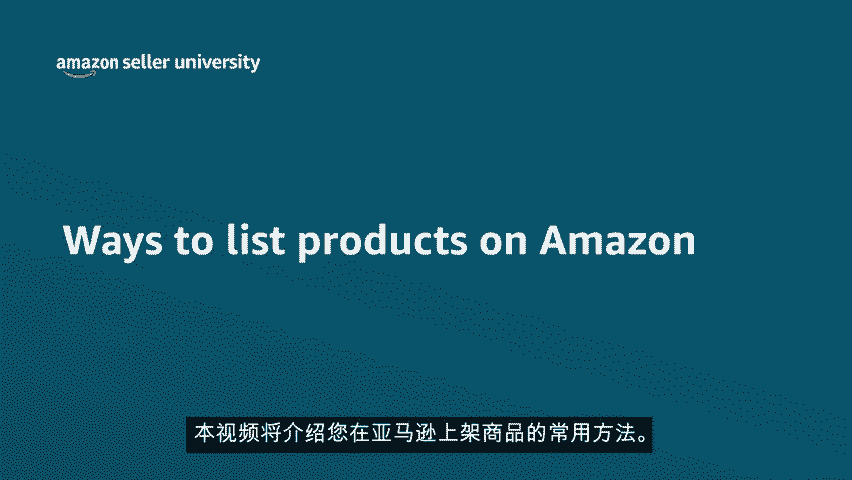
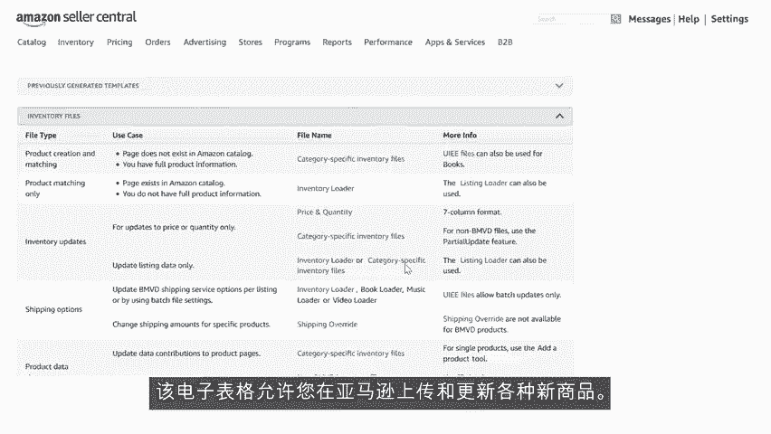

# 2024年亚马逊跨境电商开店教程，零基础亚马逊运营课程【合集】Amazon亚马逊跨境电商入门到精通教程（纯干货，超详细！） - P20：8.8、在亚马逊上面发布商品的方法 - 蛋哥说亚马逊 - BV1Ux2ZYPEFB

🎼本视频将介绍您在亚马逊上架商品的常用方法，您选择的方法取决于两个因素。

🎼一、您的商品是否已经在亚马逊上存在，或者您是否需要创建一个新商品页面。🎼2、您是逐个添加商品还是批量添加商品？亚马逊目录包含许多卖家销售的商品。🎼为了防止同一商品多次出现。

亚马逊要求卖家通过匹配完全相同的商品来消除重复的商品。如果您要销售亚马逊上已有的商品，您将使用现有商品详细信息页面创建商品。🎼此过程名为匹配现有列表。如果您要与现有商品一一对应，请使用添加新商品工具。

🎼在卖家中心主页上将鼠标悬停在inventory库存选项卡上，并单击ad product，添加新商品选项，确保您匹配的是完全相同的商品。在搜索框中输入商品标识符，如UPCAIN或ISBN编号。

以获取准确的结果。🎼如果您没有商品标识符，请输入关键详细信息，如品牌名称和唯一标识符，如零件或型号来搜索商品，找到商品页面后，查看标题品牌名称图片关键商品功能，描述以及详细信息页面上的信息。

确保匹配正确，仅仅因为您销售的是相似的商品，并不意味着它们是相同的。如果搜索结果与您的商品完全匹配，请单击sell this product，销售此商品按钮。

🎼接下来会要求您输入商品、价格、可用数量和配送渠道等条件。如果您是职业卖家，并且想批量批配现有商品，请使用库存加载程序，将鼠标悬停在inventory库存选项卡上。

然后单击ad products via upload，批量上传商品，展开inventry files库存文件部分，然后下载库存加载程序电子表格。

🎼该电子表格可让您快速上传亚马逊上已有商品的数千个商品页面。现在让我们学习一下何时创建新商品页面。🎼在以下情况下，需要新商品页面，您正在采购或创建自己的品牌产品。🎼您正在销售自有品牌产品。

🎼您正在尝试上架亚马逊目录中没有的商品。🎼详细信息页面的创建取决于您一次要上架多少款商品。如果您的商品尚未出现在搜索结果中，请单击create a new listing，创建新商品页面。

🎼选择商品类别。🎼选择最佳的类别，可确保您看到最适合该商品的数据字段，单击select category选择类别后，您将被重定向到列表页面。您可以在这里输入商品详细信息。

最好启用adanced view高级视图，这样可以看到哪些字段是必填字段，哪些是可选字段。🎼这可以提高商品的可发现性，并为客户提供重要的信息。🎼每个选项卡中以红色突出显示的所有必填字段都需要填写。

在viital info重要信息下输入标题、制造商、商品ID、品牌名称等信息。如果要销售的商品有不同的尺寸、颜色、包装数量等，请在variriation、变量选项卡下输入详细信息。

在offer报价选项卡下提供价格、数量、条件和配送渠道等信息。在compliance、合规性选项卡下添加商品合规性信息，在images、图片、选项卡下，您最多可以添加9张商品图片。🎼上传之前。

请参阅您的商品类别的图片指南。接下来在more details更多详细信息部分中添加描述、关键词和所有其他详细信息。🎼输入所有信息后，单击save and finish保存并完成。🎼如果您是职业卖家。

并且要批量上传新产品，将鼠标悬停在inventory库存选项卡上，然后单击ad products via upload批量上传商品。🎼展开inventory files库存文件部分。

然后下载特定类别的库存文件电子表格。🎼该电子表格允许您在亚马逊上传和更新各种新商品。商品页面就介绍到这里，非常感谢，祝您销售愉快。

