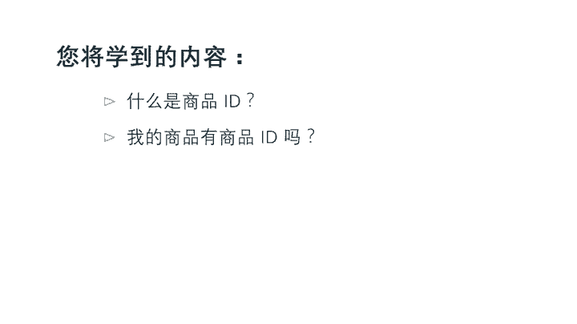
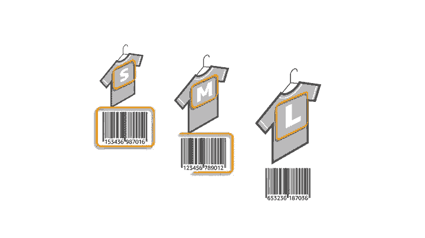
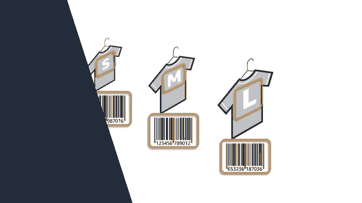
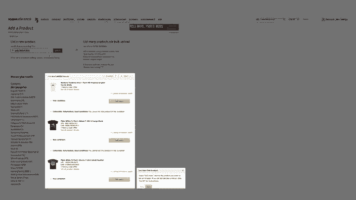
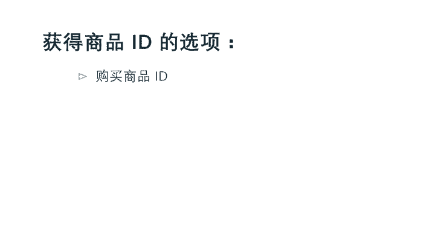
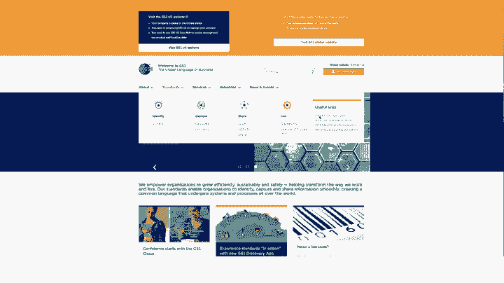
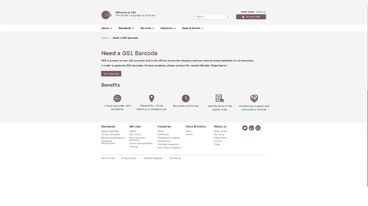
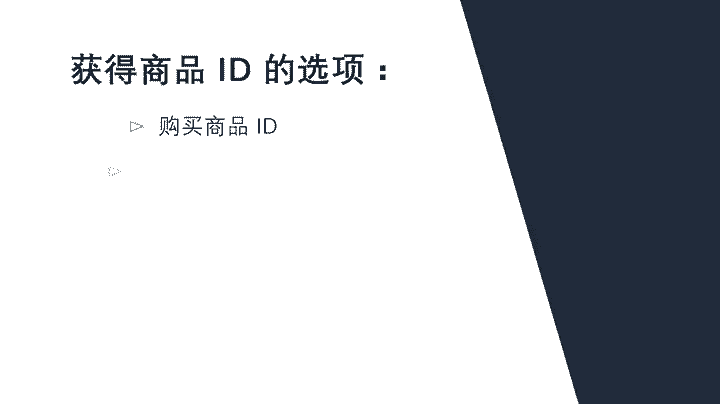
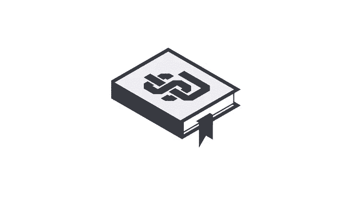

# 2024年亚马逊跨境电商开店教程，零基础亚马逊运营课程【合集】Amazon亚马逊跨境电商入门到精通教程（纯干货，超详细！） - P21：9.9、了解商品ID - 蛋哥说亚马逊 - BV1Ux2ZYPEFB

。

基本就是这些，我们将讨论在创建您的实际商品信息之前，需要完成的最后一步。在本视频的最后，您将了解什么是商品ID您的商品是否有商品ID。如果没有如何获得商品ID。😊。

对于大多数商品类别，卖家在亚马逊目录中创建新页面时，需要使用行业标准商品标识符，称为商品ID这些商品标识符是称为GTIN全球贸易项目代码的系统的一部分。

最常用于创建亚马逊目录页面的GTIN是通用商品编码UPC国际标准书号RSBN和欧洲商品编号EAN亚马逊使用这些条形码和编号来标识您要销售的确切商品。您销售的每件唯一商品都必须有其自己的条形码。例如。

如果您销售的T恤有三个不同尺码，每个尺码的T恤都有其自己的条形码。

请注意，如果您要发布的商品已存在于亚马逊中，则不需要UPCISBN或EAN您将与期使用其中一种条形码创建的现有商品页面进行匹配。

如果您要发布的商品尚未存在于亚马逊中。则您有两个选项来确保涵盖您的商品的ID您可以购买UPC。

亚马逊通过检查GSE数据库来验证商品UPC的真实性。我们建议直接从GS1，而不是从其他第三方销售UPC授权，获取UPC以确保UPC有效，要购买UPC编码，请访问GSE点ORG或直接单击本视频下方的按钮。

如果您的品牌、制造商或出版商没有为您的商品提供GTIN或者您的商品是私人标签和或手工制作的。您可以申请GTIN豁免。如果您获得了GTIN豁免，则您在尝试创建商品信息时。

商品ID字段将不会突出显示为必填字段。要申请豁免，请查看右侧的更多信息框。您可能想知道商品ID与SKU或ASIN有何区别。正如您所学到的商品ID是可在线搜索的注册条形码。

而SKU是您作为卖家分配给您的商品，用来跟踪库存的一个数字和字母字符串。最后，亚马逊商品编码ASIN是由亚马逊自动生成的唯一数据块，包含10个字母合或数字。ASIN用于在亚马逊目录中标识商品。

并可在amazon点com上商品的商品信息页面上找到有关更多信息，请在卖家平台帮助中心中搜索UPC。请继续观看下一个视频，了解有关亚马逊入门指南的更多信息，再见。🎼。

