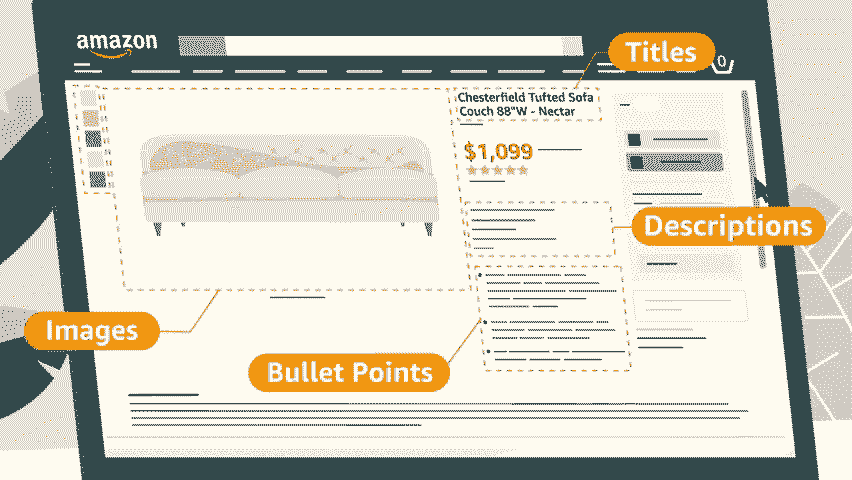
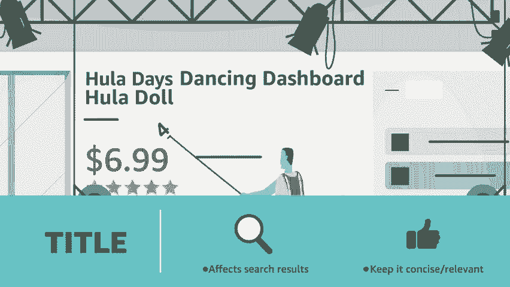
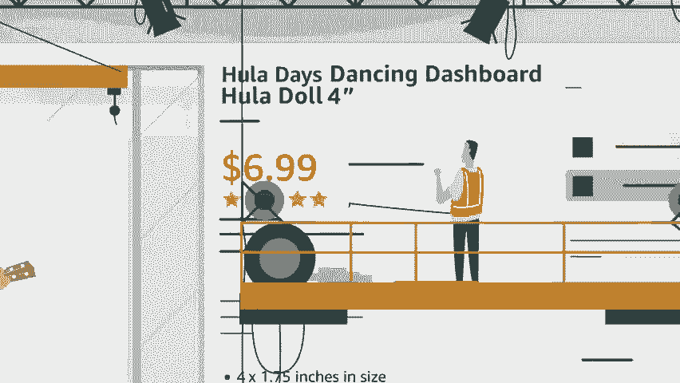
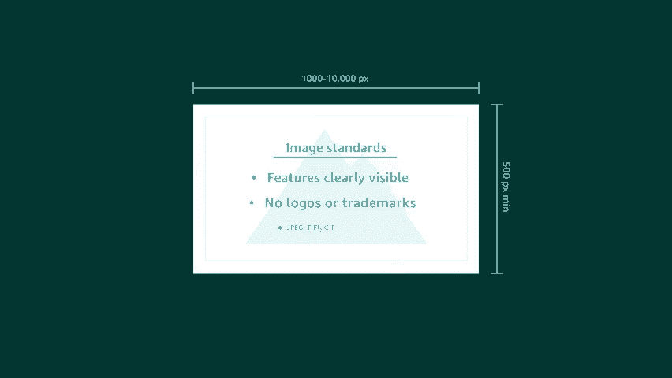
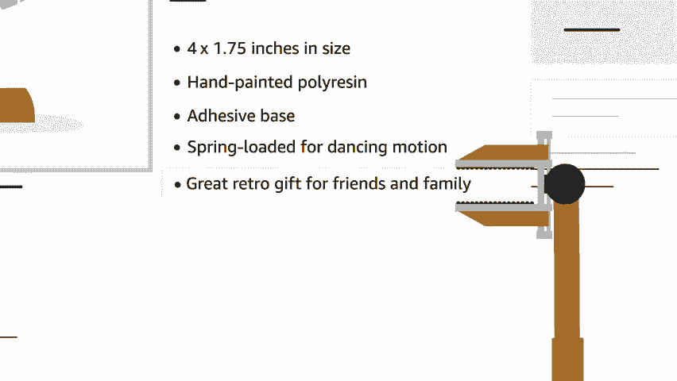

# 2024年亚马逊跨境电商开店教程，零基础亚马逊运营课程【合集】Amazon亚马逊跨境电商入门到精通教程（纯干货，超详细！） - P22：10.10、如何创建卓越亚马逊的信息 - 蛋哥说亚马逊 - BV1Ux2ZYPEFB

Just getting started selling on Amazon， wondering how to showcase your products and win over customers。

Detail pages are where customers make their buying decision。

 and high quality listings make it easier to discover。

 evaluate and purchase your products to build a great listing， put some work into the details。

 titles， images， bullet points， descriptions and keywords can all help you construct a page that converts。

Let's take a look at how the best page builders get the job done。

The first thing customers see is your title。

It also helps determine where you show up in search results。A concise。

 relevant title will drive the most traffic to your detail page For most categories。

 there's a quick formula。

High quality images can also set your product apart。

Choose images that are clear， easy to understand and attractively presented be sure to follow the requirements in Sar Central and category style guides to avoid any headaches。

To give customers a snapshot product overview， perfect your bullet points。

 these appear prominently on the detail page right next to your images。

 so focus on the most important product information。

Further down the detail page is your product description This is your chance to let customers imagine owning your product。

Put yourself in their shoes What would you want to know Lastly。

 help customers find your product and searches with the right keywords。

Provide search terms customers might use， don't forget synonyms， spelling variations。

 or alternate names。Why put all this effort into optimizing your listings。

 it's all about giving customers a clear and compelling case to purchase your product。

The right details can help you grow your brand， increase sales， and attract new customers。

Build your business with Amazon。