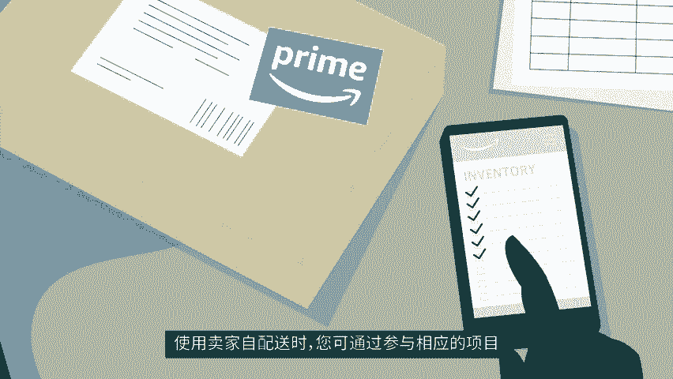
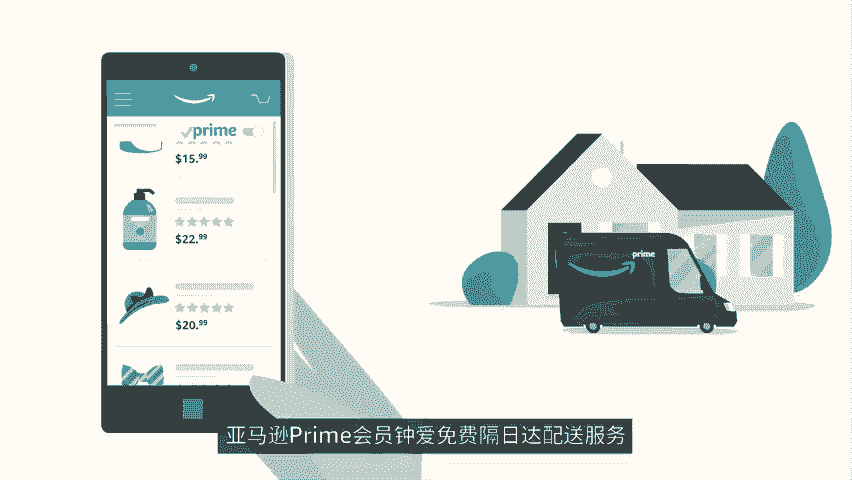
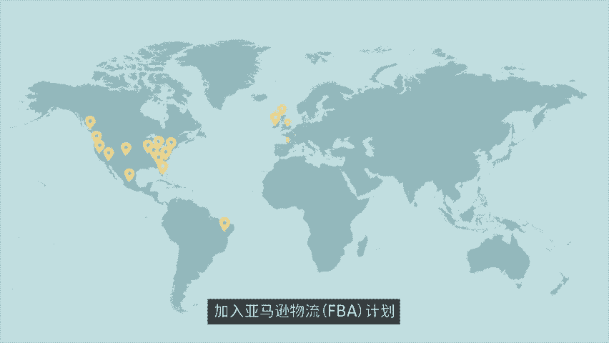
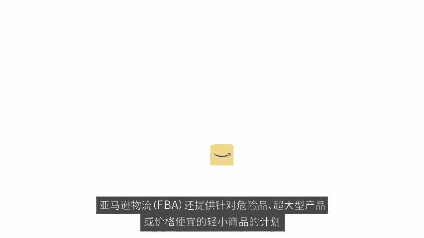
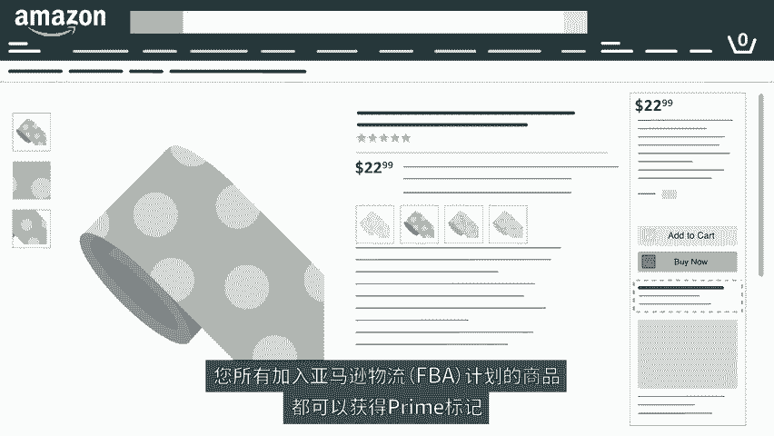

# 2024年亚马逊跨境电商开店教程，零基础亚马逊运营课程【合集】Amazon亚马逊跨境电商入门到精通教程（纯干货，超详细！） - P23：11.11、使用亚马逊配送方式 - 蛋哥说亚马逊 - BV1Ux2ZYPEFB

🎼亚马逊开店时，卖家要考虑的第一个问题就是商品的配送方式。

🎼对于这个问题，您有两种选择，您可以自建仓储，自己将商品配送给买家，或者您也可以使用亚马逊物流FBA服务，让亚马逊帮助您搞定所有事情。如果您的商品销量较小，利润较低，或者您希望采用定制包装。

那么自配送是一种更合理的选择。😊。

🎼简单而言，如果你想更灵活的管理库存，那么卖家自配送更符合您的需求。使用卖家自配送时，您可通过参与相应的项目，让您的商品拥有prime标记。亚马逊prime会员中外免费格日达配送服务，为满足其需求。

您可以把物流工作交给亚马逊加入亚马逊物流FBA计划。亚马逊在全球都设有运营中心，加入亚马逊物流FBA计划后，您可以把库存送到我们的仓库，由我们帮您处理发货客户服务退款和退换货等工作。

如果您的产品销量较大，利润较高，或者您想节省时间和展业务则可以选择亚马逊物流FBA计划。亚马逊物流FBA还提供针对危险品超大型产品或价格便宜的轻小商品的计划。

您所有加入亚马逊物流FBA计划的商品都可以获得prime标记，并有机会在商品详情页上赢得购买按钮。您的配送策略，取决于您的业务目标。很多卖家都会混合使用亚马逊。😊。

🎼物流FBA和卖家自配送，无论您选择哪种方式，您都可以随时转换，为全球买家快速交付商品，创业开店就上亚马逊。😊。

