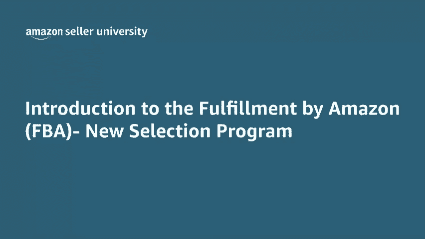
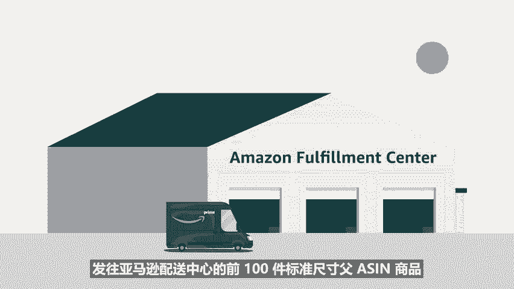

# 2024年亚马逊跨境电商开店教程，零基础亚马逊运营课程【合集】Amazon亚马逊跨境电商入门到精通教程（纯干货，超详细！） - P24：12.12、亚马逊FBA新选品计划 - 蛋哥说亚马逊 - BV1Ux2ZYPEFB

🎼亚马逊物流FBA为卖家提供了一种轻松获得更多客户的方式，使用亚马逊物流的商品享有prime配送资格。这是在亚马逊上最大限度提高商品曝光率和销量的好方法。注册亚马逊物流FBA新品入仓优惠计划。

即可获得更多客户。🎼他非常适合亚马逊物流新手卖家，以及有新库存要添加到prime目录的新卖家或现有卖家。

🎼亚马逊物流FBA新品入仓优惠计划为亚马逊物流新卖家提供高达200美元的商品推广促销点击服务和100美元入库折扣。🎼此外。

该计划对新的或现有的亚马逊物流卖家符合资格的新asN提供免费存放、免费搬运和免费退货处理。我们首先介绍面向亚马逊物流新手卖家的服务。如果您是亚马逊物流新手，并注册了亚马逊物流FBA新品入仓优惠计划。

我们将提供高达200美元的商品推广促销点击服务以及免费创建广告活动服务。😊，🎼此外，我们将使用亚马逊合作承运人计划的首选费率发货，减免前100美元的入库运输费用。

🎼如果您已再使用亚马逊物流，并已注册新AN，您就有资格在规定实现获得免费的每月存放、免费搬运和免费退货服务。如果您符合新品入仓优惠计划的资格。

对于每款新加入亚马逊物流的AN发往亚马逊配送中心前50件标准尺寸负A商品，及前30件超大尺寸负A商品，有资格从收到第一件商品后开始免费存放90天。😊，🎼在收到第一件商品后的180天内，可以免费搬运。

这前50件商品中的任何一件。🎼此外，对于选品类别中，每款新加入亚马逊物流的asson发往亚马逊配送中心的前100件标准尺寸付A森商品，有资格在收到第一件商品后免费存放120天。

🎼在收到第一件商品后的180天内，可以免费搬运这前100件商品中的任何一件。🎼最后，其中最多20件商品在收到第一件商品后的180天内获得免费退货处理，注册亚马逊物流FBA新品入仓优惠计划的步骤非常简单。

以下介绍一下注册过程。首先，如果您不熟悉如何在亚马逊上销售商品，则必须注册为专业卖家，并注册亚马逊物流。其次，新的或现有的亚马逊物流卖家必须注册亚马逊物流FB新品入仓优惠计划，转到右上角的搜索栏。

输入亚马逊物流FB新品入仓优惠计划FBnew selection program单击相关的帮助页面，可以访问该计划的相关信息，单击立即注册roll按钮，您将收到一条信息，让您确认您选择加入。

可以在我们的帮助页面上了解有关亚马逊物流FB新品入仓优惠计划的更多信息，并通过亚马逊拓展您的业务。感谢观看，祝各位销售愉快。😊。

