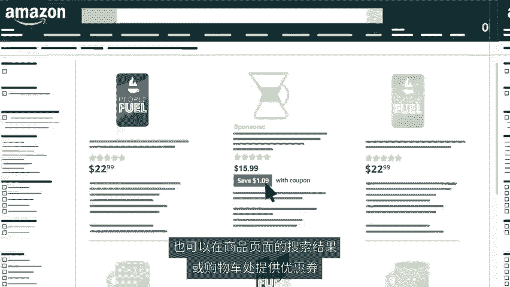

# 2024年亚马逊跨境电商开店教程，零基础亚马逊运营课程【合集】Amazon亚马逊跨境电商入门到精通教程（纯干货，超详细！） - P26：14.14、通过亚马逊进行广告宣传的方式 - 蛋哥说亚马逊 - BV1Ux2ZYPEFB

🎼设定好卖家账户，熟悉我要开店的各种操作后，您就可以开始扩展业务了。为触达更多买家提高销量，增强粘性。您可以结合使用广告、促销、秒杀和优惠券等多种方式，快速推动销量增长。😊。

🎼亚马逊点击付费广告可以快速提高商品曝光度。商品推广广告可以显示在搜索结果和商品页面上，让更多买家看到品牌所有者还可以使用品牌推广广告突出显示品牌标志标题和最多3款商品以您希望的方式将品牌呈现在消费者面前。

您可以控制花费的资金活动持续时间，而且仅在获得点击时才需要付费。买家喜欢促销活动。您可以在亚马逊最受欢迎的页面上开展秒杀和限时促销活动，也可以在商品页面的搜索结果或购物车处提供优惠券。

让买家点击获得促销活动也有助于提高销量，比如提供免费配送折扣或买一赠一等。您还可以获得自定义的亚马逊URL并在营销活动中分享商品促销，对于您的亚马逊业务战略至关重要，有助于提高。😊。

🎼量推广新品，获得评论等等。有了正确的广告受众，广告位和时间，您的商品曝光度将快速提升，马上开始广告宣传吧，创业开店就上亚马逊。😊。

