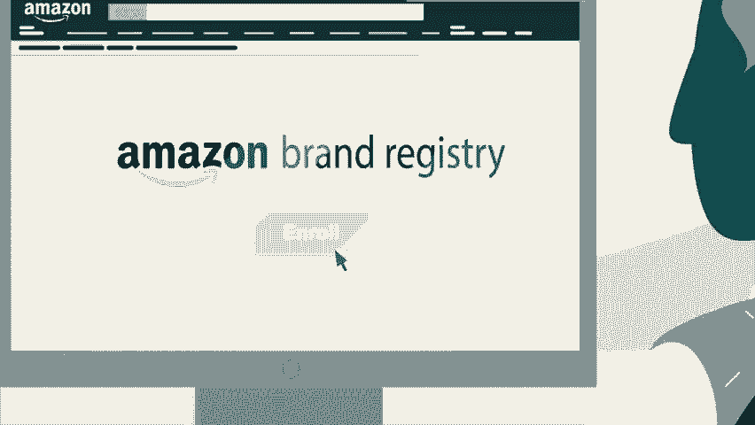
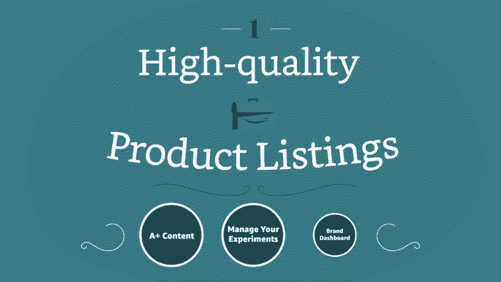
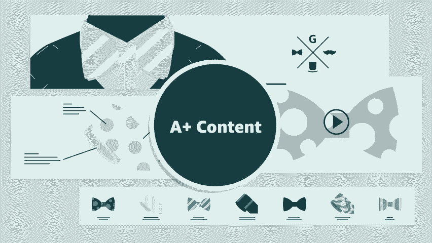
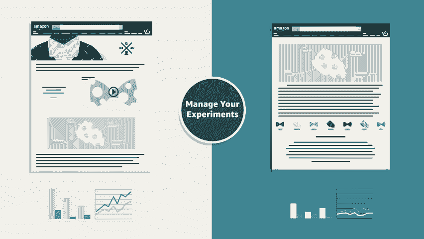
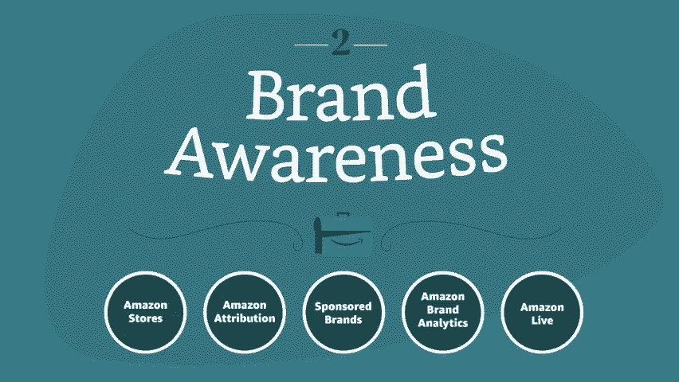
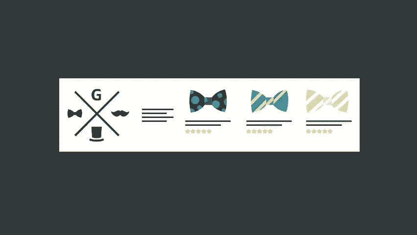
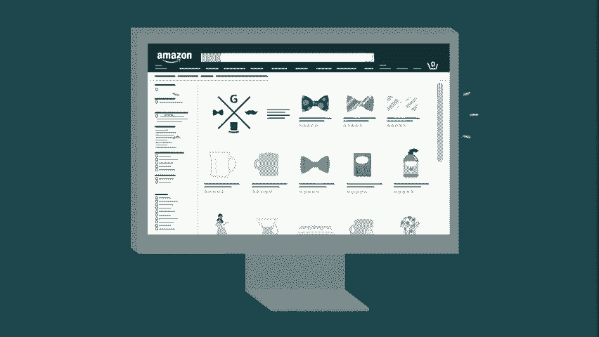
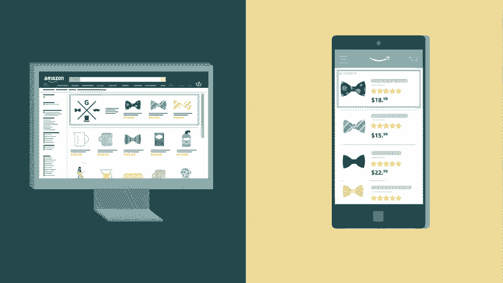
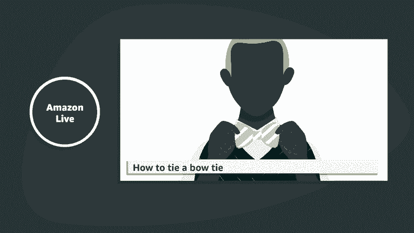
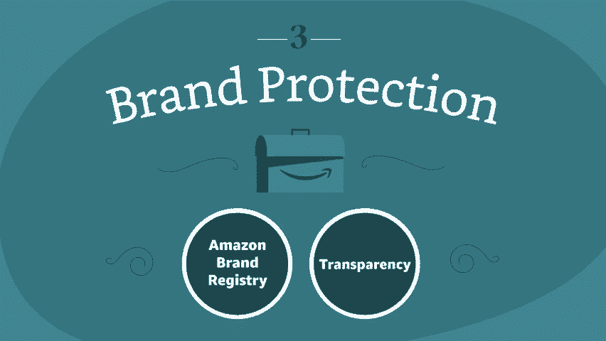

# 2024年亚马逊跨境电商开店教程，零基础亚马逊运营课程【合集】Amazon亚马逊跨境电商入门到精通教程（纯干货，超详细！） - P27：15.15、用亚马逊建立你的品牌 - 蛋哥说亚马逊 - BV1Ux2ZYPEFB

。

Customers love when brands list and sell their own products on Amazon To encourage eligible brands to sell directly。

 we offer an exclusive set of tools unavailable to other selling partners these tools can help your brand improve conversion。

 drive discoverability and protect intellectual property enrolling an Amazon brand registry is your first step to unlocking these benefits。

Let's look at some of the brand exclusive tools for creating high quality product listings。

A+ content can make your products stand out with rich text and images in the product description section of the detail page。

Adding A+ content can help increase sales by connecting customers with your brand story and diving deep into product features。

The Manage your experimentsments tool lets you run controlled experiments to AB test your detail page content and discover what may convert best your brand dashboard offers helpful insights on how you can improve customer experience。

 help newly launched products gain traction and help increase sales。

Next， a few of the brand exclusive tools to help you build brand awareness。

Amazon Store help shoppers learn more about your brand and increase conversion across your catalog。

 create your own brand store experience to showcase your brand， selection and content。

Sponsored brands advertising helps customers discover and engage with your brand The ads feature your logo。

 a custom headline and up to three products to build brand awareness sponsored brands ads are available in multiple locations on desktop and mobile。

 including above shopper search results。

Amazon attribution can help you maximize your advertising ROI by measuring the impact your non- Amazonazon marketing tactics had on Amazon shopping activity。

 unique conversion metrics including detail page views。

 purchase rate and sales give you a unified view that quantifies your media investments。

Amazon brand Analytics can use powerful data to help you improve your business。

 analyzing aggregated customer search and purchase behavior， search terms， demographics， and more。

Finally， Amazon Live can help drive sales with streaming product demos。

 engage shoppers in real time and allow them to follow your stream channel We also offer crucial tools to help you protect your intellectual property and combat counterfeit issues。

 whether or not you choose to sell on Amazon。

Brand registry helps you protect your intellectual property with accurate brand representation。

 powerful search tools and proactive brand protection to create a trusted experience for Amazon customers You can also use transparency a new itemlevel tracing service to associate each unit you manufacture with a unique code helping to protect your brand and customers from counterfeiting It's never been easier to get your brand in front of millions of customers Take the first step toward becoming a trusted household name and register today build your brand with Amazon。

