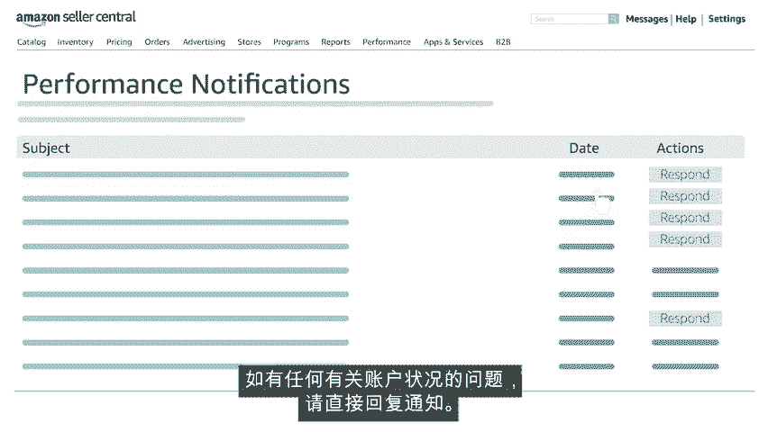

# 2024年亚马逊跨境电商开店教程，零基础亚马逊运营课程【合集】Amazon亚马逊跨境电商入门到精通教程（纯干货，超详细！） - P28：16.16、维护您的账户状况 - 蛋哥说亚马逊 - BV1Ux2ZYPEFB

🎼，🎼欢迎观看视频，在卖家中心中保持账户正常。在此视频中，我们将概述影响您账户状况的多个方面，以及如何对其进行监控。让我们开始吧，在卖家中心主页上将鼠标悬停在performance绩效选项卡上。

然后单击account health账户状况。

🎼账户状况总结了您遵守亚马逊绩效指标的程度，有三个部分需要注意客户服务绩效、商品政策合规性和发货绩效。客户服务绩效基于订单缺陷率。决定该缺陷率的三个因素是差评。全程担保索赔和拒付索赔。

差评是指买家对您的商品的评分不高于两颗星，全程担保索赔是指买卖双方之间的争端尚未解决。并且买方联系亚马逊来寻求解决问题。通过关注导致客户负面反映的最常见原因。您可以避免差评和全程担保索赔。原因一。

🎼24小时内未回复消息，使用买卖双方消息传递工具，快速解决客户的疑虑和消息。这里有一个好点子，下载名为亚马逊卖家的卖家应用。当您离开主要工作场所时，仍能接收和回复消息。原因2。🎼处理退货您如何处理退货。

关系到买家发布的评论类型？🎼或者买家是否认为有必要将争议升级为全程担保索赔，始终站在客户的角度考虑问题。🎼就像您遇到订单问题时，希望别人对待您那样对待您的客户，了解退货政策是确保账户健康的良好策略。

可以在卖家中心的搜索栏中输入亚马逊退货政策。🎼亚马逊为卖家提供的另一项支持是处理拒付问题。亚马逊负责商家交易。🎼为避免拒付，请始终将商品运送到订单上经验证的地址。

🎼并选择为亚马逊提供了完整跟踪信息的运输公司。🎼按照以下步骤操作，有助于防止拒付account health账户状况，仪表版的下一个部分名为product policycompance，商品政策合规性。

旨在使卖家意识到知识产权问题、真实性问题、商品状况和其他违反政策的情况。🎼卖家有责任了解和理解，适用于其所销售产品的知识产权法律。🎼与商品相关的投诉，包括客户对收到的订单感到担忧的情况。

如果您的商品从销售目录中被删除了，一定要遵循上诉程序，这一点很重要。🎼保留有效来源的发票和所有适用的安全合规性文件。🎼以提高恢复上架的可能性。🎼我们建议卖家留意商品政策合规性部分。

🎼以解决账户状况仪表板上任何特定合规性方面的问题，不解决这些问题，可能导致警告或被亚马逊取消销售特权。最后让我们了解一下，为什么运输绩效对账户状况很重要。如果您决定为订单采用商家配送方式。

🎼应将延迟发货率控制在4%以下。🎼将配送前取消率控制在2。5%以下。🎼并将有效跟踪率保持在95%以上。🎼但是如果您决定使用100%的FBA服务，这些指标不会影响您的账户。因为亚马逊会为您管理他们。

🎼现在让我们详细了解一下这些术语。🎼延迟发货率表示，在逾期发货日期之后才确定发货的订单占订单总数的百分比。当您自行为订单发货时，您应在订单上指定的日期范围内确认商品已发货。

🎼如果您在指定日期范围后才确认发货，您的订单将被视为延迟发货。🎼避免配送前取消率是保持账户健康的另一种策略。🎼该比率反映了在指定的7天期限内，卖家取消的订单占订单总数的百分比。🎼持续关注并更新可用库存。

并确保已使用正确的销售价格是实现低取消率的关键。🎼另外，买方要求的取消不计入卖家的取消率中。🎼亚马逊买家使用订单号跟踪订单和预计到达日期。🎼有效跟踪率VTR是反映这些交货和送达期望的绩效指标。

🎼您的按时交货分数显示了在预计交货日期之前，收到的卖家配送包裹的百分比。🎼该分数基于已确认的跟踪信息，为帮助您提高有效跟踪率，请选择会向亚马逊报告订单跟踪信息的运输公司。

您可以单击订单上的Y食品购买配送，来利用亚马逊的购买配送服务，也可以在卖家中心的搜索栏中输入有效跟踪率常见问题，来查找运输公司列表。买家告诉我们。

按时收到订单并能跟踪包裹是评价亚马逊整体满意度的重要因素。满意的买家更容易留下积极的卖家反馈。🎼亚马逊会请求买家评价您的服务，并提供有关您所售商品的反馈。为了及时了解通知。

请显示卖家绩效团队发送的卖家通知页面，访问performance绩效选项卡下的performance notifications绩效通知。检查这里的通知中是否有可能影响您账户状况的重要警报。

如有任何有关账户状况的问题，请直接回复通知。有关如何保持账户状况的视频，就介绍到这里。

🎼非常感谢，祝您在亚马逊上销售愉快。

