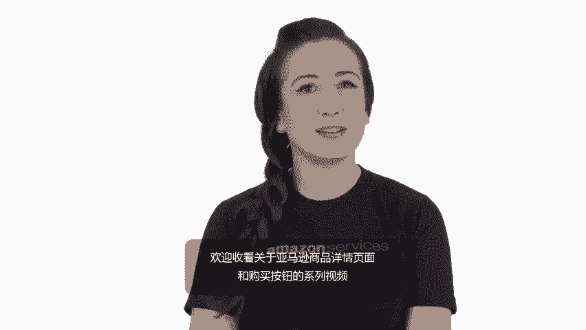
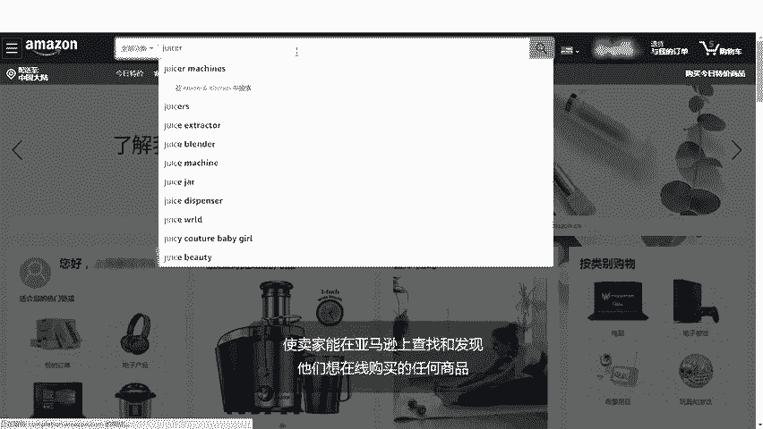
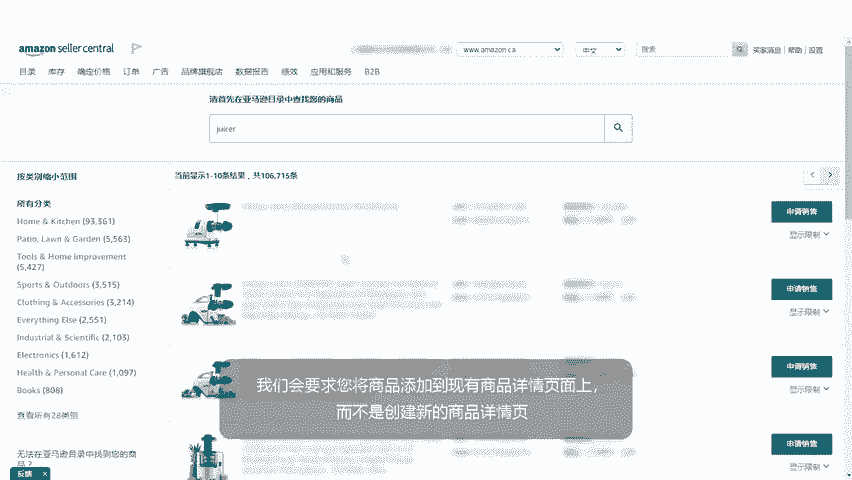
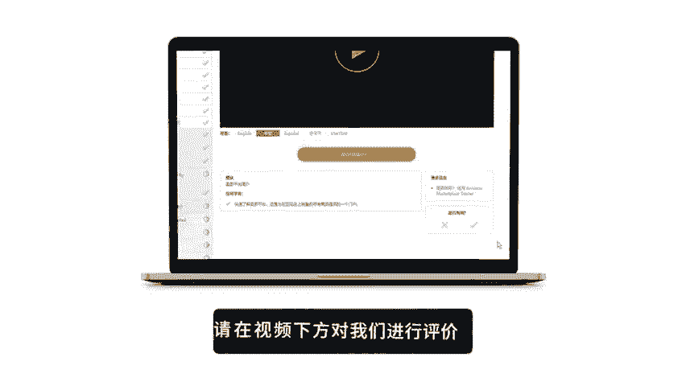
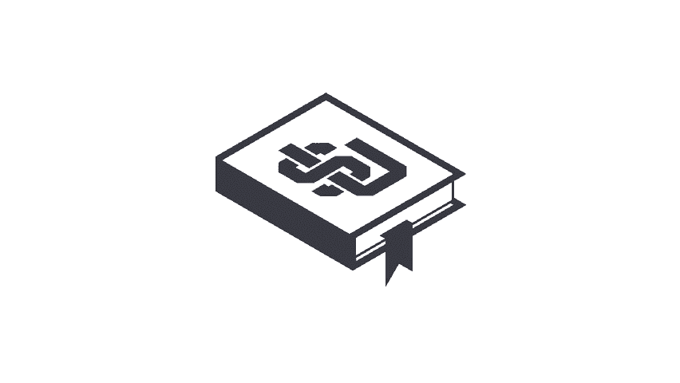

# 2024年亚马逊跨境电商开店教程，零基础亚马逊运营课程【合集】Amazon亚马逊跨境电商入门到精通教程（纯干货，超详细！） - P29：17.2-1、商品详情页概述 - 蛋哥说亚马逊 - BV1Ux2ZYPEFB

。

Yeah。Welcome to our series covering the Amazon detail page and buybox After watching you should have a basic understanding of what happens when multiple sellers offer the same product。

 the different areas of the product page and how to achieve prominent placement for your product offers。

The Amazon shopping experience is built on what we call the product detail page。

Amazon's goal is to be Earth's most customer centric company。

 where people can find and discover virtually anything they want to buy online。

The product detail page is key to making that goal a reality。

 enabling our customers to find and purchase your products。As an Amazon seller。

 you can list your products on the same detail page as other sellers offering the same product。

If you list a product that's new to Amazon， other sellers can add offers to your listing if they are selling the same product。

That means customers can see all their buying options in one place， regardless of price or condition。

If you're selling an item that already has a detailed page on Amazon。

 we require that you add your offer to the existing page instead of creating a new one。

🎼。

