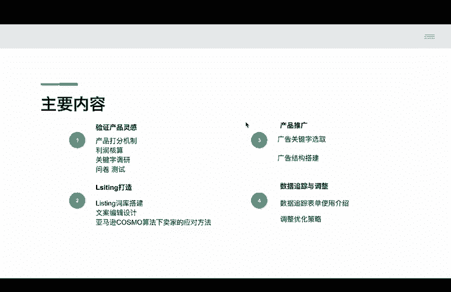

# 2024年亚马逊跨境电商开店教程，零基础亚马逊运营课程【合集】Amazon亚马逊跨境电商入门到精通教程（纯干货，超详细！） - P2：最新亚马逊新品推广计划 - 蛋哥说亚马逊 - BV1Ux2ZYPEFB

hello大家好，我是少。欢迎大家参与到我们这次的亚马逊新品打造计划系列课。那么当大家选定产品以后，亚马逊生意模型失败的第一大诱因，可能就是因为你没有一个可行的亚马逊新品打造计划。其实呢这也好理解。

凡是欲则利不预则菲。没有计划呢，就像不开导航或者布达地图，就开始一段陌生的公路旅行一样，又很难达到预期的一个目的地。那么我们这套呢系列课希望可以成为大家一个亚马逊生意开始时的地图。一个你选定产品以后啊。

推广无忧的那么一个指引吧。我么这道课程呢将主要分为以下四大模块，模块一验证产品灵感选定了产品能不能做有什么风险？这是大家在开始上架前需要再确认一次的重点内容。不然产品万一不适合销售。

后期在线上的沉默成本更高。所以呢这部分我将跟大家重点分享一下内容，分别是一产品打分机制。2、利润核算。3、关键字调研。4、问卷测试。那么模块二呢将跟大家分享listing打造。呃。

即使你有类目中最好的产品质量，但如果你不能打造一个完善的listing，被亚马逊算法识别推荐，你的销量也不会得到保障。模块二呢，我将跟大家分享以下重点内容。第一个呢是有关listing词库的搭建。

第二个是文案编辑设计。第三个亚马逊新算法下卖家的应对方法。第三个是产品推广部分。那么在产品推广部分呃，对于目前大部分的亚马逊卖家来讲，通过广告来推广新品都是一个非常主流的方式。

一个好的新品广告策略呢是可以真金白银的帮助到大家的。在这部分呢，我将跟大家分享啊有关广告关键字的一个选取方法。第二个呢是广告结构的如何搭建。模块四呢先跟大家分享一个数据追踪与调整。新品期。

大家该关注哪些数据，如何针对数据进行反馈，分杂的后台数据，哪些才是我们应该重点关注的。这部分呢我将跟大家重点分享有关数据追踪表单的使用介绍，以及我们常用的一些调整优化的策略。

以上四个模块中呢会涉及到中的附件呢，大家可以添加大元的微信获取。的，那么接下来呢我们开始我们的模块一的部分啊，那就是第一个验证产品灵感中的有关产品打分机制啊。当验证产品灵感时的第一步呢。

我先对产品做一个初期的打分策略。那么将主要包含以下要点。我们来到我们的表格来给大家分享。那么大家现在应该能够看到我们的这个产品打分条件啊，这个子的一个s表表单。那么在这里面呢。

我一共列举了15条我们逐一的来看一下啊，有关这个表格呢，同样大家在添加大元的微信以后可以获得啊。好的，我们来看一下第一个呢你的产品是否解决了一个问题。啊。

这里面呢不是说产品解决问题是一个呃完全必要的条件。但是对于大部分的我们亚马逊卖家来讲，如果说你选定了产品能够切实的在实际生活中物理性的解决某一个痛点，某一个问题。

你的成功概率会比其他的没有这个特性的产品稍稍高一些啊，这是第一个，如果说你的产品解决了一个问题呢，也可以勾选上这得一分。第二个，你的产品是否满足了消费者的一个诉求。

这里面其实就跟我们前面提到的这个实际的物理上解决消费者的一个痛点啊，区分开来，那可能就比举例跟大家讲，就是大家去看抖音，可能看一些搞笑视频啊，可能看一些宠物的沙雕视频等等啊。那么这些视频这个产品。

其实也并不一定解决你生活中某一实际的问题。但是它可能对会对你产生的精神上的一个愉悦。或者是更简单讲，你可能你的爱好，它并不是说马上都能你生活中必要必须的一个。痛点啊。

但是说你你的爱好上面的这个痛点解决到了以后呢，你会特别的愉悦啊，比如说你的这个呃露营啊，比如说你的这个下象棋啊，听音乐等等啊。那么如果说你能满足一部分的消费者的心理的诉求啊。

那么也是一个得分的点OK那么如果说你有这个呃你的产品符合了这个诉求呢，那么你可以勾选上。第三个产品是否有创新。这个我相信大家都比较好理解啊，目前的亚马逊，如果说你的产品还是大陆货。

你会面对非常严重的同质化的竞争啊，那么你很容易就会到一个价格这样的一个地步。尤其是站外平台，像特目像实印这些第三方的其他的啊中国出海平台啊，他们的这个地价，如果说跟你的产品在亚马逊有重叠的话。

对你是一个非常大的一个冲击。啊，那么第四个，你的产品是否处在一个流行的趋势中啊，你可以把它呃理解为就是你的产品是否在谷歌train，也就是谷歌流行趋势里面，在国外它是一个上升的一个态势。

我们肯定不想选择一个你的产品本身存在一个在一个呃这个下降的呃一个态势的一个一个世态中的那么一个产品，到了这个产品生命周期尾声的产品，我们肯定是不愿意不想去选的对吧？因为市场也不再接受这个产品。

第五个产品能否申请专利啊，那么这个产品能否申请专利，对于我们卖家来讲的话，是这样，就是你可以形成一个壁垒啊，那你辛辛苦苦开发了一款产品，轻易的不会让别人去copy到你，对吧？啊，第六个。

你的产品是否有消耗性的啊，那么其实这是一个消这是一个这个加分项啊，比如说你如果说你的产品是虫类的消耗类产品，我能想到的。比如说猫砂啊，比如说这种隔尿垫啊，这种都是其实生活中，消费者需要不断的去购买的啊。

那么如果说你的产品是符合这种特性的。但是是可以源源不断的给你带来现金有现金流的对吧？啊？那么这个非常好的啊，一个这个切入的点啊，那么如说你的产品如果说具有消耗性啊，你的客户粘性也很大，对吧？啊。

当然这是前提是你的产品本身做的不错的条件下啊，那么如果有的话可以勾选上第七个产品市场是否足够大啊那么这个呢实际上是想你去评判一下你的产你的这个使用人群的受众有多少啊，如果说你的受众人群真的特别小啊。

那么在亚马逊上它的搜索热度相对也可能也会比较低啊，那么你可能就得不到足够的一个浏览量曝光量啊，也就谈不上一个大的销量了，对吧？你要判断一下你的产品受众是否足够大啊，这也就是产品市场是否足够大。

第八个产品是否具有涉媒的一个传播性啊，那么我们知道现在亚马逊啊不仅是站内，大家要你要去有一个比较好的流量获取的方法。在站外，如果说你能够对你的利性进行一个加持啊，通过第三方的射媒平台。

比如说tktok啊，比如说youtube比如说ins啊，如果说你能在站外啊，本身这个产品就有一定的话题性，适合射媒传播，有达人红人愿意去推广你的产品，对你的销量的一个促进是非常有帮助的。

第九个啊产品是否容易制作啊，那么这个产品是否容易制作，是我本身我自己就踩过的一个坑啊。那么之前推广过一款产品，它整个的生产制作流程啊相对比较复杂啊，可能需要几个呃厂家来一起来协同来做啊。

那么这就中间就产生了很多的问题，质量啊，比如说你的交货的一个呃时间啊，都会受到很大的一个制约。我也是后面也建议大家尽可能的啊让你的产品在制作的过程中就相对比较容易啊。第十。

产品给消费者带来了好处和功能是否容易理解。那么这个呢也是大家容易非常容易忽略的点啊，就是你的产品质量再好，功能再完善。如果说消费者不能在短时间内理解你的产品，啊你就会面临一个很大的一个不确定性。

有可能你的产品消费者因为理解不了，造成他无法下单啊，这个大家要注意去了解一下啊，第11个产品受众是否细分啊。那么这个产品受众是品细分，他如果说你越细分，说明客户对的需求，它的转化率可能也就越高。

你面对竞争相对可能也就少一点啊，你比如说你去面对你去做一个这个呃呃地垫，那么这个地垫，如果说你。没有很特定的人群啊，比如说不是呃这个这个这个有服务特定人群的时候，你的受众很广泛的话。

你可能会面对很很激烈的竞争。比如说你的只是一个普普通通的居家的地垫啊，那么这个地垫你可能哎就会面对很多其他的低价的产品竞品。那如果说你的地垫是给特定的，比如说某一个呃喜好某一种这个绘画风格的。

或者是说你的地垫是针对户外露人人群的啊，那么这个那么你是一个评判的标准。第12个，你产品本身是否有变体啊，那么对于你的listing，如果能生成多变体的话，其实对你的销量是一个潜在的啊一个增长的可能。

对吧？因为你的产品生产出来以后，你可能只需要去呃变换呃特定的颜色材质啊，就可以增加啊，你的受众的这个人群，消费者的这个涵盖的面积更广一点，你的销量就能得到一定的一个怎么讲扩大啊。

第13个产品能否扩展成一个产品线啊，就是这个产品能否跟上下游啊，消费者的一个诉求结合起来。如果说能结合到一起啊，那么可以说你啊真的是可以垂直性的去全链路的去卖你的整个产品，你的销量也能得到一定的保证。

啊，第14个产品是否容易运输啊，那么这个相议大家都比较好理解我们要做的是跨境的一个运输，对吧？你过大或者是这个产品太脆弱，都会影响你在运输过程中，你产品到了目的国以后的一个完完善的程度啊。

有可能你的产品不容易运输，你可能会面临比较高昂的运费啊，甚至你的产品在运输的过程中损坏，都可能会得到一定的差评，对吧？呃，第15个产品是否有订购省的潜力啊，那么大家在目前能够看到亚马逊后台，有很多。

尤其是。这个营养品啊或者是些消耗品啊都有一些订购省啊，如果说你能有订购省的潜力的话，那么其实啊对你你的产品的一个长期的销量是非常有帮助的，对你的产品的品牌啊，打造也是非常有帮助的啊。好了。

如果说你的产品这15项都包含了。那么大家可以看到我这边有一个得分标准，后面有一个建议啊，那么如果说你是15分，那有较大的成功概率啊。那比如说我的产品是啊呃低于12分的啊，在9分到11分之间啊。

那么可以尝试分钱较低啊，总的来讲就是我们有一个最低的标准啊，不能少于6分对吧？如果说低于6分啊，那说明你的产品有可能啊是处在一个啊比较难推广的一个阶段啊，要么是它不易于生产，要么是它不易于推广。

要么就是它的一个受容面太窄啊，需求不够强烈啊，6分到8分啊，你可以要去做一些改良啊。比如说让他的受众更广泛。比如说他更表现的这个对于消费者的好处更易以理解，那是处于还要改良改良的一个状态啊。

那么大家可以在你的产品上架初期啊，准备推广初期呢，再次的呃我们开始我们的第一部分就是有关你的一个呃产品打分的啊一部分的一个设置一个这个呃分析啊。那么第二个啊我们可以看到第二个呢。

我们来做一个利润的核算啊，这个利润的核算的部分呢，大家可以看到现在我们这个表格里面给大家展示的啊，那么我是建议大家啊目前你的产品选定完了以后，你要在上架之初。

你要再看一下你的产品的毛利润是否能够在30%以上啊，如果说你太低的话啊，有可能也会面对一个呃入不敷出。因为现在亚马逊站内的广告，各种杂七杂八的费用叠合在一起。如果说你利润很薄啊。

那么你上架去面对亏损的这么一个呃状态是非常高的啊。然后这里面就有一个表格，然后我罗罗列了一些费用，大家可以在初期做一个验证。当然了，这个毛利润越高越好，如果说你能能够达到40%，50%更好了啊。

那我是建议大家最少你就维持在30%到5%0之间做一个最低的一个门槛啊，然后这里面设置，我会。除了这个表格里面会设置的包含了，比如说产品生产成本，这里面包含了比如说你的设计包装主体头程的一些费用。

那亚马逊的一些费用，类目费用配送费、仓储费、退换货费用，汇率损失后PPC广告费，然后产品售价毛利润啊。然后PPC广告费用跟你自己商家本身你产品本身的质量以及你利性打造程度，以及你的广告打法是相关的。

然后这里面呢就呃先留个空白啊，然后你至少要在你微加广告费之前，你的毛利润要维持在30%左右才是一个比较好的一个结果啊，然后这除了这个表格以外呢，大家还要去结合了去看一个亚马逊的一个这个利润计算器。

那么在利润计算器里面，我们好多数据呢都可以用到这里面啊。那比如说我们现在这个产品然后把它复制过来，然后我把它添加进来啊，粘贴啊。OK啊，那么这里面就会有很多的一些数据，我们都可以用到。

比如说亚马逊还B的费用啊，你的呃尾程的派送的费用啊，那么在这里面都注意的，大家按照实际的数据添加进去啊，就OK了。然后你去计算一下你的产品毛利润再不添加啊，再不计算PVC花费的时候啊。

是一个什么样的一个呃呃价值啊。好的啊，那么这是呃产品验证的第二呃小节。好的，那么接下来呢我们到我们关键字的一个垄断程度的一个验证。好，那么这个部分呢其实也是非常重要的。对于我们来讲。

我们能够看到我们接下来在产品上架以后，面对的流量竞争是什么程度的。是否有同步的卖家，他们在呃leaing的部分的这个关键字收购流量部分啊，在类目中占据一个统治的一个地位了啊。

OK那么这里面我们点击我们的klinton插件。点击X ray啊，然后这里面呢我会选择我主要的头部的10个卖家的A来进行一个呃反差okK啊，那么选择10个。啊。

那么这里面大家就可以去挑一下跟你产品嗯相似度比较呃相关的啊。然后呢通常大家可以选择10个啊来进行一个反差。啊，然后10个跟你的产品最相关，然后销量相对比较高的啊啊，然后呢避开这些广告位的asen啊。

这里面我就按照顺序啊选择了10个。大家在实际的有关流量的分析的过程中呢，大家去选择刚刚提到的跟你产品最相关。然后呢，销量比较高，然后排除广告位就OK了。我们点击receable，它就会进行一个反查了。

OK啊，那么这这个全部的关键字就反查出来，一共是19000多个关键字，对吧？那么这些关键字呢我并不是全都要的啊，我选择一个至少月近500的流量的关键字啊，连接blly filter。还剩1800多个。

然后把它导出来啊。OK啊，那么打开以后，那就是全部的呃这10个asen啊，他们被收录的关键字一些相关的一些信息。然后我们会做一个数据上的一个清理啊。那比如说我这里面可能仅只会保留呃40vole啊。

像这些都会去除掉啊。啊，到这儿。然后这个position rank呢是呃第一个asen啊，是他的asen的一个呃是在这些关键字下的一个排名啊。那么回过来我们看一下第一个asson是这个名字，对吧？

第三结尾的O我们把position rank这一栏的asen把它替换过来就OK了。好吧啊。然后呢，我们到这里呢。

我们去呃对这个表格来进行相应的一些这个呃筛选啊啊然后这里面呃第1个B3节的这个A里面有一些这个数据呢，我们进行一个整理啊啊比如说这个零嗯，我们在计数的时候啊，会呃把它记到里面。这个我是我们不需要的。

我们把它删掉啊。OK好啊，这样的话就把全部涉及到零了，就删掉就好了啊。因为我会做到一个呃相关度的一个一个设置啊。

比如这里面我会做一个相关度啊啊那么相关度是指说呃我们将啊全部的这些关键字啊跟这些asson之间呢进行一个呃关系的一个衡量啊，比如说这些asen如果在这个词下面排名能够排到前30名，我就计数记为一。

就说这个asen跟实际上这个产品它的紧密程度是高的啊，也比较好理解。因为你的排名越靠前，对于亚马逊这个算法来讲，认为你的这个产品跟这个词越相关，对吧？啊。

那么这里面我会用一个count if的一个函数啊。啊，count啊okK然后呢我会选择背后面的10个，然后小于30的嗯。技数啊，记一个一OK啊，那么看这个词的相关度就是7啊。我们一下拉下来哎。

这样就全部都有了，对吧？啊，然后我们要的是相关度越多，越靠前呃，对于我们来讲，这个词的价值相对就越高，对吧？啊，我们要由高到低的顺序来进行了一个排布。好，然后我们计算完这个以后呢。

我们来去进行各个asn。在这个词下面的一个这个。呃，垄断程度是怎么样的啊？那么我们首先呢先计算一个比例是吧？我们先计算一个总的搜索热度啊，是多少。我这里面在啊左上这里面添加一行啊啊，总热度。

等于s姆函数啊，然后这里面我肯定是要选择的是什么呢？是呃有相关度的，相关度至少唯一的啊啊这些词，它们的流量价和是多少啊，那么把它加一起啊。啊，那么就到一好吧。OK那是3935万多的一个测试额度，对吧？

然后我们来看第一个啊前十流量。我来计算一下这10个asson呃，全部的在。呃，这个呃搜索词排名排在前十位的，它流量加和是多少啊，我来看一下。其实就是这个对不对？就是这加一起这些他们的流量啊分别是多少啊。

每一个asen它在前十流量是多少啊，这就算一个前三十流量啊。相当于前十流量是它比较头部靠前的关键字。前三十流量确保了它是在首页搜索结果首页的关键字的一个流量。啊，那么计算一个前十流量的占比。

前三是流量占比啊。好的啊，那么接下来呢我们会逐一来计算一下啊，那么第一个我们回到一个函数啊，sif函数。然后选择呃相应的流量。范围啊。好，那么是第一个我们呃范围权限完了以后，我们到第二个。

那么第二个呢是我们第一个asson，嗯，那么他所有我我们让他在呃搜索结果排名啊，在这些词下小于十的啊，它的流量总和是多少？逗号。然后呢。Xiaoyu。等于。小于等于。是。OK啊。

那么可以看到是55755的流量，对吧？啊，然后呃我们接下来还要我注意啊，要把前面啊这个你查询的这些流量啊，要把它锁定啊。嗯，稍等啊，那你们你锁定的过程呢，就是啊把它全部的这些字符制。好，以这个。啊。

锁定住就OK了啊，这样的话呢你去后面去呃拉其他的数据的话，就不会有问题啊。然后我们看三前三十的有多少啊。哦，这边上上算了一下啊。😔，OK啊，那么前三十的是这样。然后我们接下来下面的一个占比啊。比上。

他啊。同样啊我们也把啊。啊，这一行给他锁上。啊，然后呢啊大家可以比如说数据上我就用百分比的方式来表现。哦。数具。百分比的方式啊。好啊，然后我们再看下回。Okay啊。这是啊这是第一个AN，我们计算完了啊。

我们也横向了一拉，这样的话就把全部的AN都计算出来了啊。OK那么这个时候呢，我们去看一下头部里面，我们看流量占比啊，最多的是这个呃AN对吧啊。它是29%啊，然后呢其他的这几个asen嗯。

相对占比就没有那么高啊。那么这里面我会通常啊如果说发现三个asen，他们在前十流量占比超过50%，那么就是一个比较呃需要大家警示的一个信号，可能说头部的卖家他在这一部分他的一个呃这个呃优势就比较大啊。

新卖家入场的话会比较困难啊。然后前三0流量占比呢同样就是我有5个卖家，他们的流量占比超过50%啊，也是一个需要注意的一个信号。

说明他们在前期占据的一个这个流量啊已经是一个比较相对来说他流量占比比较高的一个流量一个统治的一个地位了啊，对于新手卖家去呃推新的时候也是不友好的啊。好，那么这样呢我们就完成了第三节啊。

关关键字的一个流量呃竞争程度的一个分析啊，那么。了前面的三个验证以后，到了我们产品验产品灵感验证了最后一回了，就是一个实际上面的一个呃对于老外的呃意见的一个询问啊，那么推荐大家使用ick付这个工具啊。

那么大家在付上面可以开启很多种不同的调研，有产品灵感啊，主图AB测试啊，那么大家可以看到现在我视频中这个PPT里面展示的这个呢就是我们最近在做一款产品的时候做的一个测试啊。

我们做了一个产品功能上的一个迭代更新啊后呢就呃问一下消费者，他对于这呃A是我们的一个主要竞品啊，对于这两款产品来讲啊，你更愿意为哪款哪款产品付费啊，那么还好，那么我们的这款产品啊，在剩产支出啊。

问了一下老外的意见，大家可以看到是呃得分是相对高一些的对吧？然后。

那我们其实是哦这个方向是走对的啊，那么这个时候我们再去按接下来的推新的准备，心里会更这个信用充足一点，对吧？啊，而且呢他这里面还会有一些总结，会总结到你赢在哪啊，他有不同的。

你可以把你的这个调研的池子啊，呃换成不同的有这个50人的100人的等等。我们这个是调研了50个亚马逊的preme会员，然后是垂直到我们要做的这个产品的类目里面来问一下我们产品的新的设计灵感啊。

来看他更更选择哪哪一家的产品啊。好，那么这呃如果说你呃看到这里面呢，相当于我们就完成了我们的第一步啊呃灵感验证部分了啊。那么接下来呢我们到我们的第二部分，关于licing打造的部分啊。

好的，那么接下来呢我们来到我们的一个listing打造模块二的部分啊，那看首先开始我们的一个listing词库搭建啊，以这个m bottle这个产品为例啊。

那么我习惯来跟大家讲这款产品我们的一款产品升产之出，我们在流量关键词的一个收集的过程中主要分为三个渠道它分为分别是亚马逊站内的一个渠道。第二个呢是站外的第三方软件。

例如我现在使用的黑后第三个渠道呢是谷歌搜索引擎的收入的关键字的一个渠道啊，那么这三种渠道我们收集的关键字就能够帮我们囊括了大部分啊。

我们的个产品在目前在市面上消费者去搜索的关键词了啊那么第一个我们站内的一个渠道我们可以用的一个渠道主要有两种啊，分别是亚马逊的一个这个AB数据，品牌分析的热门搜索词。

另外一个呢你可以用的是呃这个新品机会探测器。那么这两个渠道呢，我们都可以进行关键字的一个收集啊，那么这两个渠道是亚马逊实打实的告诉你，目前你要做的这一类产品。

在亚马逊上有哪些关键词作为主要的流量词转化词啊，是非常重要的啊啊，我们将这些词，比如说呃比如说大家现在看到的这个画面，在搜索频率排名靠前的这些词呢，你可以把它呃这个当做一个重点词放到你的标题里面啊。

当然呃有关listing排布的一个这个流程。我们是在后面呃呃解模块中会跟大家讲讲到啊，先跟大家讲一下我们词库搭建的一个来源啊，我们首先就把通过亚马逊站内的这呃刚刚提到的比如说呃这个亚马逊的品牌分析啊。

还有新品机会探测器这两个主要的工具，能够把主流的站内的能够形成带来流量和转化的词收集的。第二个呢，我们选择的是呃黑linton啊，那么黑linton。里面的这个sable，它是一个关键字反差工具。

它的功能对于我们来讲其实可以这样啊，对于它来讲，我们可以去做到的一个呃非常重要的一个工具呢，它可以帮我们去反查我们那些竞品收录的全部的关键字啊，当然这个关键字我们收集的过程中呢，肯定也要做取舍的。

比如说你看现在呃我是反查了有一个搜索热度，至少要在500以上的啊，才会做一个收录的一个条件啊。那然后大家可以看到，就是一共有多少个词，对吧？啊啊，你能去啊将其中。

比如说按照一些这个搜索热度啊啊来作为一个排序的标准，将样一些重点关键词收录下来啊。那么这三个渠道。对于我们来做的呢，它是一个这个呃谷歌呃搜索引擎里面的一个这个谷歌广告下面的关键字规划师啊。

那么你像呃谷歌这个搜索引擎是国外的消费者日常使用频率最高的啊一个这个呃搜索呃互联网的一个入口。那在这里面的一些关键字呢，就能够跳脱出我们亚马逊站内的一个思维的局限啊。

在站外的角度看看消费者它会在哪些关键字下啊，比如说他去搜索词搜索产品啊。那么我们通过以上的三种渠道搭建的关键字的词库呢，基本上就能囊够我们全部的呃呃这个我们只要做了这一类产品的全部的啊关键词了啊。

这词呃适合我们去呃。添加到标题里面，什么样的词呃，适合我们去放到我们的这个描述里面啊，我们来跟大家说一下。好。好，同样呢我们来到我们刚刚的这个表格里面啊。嗯。好，那么大家可以看到呃。

我们现在就到了一个主图编辑啊，其实也个也是一个呃我们呃调研啊消费者关注的点的一个，你可以理解为1个SOP吧啊。然后关于在listing编辑这部分呢，我跟大家啊有几个工具来跟大家说一下。

就是第一个呢就是一个listing打造的checklist啊。那么这个呢是你要去看一下你的listing里面啊哪些要去完善的啊，这里面一共有14项啊，那么在我们产品生产之初，你要去做一个呃优化的。

比如说关键字调研标题优化产品图片，5点优化产品描述后台review啊，站外listing折扣码这些等等的哦，一共是14项都是围绕我们listing打造需要去完善的点呢。啊。

然后呢大家可以注意的去看过来你每一项具体要做的哪些啊。然后呃我接下来呃跟大家讲的就是我们要做呃，我们选定了一些词库，到底哪些词放到我们的这个标题类里面，哪些放到我们的这个描述里面啊。

那么这里面我会做一个呃竞品类性横向比较的一个部分啊。首先我们来说第一部分，这是文案部分的。然后主图的部分我们稍后再跟大家讲啊。OK那么像刚刚回到我们去做listing的一个编辑的时候。

哪些词适合放到标题里面，哪些词适合放到5点里面啊。啊，那么我这里面先跟大家明确一点，就是亚马逊上面的listing啊，对于我们大多数的亚马逊卖家来讲呃，你要做到两点。第一个你要去做一个模仿啊。

这个模仿是什么呢？模仿代表着你知道目前市面上啊，你的类目里面的主要竞品。他们的哪些词选取的是有用的，是有作用的，可以用来使用的。啊，那已经是被市场所接受的。那么这些词你要在你lic里面必须包含。

第二个呢是做一个超越，这个超越是什么呢？我来跟大家讲。首先我们要明确一个就是listing里面呃关键字权重最重要的一点是什么呢？啊，是标题对吧？啊，那么标题部分的这里面做的超越。

就是你要去将你去反查你类目中啊主要的竞品啊。有共性被收录的关键字啊，但是被收录了啊，也是流量也够够大，但是它没有放到标题里面了。这部分词你放到你的标题里面，对于你推广新品的时候。

你在这个词下面就更容易排在搜索结果的前面的位置啊，是后来跟大家去演示啊。那么我们先看我们的第一部分。呃，我们去提炼共性的词啊，那么这里面我是举了呃两个listing来作为一个案例。

那么大家去做横向调研的时候呢，可以去把这个数量呢放的多一点。比如说5个啊，甚至更多啊，我们来看一下标题部分有哪些关键词是啊消费是目前在售的这个商家里面，他们常用的啊，那么这边我会看到那比如说这个词啊。

它是一个目前啊这两个卖家都有放到自己的标题里面的，对不对？我们把它添加进去啊。啊，我们去做一个呃标注啊，我们再去看一下还有哪些词啊。啊，那你看像。啊，这里面还有一个词magic啊，磁吸的对吧？

我们这款产品它非常重要的一个特性，它就是磁吸的，对不对啊？那么我在我的标题里面一定要囊括这个词啊。同样的道理，大家比如说目前我只看得到的是呃两个竞品，对吧？那么你横向的看5个竞品的时候。

你就能罗列出来啊，头部的词哪些是要把它放到你的这个标题里面的啊。然后第二个我们去做的一个超越啊，上面这个道理同样你放到标题，放到5点里面也是这样，你是逐一的去呃匹配匹配一下哪些关键词是在呃标题里。

这5点里面重复出现的啊，那么第二个做超越的部分，其实我们会用到sable啊，那么s目前我们来说一下啊，当然这个是上口手套啊，没关系，我们啊就是来说明一下它这个逻辑啊。

那么这二第二个就是刚刚我提到做超越的部分。那么在新品推广初初期的时候啊，那么标题的关键字的权重是最重的啊，那么对于他来讲，如果说你能够找到已经被类目中大部分卖家都收入关键字啊，但是他们没有放到标题里面。

你找到了，你把它放到标题里面，在新品推广期对你的帮助非常大的啊。然后这个逻辑大家去筛选的时候是按照一个什么逻辑呢。那首先呢我会确保一定的搜索热度。那么第二个呢我会去做的一个呃参数的拆选。

选的是title dnasty啊，那么这也可以理解为就是。你去反查的这10个asen里面有有多少，有哪个词是。哦，出现在呃这10个A3的标题里面了。那么我比如说我最多我设置一个。

最多不超过3个卖家在标题里面啊出现了有共性的关键词啊，然后呢，这是第二条。第三个条件我要去做的一个就是。啊，至少有多少卖家收录了这个关键词啊，那么这里面有一个rankingcomps，那么是10个。

对不对？那么至少我选择至少有5个卖家收录这个关键词啊，那么说明这个词对于大部分的这10个竞品来讲都是有价值的，对不对啊？但是呢他们其中只有3个把它放到标题里面了。我会找出这样的词啊，去把它放到标题。

我们点击apply filters。OK那那你看可以看到，那么呃他就帮我呃找出来了这些词。可，那么这些词呢你可以一个是你看一下啊筛选的标准啊，那比如说你可以去呃设置一个门槛，我刚刚我设置是500，对吧？

那我设置更高一点啊，我设置1个1500的门槛，我们来看一下多少。一共17个啊，那这就是大词了，对吧？那么这些词你去在这里面去找一些。跟你产品紧密性强的。然后你看很多呃只有一个呃卖家放到标题里面的对吧？

啊，那么你像这些词，我们就重点留意一下，你在leaing打造的时候，其实就做出了一个超越啊，这是我们文案的排布的时候啊，那么这些词你不仅可以放到标题里面啊，你可以去放到你的这个5点啊，都OK的对吧？啊。

这是有关那我们这个工具竞品listing横向比较的时候，我们用它的一个意义，用到了两点，对吧？一个是标题共性关键词的查看。另外一个就是啊如何去超越竞品，找到他们不知道的一个潜在流量入口啊。

把它放到我的listing里面。然后接下来呢我们嗯来做listing编辑的下一环节。有关主图编辑的部分。你像主图编辑的部分，大家去做下来的一个呃这个过程呢。首先就是大家把思路捋顺，把思路捋顺以后。

按照我现在这个表格，你逐一的去做，其实你就固定的思路了。啊。第二个呢就是你有了这个思路以后，你把它整理出来，表现出来。你去让你的设计师去帮你去拍图片，或者你自己去PS图片的时候，你就有方向了啊。

首先我们看一下我们这个流程图里面的左侧，我们来先明确一下我们的这7张主图，它每张图啊它的一个意义所在。第一个呢展示产品主体，它的一个目标是尽可能的促进点击次数啊，提高点击率用的。

那么第二个主图是用来主力卖点的一个提炼。第三个也是啊主力卖点提炼。第四个，我们去啊对要么是做自己产品的优点的一个显示啊，或者是以其他相比目前消费者一些痛点啊的一个展示以及消费者一个期望的一个展示。

那么第五个我们去做一些容易产品可能会需要给消费者带来一些困惑的点。比如说你的参数大小啊，是用的场景在里面写的。第六个，你去把你的产品主要的一个材质特征展现出来。第七个啊，当然我们一般情况下。

我们会上传6张主图。第第七张图的位置是留给视频的对吧？如果说。里没有视频，你可能会去放一些产品包装的一个展示啊。OK那么这是我们这7张主图，我们呃用来去做的呃这个呃这个这个呃目的是什么，对吧？

然后接下来我们我们来做下边的有关主图编辑的部分啊，首先产品信息呃，就是你比如说你去啊把这个产品的标题啊，把它粘贴到里面啊，知道我们这个产品是什么东西啊啊，或者是你直接就写一个啊啊。

比如说我这里面直接就把它复制过来啊后粘到这里面啊，OK，那么这是这个。啊，你可能到时候你会把它这个给你的设计师的时候，直接把这个表给到他啊，就容易很多。你们沟通起来就比较痛快了啊。然后主列竞品啊。

比如说你把你的类目中主要的asen放到这里面。这个其实大家如果做主图也是很多设计师会管你要的，对不对啊？然后现有产品的一个优点啊，那么现有产品的优点，我们可以快速在大家提炼。啊，第一个精品横向的比较。

5点的部分。那么大部分的卖家都会把自己产品的优点，在5点的部分提前揭示出来，对不对啊？然后下一个啊，我们的一个产品的痛点。那么这个产品痛点我们在哪哪里看呢，大家可以在它的。

我们在描述在这个呃review的部分啊，那么如果说你没有插件，你可以逐一的去。呃，查看三星及往下的这些评价里面提到了一些痛点啊，那同样你也可以用helin ten。

这里面有一个review in size的功能啊。稍等啊，这个我没刷出来。等一下，我回过头来啊。啊，比如说现在用reviewing size功能啊，我的网络有点问题啊。O reviewing size。

啊，然后他会去抓取啊全部的review。然后我们去看一些痛点出现的高频词也OK了，对吧？那比如说现在呢我会去呃做一个。啊呃，筛选啊，那比如说这里面我会三星、两星、一星啊，我会只看差评的对吧？

OK那么现在就有了全部的这些差评哪些啊？那比如说有些是什么。太小了，你看这里面有的啊，64个消费者表示这个产品太不太适合老外的一个尺寸，对吧？啊，那么其实对于我们就把它添加到这里面。

如果说你的产品做了改良，尺寸变大，你是不是就可以把它放到你的第四张主图里部分，对不对啊？这只是一个啊，然后产品购买前，买家容易困惑的点啊，那么困惑点，我相信啊，这个产品它困惑的时候。

肯定担心的一个重要的点就是你产品尺寸？对不对？你要把你的产品尺寸清晰明白的表现出来。啊，还有一些比如说啊隔热性不好，哎，这要这都是这个一星的啊。啊，你看一下嗯，很多人都提到太小，还有提到太大了，对吧？

功能性也不全啊，还有的提到他的格程度不行啊啊，手指比较短。那其实你这也是很多消费者可能会困惑的啊，手指不够长的部分啊。那么按照这样的部分呢，我们去把产品的特性，我们有的呃改良的部分把它写出来。

然后带给消费者的好处。那比如说像刚刚的这个尺寸够大，最终的结果，那么这个带给消费者的好处和最终的结果是一个呃表现形式的不同。我为什么把它单独罗列出来呢？就我们作为亚马逊卖家。

其实我们在呃图片的拍摄或者是视频的展示，我单的描述时后啊，最容易啊倾斜的可能是把它放到了带给消费者的好处部分的一个展示。但实际上啊作为消费者他去接收的时候啊，它可能更直观一点，对它。理解起来更容易一点。

他直接就想到看到最终的结果。啊比如说刚刚提到的太小了啊，那么你就说我这个产品我的这个手套大足够大，对于消费者来适合适合你比较大大尺寸的手那么最终的结果其实为什么小小给消费者带来好的一个这个痛点是么啊？

手插不进去，对不对？或者是手指比较勒的勒勒得慌啊，比较紧啊，那么我把它直接体现出来，比如说很大啊，直接什么样这个消费者穿戴的过程中很轻松啊，或者是我做一个比对图，我的这个手套跟其他竞品比大了很多啊。

那么这个最终的结果对于他们来讲啊，是不是看起来就更加的直观，或者你直接就说手套佩戴非常的舒服啊，那么这个就比你说我的手套大啊，或者是我的手套这个呃这个尺寸啊加厚加大啊，那么其实都不如你把这步。

分的一个最终结果展示出来啊，那么你去呃做主图的时候，也要去看一下你的这个图片是展示了好处，只是单纯的说你的产品尺寸，还是说到了最终的一个结果啊，这是一个思维上的一个转变啊。

这个是我为什么其实这两个东西表现的是一个意思。只不过是在你在展现的过程中，很多人的话有可能就会只聚焦在第二点，没有放在第三点上面。好吧。OK然后呢我们接下来去看消费者期望的产品特性。

最终带来几个同样的道理，对吧？啊，那么这些你就可以把它放到一的主图部分啊，你在哪张图上面应该是怎么展示的啊，然后你把你的要求去写到。那比如说刚刚我提到的给消费者带来结果佩戴舒服舒适啊。

那么我可能就放在主图四的部分，或者说直接把它放到主图一里面对不对啊，你在这里面就会去附图的要求里面会要求呃设计师或者拍摄图片的人这样啊，怎么样怎么展示出来啊，这个产品消费者带起来是非常舒服的啊。

这是我们在做主图的时候啊，大家去做的一个方向上面的一个准备啊，这样的话呢，我们就。啊，将我们第二环文案编辑设计这部分来跟大家分享完了啊啊然。

那这个cosmo我觉得呃提炼出来就是亚马逊把呃大语言模型、人工智能融入到它的算法里面啊，那么融入到算法里面的一个最呃直观的一个。这个诉求或者作为卖家要去应对的一个方案呢。

就是你要去呃把你的list型的里面的一个文案的表述呃适配到亚马逊的AI大语言模型里面来看一下你的完善程度是怎么样的啊，大家能明白吗？因为之前市面上有很多IAI工具，对不对？你要GPT等等。

那么他的那些或者谷歌啊，他们可能是针对它特定平台了。但实际上亚马逊自己也有自己的AI模型啊，那么他的AI模型可能是优先服务于他的呃一个商业诉求，对不对？那就是呃在亚马逊平台。

如何更好的服务到消费者的购物意图啊，那么其实大家可以看到，其实我们看cos的一个各个文章的一个解释。么无非呢就是这个大语言模型能够预判消费者下一步的一个购物的一个意图啊。

或者是他能够更好的去将相关能够更。契合消费者购物意图的产品推送到对应的消费者面前。那么它依据的什么？其实依据的就是你list里面。呃，你如何把你的数据投位给亚马逊的这个AI大语言模型。

然后这里面呢我们会用到亚马逊的一个叫做这个AWS下边的一个amazoncomhand的一个这个。呃，这个这个你可以理解为理解力的一个工具啊，我们这个网址呢大家可以去复制一下，或者你直接搜AWS。

然后搜索啊的这个关键字啊，你就能够来到这个网页。然后呢，你把你的listing的部分，你把你的全部的文案添加进去。这里面我随便找了一个产品的，然后把它标题5点添加进去啊，然后点击分析。

然后我们进行到了下一个界面，这个界面里面有一个confidence啊，那么就是你可以理解为啊这confidence的一个最大的数值是一你越接近一啊亚马逊的AI模型，理解你的产品越完善。就是这样啊。

那么我们去看一下，比如说你listing里面的一些重点的一些。词啊，他们会里面去看一下你出重复出现的一些词，你强调的是什么？比如说这个产品可能就适配一些cano的一个阅读器的。那么哪些理解起来？

是不完善的啊，这个数值你怎么把它提高到越接近一啊，亚马逊离解离性。通过在costomer下面这个呃算法理解你的行为越完善，你越能够呃推送给。更精准的人群啊，这个我觉得是大家在呃新的亚马逊呃算法机制下呃。

非常急切的要去解决的一个问题啊啊你就可以去尝试不同的文案表述。然后把它放到这个算法里面去看一下啊，你针对哪一部分的表述去做针对性的一提升啊。如果说你全部能达到一义的话。

那说明你呃肯定是在亚马逊的产品推送机制里面呃排名会更靠前啊。Hao。那么这样呢我们就完成了第二部分有关理ing打造模块的部分了啊。我们刚刚啊在前面跟大家创建了我们的一个关键字词库，相信大家都有印象了。

对吧？那么这些关键字词库里面的关键字呢，我们要进行一个这个分类啊，那么主要是分为两部分的内容，一个是shopable，也就是购物关键字，还有一部分呢是bsing关键字。

这两部分关键字呢我们来进行一个分类shopable呢购物关键字啊，就是它对于这个我们卖家来讲啊，它的转化概率更高一点。那么针对这一类词呢，我们会在竞价上面会给相应的一个倾斜。

那么bsing关键字呢有很多消费者可能是通过这些关键字啊，只不过它是用来浏览产品的啊，它的转化意愿并不那么强啊。那么首先我们对我们关键字词库里面词进行一个这样的一个大的分类。啊。

然后呢呃有了这样的大的一个分类以后，我们再去选取其中哪些关键字，我们去用来作为早期的用来产品推广的关键字来使用。稍后呢我会在网页端来给大家展示。然后在下方呢就是另外的一个呃挑选关键字的一个来源。

就是我们通过第三方的软件。例如现在给大家展示的是helintens，将收集到了关键字呢来进行一个逻辑上的一个拆分啊。大家可以看到，现在像这个filter部分呢，有很多不同的条件呃设定。不同的条件设定呢。

我们就能选择出来不同的关键词来进行一个投放啊，那么我会跟大家介绍几种方式啊，在这里面挑选相应的目标关键字来进行投放啊。然后呃再往下呢，我们会跟大家讲的是像呃我们第三种关键字，就是品牌关键字。

那你的品牌关键字你在投放的时候呢，很多同学可能会讲，我最早刚上加亚马逊，有可能并没有什么流量啊，有必要去做这个保护嘛啊，其实不是这样的，后面随着你的单量越来越多，你的品牌词后面也会有一定的呃竞价啊。

很多竞品呢如果说你不是这个品牌最早进行广告投放，对这个词进行保护的话，其天竞品就有可能去投放你的品牌词来呃，怎么讲截取你的流量啊，我们现在以一个列表为例吧啊，那这里面我会用到两个工具。

一个是我们的关键字来源，对吧？啊，那这里面的话我们有三种不同来源啊，亚马逊的新品机会探测器啊，品牌分析关键字啊，给你收集到的放在这里都OK的。还有是第三方软件，还有谷歌关键字规划师。

那么这些词我们搭配呃完了以后呢，我们在这里面比如说。这里面只以亚马逊新品机会词为例啊，这里面来的关键字，我把它全选啊。然后呢，我放到chaGPT里面，当然你可以用你自己目前手头上可以用的这个AI工具啊。

那我会直接就用中文指能跟他讲啊，请将上述。关键字啊进行分类，主要分成。Spable。啊，sle和。browsing两类。好。OK那么大家可以看到，这样的话呢，他就帮我们啊分类了啊。

那么我因为我们这个关键词的一个来源，大家可以看到是亚马逊品牌机会词里面的啊，那么这里面实打实的亚马逊给出来的就是平台流量转化最高的一些关键词，那么这里面可以看到很多词的都是shop关键词。

如果你卖这一类的产品，比如说这个词，那你就要去多注意一下这个shople的关键词啊，那么浏览关键字，那么这里面也讲到，比如说消费者可能更多的是站在一个研究的阶段，还没有转化的意愿的时候的词啊。

那么这些词呢你可以进行分类。这里面呢我不就我不就这个逐一来给大家演示了，就是我只演示像这一部分词。那第三方软件还有个关键字规划师你调出来的词呢啊自己可以再去分呃放到上面去这个然后进行一下分类啊。好的。

第二个呢来跟大家讲的就是我们通过hein ten的啊这个sboard里面的filter功能来选取的一些关键词啊。首先我把这个词我把这个啊它的过滤器的条件设置给它去除掉啊。好的。

那么现在可以看到目前一共是19167个词，对吧？啊，然后有关像这个halintonsable的啊各个详细的这个参数的功能啊。

大家可以按照你自己的这个理解去看它的一个中文的说说明文档也可以也可以看我呃免费版的，就是在youtube或者在B站上面有专门的hellinton的教程啊，那下面有详细的解释。

这里面今天就不详细的跟大家讲述啊每一个参数的一个意义了啊，只跟大家讲到呃我们去挑选关键字里面这个逻辑是什么啊那么首先我们看到像这个过滤器的部分，linton呢帮我们预设了两种啊，那么首先第一个机会词。

啊，那么我们点击机会词来看一下啊，机会词这里面有29个。那么黑林特给的逻辑是什么？他给的是首先我们看第一个就是sarch volume，就是最少月经500的搜索热度。然后再往下啊，那么然后呃。

竞品的一个表现，这里面有一个1分到10分之间，分数越高呢，代表这个竞品在这个词的表现更好。那么这个表现怎么来的呢？一个是转化，一个是你listing的一个文案的完善程度，就是综合的一个竞争竞争力吧啊。

那么这里想到一个最多不超过5分的，就是说竞品在这些词下面其实他们的listing的一个竞争力，最多不超过5分啊。第二个是有多少个竞争对手啊，那么最多两个最少一个。啊，这是是第三个条件啊。

那么第四个条件啊，那么竞品在这个词下面啊，他们的一个排名1到15名，说明这个词啊虽然竞有一定的热度，然后呢，竞品在这个词下的质量其实表现并不理想。但是啊它还是有1到2个竞争对手啊，在这个词下面排名靠前。

那么这就是一个潜在的机会词，对吧？因为我们可以看到，其实一个是竞品它的这个表现力不行，它历性完善程度不高，最高不超5分嘛，对吧？然后呢竞品在打这个词的人少啊，然后呢还比较靠前。那么像这些词。

那么你在推新的时候，你就可以把它挑出来。A，把它当做你的一个流量词呃目标关键词早期的机会词来进行投放啊，大约这是林特按照这个预设的条件呢帮我们筛出29个。

然后接下来我们再看第二个啊top keyword。那么top keyword呢就代表着类目中的头部的一些词，也可以就是类目中已经大家都知道的啊，可以理解为兵家必争的一个关键词啊。

那么这里面同样他在40 value部分呢设置一个最少是500。然后这里面平均排名1到301到40，那么也能确保他在首页的一个位置，然后再往下后面是至少有5个卖家在这个词上面呃有被收录啊。

那么就可以看到这是一个共性的词。然后类目中头部的卖家大部分在这个词的排名都比较靠前。那么这里面有32个。大家看到了对吧？好的，那么接下来呢跟大家分享第三个参数啊。那么第三个参数呢。

我是从广告的角度去考虑词的挑选。比如说我设置一个最少月经500搜索热度的词。然后呢，它的匹配形式呢，我我以这个ponor字源是广告在打。然后目前呃这个广告的关键字的这个呃各位asson在这个词下的位置。

广告位，我在排在第一位到第四位之间。然后呢，最多有三个asson在打这个词。那么我我的这个逻辑来挑选的就是这个词相对有一定的热度。然后是广告位，然后呢，只有少部分的啊卖家在进行一个广告的投放啊。

当然这个词出来以后，你要进行一个甄别，是不是有些是特别大的色彩，所以不适合你大。那你可以看到有些是不是长尾词，有些机会词啊，只是少部分人知道的啊，那么这些我们都可以看到。

我们按照这个逻辑挑选筛选完了以后呢，我们点击apply filter，我们看看系统帮我们筛出多少词出来啊，有29个。那么可以看啊，那么里面就一些偏长尾的词，其实大家就可以去看一下啊。

大家能够看到一些热度相对比较高。然后有一些是品牌词，有些可能还跟这个呃产品有一定的互补。这个呢就是你可以在早期的时候能避开啊一些竞争比较激烈的广告词的一个挑法呀啊，当然我现在跟大家略略列举了这个三个词。

大家也可以开动自己的呃这个想法。你看看你能从这个筛词的角度里面筛出哪些不一样的词的来源啊。然后接下来呢我们呃说的第三个词就是广告关键词。那比如说提到啊，那么最早啊大家这个上架完了以后。

啊比如说像有一些词啊，那像这种啊，那么这个是其实就是一个品牌词，对吧？啊，那么早期的时候你就要去把你的这个品牌词啊，作为一个广告去保护起来。那你看这个卖家它的品牌词。

其实他已经斯邦斯这样已经呃保护起来了，像其他的竞品是不是啊，有一些相关性的产品啊有些在打它啊，有些自动广告再关联它，对吧？啊？这个的卖家就对自己的利这个关键字呢就保护的就比较好了。

他知道我的品牌在早期的时候就要去呃关注去保护他啊，当然这已经是已经呃成熟的链接了啊。那么在新品卖家，大家一样的啊，也是尽可能的将一些呃这个你自己的品牌词啊尽早的啊保护起来。

是尽量让这些广告位置都展示出你自己的产品啊，好吧，好。

这个新品期的广告结构，我把它放大给大家看一下啊。

啊，那么我们在新品期的时候呢，我们把我们的广告结构创建的。如何啊结构化更加有效，其实也就是要让你的目的明确各个广告活动用来干嘛的对吧？啊，首先第一部分啊，我们创建一个广告组合啊。

这个广告组合主要是为了方便你数据上的处理。如果说你不去创建也O然后下面才是我们要开始的第一个第一个呢是创建关联广告，那是我为了让亚马逊的算法识别到我的产品是什么。

我可以定位类目的大词我可以定位头部的当然这个的这个产这个广告的可能会比较高。因为你定位都是类目头部里面流量比较大的词或者流量比较高的嘛。那么你后面后续你可以跑7天回过来再看它的广告是否合适。

如果说你觉得不能接受，你可把它停掉啊，后面等到你的链接的转化率上来了。比如评价review啊都多了起来，你可以再把它开启。然后接下来是我们的一个呃创建手动精准目标关键字的广告活动啊。

那么这个提取目标早期的目标关键字，刚刚已经跟大家讲到的一个方法，对吧？你可以在你的关键字词库里面啊去挑选啊，还可以在我们的这个软件的逻辑里面去挑选一些词来做啊。

当然你要确保你要投放的关键已经在埋在你的listing里面了。然后呢我们接下来去做的另外一个事情就是等待看一下我们前端广告运转三天来看一下我们实际的一个效果。这里面讲到了。

如果说你的关联广告效果一般比较高的，你可以降低预算啊，然后接下来我们就到了另外的动作。我们来去创搭建更多的广告活动3天以后，那么我们的自动广告啊，自动钓鱼广告，自动钓鱼广告我相信大家应该都不陌生了。

就是有一个比较低的B出价啊，将你店铺里面全部的a都放到这个广告活动里面来进行拉低的一个操作。然后接下来是一个商品定位广告。那么这个商品定位广告可以是你早期的。也调研类目中头部的精品ason啊。

也可以是啊你在你的这个类目中挑选出来的一些呃新品啊，去截取他们的新品期的流量啊也ok然后是品牌词保护广告再往下是一个视频广告啊。那么我们跑了7天以后。

我们来看一下数据上是怎么样的我们看一下报表里面关注一些重点目标关键字的曝光点击转化率比较高的这些我们要把它这些词可能在接下来的时候我们把它单独去拿出来来跑啊后在跑这过程中啊。

你还要记录使用这个 keyworder或者是其他关键字的追踪工具来看一下你调研的主要的目标关键字在这一段期间自然位广告位的一个变化。

O那么再往下呢我们接下来从报表里面提炼出来的词就是表现较好的关键词呢安排词组或者广泛来进行进一步的一个拓词对于表现较好的as也是在报表里面看到。我们开启单独的一个商品订位广告。然后呢。

我们再开启一个新的自动广告。当然这里面我们是仅开紧密匹配。然后将之比之前的啊这个广告的这个平均进价要低个10%，不要让他们打架啊，我们来看一下，这个时候因为你已经累积一定广告数据。

这个时候呢你多开自动广告。其实啊能够获得一个相对比较好的一个收益的啊。然后再往下对报表中的广告活动进行优化啊预算啊。那么我们的广告数据，大家跑起来一段时间以后呢，其实也是追循一个28法则的。

就是很多时候你主要的啊这个广告活动能够贡献你广告的80%的销量。像其他一些啊这个不必要的没有贡献特别多的销量的，你甚至可以把它停掉啊，要对你的广告活动进行一个减法啊。好的。

那么这个呢就是我们早期的这个广告在新品推广阶段的时候的一个呃这个设置啊。

好的，那么接下来呢就到了我们模块四的部分关数据追踪与调整啊那么我们刚刚设计好了我们的一个产品推广广告活动的一些工作，对吧？那么接下来我们要做的就是在产品上架以后，我们要追踪哪些关键的数据啊。

对于我们来讲意义比较重要啊，那么大家现在在PPT里面看到的就是我要跟大家接下来分享的一个简单的一个表格部分涉及到的点啊。那么因为我们前面提到啊，对于大多数卖家来讲。

那么亚马逊站内的广告都是我们推新里面一个非常重要，或者是目前来看为数不多可以仗样的一个推新的一个手手法。那么这里面呢大家更重点一些关注的点就是我标率的这些词啊。

这些这些数据像广告单单个订单花费金额最大的PA可以理解为最大的回客成本打平和s这几样数据啊然后我这是一个表。我们稍后呢会跟大家分享来讲我们记录什么啊哪些信息啊。

然后另外一个呢就是我们要追踪记录的另外一个数据呢，其实就是啊我们的下面的一个工具啊，这是一个里面有关关键字追踪的一个数据啊，其实产品上架以后啊那么我们早期按照我们的一个想法。

已经把相应的比如说ing文案的优化的相对比较到位了啊，或者说你的产品目前已经发到货到FB仓，其实你能改动的部分并不太多了。只能是说在流量上面啊，在重点的这些词的监控上面。

你来看一下你的一个表现来保证listing上面有源源不断的流量。然后去根据这些部分来进行比如说你价格的调整增加转化率的部分的一些操作啊然稍后会跟大家去讲啊。好。

那么我们直接来到我们的这个表格部分来跟大家说一下啊。那么我们接下来来到表格，那么大家可以看到，这是我们产品数据追踪表。那么这个产品数据追踪表主要的数据来源。

大家可以在你自己的业务报告加前台listing来去看到对吧？那比如说现在我有的一个as是什么？然后我产品上家日期，然后我的这个商品名称啊。

当天业务报告中有关绘画次数啊的部分相关的一个呃记录后以订购的商品数量、销售额、订单商品总数、产品售价、review总数review星级啊，相应的广告花费啊，那么这些数据就是我们呃前方要去先收录过来的。

然后接下来呢还有一个你还要去单独去看一下你的广告单有多少啊，然后具体到这个产品的A是多少。然后单个订单广告花费金额是多少？其实这个呢就是你的总的广告花费比上你的广告单量就OK了，对吧？

然后最大的CPA这里面呢可能有同学会啊比较迷糊啊，这个最大CPA就最大的获客成本那比如说我的产品它的一个制造成本啊，我简单的举个例子是100美金啊。然后呢我的这个盈利我售价是200美金啊。

然后呢我把我的这个呃100美金里面包含了我的头程啊，我的产品制作我的包装啊，亚马逊的一些这个费用啊类目费用节点费用啊，都加都加过去了。然后呢我用我的售价减去我这些刚性的费用我还不是不涉及到广告啊。

然后呢我就能去计算出来啊，我单次的一个保本的粗略计算的啊，就是一些细枝末节的一些费用可能没加，但是也占比就相对很低很低很多了嘛，就是我们把主要的费用都计算到一起。然后用售价减去我刚刚的这些成本。

就是一个最大的。比如说我的一个获客获客，我能承受的成本是多少美金啊，这要去计算一个。因为这个前面的话，你能做一个比较，对不对？你看一下你广告投放呢是亏了还是还是这个赚了，对吧？然后这个打平A是这样的。

那打平A你可以这样理解。就是你最大的回合成本比上你的产品售价的一个比值。那么这个可以给你具体的产品的来进行一个比较。你的广告活动啊是否是在一个盈利区间啊，对吧？然后接下来是一个co的一个变化。

那么一个co的数值co的数值就是你整个的你在前期我前面跟大家提到我们的一个利润率计算里面有个广告话费的部分的一个呃没有没有没有去填写嘛，对吧？

那么我们通过这个能够看到我整个的这个产品当天的广告营销成本比上我总共的订单量，这里面包含了。因为我大家可以看到这里面实际上当天出单实单，然后有有自然单，也有广告单，对吧？

实际的广告营销成本占了我的这个呃销售额的6。33%啊，其实也就是这个啊那么我都知道。啊，我给自己的设置的一个预期是多少，对吧？那可能我的广告话费我最多刚才跟大家提到了。

我不能超过呃我整个的这个销售额的10%。那么我通过这个数据也能也能计算出来，我的这目前我的这个营销费用是没超的啊，是能够符合我自己规定的一个预算预期的啊然后呢我们将这个数据计算下来。

然后接下来呢再看PPT里面的这个我刚刚刚刚跟大家说的这个的这个可以去帮助我们追踪一些我们主要的目标关键字。

因为类目中其实主要的出单关键字是有非常明显的聚集效应的你后面就知道了哪些词是你务必要去争取的关注下这些词的一个排名的一个变化就O了。但是他最多可以有上百个关键字都是O可以去追踪的，这里面我追踪几个例子。

来大家跟大家说一下啊啊，然后我们有了这个表格，我们就能够看到。比如说我当天ac如果说啊超过了啊比如说435啊，超过我了打平，那么我要去看一下我这些广告活动里面哪些出价啊，我要进行一个调整啊。

当然了这个呢是一个长期的趋势。我不可能只看一天的数据来进行一个调整，比如说我是连续几天啊，它的数据上都有一个变化啊，等于说都是一个逐渐上升的一个态势，那我可能就要去注意对不对？那么但早期的时候。

那对于广告作为一个我们最主流的一个推新的方式，我可能会对这个来进行一个呃容忍，对吧？啊，当然这个呢你还是根据你实际的情况去考虑啊，你要看一下你自己的有没有一些差评或者产品质量在这个呃消费者评价回来以后。

有没有说你刚性的一些产品本身存在问题的点啊，那那些如果说刚性存在问题点，你可能这个产品本。就推不活啊，当然是如果说产品本身没什么问题啊，只不过是在流量的精准上出现了问题，你就要适时的进行一个广告调整啊。

换关键字啊，及时的否定一些不适当的关键词。然后如果说你的广告的部分，如果说你看一下你的点击率如果说有变化。啊，点击率变差或者是转化率变差，你去看一下要不要更换一些主图。那么转化率变差的话。

我们看一下是不是要适时的啊把价格往上调一调啊，这都是我们要去通过数据上来考虑的啊。当然这个表格呢只是一个粗略的简单来跟大家讲一下，就把些广告还有些我们成本部分，大家应该关注的点列出来。

大家可以在这个表的基础上去添一些你自己自己更关注的点，那比如说刚刚提到点击率转化率这些部分都可以放到里面，对吧？然后你可以把这个表呢在做成一些柱状图的方式看起来更直观。

同样呢大家如果说你有像这个ERP啊像领星啊这些软件的话呢看起来你单个产品的表现，你把相应的一个成本都录入进去以后表现的会更直观一点，应用的会更顺畅一点啊，这个看个人的选择了。

好吧好的那么以上呢就是我们这次亚马逊新品推广。计划系列课的一个全部的内容了。那么像我们课程中提到的这些插件呢，大家都可以啊跟大元联系获得啊。呃，其他的部分呢，那么我们呃今天就到这儿。

