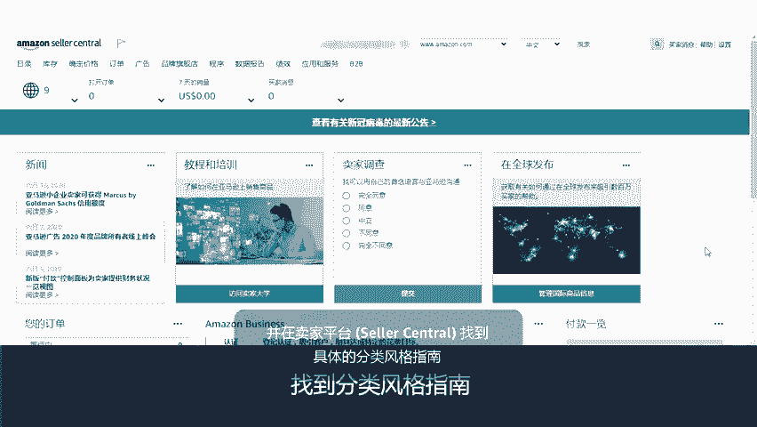
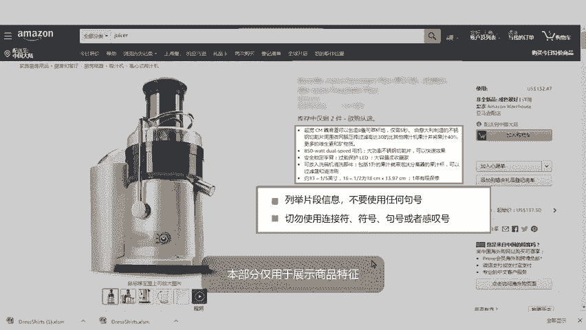
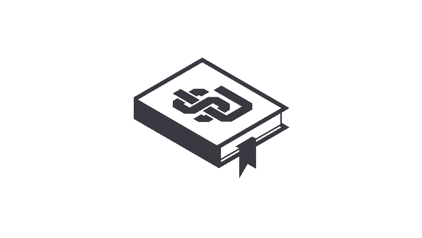

# 2024年亚马逊跨境电商开店教程，零基础亚马逊运营课程【合集】Amazon亚马逊跨境电商入门到精通教程（纯干货，超详细！） - P30：18.2-2、详情页指南 - 蛋哥说亚马逊 - BV1Ux2ZYPEFB

。

At Amazon we do our best to provide a consistent look and feel for customers that said。

 individual product categories may have slightly different content requirements。😊。

To help you create compelling and accurate product detail pages。

 we've created category style guides which contain guidelines for images， descriptions， and more。

These guides are available in PDF format for easy downloading and printing this video will give you an overview of creating great product detail pages and locating specific category style guides in sellerar Central。

The way you present your products on Amazon can influence a customer's buying decision。

It's important to provide clear and concise product information in a consistent format。

Let's review the key product information you must provide， along with a few best practices。

Your product image is one of the first things customers see when visiting your detail page。

Images need to be formatted consistently so customers can easily compare product size， fit。

 color and texture。Listings with missing images are suppressed from the site。

This could result in missed sales opportunities。The best product images have a pure white background are at least 1000 pixels on their longest side so customers can zoom in for more detail。

Show the entire product with the product itself occupying at least 85% of the image area。

Include only what the customer will receive and are free of any logos。

 watermarks or text that is not part of the product。Titles should be short， concise and descriptive。

 avoid using all caps and don't include promotional messages or subjective commentary。Remember。

 a brand name is a unique and identifiable symbol， association， name。

 or trademark that serves to differentiate competing products or services。

Use your seller name as the brander manufacturer only if your product is private label。

The key product features bullet points on a detail page can provide quick summary information about a product。

You may want to highlight the top features you want customers to consider， for example， dimensions。

 age appropriateness， country of origin， or warranty information。You can write in fragments here。

 just be sure to avoid company specific information。This section is for product features only。

Further down the detail page is the product description。

While the title and key features need to be concise。

 your product description allows you to get closer to creating an in store experience。

Put yourself in your customer's shoes， What would they want to know about the product？

Be sure to avoid company specific information here in the product description as well。

In addition to these basic style guidelines， categories may have their own specific style requirements。

 be sure to review any guides that apply to the categories in which you sell。

These style guides are downloadable from the file template table in seller Central。

From the sellerar Central homepage do a quick search on templates for specific categories。

 scroll down for the full list of categories and click on your corresponding category style guide link。

The style guides give you more depth and detail on the rules for a particular category。

 along with some examples of do's and don'ts。Check back regularly for updated guides to be sure you stay on top of any changes to a category。

For more information， search for style guides in seller Central Help。🎼。

