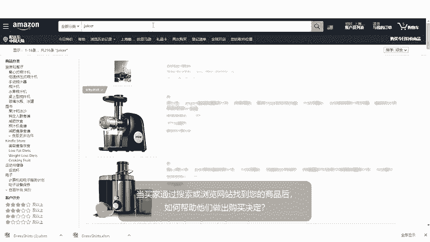
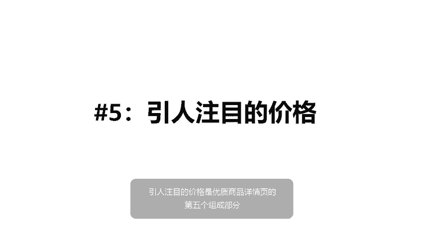
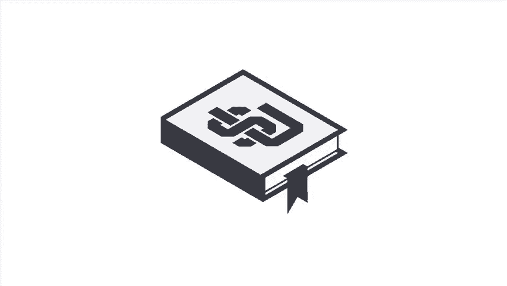

# 2024年亚马逊跨境电商开店教程，零基础亚马逊运营课程【合集】Amazon亚马逊跨境电商入门到精通教程（纯干货，超详细！） - P31：19.2-3、如何创建高质量的商品详情页 - 蛋哥说亚马逊 - BV1Ux2ZYPEFB

。

Yeah。Once a customer finds your product by searching or browsing Amazon。

 how can you help them decide to make a purchase， start with your detail page？

There are five critical components to a high quality detail page。 The first component。

 a descriptive title。Your title should clearly and succinctly describe the product。

 It should include the product brand in a short description。 The product line。

 the material or key ingredient， and the color， size and quantity。

An example of an appropriate title is Laura Ashley， Sophia Collect，300 thread count pillow cases。

 Blue， queen set of two。The second component of a high quality detail page is an inspiring product image。

The primary image of your product， sometimes referred to as the main image， is essential。

Customers base purchase decisions on images， so quality does matter。 Choose images that are。Clear。

Easy to understand， information rich and enticing。Your main image must have a pure white background and show the actual product。

 not a graphic or illustration。Make sure your images are at least 1。

000 pixels in either height or width。Meeting this minimum size requirement enables the Zoom function on Amazon。

 which can help to boost sales。The third component of a high quality detail page is the use of clear and concise bullet points。

Product bullet points highlight important facts and key features that can differentiate your product。

Customers rely on well crafted bullet points to inform their purchase decisions。

Your bullet point should highlight the five key features you want customers to consider。

 These might include dimensions， age rating， ideal conditions for the product， skill level， contents。

 country of origin and so on。Each individual bullet point should。Begin with a capital letter。

Be formatted as a sentence fragment， don't use end punctuation。

And reiterate important information from the title and description where applicable。

It's also important to note that bullet points should never include promotional or pricing information。

Here are some examples of high quality bullet points describing a set of rain gear。

The fourth component of a high quality detail page is an imaginative product description。

The description area of your detail page is where you can go above and beyond the simple feature descriptions included in your bullet points。

 It's a great place to capture the customer's imagination。😊，In this section。

 you can dive into the feel， usage， and benefits of your product in a narrative format that appeals to the customer。

Here's an example of an ideal product description。Cut for active wear。

 these pure cotton canvas pants might be the most durable and comfortable trousers you'll ever wear Wasable faux sued trim on back pockets and d ring add durability and extended wear available in brown。

 green， khaki or stone， washable， imported。😊，The fifth and final component of a high quality detail page is a compelling price。

 Research other products and offers as you determine a price point that will appeal to customers。

 and don't forget to take shipping costs into account。

 You might also consider offering free shipping to help you increase your sales。😊。

🎼。

