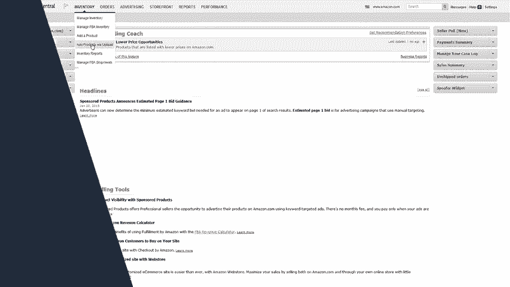

# 2024年亚马逊跨境电商开店教程，零基础亚马逊运营课程【合集】Amazon亚马逊跨境电商入门到精通教程（纯干货，超详细！） - P32：20.2-4、编辑共享的商品详情页 - 蛋哥说亚马逊 - BV1Ux2ZYPEFB

。

现在您已了解高品质商品详情页的五大组件，您将怎么做才能对您与其他卖家共用的商品详情页提出编辑意见。或者假如其他卖家希望对您在该商品详情页上的信息进行更改，您又该怎么办？

这就是商品详情页控制发挥作用的地方，虽然任何卖家均能对商品详情页提出编辑建议，但商品详情页控制是一个自动化的系统，它自行确定显示哪些编辑项和不显示哪些编辑项，此系统还会考虑提出编辑建议的卖家的绩效情况。

包括卖家销售量退款率买家反馈，及亚马逊商城交易保障索赔，通过使用本系统多个卖家可提出更改建议，然后由商品详情页控制来完成剩余的工作。您可通过三种方式对现有的商品详情页提出更改建议。第一种是最常见的方式。

😊，您在现有商品详情页上创建或编辑一个报价后，您对商品详情页组建的建议会自动提交，并由商品详情页控制对其进行评估。😊，如需编辑卖家平台上现有的报价，从库存下拉菜单中选择管理库存。😊。

然后点击您需要更改的商品旁的编辑按钮。😊，您可在viital info选项卡上更新商品名，在description选项卡上更新，我们称之为主要商品特性的要点以及商品描述。😊，当您完成这些后。

点击保存并完成编辑，然后您建议的编辑将被提交审核。如果您通过上传库存文件添加或编辑您的商品信息。商品详情页控制将会自动考虑您的商品信息。😊。

对商品详情页提出更改建议的第二种方式是专用于图片更改的方式。如需对图片提出更改建议，从库存下拉菜单中选择管理库存。😊。

点击编辑按钮旁的箭头，选择管理图片。您可在此更新主图像或添加其他图像。如果您通过上传库存文件的方式添加商品，您也能上传包含图像URL的库存文件。😊，提出更改建议的第三种方式，要在亚马逊网站上使用。

你只需找到您的商品向下滚动至商品详情，然后点击更新商品信息或给图片反馈。😊，如果您发现您不能通过上传库存文件完成您希望的更改，或者商品详情页上存在您不能删除的错误信息，请告知我们点击联系卖家支持。

然后依次点击商品和库存商品页面问题和修复商品页面，然后填写表格并点击发送。😊。

