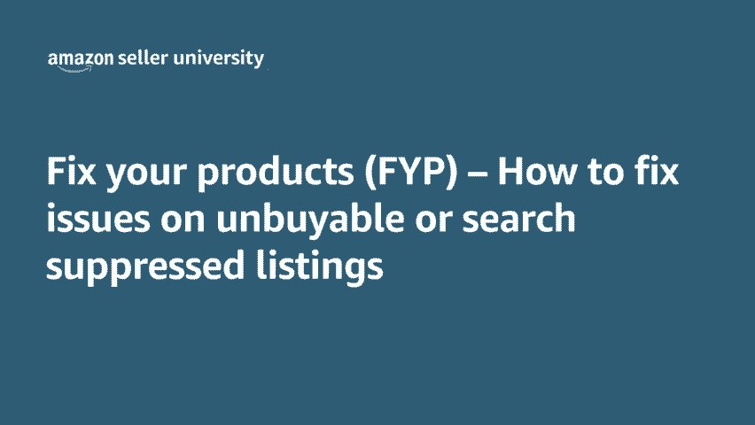
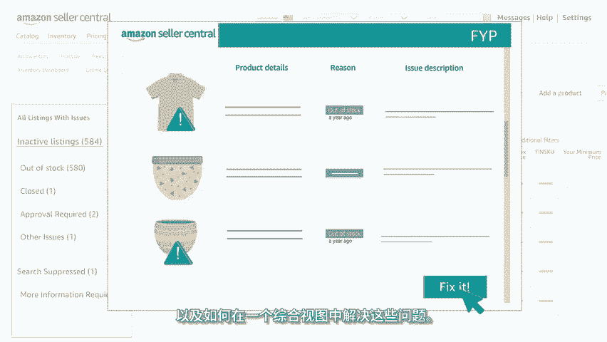
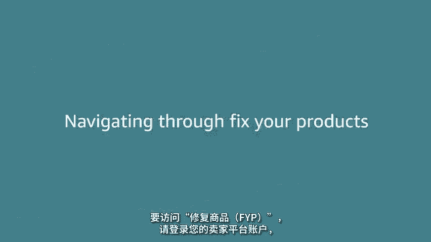
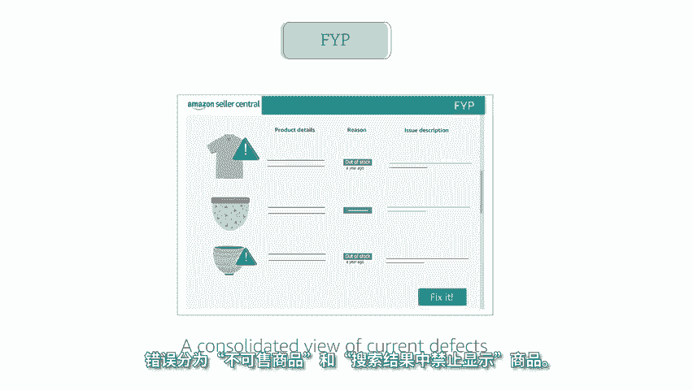

# 2024年亚马逊跨境电商开店教程，零基础亚马逊运营课程【合集】Amazon亚马逊跨境电商入门到精通教程（纯干货，超详细！） - P33：21.2-5、使用修复商品修复不可售商品 - 蛋哥说亚马逊 - BV1Ux2ZYPEFB

🎼欢迎观看关于修复商品的视频。😊，🎼在这里您将学习如何在卖家平台上使用和浏览此页面。🎼该页面旨在帮助您解决商品无法购买或被禁止搜索的问题。修复商品FYP是卖家平台中的页面。

旨在帮助您了解哪些商品存在问题，以及如何在一个综合视图中解决这些问题。要访问修复商品FYP请登录您的卖家平台账户，将鼠标悬停在库存 inventoryvent选项卡上。

然后单击管理库存manage inventory，然后您将单击页面顶部的不可售 inactive，这会将您带到您的修复商品页面，在修复商品页面上，您会在左侧看到一个导航栏，提供有关当前问题的整体视图。

您可以发现并修复不可售 inactive的商品，例如缺货out of stock，需要批准approval required拦截block。

🎼和已停售closed，或者您可以找到被搜索结果中禁止显示search suppress的商品。🎼商品在搜索结果中禁止显示。

search suppress的原因可能存在重复商品或未符合核心详情页面质量要求，例如缺少颜色或尺码，主图片不是白色背景或标题长度太长。您最近的不可售商品。

也将显示在页面顶部方便查看页面顶部还有一个搜索栏。🎼可让您按特定的SKUaen或关键字进行搜索，您可以使用筛选器进一步优化结果，可选择按商品状况原因、配送类型或更改日期进行筛选。

现在您已知道如何浏览修复商品fiture product。🎼那么我们通过几个事例来看看此页面如何帮助改善商品状况。一、您可以发现并修复。

由于被归类为可能存在重复商品而被禁止搜索的SKU如果您确定该商品不是重复的商品，请选择这些不是重复的商品，these are not duplicates来解决此问题。2、您可以发现并修复缺货的SKU。

🎼要解决此问题，请更新数量或选择补货restock，以创建新批次的货运。3、您可以发现并修复符合核心详情页面质量要求的SKU。例如，需要上传图片或添加属性，要解决这些问题。

请按照提示添加图片、颜色或色表。🎼想知道通过修复商品FYP修复商品后会如何吗？对于大多数问题，您所做的更改将需要15分钟的时间完成全网更新。然后您的商品将再次上架。🎼但是需要人工审核。

例如被拦截或需要批准的情况，可能需要更长的时间。具体取决于批准团队的工作。回顾一下修复商品FYP是一个页面，可通过登录到您的卖家平台账户进行访问，修复商品FYP可帮助您轻松解决商品可购买性问题。

从而改善整体商品状况，修复商品页面提供当前错误的综合视图，错误分为不可售商品和搜索结果中禁止显示商品。关于修复商品FYP的视频到此结束。谢谢您，祝您在亚马逊上销售愉快。

