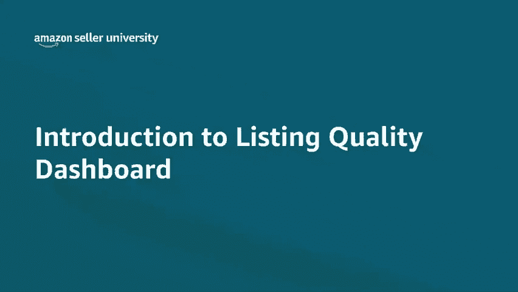
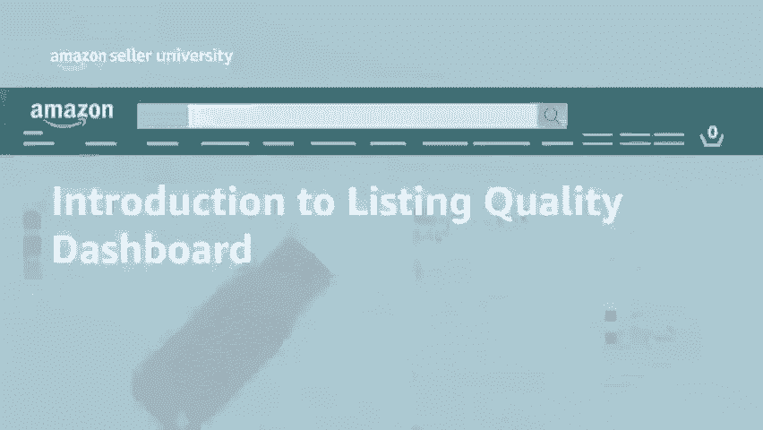
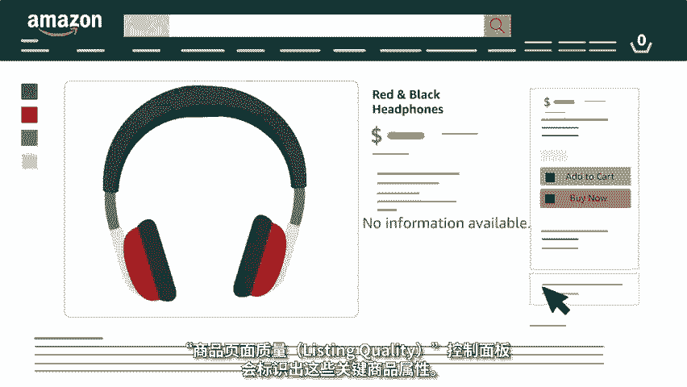
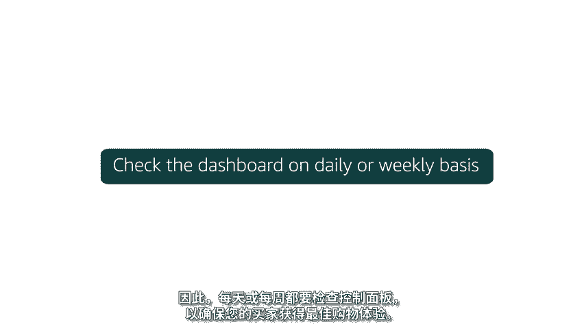

# 2024年亚马逊跨境电商开店教程，零基础亚马逊运营课程【合集】Amazon亚马逊跨境电商入门到精通教程（纯干货，超详细！） - P34：22.2-6、使用商品质量控制面板 - 蛋哥说亚马逊 - BV1Ux2ZYPEFB

🎼欢迎观看如何提高商品页面质量的视频。

🎼高质量的商品页面提供完整和准确的信息，使买家更容易发现、评估和购买商品。🎼具有高质量页面的商品也较少出现退货的情况，并且帮助您在亚马逊品牌旗舰店中打造自己的品牌。那么如何提高您的商品页面的质量呢？

🎼很简单，请前往商品页面质量listing quality控制面板。🎼要访问商品页面质量、listing quality控制面板。

🎼可以在卖家平台主页上将鼠标悬停在库存 inventoryvent选项卡上，单击管理库存manage inventory，然后单击商品页面质量、listing quality控制面板。

控制面板上的商品页面，已按照商品的销量和页面浏览次数进行了预排序。因此，您可以首先关注对您的业务最重要的商品，将鼠标悬停在一个字段上，可以查看所需填写属性的简要说明，以及填写该属性的好处。

商品页面质量listing quality控制面板，向您显示买家所寻找的缺失商品信息。🎼为商品添加推荐的信息可以帮助您。一、提高商品的发现率，买家使用特定的属性来筛选搜索结果，添加这些属性。

将确保在您的商品满足买家需求。且这些筛选器被应用时，买家不会错过该商品。商品页面质量listing quality控制面板，会标识出这些缺失的商品属性，并提示您填写他们。

🎼2、在详情页面上启用商品概述product overview小部件。商品概述是一种全新的体验，它将在商品详情页面的要点上方突出显示重要的商品属性，这将帮助买家轻松评估您的商品，并更快做出购买决定。

🎼3、潜在的减少买家退货。🎼买家常常由于详情页面上缺少商品的关键信息而退货。🎼例如，耳机和电缆的兼容性。

🎼商品页面质量、listing quality控制面板会标识出这些关键商品属性，添加此信息，可以帮助减少退货量。🎼3、采取对时间敏感的操作。

🎼商品页面质量lististing quality控制面板将突出显示必须在特定日期前填写的强制性商品信息，以防止销售中断。您可以通过单击查看强制性商品信息。

review at risk listings选项卡检查由于缺少信息而面临销售中断风险的商品信息。🎼如果您认为缺少的属性与商品无关，令人困惑，我们有正确的选项卡供您选择。

请通过为属性选择适当的原因代码来告知我们。🎼我们的系统会实时识别出缺失的重要商品属性。🎼因此，每天或每周都要检查控制面板，以确保您的买家获得最佳购物体验。谢谢您，祝您在亚马逊上销售愉快。

