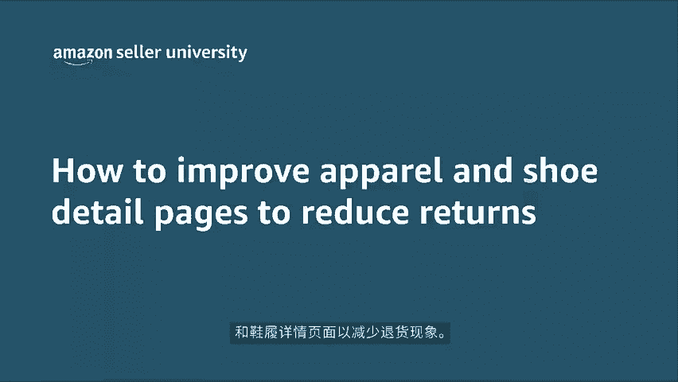
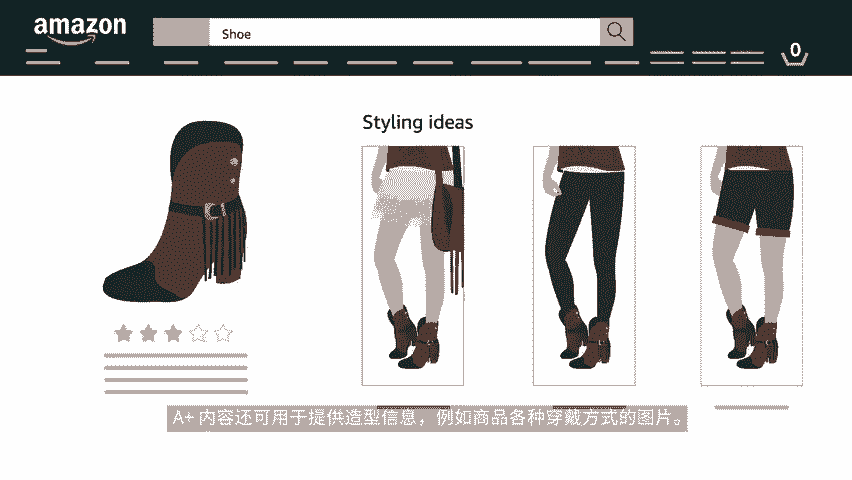

# 2024年亚马逊跨境电商开店教程，零基础亚马逊运营课程【合集】Amazon亚马逊跨境电商入门到精通教程（纯干货，超详细！） - P35：23.2-7、鞋履和服饰的商品 - 蛋哥说亚马逊 - BV1Ux2ZYPEFB

🎼欢迎观看本期视频。这次我们来了解如何改进服装和鞋履详情页面，以减少退货现象。退货作为时尚购物体验的一部分，可能会在买家对您作为亚马逊销售合作伙伴的信任中起到重大影响。

本视频将总结一些减少服装和鞋类的买家退货的最佳做法。可按照这个简单的步骤查看和更新商品属性。现在我们就来检查现有的详情页面属性吧。要改善您现有的商品信息属性，请点击采取措施按钮，然后选择编辑商品信息。

选择编辑商品信息5秒后，您将被转至商品信息页面，您可在该页面开始更新和改进现有报价的属性。首先确认您的商品，有适合美国市场的尺寸选项。这对于保持买家体验的连贯性，以及提高。

🎼通过搜索找到商品的几率都很重要，尺寸应按声序列出，从最小到最大为体型和身高类型添加其他详细信息，例如大或高，以便买家更好的了解尺码，并可以选择合适的服装，为了减少差错。

亚马逊最近已将尺寸字段更新为标准格式，务必为您的商品填写相应的必填属性，他们将被显示在页面上，并以对客户友好的格式自动合并。接下来，检查您的商品名称是否准确且合规。标题的两大关键作用，是吸引客户的注意。

以及提高通过搜索找到商品的几率，标题应该简洁信息丰富且准确，一般来说，他们应包含品牌名称、商品类型和其他识别信息，但标题不应该包含促销信息，而且不同类别的商品。🎼标题应遵循特定的亚马逊语法。此外。

包含多种商品属性的标题，如尺寸和颜色，应显示在详情页面上。现在让我们来了解一下商品图片高质量的图片对商品来说至关重要，可让客户对商品有更清晰的印象，建议每个详情页面包含5至7张图片。注意。

图片应为全白背景，图片应从多个角度展示商品关键功能，即在模特身上的效果，在图片中使用多个模特可帮助买家更好的设想各种身材类型的衣服。请记住，对于在国家或地区之间共享的A型图片也将被共享。

请确保这些A型的图片，适用于所有国家或地区。我们建议您同时包含以英寸和厘米为单位的测量信息，以适应所有地区的习惯。🎼商品描述和要点应用于向客户提供额外的合身度、材料和产品保养等，不易通过图片传达的信息。

尽可能在要点中包括以下内容。一、商品是否偏大或偏小。2、模特的尺寸和相应的服装尺寸。3、具体商品尺寸，例如内缝长度或腰围尺寸。4、造型信息，例如紧身贴合或露肩，为了提供更好的客户体验。

某些类别中的要点直接提取自A型数据，例如，在鞋子和服装中系统会自动显示材质、鞋跟高度或袖子类型等属性，以便为买家提供额外的合身信息。🎼尺码表是详情页面中最有用的组成部分之一，适用于不易确定尺寸的客户。

尺码表数据应包括与相应的服装尺寸相一致的特定身体尺寸，联系卖家支持来为您的品牌上传特定的尺码表。适用的亚马逊商店中具有相同品牌名称、部门名称和商品类型的A型，会在商品详情页面上自动显示尺码表插件数据。

请务必确保这些数值与尺寸下拉菜单中包含的数值匹配。同时还请确认所有A型都包含完整且有效的属性，否则尺码表将无法显示A加内容不仅有助于大力宣传品牌，也是主动回答客户问题的绝佳资源。例如。

某些品牌使用A加内容描述其商品可用的不同合身类型。A加内容还可用于。🎼提供造型信息，例如商品各种穿戴方式的图片，感谢观看本期关于改善商品详情页面最佳做法的视频，请记得给视频打分评论哦。

以便我们继续打造优质内容。

