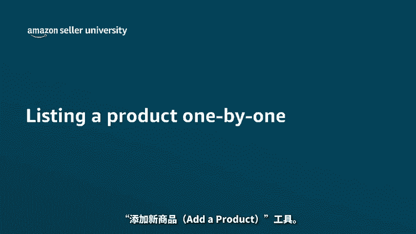
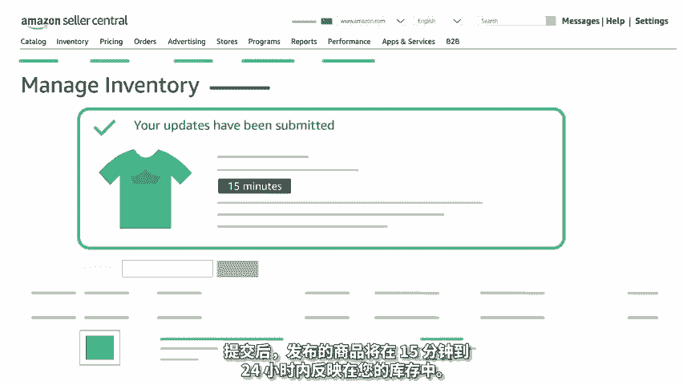

# 2024年亚马逊跨境电商开店教程，零基础亚马逊运营课程【合集】Amazon亚马逊跨境电商入门到精通教程（纯干货，超详细！） - P36：24.3-1、创建单个商品 - 蛋哥说亚马逊 - BV1Ux2ZYPEFB

🎼在本视频中，我们将向您展示如何使用卖家平台中的添加新商品ad product工具。您将学习如何？

🎼为亚马逊上现有的商品创建报价，也称为批配。🎼创建一个新的商品页面。🎼让我们开始吧。🎼在卖家平台主页上将鼠标悬停在库存inventory选项卡上，然后单击添加新商品ad product选项。🎼首先。

您需要检查准备售的商品是否在亚马逊商店中已发布。为此，请使用搜索栏查找您的商品。🎼如果使用商品编码，例如UPCEANGTIN或ISBN搜索结果会更准确。您可以使用分类筛选器来帮助缩小搜索范围。

🎼找到商品后，选择商品状况，然后选择销售此商品，sell this product。🎼如果这是变体的一部分，请单击显示变体show variations，然后选择正确的商品。如果商品显示为目前无货。

not available，请单击显示限制show limitations，以了解原因。您可以单击了解更多信息，learn more，以了解更多详情。🎼接下来您将在提供的数据字段中输入报价详情。

🎼必填字段标有星号。🎼尽管卖家SQU sellereller SQU是选项，但是最好在该字段中输入您自己的商品编号，或用于对商品进行分类的唯一编码。🎼当您尝试将已发布的商品与自己的系统进行比较时。

这样做会很有帮助。另外，为了第三方集成工具同步您的商品，卖家SKU通常是建立关联的关键领域。🎼如果将此字段留空，亚马逊将为您生成一个随机字母数字组合的卖家SKU。此外，一旦创建了报价。

就不能更改SKU除非创建新报价。🎼输入必填信息后，单击保存并完成，save and finish即可创建您的报价。🎼只有输入了所有必填的详情，该按钮才可用。🎼如果您要销售的商品在亚马逊上不存在。

则可以发布新商品。然后亚马逊将创建一个新商品详情页面。🎼为此，您可以。🎼从搜索结果页面中单击创建新商品页面，create a new listing。

🎼或者您可以从添加新商品ad products页面中单击。我正在添加未在亚马逊上销售的商品。I'm adding a productnot sold on Amazonazon。

🎼然后您可以浏览您的分类，或在搜索栏中进行搜索。🎼如果您经常添加同一分类的商品。🎼请建立收藏清单，方便将来使用。🎼单击分类左侧的星号，以添加收藏。🎼找到最符合商品描述的具体分类后，请单击选择分类。

select category以继续。🎼如果有一个锁定图标，阻止您选择某个分类，则它需要批准或受到限制。🎼单击锁定图标旁边的了解更多learn more链接，以获取有关这些情况的更多信息。🎼选择分类后。

输入所有必填商品信息完成发布。🎼可在页面顶部的选项卡中组织商品信息。🎼标有红色星号和红色边框的字段为必填项。🎼填写此信息时，请务必遵循亚马逊的质量标准。🎼添加丰富的信息，例如正确格式的标题。

白色背景的高清图片。🎼详细商品描述以及可帮助买家做出明智购买决策的要点。🎼如果未包括所有必填商品数据，则可能导致您的商品收到质量警告或被删除。要查看商品页面中所有可选的选项卡和字段。

请从右上角打开高级视图advanced view。🎼添加精确的可选信息，有助于提高所发布商品的可发现性。🎼如果您的商品有多种尺码或颜色，您不必逐个变体分别添加。🎼让我们学习如何操作。

从变体variriation选项卡中单击变体主题variriation theme选项，然后选择您的商品有何更改，这也称为父子变体。例如，假设您销售的一款榨汁机，有4种不同颜色。🎼在这种情况下。

您将单击变题主题variriation theme，颜色、color。🎼在此事例中，副商品是榨汁机，而四个子商品分别是每一个颜色选项。🎼在每个文本框中输入您希望买家看到的具体颜色描述。

输入后单击添加变体ad variations。🎼然后更新每个子商品的报价信息，这包括您的卖家SKU商品ID状况、价格和数量。🎼每件商品的必填字段都标有红色边框。

🎼您在其他选项卡上填写的商品信息将被复制到每个子商品中。🎼重要的是，要输入可应用于变体中所有商品的陈述。🎼构建变体后，您将能够分别调整每个子商品页面。🎼创建子商品后。

您需要通过分别编辑每个ASIN来添加图片。🎼在所有选项卡上输入商品信息后，单击保存并完成save and finish按钮，完成所有必填商品数据并更正错误后，此按钮被启用。

🎼红色的感叹号将引导您到所有缺少必填商品数据或包含错误的选项卡。🎼提交后发布的商品将在15分钟到24小时内反映在您的库存中。

🎼我们关于逐一发布商品的课程到此结束，谢谢您，祝您在亚马逊商店中销售愉快。

