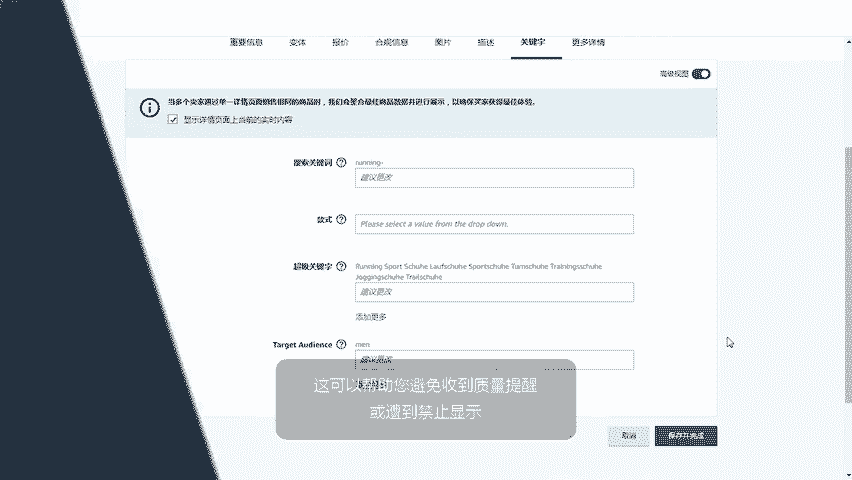
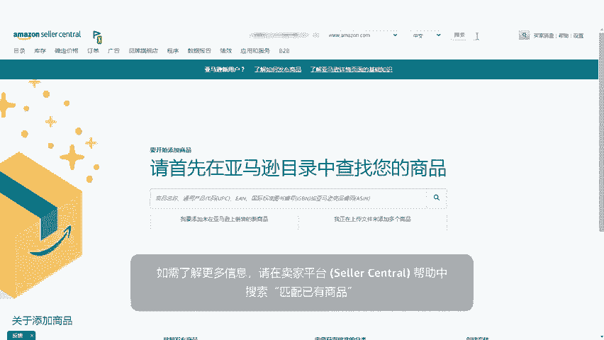
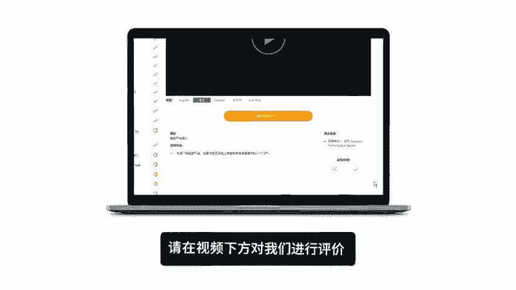

# 2024年亚马逊跨境电商开店教程，零基础亚马逊运营课程【合集】Amazon亚马逊跨境电商入门到精通教程（纯干货，超详细！） - P37：25.3-2、销售在亚马逊上面已有的商品 - 蛋哥说亚马逊 - BV1Ux2ZYPEFB

。

Yeah。Do you have products for sale that are also available from other sellers on Amazon， If so。

 you can match to these existing listings using the add a product tool in seller Central。

The Amazon catalog features products sold by many sellers。

To prevent the same product from appearing multiple times。

 Amazon uses product matching to find and eliminate duplicate listings。

This video will show you how to match to an existing listing on Amazon。

How to update your offer with additional AsN information。

And how Amazon customers can see multiple seller offers for a product。

You can match to a listing from the seller Central homepage by hovering over inventory and clicking add a product。

To search for an existing listing， enter your product name， UPC， EAN， ISBN。

 or ASIN in the search bar and click search。For example。

 you can type Juicer to see a list of available juicers that are existing listings on Amazon。

You can also narrow your results by category on the left menu。

Click sellll yours to list your product under the existing listing。

That'll take you to a page for updating your specific offer information。

 including the item condition， your selling price and quantity。

 After you click Save your listing may take up to 30 minutes to surface to Amazon and your manage inventory page。

When you're matching to existing listings， it's important to follow a few best practices。First。

 match to high quality listings， make sure that the existing listing meets all of Amazon's data requirements。

 such as images with a white background， product descriptions。

 bullet point details and title structure if you match to a listing that does not meet Amazon's data requirements。

 your product may receive quality alerts， or be suppressed。Next。

 double check the listing details to ensure your item is an exact match。

It's essential that you supply exactly what the customer is purchasing。 For example。

 if a product is sold in a package quantity of three， but your product is a package quantity of one。

 Your item is not a match。 An incorrect match like this could result in a poor customer experience and negative feedback。

With these best practices in mind， let's explore how you can update Ain information with your listing information。

Even when you've matched to an existing listing， you can edit your own listings from the manage inventory page。

A few things to consider are。A properly formatted title or image。

Your own product description and bullet points or additional key words。

 The original ason's information will still be the default for the detail page。

 But adding your own information is the best practice。

 This will help you avoid any quality alerts or suppressions。

For more information， search for matching your products in Car Central Help。

🎼。

