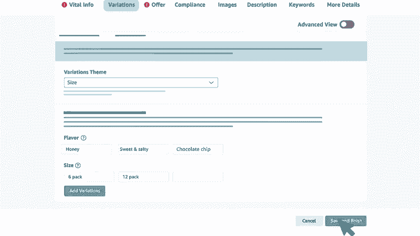

# 2024年亚马逊跨境电商开店教程，零基础亚马逊运营课程【合集】Amazon亚马逊跨境电商入门到精通教程（纯干货，超详细！） - P38：26.3-3、如何创建商品变体 - 蛋哥说亚马逊 - BV1Ux2ZYPEFB

🎼您销售的商品是否有不同的尺码或颜色或其他形式的变体？🎼您无需为每个变体创建独立的商品页面，而是可以将它们组合在同一个详情页面上。🎼我们称此功能为商品电体关系。🎼创建变体。

让买家可以在一个页面上看到其所有购买选项，并可以帮助提高转化率。🎼本视频将向您展示如何在卖家平台上使用添加新商品，创建商品变体。🎼让我们开始吧。🎼我们以具有不同片体的商品为例。

🎼该商品是一盒格兰诺拉麦片，有两种规格，分别是6件装和12件装，有两种口味，分别是蜂蜜和咸甜口味。🎼总共有4个实物商品选项，可以链接到一个亚马逊商品页面。在此事例中有4个子商品映射到一个副商品。

他们通过所选择的变题主题组合在一起。请注意，副商品并不是要出售的实物商品。如果副商品与子商品没有关联，则子商品将自己成为一个独立商品。🎼现在我们看一下如何使用卖家平台中的添加新商品工具。

创建副商品和子商品。🎼在卖家平台主页上将鼠标悬定在库存inventory选项卡上，然后单击添加新商品at product。🎼然后单击我正在添加未在亚马逊上销售的商品。

I'm adding a product not sodom amazon选项，现在为您的商品选择相关的分类，输入副商品页面中的商品名称以及品牌和制造商如果需要。由于副商品不是要出售的实物商品。因此。

以下字段请保留空白商品ID和ID类型，包装数量以及颜色、尺码和口味等变体属性。🎼现在转到变题选项卡。🎼从下拉菜单中选择适当的变题主题。🎼请注意，这些变体主题可能会根据您所销售商品的分类而有所不同。

输入变体名称、颜色、尺码、口味或所选变体主题指示的属性，然后点击添加变体。🎼电体将显示在页面底部。🎼填写每种商品遍题所需的信息。接下来您将转到其他选项卡和菜单选项。

以提供商品描述、特点和有助于创建高质量商品页面的其他必须信息。🎼我们建议选择高级视图来添加可选信息，以帮助提高商品页面的可发现性。🎼您在其他选项卡上填写的商品信息将被复制到每个子商品页面中。

因此重要的是要输入应用于变体中所有商品的信息。您也可以在以后分别更新每个子商品页面。🎼完成后单击保存并完成按钮。🎼构建变体家族后，您将在管理库存页面中看到一个看起来是一个商品页面的合并结构。

🎼但是在副商品的最左侧，您会看到一个箭头符号，并显示变体一词和在组合中发布的变体数量。🎼要查看每个子商品页面，请单击箭头符号。🎼为每个子商品页面添加一张主图片，这很重要。如果没有主图片。

商品最终可能会被删除，且无法购买。🎼要添加图片，请在子商品页面上单击编辑edit，然后导航到图片image选项卡，添加图片时，还可以调整或添加选项卡上的任何其他内容，以进一步说明该特定子商品。

🎼如果将来需要将更多商品添加到同一变体家族中，请单击副商品上的编辑edit，然后导航到变体variation选项卡。🎼在这里您可以构建变体家族的新增成员，像第一次设置原始变体时一样，在文本框中填写详情。

单击添加变体，并填写所有必填信息。🎼然后单击保存并完成按钮，新增成员将被添加到变体家族中。

🎼如何使用添加新商品来创建产品变体视频到此结束。🎼谢谢您，祝您在亚马逊商店中销售愉快。😊。

