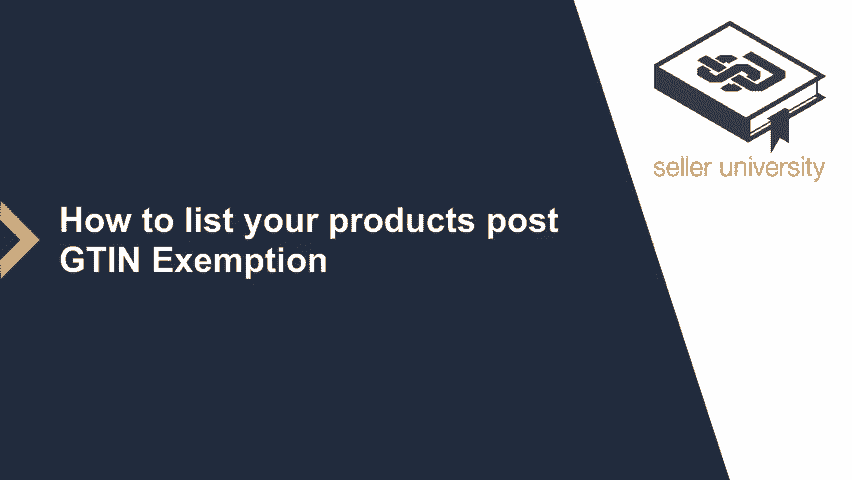
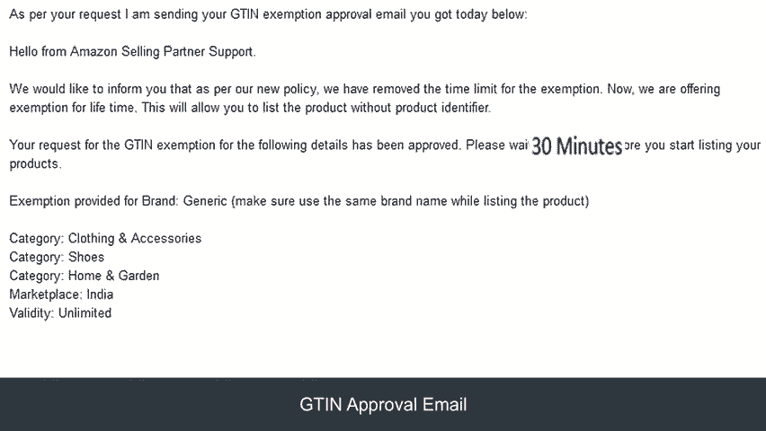
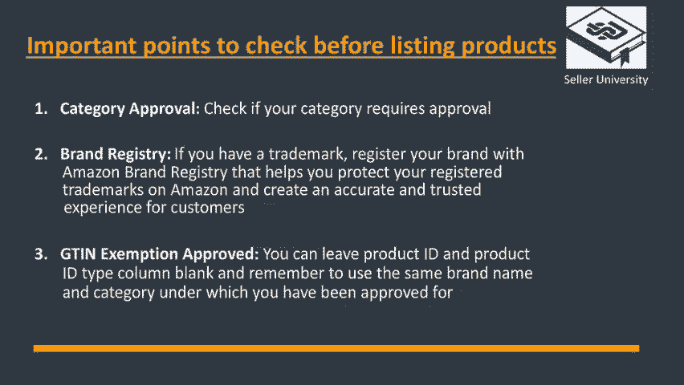
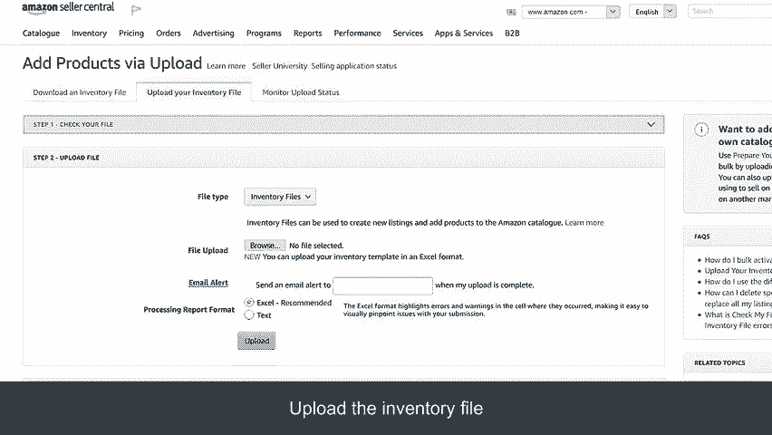
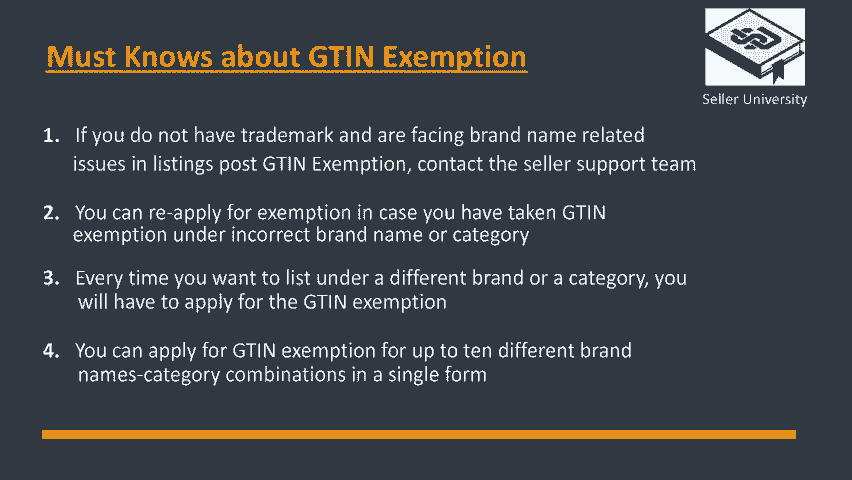

# 2024年亚马逊跨境电商开店教程，零基础亚马逊运营课程【合集】Amazon亚马逊跨境电商入门到精通教程（纯干货，超详细！） - P39：27.3-4、如何发布UPC豁免的商品 - 蛋哥说亚马逊 - BV1Ux2ZYPEFB

응。Welcome to the module on How to list Products post receiving the GTIN exemption。

Let's begin this module by checking the GTIN exemption status， log into your seller account。

 hover over the inventory tab and click on add a product。At the bottom of the page。

 there is an option to check the GTIN exemption status。Once you click here。

 you will be able to check the status of your GTIN exemption by clicking over the option。

 view or respond。 The approved GTIN exemption request email will look like this。

This will provide you with the confirmation on the category and the brand name to be used while listing the products。

Also note， you can start listing your products after 30 minutes post receiving the approval。

Before we start listing the products， there are a few important points to keep in mind。

 Do you require a category approval for the products you are selling。

If you have a trademark certificate， you can register your brand along with Amazon with brand regiiststry。

 which will help you protect your registered trademarks on Amazon and create an accurate and trusted experience for customers post the approval on the GTIN exemption you may leave the product ID and product ID type blank as this will become an optional field while listing your products in the same category。

Now let's take an example of listing the products manually postd receiving a GTI exemption。

From the seller Central homepage， hover over the inventory tab and click on add a product。

You will need to click on the option。 I am adding a product not sold on Amazon。On this page。

 you will need to choose the right category for your product either by typing in or using the browse feature。

Enable the advancedd view option on this option to display all the important options to be filled for your listings。

Once all the tabs are enabled， you will need to fill all the relevant details about your product to enable the Save and finishish button。

Please note， post GTIN approval， entering data into product ID and product ID type field will not be required Once you click on saveve and finish。

 your product will be successfully listed on Amazon。😡。

Now let's learn how to upload your products's post GTIN approval via bulk upload。

Hover over the inventory tab and click on add products via upload。

Once you enter the bulk upload page， the first step is to download the template。

You can either generate a template by selecting the categories through the product classifier。

 selecting the type of template， and then generating the template。Alternatively。

 you can download category specific inventory files。

Scroll at the bottom of the page and click on the inventory files。

 click the category specific inventory files option。

 a pop box will appear with a list of categories to choose from。

Please click on the correct category to download the template。In the Excel template。

 which is downloaded， begin first by selecting the product type you want to list from the dropdown。

This will activate the relevant columns that needs to be filled and block the other ones。

Remember to keep the product ID and product ID type field blank and enter all the relevant details in the sheet。

Once the sheet is filled completely， you can save it and go back to the Add product via upload section and click on the upload your inventory file option。

In the step2 section of this page， you will need to attach the template and click on upload。

That's it。 Your products will be listed on Amazon。

Here are the four must know things about GTIN exemption。

If you do not have a trademark and are facing brand name related issues and listings post GTIN exemption。

 contact the seller Support team， you can reapply for exemption in case you have taken GTIN exemption under incorrect brand name or category。

Every time you want to list under a different brand name or a category。

 you will have to apply for the GTIN exemption。You can apply for a GTIN exemption for up to 10 different brand name category combinations in a single form。

 Thank you。 And happy selling on Amazon。

