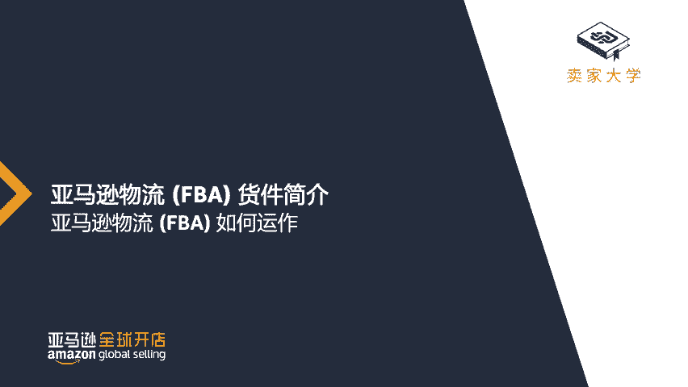
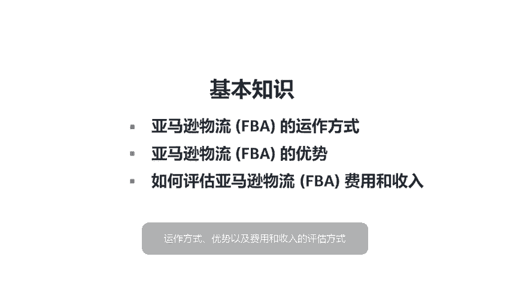
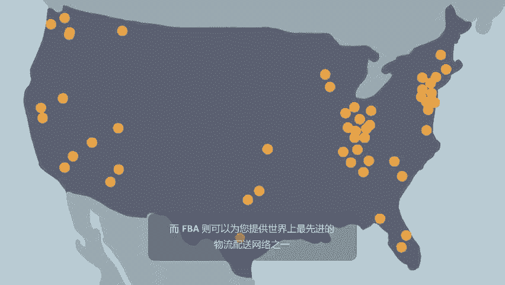
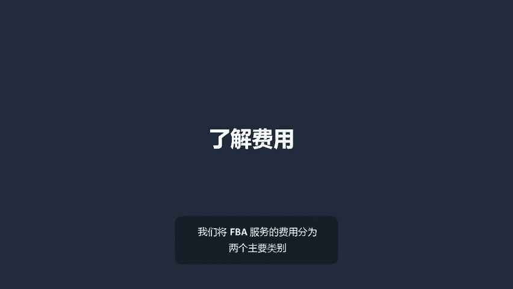
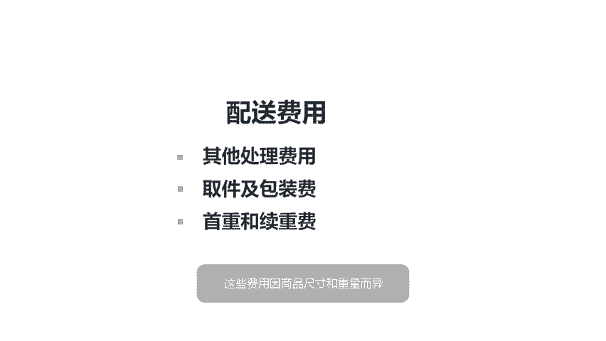
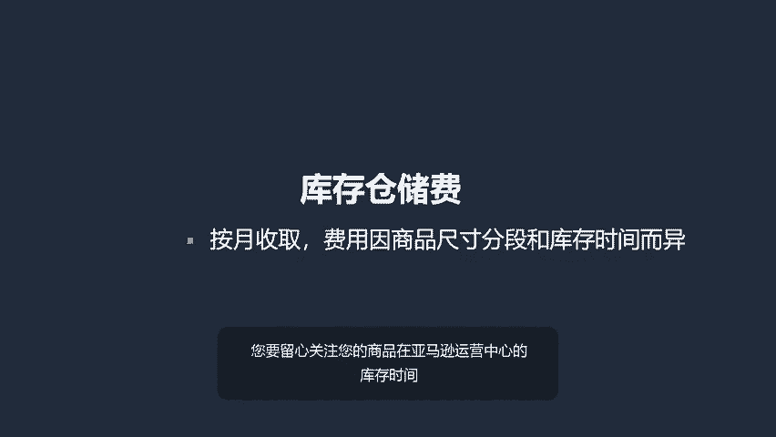
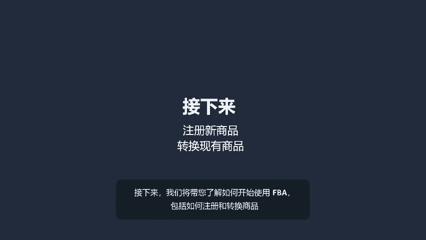
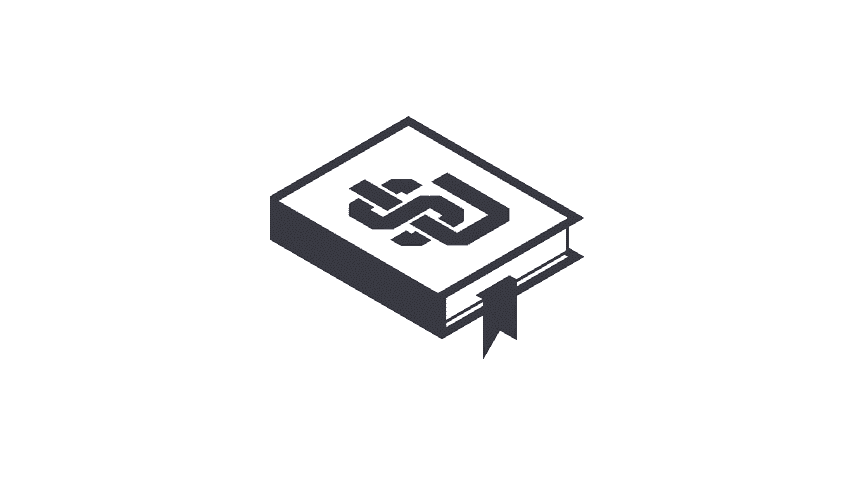

# 2024年亚马逊跨境电商开店教程，零基础亚马逊运营课程【合集】Amazon亚马逊跨境电商入门到精通教程（纯干货，超详细！） - P40：28.4-1、亚马逊物流的工作原理 - 蛋哥说亚马逊 - BV1Ux2ZYPEFB

。

With FB you store your products in Amazon's fulfillment centers where we ship your orders。

 handle customer service and take care of returns for you in this video we'll cover the basics how FB works。

 the benefits of the program and how to estimate FB fees and revenue with fulfillment centers across the United States and around the world。

 FBA puts one of the world's most advanced fulfillment networks to work for you。

FBA also offers a number of special services that can help you grow your business。

 like two day shipping for prime members。  customers absolutely love free shipping。

 and FB gives you a cost effective and easy way to offer free shipping on your products。😊。

Other F services include powerful inventory management tools and access to hundreds of millions of shoppers worldwide。

 So how does it all work， to put it simply， you sell。

 We take care of the rest after you complete the steps to register your business。

 you'll need to identify the products and quantities you want to fulfill using F。😊。

Each item in box needs to be labeled and prepared according to our exact shipping guidelines with your labels in place and your box is prepped。

 you are now ready to ship your inventory to Amazon fulfillment centers designated by F。

After we receive and process your products， we make them available to millions of customers on Amazon。

com as orders come through， we'll pick， pack and ship them out on your behalf。

 and our trusted customer Service Center will assist your customers and manage any returns。

Understanding fees is key in maintaining a healthy return on your legal investment。

 Let's break down the two primary types of fees that will apply with F。

The first is fulfillment fees。 These include order handling。

 pick and pack charges and weight handling， which vary based on the size and weight of your items。

 The second is inventory storage fees， which are charged monthly and are based on the size and age of your products。

 You will want to make sure you monitor the age of your F inventory。

 Uni that remain in fulfillment centers longer than 365 days。

 will be assessed Long term storage fees。😊。

FBA also offers a variety of optional packing services。

 If your products need special supplies like poly bags， shrink wrap， bubble wrap or special labels。

 we can take care of that for you。 We can also remove and dispose of inventory at your request。

Additional fees will be added if you choose to take advantage of these services。😊。

Be sure to use the downloadable reports in sellerar Central to break down your fees。

 track profitability， and estimate fulfillment costs。

The FB revenueevenue calculator is another great resource that can help you estimate potential fees Find this tool in sellerar Central。

FB's inventory dashboard makes it easy to manage your business， Use it to measure sales。

 maintain inventory levels and get custom recommendations on how to improve your sell through rate。

 access your dashboard via seller Central or use the Marketplace Web service APIs to connect your FB In information to tools you already use。

 You can also stay connected to your business with the Amazon seller mobile app。

 This app makes it easy to manage inventory， preview fees， set prices and more all while on the go。

 Download it via the Apple app store or Google Play。😊，As you can see。

 FBA is a powerful tool that lets you focus on what you do best。 grow your business。 You sell。

 we handle the rest。 Now that you know how FB works， we'll dive into how to get started with FB。

 including registration and converting your products。😊。

。

