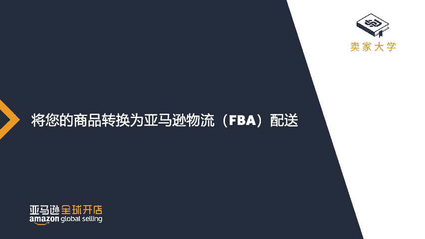
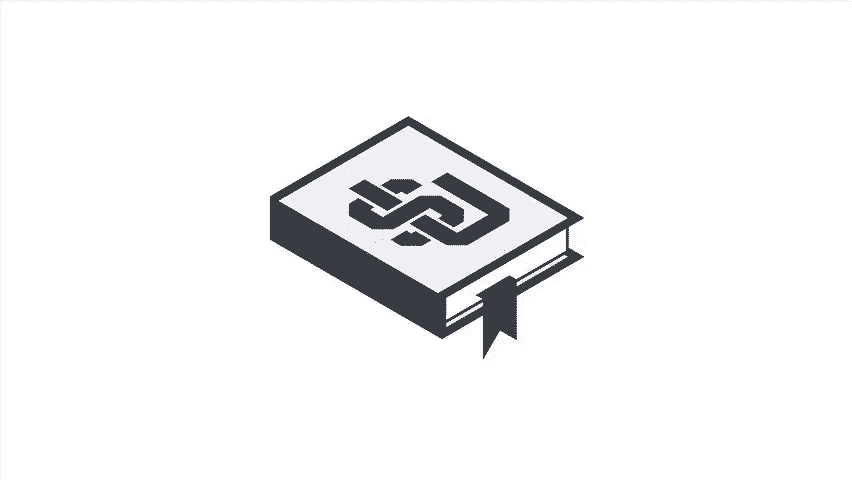

# 2024年亚马逊跨境电商开店教程，零基础亚马逊运营课程【合集】Amazon亚马逊跨境电商入门到精通教程（纯干货，超详细！） - P41：29.4-2、如何注册FBA - 蛋哥说亚马逊 - BV1Ux2ZYPEFB

。

Yeah。Hello and welcome to the Fment by Amazon series In this video。

 we're going to walk you through the steps of converting your products to fulfillment by Amazon。

 also known as FB。The first thing you'll need to do is enroll an FBA。To do this。

 log into Sear Central， hover your mouse over settings， and then from the drop down menu。

 select account info。On the left side of the screen you'll find your services， click manage link。

Then select the radio button for fulfillment by Amazon。Now that you've enrolled in FBA。

 you can convert your products to do this， hover over the inventory tab and select Manage In。

When your inventory loads， locate the skekuws you want to convert。

Then click the arrows next to the edit button from the drop down menu that appears。

 select Change to fulfilled by Amazon From here you can choose to convert this product to FBA or convert and begin your shipping plan。

That's it You've now successfully converted your products to fulfillment by Amazon and you're ready to create your first shipment。

You can view your converted products by clicking on inventory。

 then clicking on manageage FB inventory。Thanks for watching when you're ready to complete your first shipping plan。

 watch the C your first shipment video located in Seller University。

