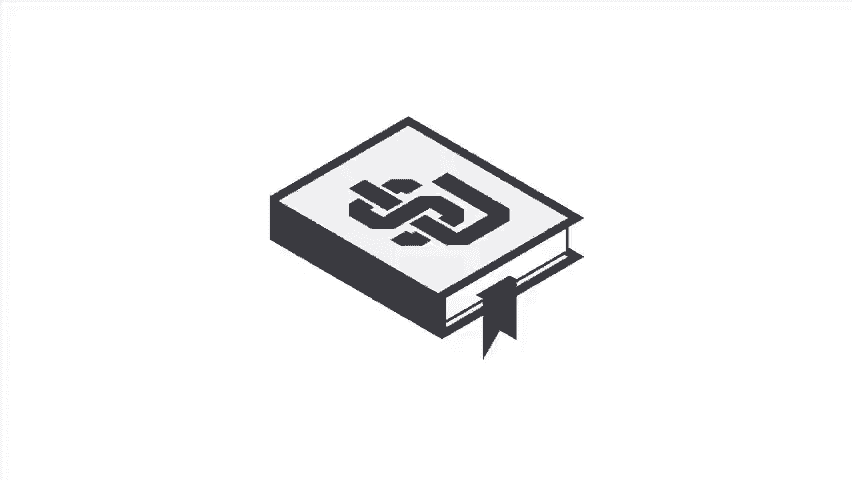

# 2024年亚马逊跨境电商开店教程，零基础亚马逊运营课程【合集】Amazon亚马逊跨境电商入门到精通教程（纯干货，超详细！） - P42：30.4-3、如何准备亚马逊物流商品 - 蛋哥说亚马逊 - BV1Ux2ZYPEFB

。Yeah。

Now that you know a bit about how FBA works， let's move on to how to get started First you'll want to register the best way to register for FBA is by following the link at the bottom of this seller central page。

 we recommend using this method rather than simply starting to convert your listings as it will ensure you have all the functionality you need to get started with FB。

Before we move on to converting your listings to FBA， let's talk a bit about preparing your products。

 Your products should be e-commer ready when they arrive at Amazon's fulfillment centers。

 What does that mean？😊，Ecommerce ready means your products are correctly prepped。

 labeled and packed for safe and secure shipping to customers doorsteps。

 Amazon's receiving systems and catalogs are barcode driven。

 Each unit will need an Amazon product label so we can associate the unit with your account。

 You have three options for labeling your products。

 Your first option is to use the existing manufacturer barcode for eligible products by using the manufacturer barcode。

 You can skip having to apply barcodes。😊，Your second choice is to print and apply Amazon labels for each unit。

 which we'll discuss later during the shipment creation workflow。

 you can use this option even if your products do not have a UPC code or barcode。

The third option is the F label service where Amazon will label qualified units for you for a fee。

As we mentioned earlier， your products should be e-commerce ready。

 meaning they are individually prepared to be securely transported throughout the fulfillment cycle。

 Certain categories have special prep requirements。

 which you can find in the prep label matrix and seller central pictured here。

 De or fragile items should also be prepared so that theyre not damaged during regular handling。

 Additionally， you can opt to select the F prep service。😊，If you select the F prep service。

 Amazon can prepare your eligible products for a per unit fee， first。

 enable the FB prep services by selecting Amazon when asked。

 who will prep your products when you're building out your shipping plan。

 you'll be provided with an estimate of the associated fees for their services once you've selected Amazon。

 save the settings and continue with the shipment workflow。

You should also determine if your products are individually packaged or case packaged if you plan to send a mix of product。

 sizes or conditions， your products would be considered individual items。

 if all items in the case have the same skewing condition and each box is uniformly packaged with equal quantities。

 and your products would be considered case packed General this applies to products that are packaged by the manufacturer。

 If you do use case packed items， we will still require each item to be individually prepped。

 you will not， however， need to split a case to multiple locations。😊，Products that are sold as a set。

 such as a series of DVDs or a collection of books need to be bundled into a single secure package。

 You don't want part of the series getting lost。 Products that are not officially a set but are being sold as such。

 For example， a collection of toy cars or trucks being sold together must be packaged together and visibly marked as a set on the packaging。

 Otherwise， they may get separated。 If your products arrive at a fulfillment center and aren't correctly prepared。

 you can expect delays in there being available for sale。😊，Not only that。

 but if additional work is required by the fulfillment center staff to make sure your products are e-commerce ready。

 you could be charged unplanned prep service fees to avoid these headaches。

 always make sure your products are e-commerce ready when they arrive at our fulfillment centers。🎼。

