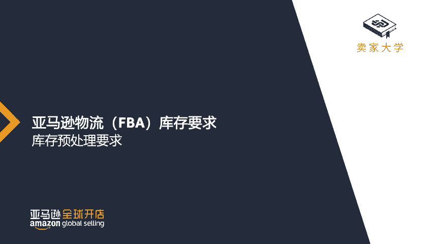
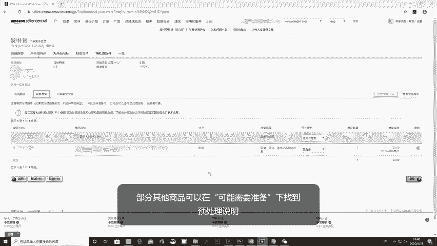
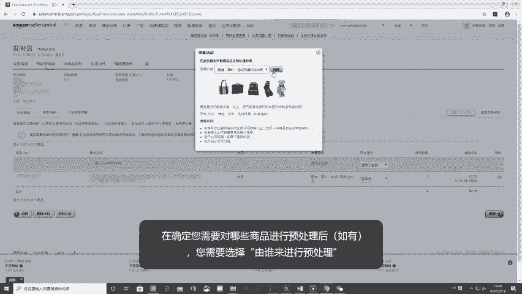
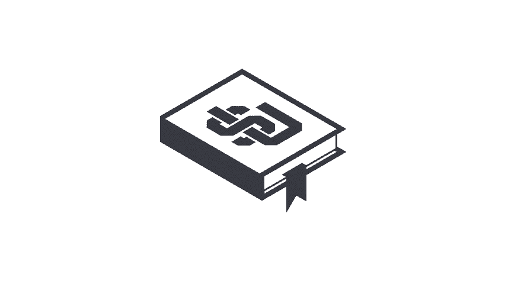

# 2024年亚马逊跨境电商开店教程，零基础亚马逊运营课程【合集】Amazon亚马逊跨境电商入门到精通教程（纯干货，超详细！） - P43：31.4-4、仓库入仓前的预处理要求 - 蛋哥说亚马逊 - BV1Ux2ZYPEFB

。Yeah。

Yeah。When you send your products to an Amazon fulfillment center。

 they need to be e-commerce ready so that they can be received efficiently。

 made available for sale as quickly as possible， and reach your customers in perfect condition。

If this is your first time working with an e-commerce channel like Amazon。

 the prep guidelines may feel overwhelming， but each requirement is in place to help your items reach Amazon customers in the same condition in which they leave your warehouse。

Sending items to a brick and mortar store is a one way trip。

 items move from a warehouse to the retail location。

 and customers are then responsible for getting them home safely。 However， as an Amazon seller。

 anything that you ship to our fulfillment centers has to survive an initial ride in the delivery truck to us。

 along with many other items， unpacking at the fulfillment center and placement on a shelf until sold。

 Once sold， it's pulled from that shelf packed up in a new box and shipped to the end customer。

 if you think about it in these terms， the prep we require really helps ensure that your items arrive to your customers in perfect condition。

To meet the prep guidelines， it's important to know what type of prep your products need， if any。

 and who is going to perform the prep。 First， to find out if your products need to be prepped。

 look in the prepare product step during shipment creation here。

 some of your products may have prep instructions under prep required。

 and some others may have prep guidance under prep may be required in order to see the prep guidance specific to your product。

 you will need to choose the prep category appropriate for your products。

Once you have determine what type of prep your products need， if any。

 you have to select who's going to perform the prep。

 You can do this yourself or have Amazon do it for a per item planned prep fee。

If you choose to do the prep yourself， it's important that you prep your products adequately。

 if you select that you are going to perform the prep and the products that you send have not been prepped adequately or at all will need to perform unplanned prep services for a higher prep item fee than our planned prep services。

The most common prep related issues are with polybaing， bubble wrapping and taping。

Polybagging your items is important to help protect our associates， other products and customers。

 as well as to protect your own products from dust， dirt， and damage during receipt， stocking。

 packing， and shipment to the customer。This is why you need to protect your items with a poly bag when shipping them。

 especially when they include。Perforated packaging。Pllets， powders， and granular items。Pluh items。

Baby products。Apparel， fabric and textiles。Jewelry。

Small products such as keychas or USB flash drives。

Liquids and non glass containers that are not double sealed or products with more than 16 ounces of liquid。

 even if they are double sealed。 A double seal includes both a tightentan lid that cannot be easily opened and either a safety seal。

 like you would find on a new ketchup bottle or a manufactured seal around the outside of the neck of the product。

So when bagging these types of products， you need to ensure that the poly bag is transparent。

 at least 1 millm thick and completely sealed。 Some bags may come with their own adhesive seal。

 but if not， you can just use regular adhesive tape to seal the poly bag。

It's also necessary to have a suffocation warning on the bag If the opening is larger than 5 inches when lying flat。

 Some bags already come with this warning， but if not， you need to apply that warning label yourself。

Finally， your item's barcode has to be readable through the poly bagag。 if it's not。

 then you need to put the barcode label， whether it's an Amazon barcode or a secondary barcode for items tracked with a manufacturer barcode on the outside of the bag。

It's also important to remember not to let the bag protrude more than three inches past the dimension of your item。

Force a product into a bag that is too small。 Use black or opaque bags unless it's a product in the adult category。

 or leave any part of your item exposed。Bubble wrapping is important to help protect our associates。

 other products and customers， as well as to protect your own products from dust。

 dirt and damage during receipt， stocking， packing or shipment to the customer。

This is why you need to protect your items with bubble wrap when shipping items that are fragile。

 sharp， or made out of glass or ceramic。When bubble wrapping your items， it's important to make sure。

Your item is properly covered and sealed by the bubble wrap， and the barcode is readable for this。

 you'll need to place either a secondary barcode label starting with B or a number or an Amazon barcode label。

 starting with X on the outside of the bubble app。Taping is important to ensure that the contents of your boxes。

 polybags， and bubble wrap are secure and won't get loose or lost。

This is why your boxes should always be taped by the seams and not have the flaps weaved。

 Poly bags should be shut close with the tape if they don't come with an adhesive ceiling。

 and bubble wrap should be taped to secure the item within the bubble wrap。

It's important to remember not to cover any box labels when taping your boxes or any inventory labels when taping your poly bags or bubble wrap so that all labels can be scanned properly。

Now that you know how to comply with the F inventory prep requirements。

 your products will be processed and shipped to customers as soon as possible。

 Remember that this video is meant to help you prevent prep issues。

 Please feel free to review our entire policies regarding these and other prep requirements in the links below。

🎼。

