# 2024年亚马逊跨境电商开店教程，零基础亚马逊运营课程【合集】Amazon亚马逊跨境电商入门到精通教程（纯干货，超详细！） - P44：32.4-5、商品贴标要求 - 蛋哥说亚马逊 - BV1Ux2ZYPEFB

。

In this video， you'll learn about product barcodes， how to label your items。

 and best practices to avoid delays in the shipping process。

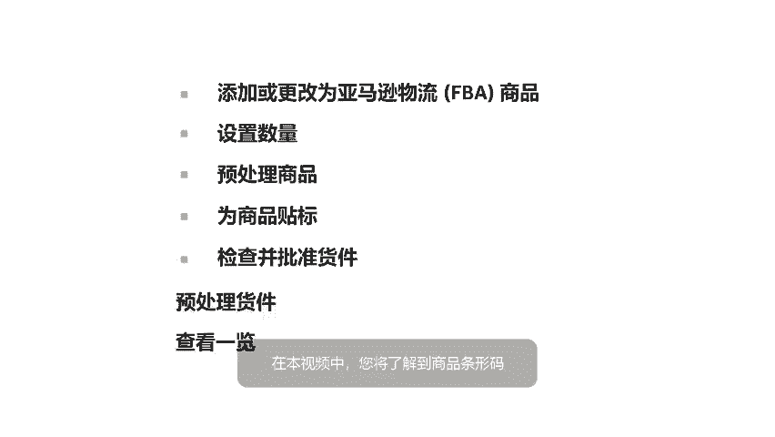

To start， let's review the different types of product barcodes and how to choose the right one for your product。

To streamline the shipping process， Amazon uses scannable barcode labels on every product。

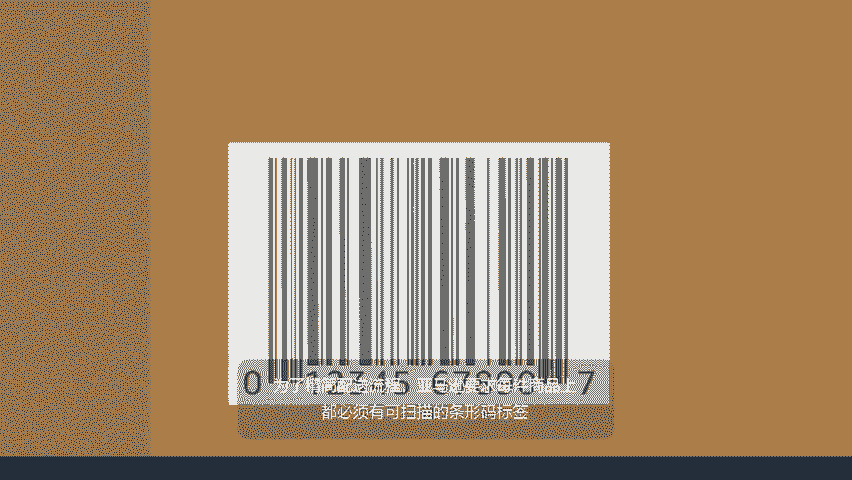

These barcodes help identify the product， for example， a specific book title or replacement part。

Barcodes also identify you as the FB seller of that unit。

 so you get credit for the sale Barcodes help us identify and track your products throughout the entire fulfillment process every unit you send to FBA requires a barcode。

 You have three options when labeling your product use an existing manufacturer barcode apply a unique Amazon barcode label yourself or for a small fee use the FB label service to apply the Amazon barcode for you we default to manufacture barcodes on eligible products to speed up delivery to customers。

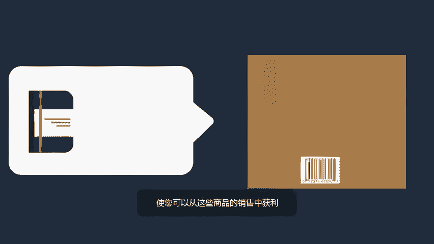

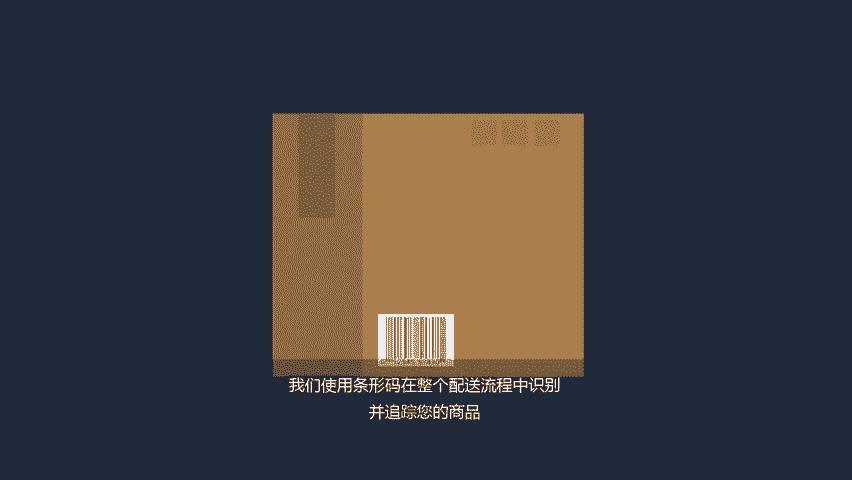

When you receive a customer order， we might fulfill that order using another seller's unit of the same product when the other seller's unit is closer to the customer。

You receive credit for the sale。 We then instantly transfer a unit from your inventory to that of the other seller。

FBA tracks each unit individually and keeps them in separate physical locations。

Each time you create a shipment， a notification on the set quantity page will show which of your offers qualify for the manufacturer barcode。

If there is no eligible manufacturer barcode for your product， an Amazon barcode is required。

You can either apply this barcode yourself or use the FB label service for a small per unit fee。

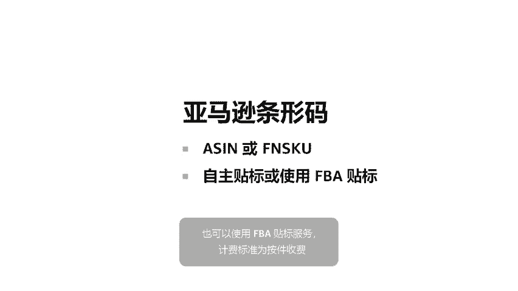

If you use the FB label service， mark each item as labeled by Amazon in your shipping plan and we'll take care of the rest。

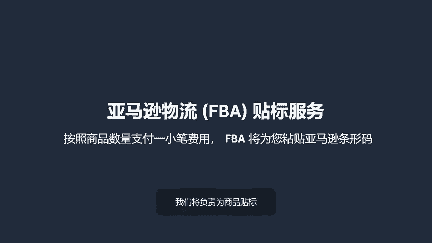

If you want to print and apply the Amazon barcode labels yourself。

 you'll need correctly sized blank mailing labels and a laser printer。 We recommend Avery 5160。

 but other label sizes will work too。

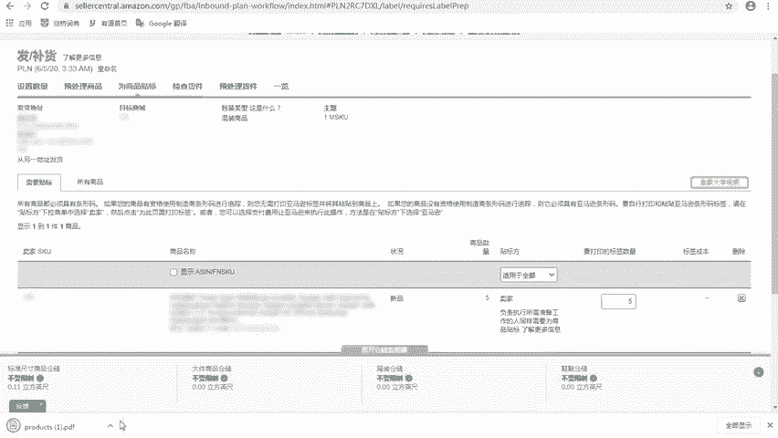

Just make sure they are between one and2 inches tall and2 and3 inches wide。For best results。

 use a laser printer and print at 300 DPI。For large shipments。

 be sure to select all pages and generate a label file for each page。

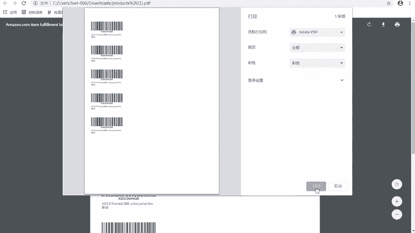

Remember， all Amazon barcodes must be printed in black ink on white。

 self adhesive non reflective labels。

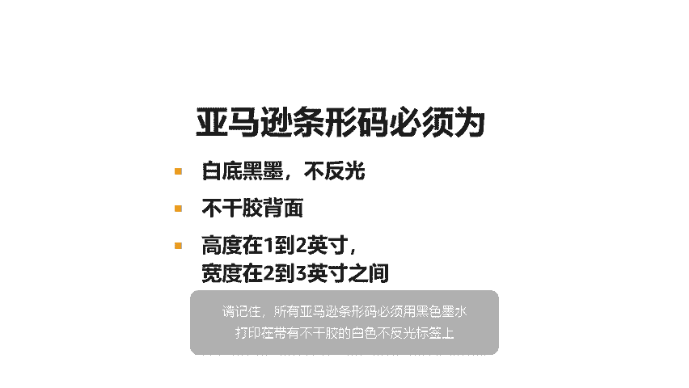

Your barcode labels will include a scannable barcode， a number corresponding to the barcode。

 also called the FN SkuU， the product title， and product condition。

Use the product title and condition to match labels with the correct units If you have trouble finding a match。

 you can generate a packing list to match FN Skus with their corresponding products。

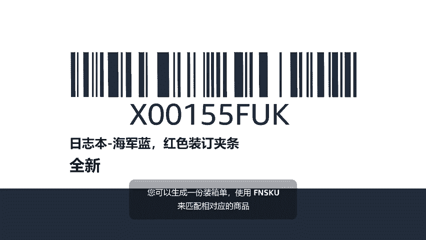

Clear crispP labels that are properly placed on the right units are key to efficient shipments and more satisfied customers。

For this reason， Amazon doesn't accept damaged or photocopied labels。

Place the label on your product。If your product doesn't need extra packaging。

 cover any original barcodes such as UPC， EAN， or ISBN codes。

 then put the Amazon label on a smooth surface， avoiding corners， edges， or curves。

For products that do require extra packaging， such as bubble wrap or other protective packaging。

 add your labels on the outside。 This way， they are easily scannable when they arrive at the fulfillment centers。

That was a lot of information， so let's review。When labeling products for fulfillment by Amazon。

 be sure to use only clean laser printed self adhesive labels。Put the correct barcode on each unit。

Cover all other visible barcodes with the exception of any serial number barcodes。

Place the barcode on the outside of any packing materials。Do not place the label on a curve。

 edge or corner。When creating a shipment on the labelbel Products tab。

 you need to choose who prints the label， Amazon or merchant， the number of labels to print。

 and then select print labelbels。

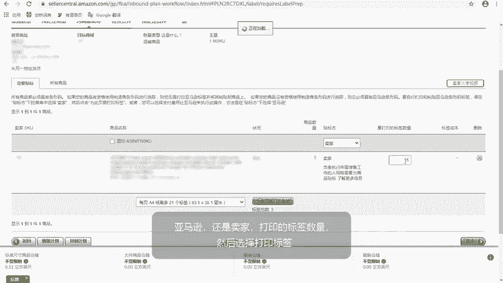

For more information on correct product labeling， visit the use an Amazon Barcode to track inventory Help page in Sear Central。

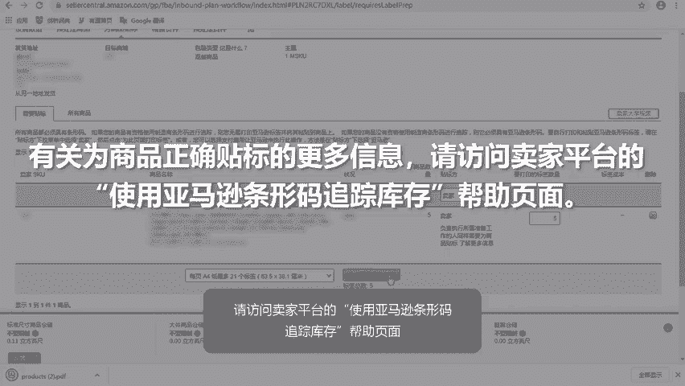

You've printed and applied your Amazon barcodes Now it's time to review your shipment。

 You can review shipment details by clicking View shipment contents。

Before you click App approveve and continuein， be sure to review the complete shipment policy available on sellerar Central。

Once you approve your shipment， your tab will change from review shipments to view shipments。

On the View Shiment tab， you might notice your inventory is being split into multiple shipments to be placed in different fulfillment centers across the Amazon Fment Network。

In order to speed delivery to customers， Amazon might spread your inventory across the fulfillment network to be closer to potential customers。

Split shipments can also happen if your products are oversized or in a category that requires special handling at designated fulfillment centers。

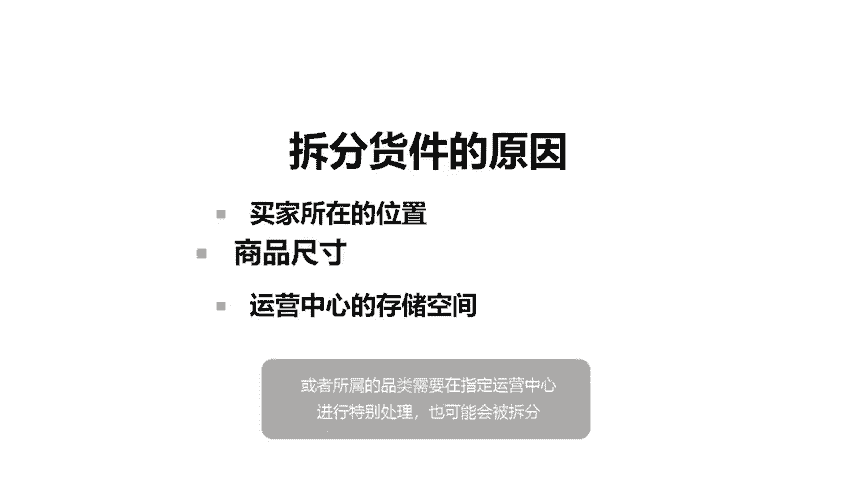

If you'd prefer to send your eligible inventory to a single destination。

 you can sign up for the inventory placement service。

 Amazon will receive your units and redistribute them across our fulfillment network as needed。

 A per unit service fee applies。 using this service can help you avoid delays and unplanned service fees。

 If you find it difficult to manage multi destinationestination shipments。😊，For more details。

 please visit the F Inventory Placement Service Help page Always double check your shipping locations。

Shipments that are incomplete， misrouted， or that have been deleted after approval lead to longer processing times。

 This decreases your overall FA performance。Congratulations。

 you've learned about barcode types and best practices for labeling inventory。

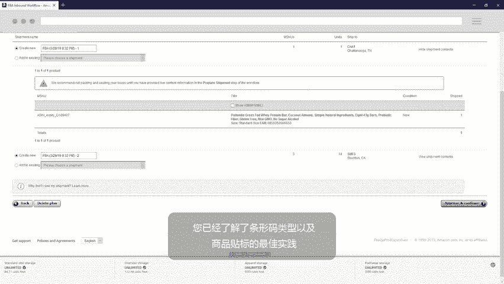

To continue the video series， watch F shipping， prepare shipment and summary。

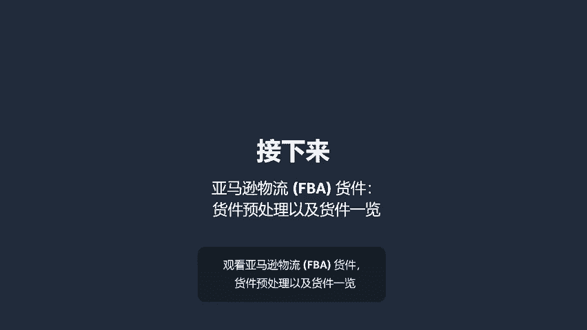

Yeah。

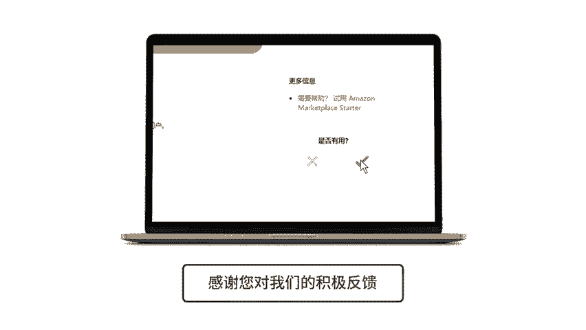

🎼。