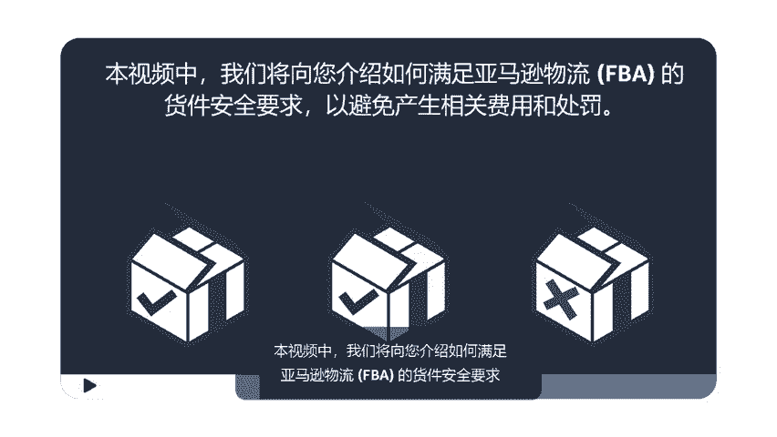
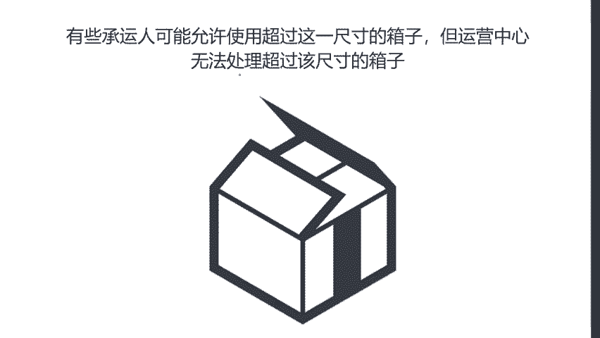
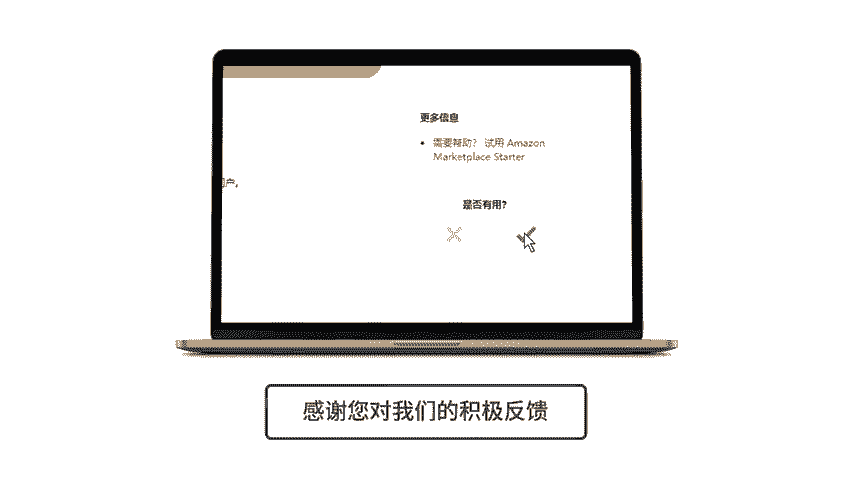

# 2024年亚马逊跨境电商开店教程，零基础亚马逊运营课程【合集】Amazon亚马逊跨境电商入门到精通教程（纯干货，超详细！） - P45：33.4-6、箱子和托拍的安全重量和尺寸 - 蛋哥说亚马逊 - BV1Ux2ZYPEFB

。Yeah。

At Amazon， we take the safety of our fulfillment center associates very seriously。

In this video， we will show you how to meet FBA shipment safety requirements in order to avoid fees and penalties。

When you send a shipment to an FB fulfillment center。

 it's important that the boxes are not too heavy， too large。

 and are securely packed on pallets meeting our safety requirements。

Before we talk about box， weight and size， it's important to understand how FB defines the size of the units inside the boxes。

The packaged items you will be boxing and sending to Amazon are classified as either standard size units or oversized units。

A standard sized unit is any packaged unit that weighs less than 20 pounds and measures 18 inches or less on its longest side。

 14 inches or less on its median side， and 8 inches or less on its shortest side。

These standards apply to both seller packed units and units in original manufacturer supplied packaging。

Units exceeding any of these measurements are classified as oversized。

Oversized units and units that require special handling may need to be sent to a separate fulfillment center capable of handling those types of items。

When you are shipping multiple standard sized units。

 every box you send must contain only standard sized units， and when fully packed， weigh 50 or less。

 if the box contains any jewelry， the fully packed weight of the box must be 40 or less。😊。

Some carriers accept boxes that exceed these weights， however。

 FB fulfillment centers will have issues processing overweight boxes。

 and you may be charged additional fees。

If you are shipping a single unit that alone exceeds 50， only one item per box is allowed。

 and you must apply a team lift label to the box， ensure that the label is not placed across the seams or edges of the box。

If that one unit weighs more than 100 pounds， you need to apply a mechanical lift label to the box。

 These labels may be purchased on Amazon。 co or at your local mail supply store for boxes that contain multiple standard size units。

 The box must not exceed 25 inches on any side。 Some carriers may allow larger boxes。

 but fulfillment centers are unable to process boxes that exceed this size FB strictly prohibit certain specialty box sizes。

 including point of sale containers such as openfront boxes or boxes without tops and pallet size boxes。

 sometimes called gaylords。😊。

Boxes must never be bundled together using bagging， taping， elastic or extra straps。

Unexpected oversized boxes， specialty boxes， and bundled boxes compromise the safety of our fulfillment center associates and cannot be processed on standard conveyor belts。

All boxes must be rigid， single wall， corrugated shipping containers with their flaps intact。

 and have a high burst or crush strength stamp。If you send your shipments by truck and are building a pallet。

 it's important to follow the FBA pallet requirements。

Make sure that you are using a 4 inch by 48 inch4way wood pallet that is in good condition a fourway pallet allows a forklift to lift the pallet from any direction。

When you stack your boxes on the pallet， make sure that the heavier boxes are on the bottom。

 this creates a sturdier pallet and prevents damage to lighter boxes， the total weight of the pallet。

 including all the boxes and the pallet itself， must not exceed 1，500 pounds。

 nor measure more than 72 inches or 6 feet high。The entire stack of boxes on the pallet must be able to stand on its own without any additional support。

 and the boxes must not hang over any edge of the pallet by more than one inch。

Remember that each box on the pallet also needs to have its own FB box label。

After all these requirements have been met， wrap the entire contents of the pallet with clear stretch wrap。

 place a shipment label on each of the four sides， making sure to place the label at the top center of each side。

If a shipment arrives at a fulfillment center in an unsafe condition。

 associates have to perform unplanned services at your expense to process your inventory successfully。

These charges will appear as unplanned service fees and can be viewed in your inbound performance report or payments report。

Also， repeatedly sending unsafe shipments may result in a suspension of your shipping privileges。

Use these links to learn more about F safe shipping practices。

。