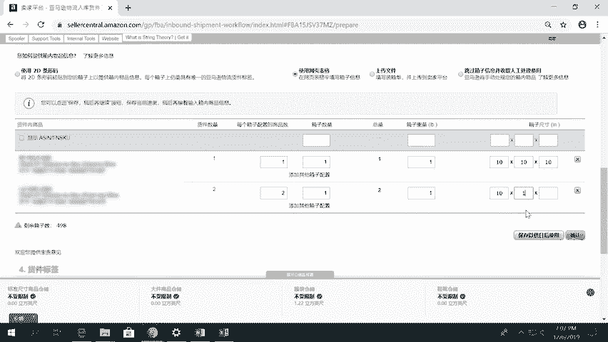
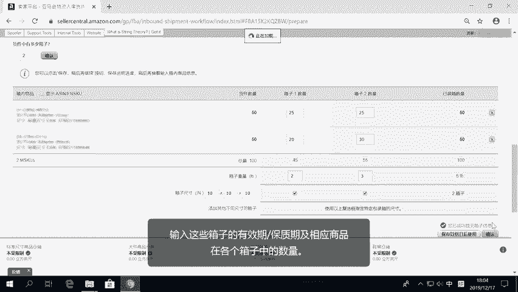
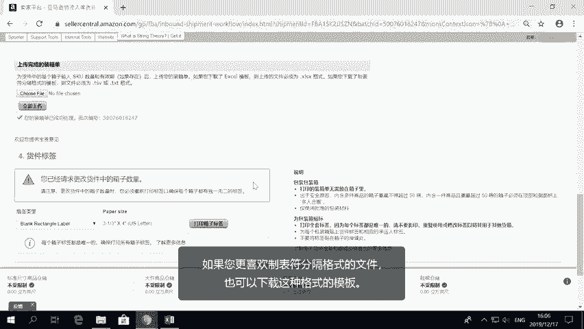
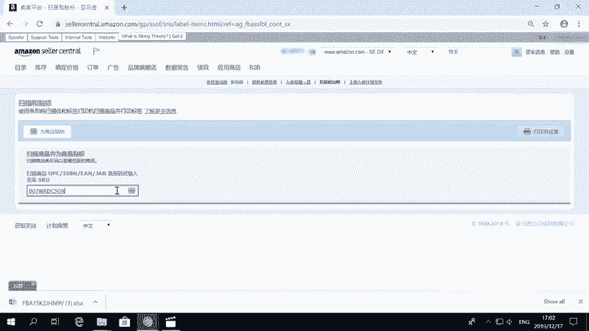
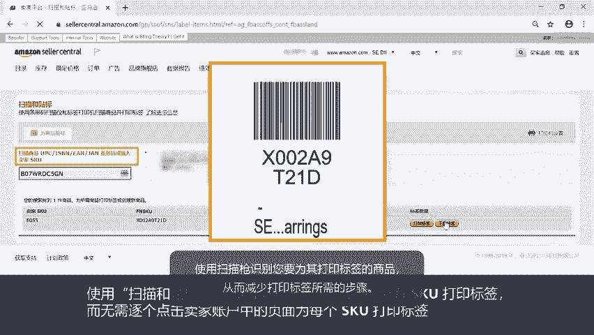

# 2024年亚马逊跨境电商开店教程，零基础亚马逊运营课程【合集】Amazon亚马逊跨境电商入门到精通教程（纯干货，超详细！） - P46：34.4-7、提供箱内物品信息 - 蛋哥说亚马逊 - BV1Ux2ZYPEFB

。

Yeah。In order to meet our delivery promise to customers。

 we need to get your inventory to the right spot in our fulfillment network。

Providing us with accurate box content information allows us to move your inventory rapidly through our network。

 becoming available for sale faster and reaching customers sooner。😡。

What does box information do for your shipment？Without box content information。

 we need to open each of your boxes and then determine where your products should be placed in order to reach customers quickly。

😡，If we know the contents of a given box， we can send the whole box directly where it needs to be。

 reducing manual touches and helping get your products received more efficiently。😡。

The primary benefit of providing box content information is that your products become available for sale faster。

 Since there is no need to open and sort the contents of each box。

 your products flow through our fulfillment network quicker and more efficiently。

 providing accurate box content information， also reduces the chances of your boxes。

 getting sidelined due to inconsistent shipment information。

You can provide box content information through seller Central as you create a shipment。

We have several tools to help you record and share your box content information as part of the shipment creation process。

😡，If you choose not to provide box content information， we will manually process your boxes。

 and a per unit FB manual processing fee will apply by not providing box content information。

 your boxes will not be able to flow through our fulfillment network as efficiently。

 and your products may not become available for sale as quickly。😡。

Yeah。When choosing to ship only one box， there is no need to add box content information。

 since it will be assumed that all products in the shipment will be packed in the same box。

Exiration dates will need to be entered if applicable。

Note that each product can only have one expiration date per box。

If you have a product with multiple expiration dates。

 those units will need to be packed in separate boxes。

。

。If your shipment will only have units of one product ske per box， select the one S per box option。

 We recommend using the web form for these types of shipments。 Just select the web form option。

 Add the number of boxes for each product， expiration dates， if needed， and the box。

 weights and dimensions。😡，For boxes with the same product， but different unit counts。

 expiration dates， or box weights and dimensions， click Add another box configuration to enter information for those boxes。

。

。If your shipment has multiple product skekus per box and your total shipment will be 10 boxes or less。

 use the more than one sw per box， total 10 boxes or less option。

The web form is available for shipments with 10 boxes or less， and a total of 25 Skus or less。

If your shipment has more than 10 boxes or 25 SkuUs。

 you will need to use a packlist or 2D barcode to provide box content information。😡。

Enter the number of units per box， expiration dates if applicable。

 and the box weights and dimensions。The workflow is optimized for multiple boxes of the same configuration。

If you have boxes with the same products， but different expiration dates。

 use the Add Another box configuration button to enter the dates for those boxes。😡。

。

。The upload file feature allows you to download a pack list file， fill it out。

 and then upload it back into seller Central to provide your box content information。

 This feature works for any type of shipment。 En the number of boxes in your shipment and download the Excel based template。

Open the file in a spreadsheet program。For each box， enter the number of units per product。

 expiration dates， if applicable， and the box， weight and dimensions。

 After you're done entering the information， save the file。Upload it back into seller Central。

 You do not need to convert the file into a different format。

You may instead download a text tab delimited version of the template if you prefer to work in that file format。

😡。

。

You can apply a 2D barcode to your box to provide box content information。

Note that a box content 2D barcode is separate from your FBA box label and needs to be affixed to the outside of the box to use 2D barcodes。

 you need to enable the option in your FBA settings and then select 2D barcode when asked how you will provide box content information。

Yeah。The scan and Shi feature allows you to create shipments on a box by box basis by using a handheld scanner to identify each product as you pack it into a box。

Box content information is automatically provided to us as part of the scan and shipH workflow。

Thank you for watching this video。 We appreciate your feedback。

 You can provide us feedback by clicking on the Let us know what you think link at the bottom of the tools。

😊，🎼。

