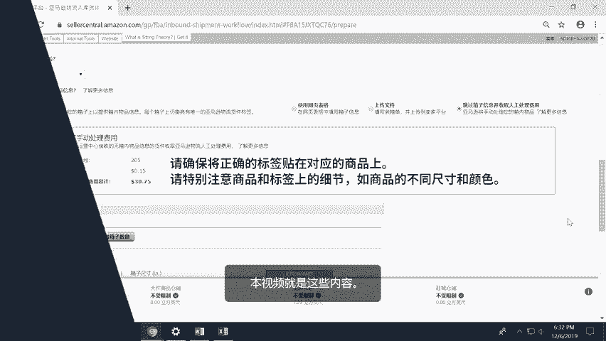
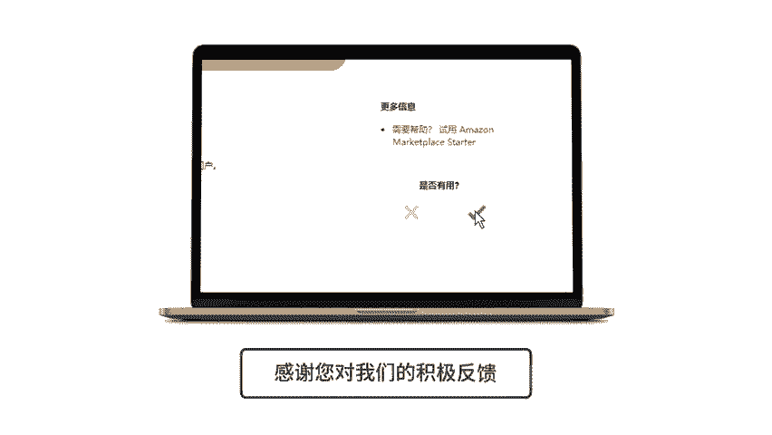

# 2024年亚马逊跨境电商开店教程，零基础亚马逊运营课程【合集】Amazon亚马逊跨境电商入门到精通教程（纯干货，超详细！） - P47：35.4-8、准确的物件信息 - 蛋哥说亚马逊 - BV1Ux2ZYPEFB

。Yeah。

Yeah。As we mentioned in the FBA boxox contentt information course。

 by providing accurate box and shipment information。

 your products move through our fulfillment network more efficiently and become available for sale sooner。

There are three things that you need to in to comply with F box content information policies。

 and it all starts with F box content information you provide when creating a shipment。 First。

 you need to ensure that every box you send。 You include only the ass that you specified were going into that box。

 and then every shipment you send。 you include only the ass that you specified were going into that shipment。

 No other asons should be included in any box or shipment。

Once you have included only the as you specified per box and per shipment。

 it's important that you include the exact number of items per ason that you specified。

 The number of items should match the numbers specified for each box and the shipment overall。

And finally， it's important that you ship the exact number of boxes that you specified to our fulfillment centers。

We know that sometimes you may need to modify the information you provided when creating your shipment。

 There are two ways that you can modify box content information before finalizing your shipping charges。

 The first way is to change the shipment unit quantities。

 which basically means the number of units per product at a shipment level。

 You can do this at the beginning of the prepare shipment step of the shipment creation while reviewing your shipment contents。

 Remember that you can only change quantities by a maximum of 5% or 6 units。

 If you want to add more or new products to your shipment。

 you must duplicate your shipment or create a new shipment， Don't forget to print the labels again。

 if necessary。The second way is to modify your box content information。

 which is the number of boxes you're going to ship。

 as well as the asNs and quantity of each aN that you'll ship in each box。

 You can do this by entering the new information using the box content information tools such as the web form。

 Excel or TSV file， 2D barcodes or by using Amazon Marketplace web services。

 your new box content information will overwrite your old information。

 Remember to always print new labels for all of your boxes every time you modify your box content information。

 This will help ensure that all the labels are linked to the right boxes。Now。

 if you decide not to provide box content information。

 it's still important that you send in only the AsINs， the number of items。

 and the number of boxes that you specified in your shipment。😡。

The difference is that you won't need to specify the contents of each box。

 but the contents of your shipment overall should still be correctly entered。

 Be aware that a per unit manual processing fee will apply。 If you are labeling your items。

 make sure that the correct label is affixed to each item。 Pay extra attention to subtleties。

 such as different sizes or color variations。 And that's it。

Now that you know how to comply with our shipment information policies。

 you should be able to make shipments to Amazon and then have your inventory processed and shipped to customers as soon as possible。

 don't forget to check the box content information course here in Celler University and the link below for more information。

Yeah。

🎼。