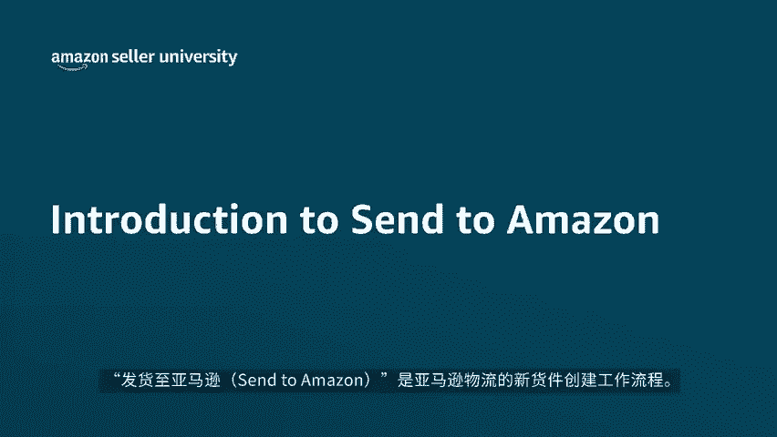
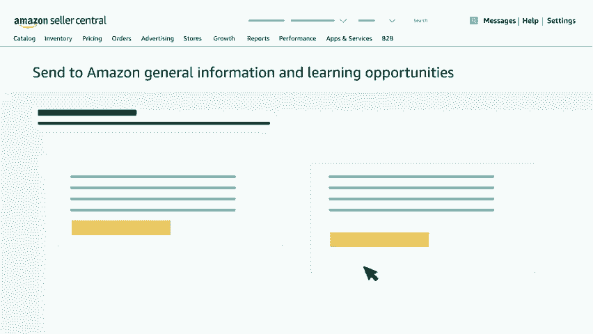

# 2024年亚马逊跨境电商开店教程，零基础亚马逊运营课程【合集】Amazon亚马逊跨境电商入门到精通教程（纯干货，超详细！） - P48：36.5-1、发送至亚马逊简介 - 蛋哥说亚马逊 - BV1Ux2ZYPEFB

🎼欢迎各位观看本期对发货至亚马逊s to m zone的介绍视频。发货至亚马逊是亚马逊物流的新货件创建工作流程。在本视频中，我们将介绍发货至亚马逊的优势以及合适的使用场景。

发货至亚马逊是为使用亚马逊物流的卖家打造的新货件创建流程，通过更简洁灵活的流程，让卖家能更迅速的创建亚马逊物流货件，和现有的发补货流程相比，其采用了全新的技术和焕然一新的界面，带来了下面这几个优势。

一、更简便的工作流程步骤和更短的创建货件号时。2、卖家能够保存包装准备和标签信息，这些信息可被复用于不同货件中。3、卖家流程更灵活。例如，在确认发货前进行包装，发货至亚马逊目前已向美国加拿。

🎼大墨西哥、日本、德国、英国、西班牙、法国、意大利和澳大利亚等国的卖家开放发货至亚马逊无需额外的费用或注册步骤。

您可以在卖家平台中的货件处理进度页面单机库存管理亚马逊物流货件来使用发货至亚马逊需要注意的是，发货至亚马逊功能目前仍处于开发阶段，功能尚未完善。一些货件类型仍需使用现有的发补货货件创建工作流程。

直至发送至亚马逊开发完毕，目前，发货至亚马逊适用于以下情形。一、在单个包装箱中包装一个或多个ski。2、使用小包裹快递SPD配送单个包装箱或使用汽运零单LTL配送托拍货件。

您还可以通过发货至亚马逊在适用地区购买亚马逊合作成。🎼运人的货件标签，享受折扣运费。当然，您也可以自行选择其他承运人进行配送。而以下情况目前不适用发货至亚马逊，从中国使用亚马逊全球物流或全球配送服务。

向美国、英国和适用欧盟国家发送货件，我们将会尽快开放此功能，要了解有关发货至亚马逊的更多信息，获取有关最新功能的资讯或是在线课程安排，请访问卖家平台中的发货至亚马逊一般信息和学习机会页面。

我们对发货至亚马逊的介绍到此就告一段落了。感谢您的观看，祝各位发货愉快。

