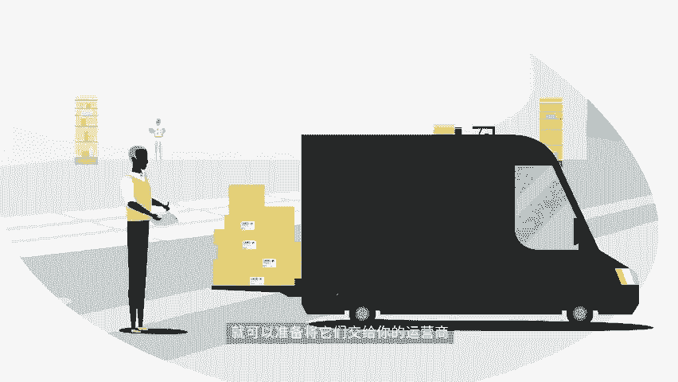
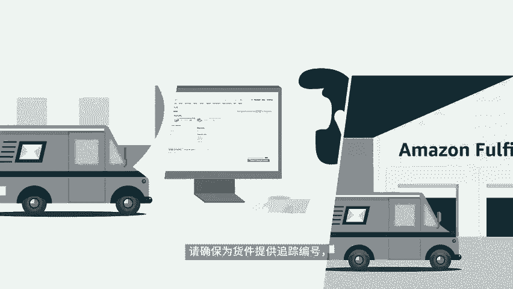
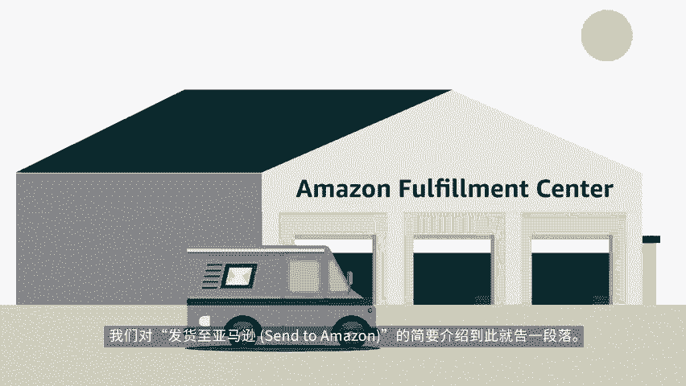
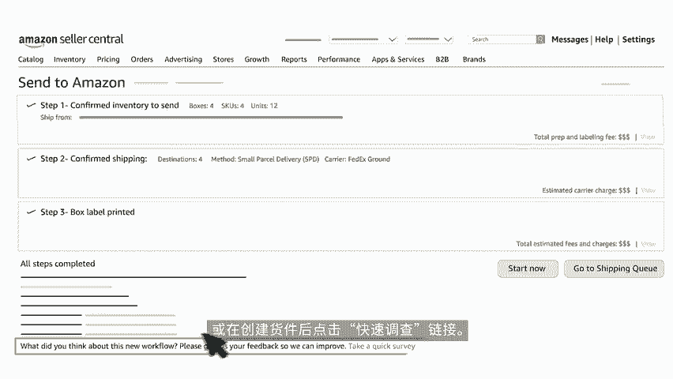

# 2024年亚马逊跨境电商开店教程，零基础亚马逊运营课程【合集】Amazon亚马逊跨境电商入门到精通教程（纯干货，超详细！） - P49：37.5-2、使用‘发送至亚马逊’节省创建货件 - 蛋哥说亚马逊 - BV1Ux2ZYPEFB

🎼做好准备，发送您的亚马逊物流库存了吗？欢迎收看发货至亚马逊3 two m zoneone系列的第一个视频。本视频将简要介绍如何使用发货至亚马逊创建货件，要了解有关工作流程的更多信息。

请在卖家大学查看有关详细步骤视频教程。发货至亚马逊是一个简易的货件创建工作流程，可简化亚马逊物流货件的创建时间。根据创建货件时做出的决策。亚马逊会引导您完成后续的一系列步骤，还请注意。

具体步骤可能会根据您的选择而有所不同。工作流程的第一步是提供箱内物品信息，了解每个箱子的物品，能让我们通过亚马逊的运输网络，快速转移您的库存，免去繁琐的手动操作。此外，准确的箱内物品信息。

还可以降低由于货件信息不一致，而导致延误的几率，使您的库存能更快的上架。

🎼对于装在包含多个相同ski的箱子中配送的库存，也称为单一ski箱子。您可通过复用的原厂包模板提供箱内物品信息。这些模板包含有关如何准备贴标和打包ski的信息。

非常适合在不同货件中使用相同箱子配置的ski的情况，每次在发货至亚马逊中创建货件时，系统都将自动从您的原厂包模板中识别箱内物品信息，只需输入箱子数量即可，将其添加到工作流程中。

即使您始终以同样的方式包装准备和贴标ski，应避免在每批货件中重新输入相同的详细信息。如果您要在一个箱子中包装多个s也称为混合s箱子，系统将提示您输入要配送的每个ski的商品数量。

确认要在混合ski箱子中发送的库存后，亚马逊会甄别需要在运营。🎼中心进行特殊处理的ski，并判断哪些可被包装在一起。例如，被认为是危险品的ski不能与其他ski一起包装。

因为危险品s必须被发送可以安全接收危险品的特殊运营中心然后系统会提示您为每组可以一起包装的提供相内物品信息。如果您要将所有混合s装在同一个箱子中，则可通过在线表格直接输入箱子重量和尺寸。

如果您将库存装在多个箱子中，系统将提示您上传包含包装详情的电子表格，最后您可以使用发货至亚马逊同时配送单s箱子和混合ski箱子。例如如果您经常在亚马逊物流上销售快消商品。

并希望测试买家对一些新商品的兴趣。您可使用适用于快消商品的原厂包模板来为单箱子创建货件，并在同一工作流。🎼程中为新商品创建混合s箱子，下一步就来到了确认发货。您提供相应物品信息后。

我们就会确定每个箱子需要运送到的地方，确保您的库存被储存在客户的位置。根据运输目的地和箱子的不同，我们会对承运人费用进行估算。小包裹快递SPD按单个箱子算寄运名单LTL则按托拍来算。

使您能够再充分执行的情况下，就适合自己的配送模式做出明智的决定。无论使用何种配送模式，您都可以选择使用亚马逊合作承运人，并直接从发货至亚马逊内购买货件标签，还可享受大幅折扣的运费。不过。

我们同时也接受自行选择承运人将库存配送至亚马逊运营中心。确认发货后，您就可以准备为箱子和托拍T标了，让我们首先看看小包裹快递配送模式。

🎼您发送亚马逊运营中心的每个箱子都需要有标识箱内物品的亚马逊物流箱子ID标签。如果您使用的是亚马逊合作承运人，系统还将额外为每个箱子生成一个货件标签，务必确保标签和箱子一一对应。如果您要按托拍配送。

则必须在每个箱子装入托拍前贴上亚马逊物流ID标签。箱子装入托拍后，系统将提示您选择承运人，并为工作流程中的每个货件提供托拍详情，确认托拍信息后，每个托拍将获得4份托拍标签。托拍的四侧需要各贴上一个。

当您为箱子或托拍贴好标签后，就可以准备将他们交给您的运营商，并开始追踪运营中心输入库存的情况了。如果您使用的是非合作承运人，请确保为货件提供追踪编号，以便我们提前准备好接收货件。我们对发货至亚马逊。

🎼的简要介绍到此就告一段落，要了解有关工作流程的更多信息，可查看卖家大学的详细步骤视频教程，很乐意能了解您对发货至亚马逊的看法。点击您的反馈非常重要，来为工作流程的步骤提供相应的反馈，或在创建货件后。

点击快速调查链接，祝您销售愉快。对了，有了发货至亚马逊。现在创建货件也同样变得轻松愉快了呢。

