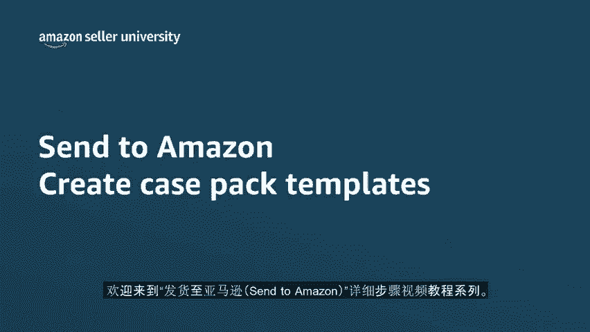
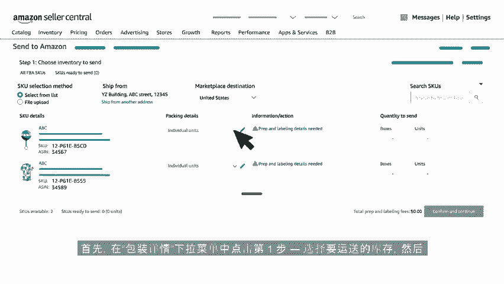
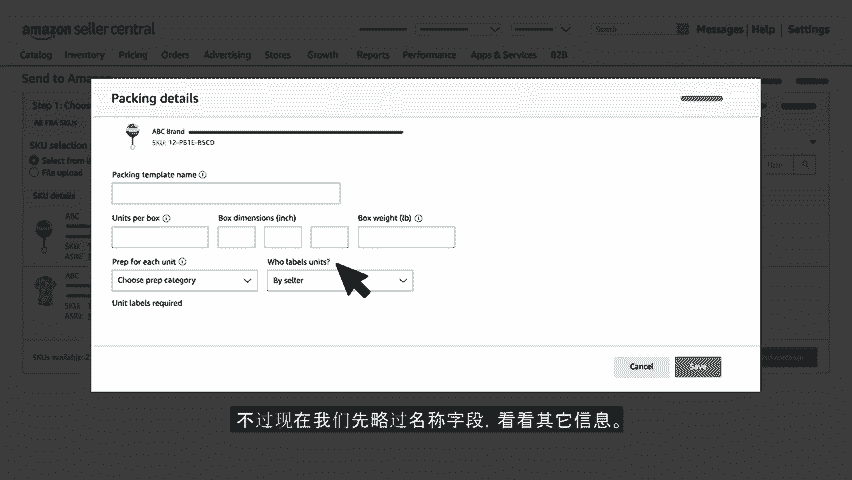
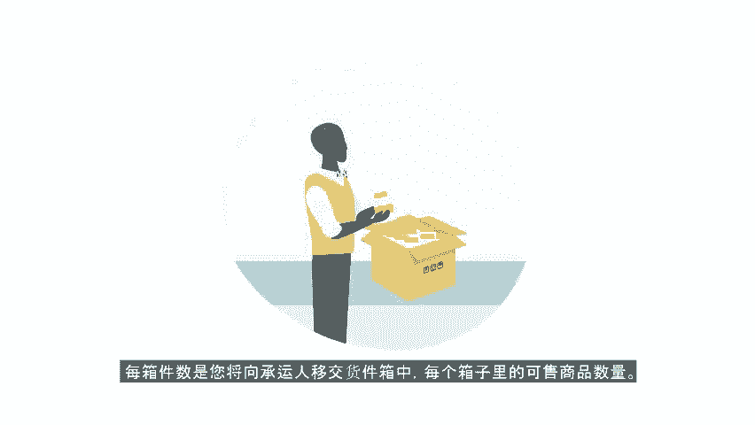
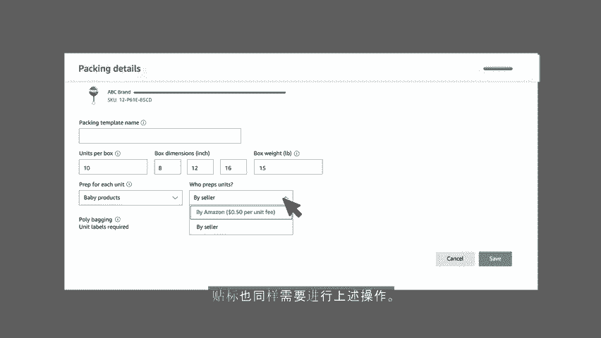
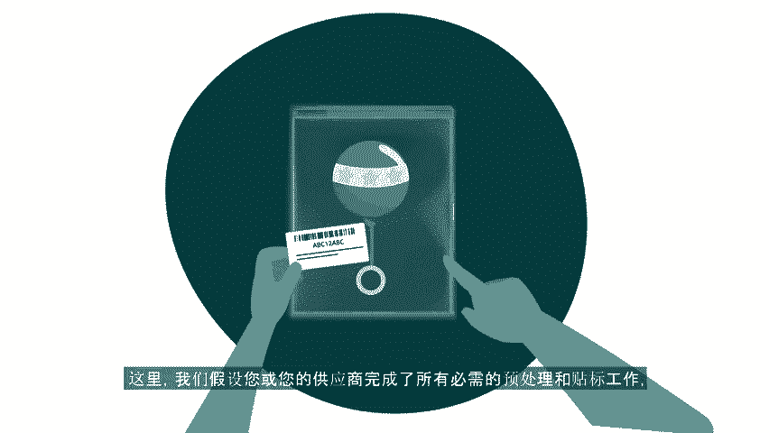
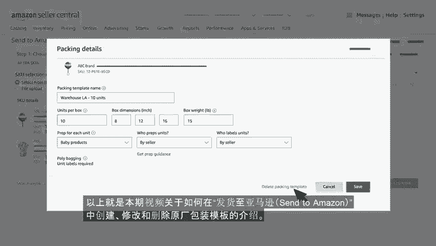
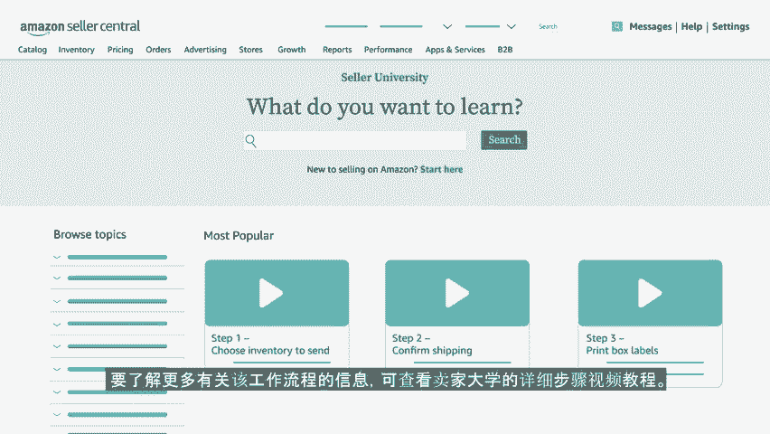

# 2024年亚马逊跨境电商开店教程，零基础亚马逊运营课程【合集】Amazon亚马逊跨境电商入门到精通教程（纯干货，超详细！） - P50：38.5-3、创建包装箱模版 - 蛋哥说亚马逊 - BV1Ux2ZYPEFB

🎼欢迎观看发货至亚马逊sand to m zone系列视频。本视频中将介绍发货至亚马逊中的原厂包装模板的优势，以及创建这些模板的步骤，提供准确的箱内物品信息，可让您的库存通过亚马逊的物流网络快速移动。

使他们能更快上市。如果在发出的货件中，有一个或多个商品在同一ski内，我们建议您创建可重复使用的原厂包装模板来提供箱内物品信息箱子重量箱子尺寸，预处理和贴标信息，此模板可复用于其他货件。

省去了再次配送该ski时，重新输入包装详情的步骤，从而缩短创建货件所花费的时间。现在我们来看看如何创建原厂包装模板。首先，在包装详情下拉菜单中点击第一步选择要运送的库存。

🎼然后选择创建原厂包装模板，原厂包装模板可保存有关您的skill预处理贴标和包装信息。不过我们现在先略过名称字段，看看其他信息，每箱件数是您将向承运人移交货件箱中，每个箱子里的可售商品数量。

假设您从供货商处获得的原厂包装中，每箱有10件可售商品，则此处输入的数字应为10箱子尺寸和箱子重量，我们这里就分别假设为8乘12乘16英寸和15磅。接下来输入每件商品的预处理和贴标信息。

如果亚马逊已储存此ski的预处理类型，其将自动显示在此处。若亚马逊尚未储存该信息，则需从下拉菜单中选择适用于该ski的预处理类别。如果您的skill无需额外处理。或其。

🎼不符合菜单中的任何预处理类型，请选择无需预处理。这里我们选择母婴商品作为预处理类别之后，您可选择自己对商品进行预处理，或使用亚马逊物流预处理服务，服务费按件计算，贴标也同样需要进行上述操作。

这里我们假设您或您的供应商完成了所有必须的预处理和贴标工作。所以接下来在商品预处理方和谁为商品贴标方字段选择卖家。现在回到我们之前略过的包装模板名称。如果您曾多个制造商或供货商进货。

且每个制造商或供货商的包装不同，则可能需要为该scu创建多个原厂包装模板。目前发布至亚马逊允许为每个scu创建最多3个原厂包装模板，务必为每个模板。

🎼进行命名，以便加以区分。打个比方，我们可以把这个模板命名为洛杉矶库房，10件商品，表示商品来自您在洛杉矶的库房，且每箱有10件商品，点击保存后将返回到最初的界面，您可在此处预览该模板的详细信息。

之前我们选择了卖家作为商品贴标方。因此在这里点击打印skill标签进行标签打印，并为ski进行贴标。如果需要再次为此ski创建原厂包装模板，可单击包装详情下拉菜单，然后选择创建原厂包装模板。

按之前讲解的步骤，填写好包装详细信息后，点击保存。如果需要编辑或删除现有的原厂包装模板，可单击包装详情旁边的铅笔图标，更改完成后，点击保。🎼存如果要删除模板，单击删除包装模板，以上就是本期视频。

关于如何在发货这亚马逊中创建修改和删除原厂包装模板的介绍，要了解更多有关该工作流程的信息，可查看卖家大学的详细步骤视频教程，感谢观看，祝您销售愉快。

