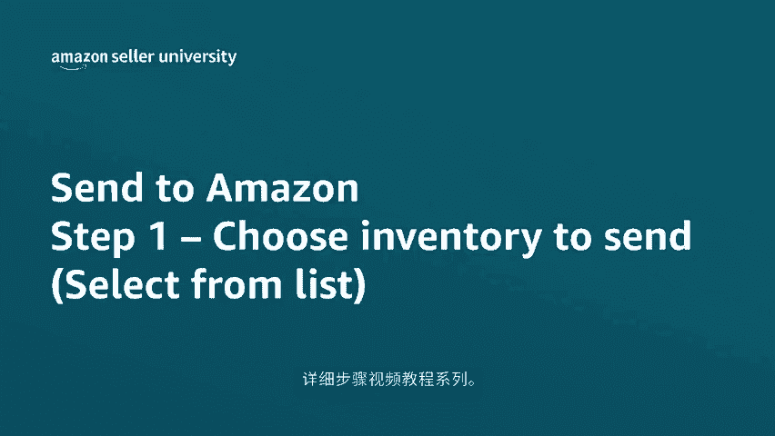
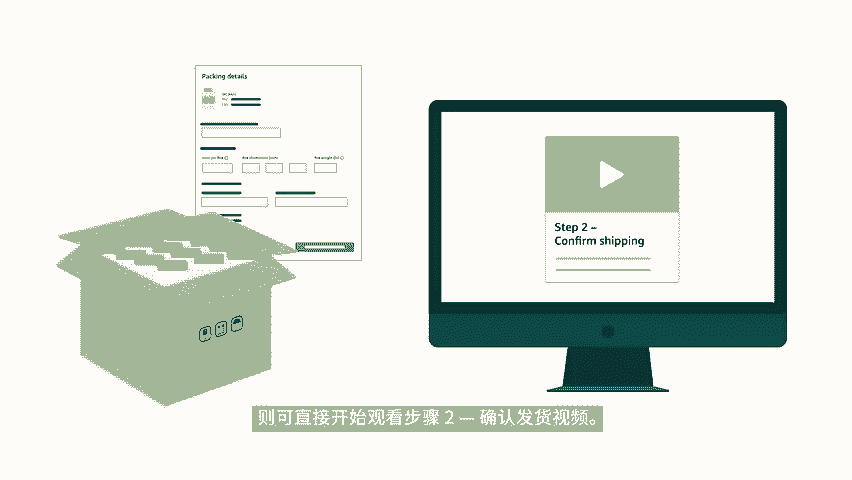

# 2024年亚马逊跨境电商开店教程，零基础亚马逊运营课程【合集】Amazon亚马逊跨境电商入门到精通教程（纯干货，超详细！） - P51：39.5-4-1、选择要发送的库存（从列表选择） - 蛋哥说亚马逊 - BV1Ux2ZYPEFB

🎼欢迎来到发货至亚马逊s to m zone详细步骤视频教程系列，发货至亚马逊是一个简易的货件创建工作流程，可简化亚马逊物流货件的创建时间。今天我们来介绍发货至亚马逊工作流程的步骤。一。

选择要运送的库存。我们在卖家中心点击库存，然后选择管理亚马逊物流货件，并点击货件处理进度页面顶部的发货至亚马逊链接，就可进入发货至亚马逊页面，在发货至亚马逊页面。

可查看所有已转化为亚马逊物流的ski的列表，要详细了解如何将库存转化为亚马逊物流。请前往卖家大学搜索，将商品转化为亚马逊物流。首先大家需要设置发货地址和目标商城。根据这些信息。

库存将分配到不同的运营中心。在之后的亚马逊工作流程步骤2。

🎼确认发货中确认货件目的地后，将无法再对这些信息进行更改。接下来需要确定如何包装货件箱，提供每个箱子的物品信息，使能让我们通过亚马逊的运输网络快速转移库存，免去繁琐的手动操作。此外，准确的箱内物品信息。

还可降低了由于箱内物品信息不一致，导致出现延迟的几率，使库存能够尽快上市。大家可以通过两种方法添加想要发送到亚马逊的库存。一是将库存添加为原厂包装。这类货件箱包含一个或多个具有相同ski的商品。

二是按单件商品进行添加，并在下一步骤中提供这些商品的箱内物品信息。首先让我们来看看如何在工作流程中添加原厂包装或单一skill箱子。如果要配送包含一个或多个具有相同。🎼商品的货件箱。

我们建议大家创建可重复使用的原厂包装模板来提供箱内物品信息、箱子重量、箱子尺寸、预处理和贴标信息，此模板可复用于其他货件，省去了再次配送该ski时，重新输入包装详情的步骤。

要进一步了解如何创建原厂包装模板，请在卖家大学搜索发货至亚马逊创建原厂包装模板，如果要对原厂包装s进行补货，可从包装详情下拉列表中选择包含该ski的包装预处理和贴标信息的模板。如果在原厂包装模板中。

选择了卖家作为标签所有者页面上会出现打印ski标签链接，点击该链接来打印和粘贴ski标签，接下来输入要运送的箱子数量。假设要运送13个拥有此ski的箱。🎼子而这里选中的原厂包装模板显示。

每个货件箱包含10件可售商品，因此就等于是总共130件商品，点击准备运送。到此，大家应该已经知道如何将使用原厂包装模板创建的单一ski箱子添加到发货至亚马逊工作流程中了。

现在让我们来看看如何将单个产品添加到工作流程中，该方法适用于要发送混合ski箱子，即包含多个ski的货件箱，或每次发送不同的单个ski箱子的情况。首先选择包装详情下的单件商品。

然后输入每件商品的预处理和贴标信息完成后，输入可售商品的数量。这里假设是15件，然后单击准备包装，如果是配送单个商品工作流程中会出现一个新步骤。

🎼步骤一B包装单件商品系统将提示大家为这些ski提供箱内物品信息。这里说明一下，大家在同一工作流程中创建的货件。

可同时包含使用原厂包装模板创建的单ski箱子和使用混合ski箱子包装的单件商品添加完要运送的库存后，就可以进入下一步骤了。以上就是本期视频对步骤一，选择要运送的库存的介绍。如果要配送单件商品。

可在卖家大学观看步骤一B包装单件商品的视频，如果仅使用原厂包装模板配送单一ski箱子，则可直接开始观看步骤2，确认发货视频感谢观看注您销售愉快。

