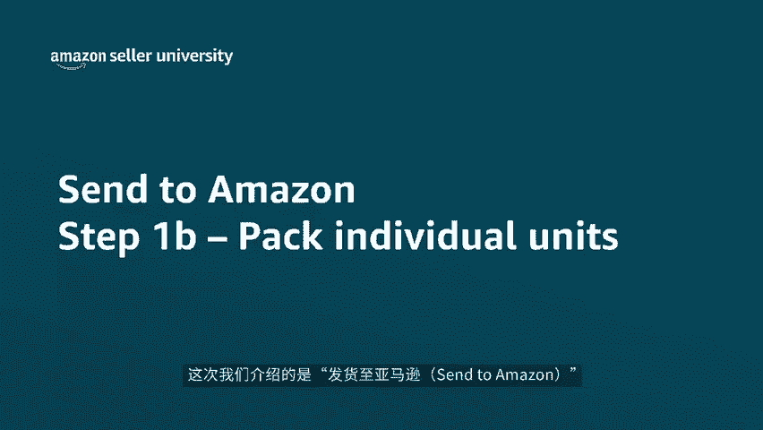
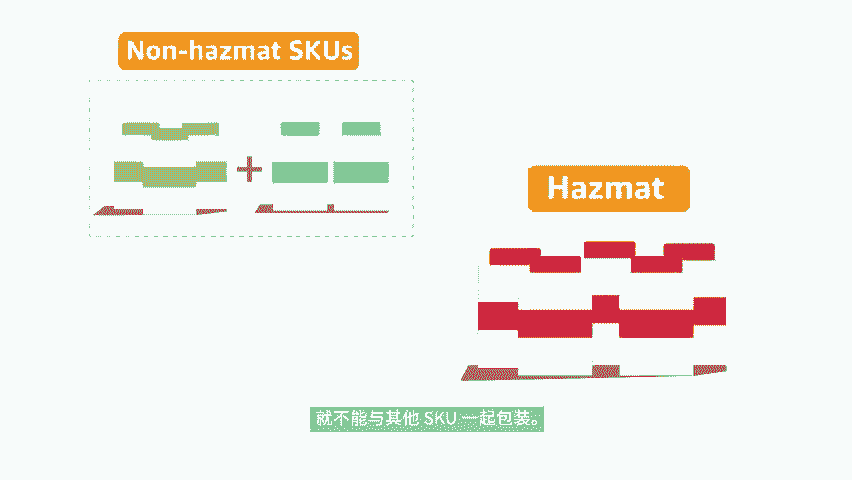
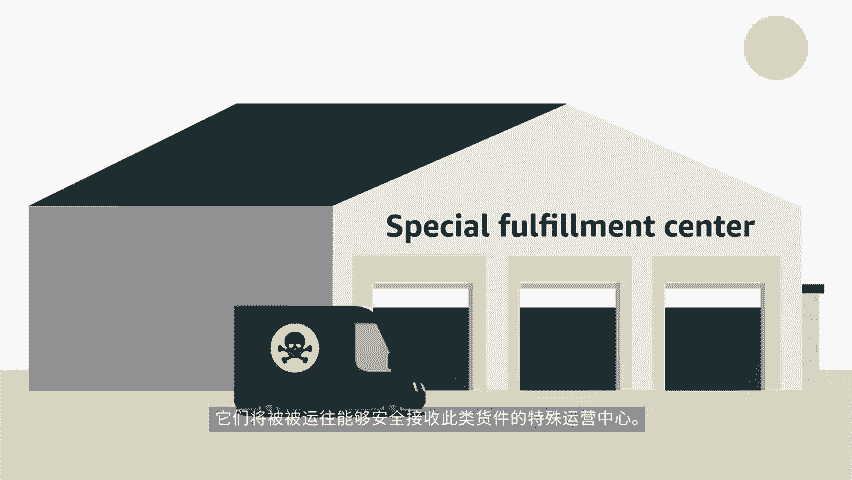
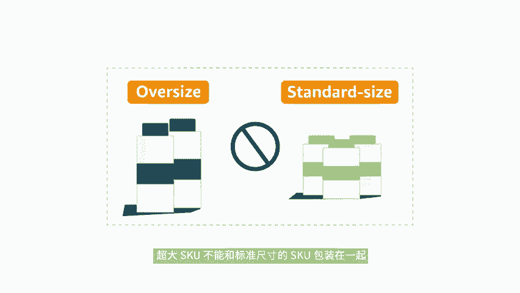
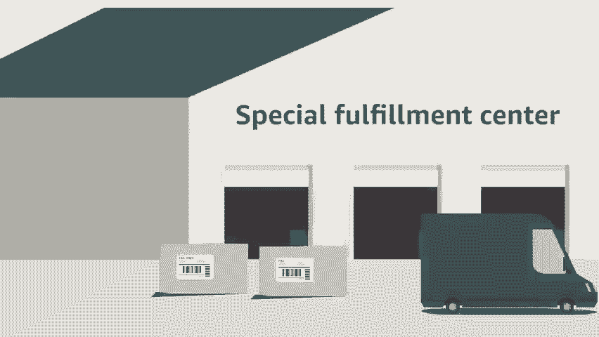
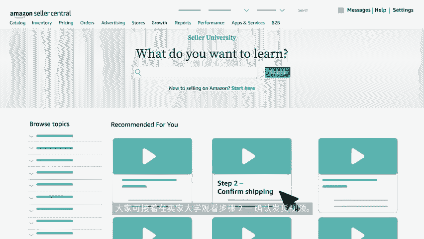

# 2024年亚马逊跨境电商开店教程，零基础亚马逊运营课程【合集】Amazon亚马逊跨境电商入门到精通教程（纯干货，超详细！） - P53：41.5-5、包装单个商品 - 蛋哥说亚马逊 - BV1Ux2ZYPEFB

🎼欢迎观看本期视频。这次我们介绍的是发货至亚马逊3 to m zone工作流程的步骤一B包装单件商品。在此步骤中，系统将提示大家提供步骤一中各件商品的箱内物品信息。

如果已经在步骤一中的原厂包装模板里为所有skiu提供了箱内物品信息，则可忽略此步骤，确认发往亚马逊的单件商品的数量后，亚马逊会甄别需要在运营中心进行特殊处理的ski，并判断哪些可被包装在一起。例如。

被归类为危险品或危险品的ski就不能与其他sku一起包装。它们将被运网能够安全接收此类货件的特殊运营中心，决定ski是否能被一起包装的另一个因素是sku的重量和尺寸。超大ski不能和标准尺寸的。

🎼ski包装在一起，超大ski只能由专门的运营中心接收，还有就是需要亚马逊进行预处理或贴标的ski不能和已经进行预处理和贴标的ski包装在一起，这是为了确保包含。

无需要亚马逊进行预处理或贴标的ski的箱子不会在亚马逊运营中心产生不必要的延误，让他们能更快上市，确定了装箱组后，系统将提示大家提供每个装箱组中ski的箱内物品信息。

在这里我们假设库存已被分为两个装箱组ski可被以任何组合包装在装箱组中。但是不同装箱组间的ski不应被混装。如果装箱组中的所有ski商品都可被放入一个盒子里，那么就选择所有商品都将装入同一个箱子。

然后点击确认，然后输入箱。

🎼重量和尺寸再点击确认包装信息。如果装箱组中的skill被包装在多个箱子里，则需选择需要多个箱子，然后点击确认之后，系统将提示大家输入包装装箱组中ski所需的箱子数完成后点击生成excel文件。

接下来下载模板文件，并在excel中打开。每个箱子都需要输入其中包装的每个skill的商品数量，请务必确保箱子中每个ski的商品数量，与预计数量相符，然后输入箱子的重量和尺寸。装箱时。

可将箱子标记为装箱组一箱子一装箱组2箱子2等，以便在步骤3，打印箱子标签中为每个箱子匹配正确的亚马逊物流箱子编码标签。完成装箱，并在excel文件。🎼中输入相应信息后保存文件，然后点击上传并验证文件。

将其上传至发货至亚马逊send to m zone。另外，在装箱时，如果出于盘点残损库存或是优化箱内空间的考虑，需要更改某些ski的数量，则需返回上一步骤，并重新输入货件相关的数量。

以及想要运送的ski数量。修改完成后继续进行本步骤。请注意，在步骤一中添加或移除scu装箱组可能会发生变化，请确保未更新后的装箱组提供最新的箱内物品信息，完成上述操作后，点击确认并继续进入下一步骤。

以上就是本期视频关于步骤一B包装单键商品的介绍。在下一步骤中，我们将。🎼单位箱子确定靠近买家的最佳出货地，大家可接着在买家大学观看步骤2，确认发货视频，感谢观看，祝各位销售愉快。

