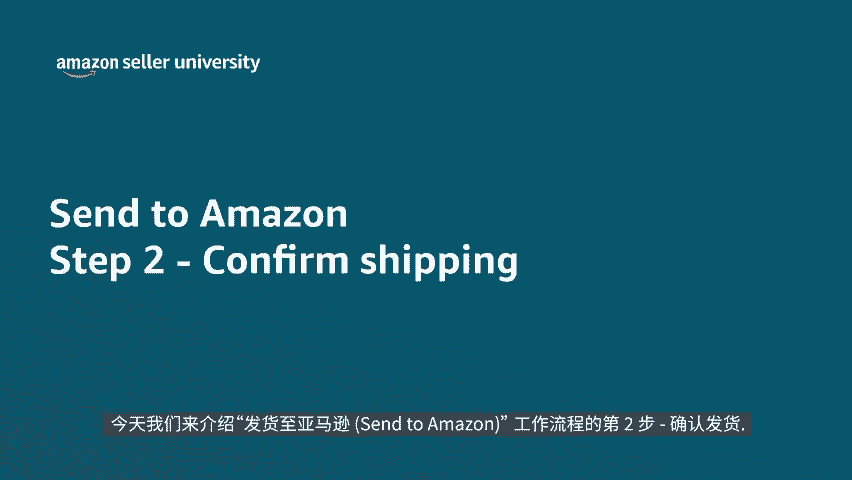
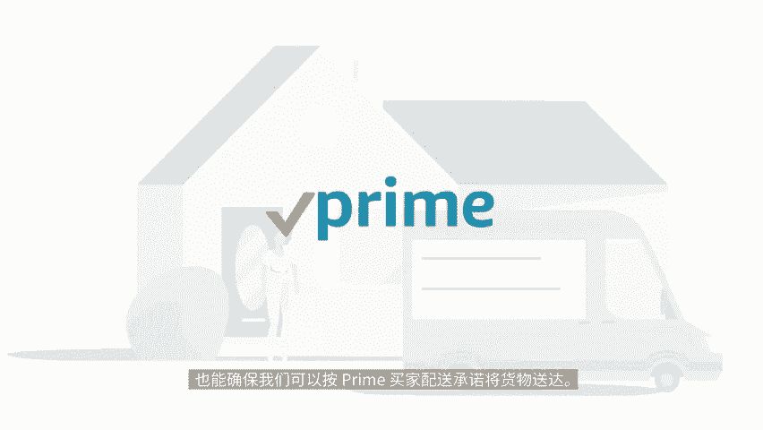
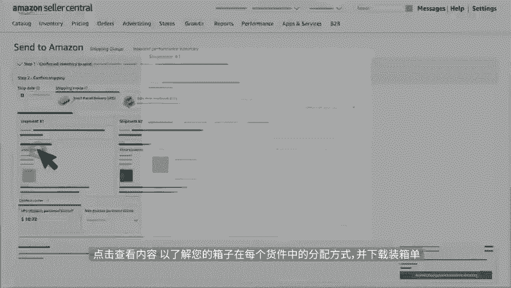
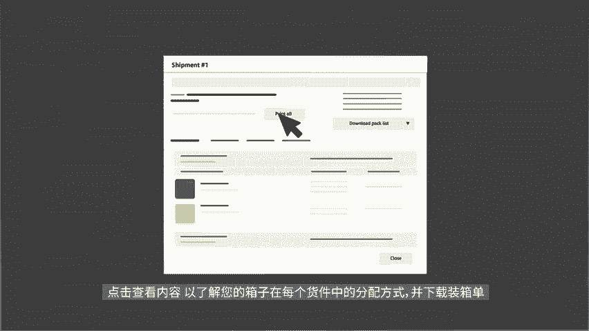
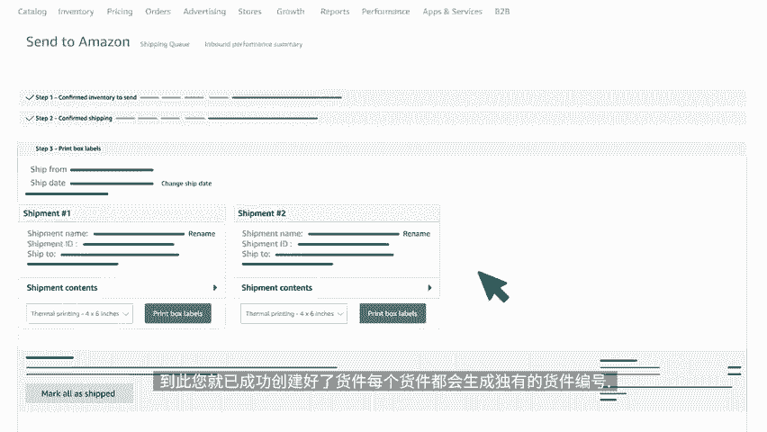

# 2024年亚马逊跨境电商开店教程，零基础亚马逊运营课程【合集】Amazon亚马逊跨境电商入门到精通教程（纯干货，超详细！） - P54：42.5-6、确认发货 - 蛋哥说亚马逊 - BV1Ux2ZYPEFB

🎼欢迎收看本期视频。今天我们来介绍发货至亚马逊3 two m zoneone工作流程的第二步，确认发货。我们在本视频里将继续发货至亚马逊的培训和支持。😊。

🎼取决于在工作流程的上个步骤中所选的skiule，您的库存可能会被运往不同的运营中心。这些信息可从货件卡上看出来。该举措是为了让出货地更靠近买家，也能确保我们可以按prime买家配送，承诺将货物送达。

点击查看内容，以了解您的箱子在每个货件中的分配方式，并下载装箱单。

🎼如果您尚未在步骤一中打开skill标签，在此也可进行打印，检查或件后输入将库存交给承运人的日期。如果您还不确定发货日期，这里给出预期日期也行。此字段在之后的步骤中也可更新。🎼准确的发货日期。

有助于亚马逊提前计划在配送网络中接收您的库存，及避免不必要的延误。🎼接下来选择配送模式，也就是货件的运输方式。🎼您可选择分箱配送，也可选择小包裹快递SPD或选择汽运名单LTL按托拍配送。

🎼如果选择小包裹快递，系统将提示您选择用于将此给有配送至亚马逊运营中心的承运人，选用亚马逊合作承运人可享运费折扣。

🎼使用小包裹快递可在发货至亚马逊than two M zoneone页面购买和打印货件标签。如果你想使用其他承运人，请选择非合作承运人，然后在下拉菜单中选择承运人名称。

如果您不确定要使用哪家承运商或要使用多个承运商，请选择其他。🎼在接受并确认发货之前，可在屏幕右下角查看预计运费。🎼如果选择汽运名单，您可以查看基于上一步骤中提供的箱内物品信息预估出的托拍配置。

🎼这些信息将被用于估算汽运零单运费来帮助选择合适的运输方式，以降低整体运输成本。同时，您可修改拖拍配置，并在工作流程的步骤四中确认承运人。🎼确定好运输方式后，对货件进行检查，然后点击确认发货。🎼到此。

您就已经成功创建好了货件，每个货件都会生成独有的货件编号，完成后可继续观看查看发货至亚马逊than two M总系列中的其他视频。

🎼感谢观看，祝您销售愉快。😊。

