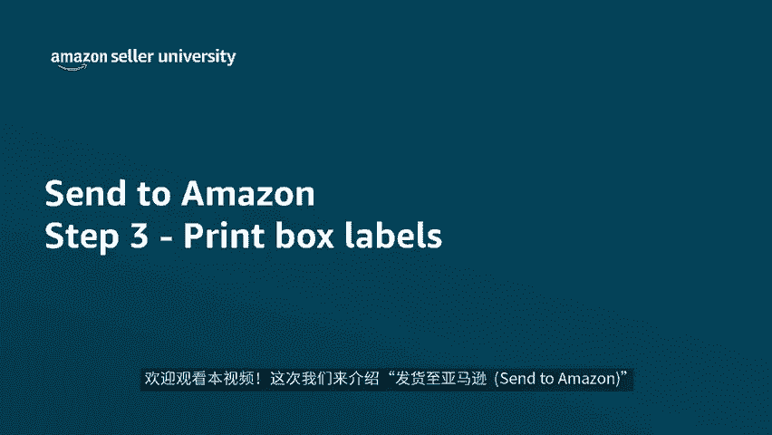
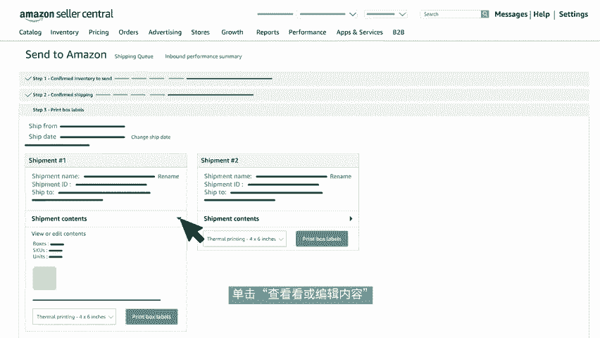
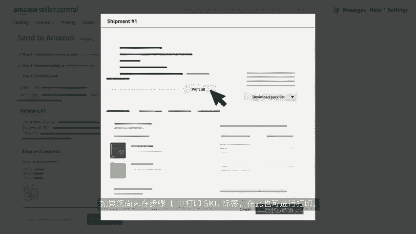
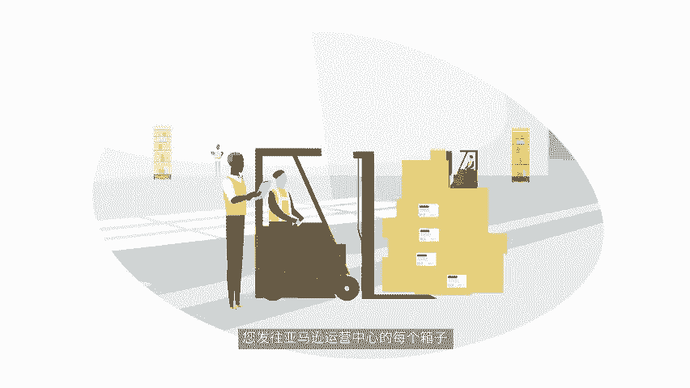
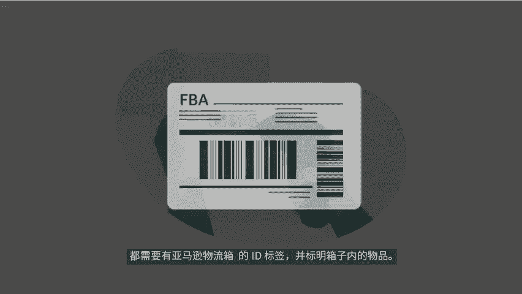
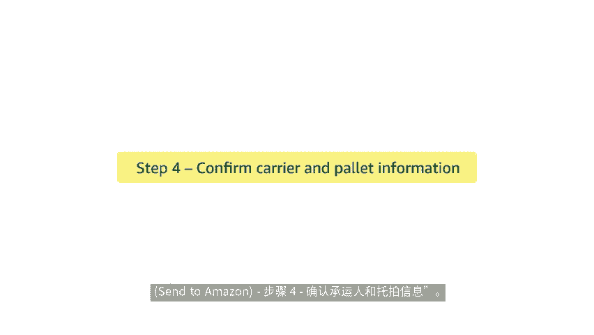

# 2024年亚马逊跨境电商开店教程，零基础亚马逊运营课程【合集】Amazon亚马逊跨境电商入门到精通教程（纯干货，超详细！） - P55：43.5-7、打印箱子标签 - 蛋哥说亚马逊 - BV1Ux2ZYPEFB

🎼欢迎观看本视频。这次我们来介绍发货至亚马逊thank to zone工作流程中的第三步打印箱子标签。在上个步骤中，我们已经确认了货件。接下来您可以查看每个货件的详细信息。

包括默认货件名称和每张货件卡中的货件编号，单击重命名，可以更新货件的默认名称，单击查看或编辑内容，以查看每个货件中箱子的分配，然后下载装箱单。如果您尚未在步骤一中打印ski标签，在此也可进行打印。

如由于正常的商业活动，需要对货件内容进行编辑，您可以在此阶段进行该操作，您可以通过在货件卡中单击查看或编辑内容来执行此操作，可调整货件中的商品数量的5%或最多6件商品，以较大者为准，完成后单击验证更新。

如果您需要进行。

🎼过此限制的更改，则必须通过单击删除货件和费用来取消此工作流程。然后新建流程。接下来我们说说如何打印箱子标签，取决于工作流程步骤二中选择的配送模式。此体验会有所不同。首先我们来了解小包裹货件的标签打印。

如果您使用托拍运输，可直接跳过此部分观看汽运领单部分，对于小包裹快递SPD先选择打印格式，然后单击将箱子标签打印。

生成包含货件中每个箱子标签的PDF您发往亚马逊运营中心的每个箱子都需要有亚马逊物流箱的ID标签，并标明箱子内的物品。如果您在小包裹货件中使用亚马逊合作承运人，系统还将为每个箱子生成货件标签。

如果您使用的是非合作承运人，请与承运人合作为箱子。

🎼承运人货件标签，确保每个箱子贴有正确的亚马逊物流ID标签，以避免产生延误。将箱子交给承运人后，选择全部标记为已发货，以表示他们正在运输途中，之后，您可以通过点击追踪货件链接，对货件进行追踪。

如果您使用的是亚马逊合作承运人追踪编号将自动填充。如果您使用的是非合作承运人，则需手动提供追踪编号，提供追踪详情，有助于亚马逊接收您货件的速度，提高至少30%，并能提前推出产品。

如果您使用小包裹快递配送，则货件创建流程到此结束。如果您要按托拍配送，请继续观看以下部分。在此阶段，通过选择打印格式，打印您的亚马逊物流箱子ID标签，然后单击打印标签以生成PDF您发往亚马逊运营中。

🎼的每个箱子都需要贴有用于识别箱内物品的亚马逊物流箱子ID标签，确保标签与箱子一一对应，避免在接收过程中出现延误。到此，我们就完成了步骤。3，可以准备好，继续下一步，查看承运人和托拍信息。

如果您要按托拍配送，请查看视频，发送至亚马逊3 two m zone步骤4，确认承运人和托拍信息，感谢观看，祝您销售愉快。

