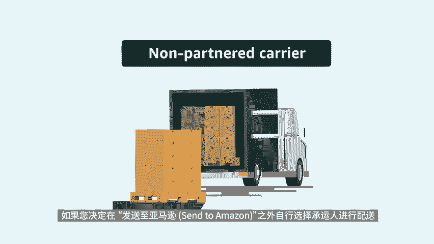
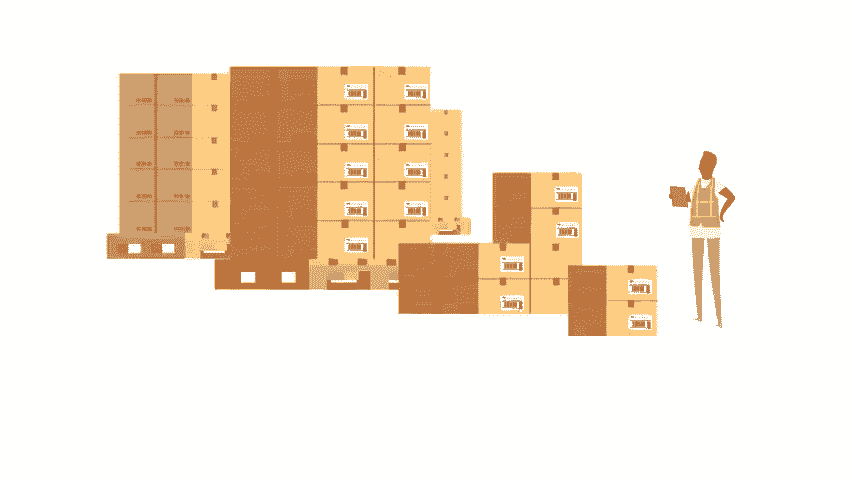

# 2024年亚马逊跨境电商开店教程，零基础亚马逊运营课程【合集】Amazon亚马逊跨境电商入门到精通教程（纯干货，超详细！） - P56：44.5-8、确认承运人和托盘信息 - 蛋哥说亚马逊 - BV1Ux2ZYPEFB

🎼欢迎观看本视频。这次我们来介绍发货至亚马逊s to am zone工作流程的第四步确认承运人和托拍信息，只有选择按托拍运输才会进入此步骤，到此，您已经完成了打印和粘贴箱子标签。

可以准备对箱子进行托盘化并确认承运人信息。取决于不同的承运人提供托拍信息的方式将有所不同。首先，我们来看看使用亚马逊合作承运人时的情况。如果您在发货至亚马逊工作流程之外，自行选择承运人。

则可跳转至非合作承运人部分，通过选择亚马逊合作承运人。您可以在发货至亚马逊中购买货件标签，安排取件以及享受折扣运费。接下来输入运输就绪日期，这是承运人可以取件的日期，为亚马逊提供准确的运输就绪日期。

可让我们提前计划在配送。

🎼网络中接收您的库存，避免不必要的延误。如果这是您第一次发送货件，还需添加负责在取件地对接承运方的承运人联系信息。如果您之前已经有寄过件，则可选择现有联系人。接下来将箱子装入托拍。

并为工作流程中的每个货件提供托拍信息，我们根据您在工作流程步骤一中提供的箱内物品信息，预填充此部分，请仔细验证这些信息是否正确。然后单击确认，以查看预估的承运人费用。如信息有误，请编辑详细信息。

以提供正确的托拍信息，更新托拍信息，将会重新计算运费，现在让我们来了解一下托拍信息部分中的每个字段。货物等级是一种标准化的分类系统，可用于确定货件的应计费重量和风险。货物等级从50到500部等。该数。

🎼可以手动调整，也可以使用亚马逊的默认预估值。接下来的运费申报价值是一个选填字段。该字段有助于我们确定您的库存价值。如果为空，我们将默认该值是货件重量乘以1。50美元之后。

输入托拍的重量和高度托拍是否堆叠，以及各种配置的托拍数量，确认所有货件的托拍信息后，接受承运人费用。然后单击确认承运人和托拍信息。如果您使用亚马逊合作承运人配送，则步骤四到此就完成了，可直接进入步骤5。

打印及贴上托拍标签，并安排向承运人提货，如果您不使用亚马逊合作承运人，请继续观看以下的部分。如果您决定在发货至亚马逊之外，自行选择承运人进行配送，选择非合作承运人之后把箱子装进托拍。

🎼并确认每个货件中的托拍数量，点击打印，可为每个托拍获取4份亚马逊物流托拍ID标签。托拍标签包含运营中心的信息，用于验证货件的到达和货物，在托拍的四侧各贴上一个标签，以方便叉车司机查看。

接下来选择您将用来配送至亚马逊的承运人。如果您不确定哪家运营商，或者您将使用多个运营商，请选择其他将托拍交给承运人后，选择全部标记为已发货，以表示您的库存正在运输中，每收入一件货件进入库存。

您的承运人将出具一份提货单。BOL文件，在工作流程中，每个货件单击追踪货件，然后在货件一览页面下的追踪事件，选项卡中输入BOL编号，以上就是本期视频对自行选择承运。

🎼人运送托拍的介绍，感谢观看，祝您销售愉快。