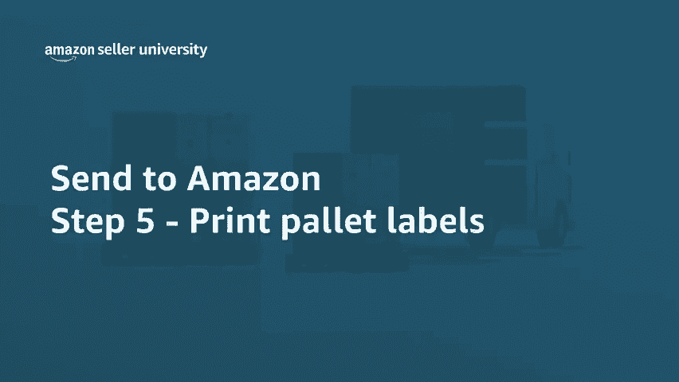
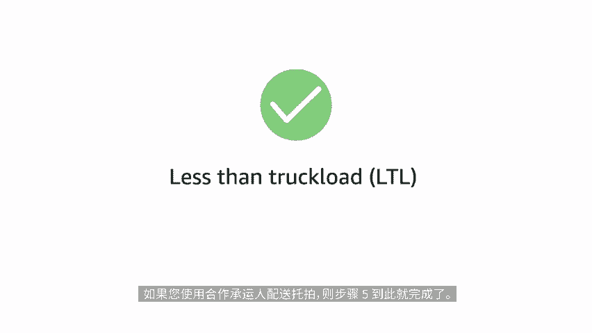
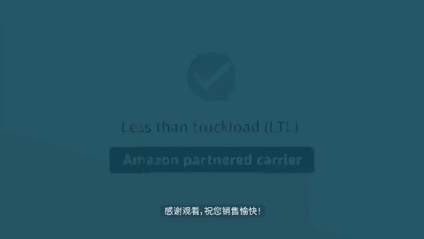

# 2024年亚马逊跨境电商开店教程，零基础亚马逊运营课程【合集】Amazon亚马逊跨境电商入门到精通教程（纯干货，超详细！） - P57：45.5-9、打印托盘标签 - 蛋哥说亚马逊 - BV1Ux2ZYPEFB

🎼欢迎观看本期视频。这次我们来介绍发货至亚马逊than two m zone工作流程的步骤5打印拖拍标签。

🎼只有使用亚马逊合作承运人配送托拍，才会进入此步骤。到这里，你已经包装好托拍，可以开始粘贴托拍标签了。通过选择打印格式打印托拍标签，然后点击打印。🎼可为每个托拍获取4份亚马逊物流托拍ID和运输标签。

🎼这些标签包含运营中心的信息，用于验证货件的到达和货物，在托拍的四侧各贴上一个标签，以方便叉车司机查看。🎼在此步骤中，您还可以打印提货单BOL对于每个托拍货件。

您必须向承运人提供有效的提单BOL以方便安排送货预约。提货单将在不迟于当地时间上午8点生成。🎼取件过程中，请确保向所选的合作承运人提供提货单BOL和亚马逊内部编ARN在取件后选择全部标记为已发货。

以表示他们正在运输途中，您可以通过点击下面的追踪货件链接来对每个货件进行追踪。以上就是本期视频对步骤五打印托拍标签的介绍。如果您使用合作承运人配送托拍，则步骤五到此就完成了。感谢观看，祝您销售愉快。

