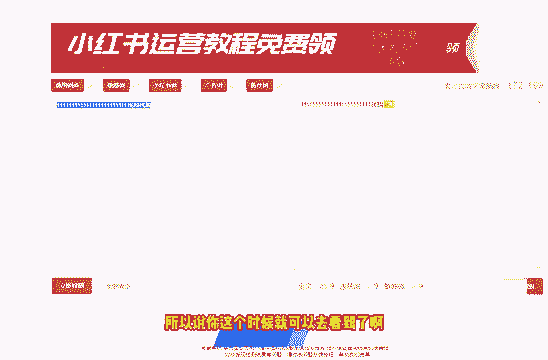
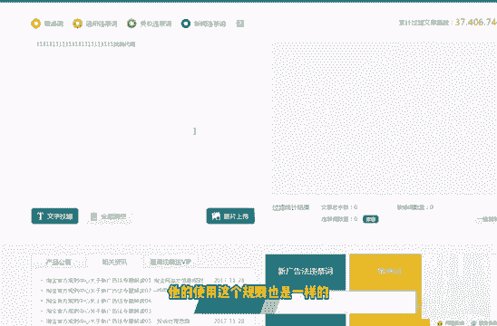
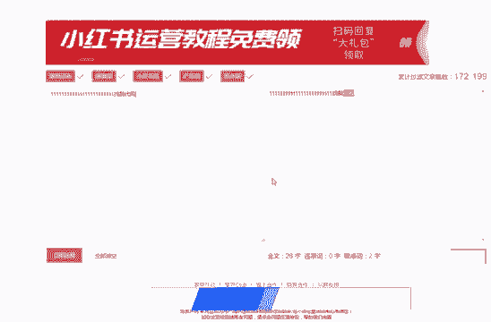

# 2024年做小红书怎么快速起号？3天养出一个高权重小红书账号，掌握这7点，小红书快速养号小技巧！ - P5：P2第2节：小红书的检测规则是什么？分析小红书最新规则和运营注意事项！ - b简单爱 - BV1yJHSefE9H

那我们这节课呢和大家聊一下，这个小红书的相关检测的一个规则，关于这个小红书检测的规则呢，我从这以下四点来和大家详细的讲一下，第一点呢就是小红书它会检测我们的，检测我们的这个个人资料，笔记内容。

私信以及评论这几个地方，在这几个地方呢，它就不得含有一些微信号码啊，微信号，微信二维码代购啊，水印啊，包括这个推广淘宝店铺的一些营销词汇呃，但是小红书管的比较松一点的是什么地方呢。

他官方啊个人资料官方是允许邮箱存在的，也可以呢用这个微博去替代这个谐音啊，去进行引流，然后呢再用话术引导到我们的微信上面啊，当然了，这个课程的话呢是在后面会和大家详细的去说，到第二个检测的内容呢。

是小红书会检测我们的这个手机设备，最好呢同一同一台这个设备呢，额最多只能登录三个账号，这这边呢大家一定要注意一下，然后呢关于笔记内容的话呢，大家要注意的就是不得去诱导用户，比如说去关注领奖啊。

点赞抽奖啊，这些呢都是小红书明令禁止的，这个呢就是诱导用户的一个行为，那第四个呢就是内容的原创度，原创度，保护程度呢在小红书的这个平台上，它是比较高的，在推广的时候呢，我们也不要说啊，你写了一篇文章。

然后呢去多个账号在小红书上面去发布，这样子呢这样子的话呢是不可以的，一篇文章一个账号去发也就可以了，不要去多发，还有一个关于这个小红书检测的一个规则呢，实际上是一个敏感词的一个检测啊，敏感词的一个检测。

就是我们在呃接下来也会大家会遇到的，关于敏感词，关于敏感词的一个检测呢，这里面我给大家介绍了两个网啊，两个网址，两个网站一般的话呢，就比如说我们小红书上，就比如说啊手机卡啊，金融啊，电子烟啊啊。

电子烟代购医疗用品等等这些东西呢，大家尽量不要去碰，那有的人可能会说了，我在写这个小红书文章的时候，万一我不小心把这些词呢，还有一些没遇到的一些词呢给加进去了，那怎么办呢，对吧。

那就会用到我们这个敏感词的一个检测的，这么一个啊网站，这里面呢我来我来用电脑给大家演示一下，我们首先打开这么一个第一个网站，就比如说我们现在写了一句话，对吧啊，写了一句话，很长很长。

但是呢里面有代购这个词，这里面呢我已经去，我已经刚才，好我们现在刷新一下，我们把这篇文章假设去粘贴进去，然后呢点击立即检测，他这个时候就会就会给你显示出来啊，代购这两个字是敏感词，大家可以看到了吗。

是敏感词，是小红书相关的一个敏感词，所以说你这个时候就可以去看到了啊。

包括我们用这个，啊这个是需要注册的，这个注册的话呢，大家到时候注册一下也就行了，然后我这边就不跟大家去演示了，他的使用这个规则也是一样的。

然后呢这里面会跳出来一个过滤的一个结果，实际上呢我们基本上用这个网站呢，它去检测的话呢，也就基本上够用了，也就是说我们平时在写文章，通过我们把这个文章啊发到这个网站里面去。

让这个网站呢去检测它，就会检测出来，我们我们的这篇文章里面，好了，这里面呢我还正在给大家整理当中，呃不过呢也很快在这节课录完之后呢。

