# 2024年做小红书怎么快速起号？小红书暴力起号实操教程分享，让你的账号快速涨粉变现，高口碑小红书运营教程，特别是新手小白，一定要知道的技巧！ - P1 - 桃花初露爱 - BV1nT421S7NL

一个新手从零开始做小红书后，30天之后月入5000块钱有可能吗。

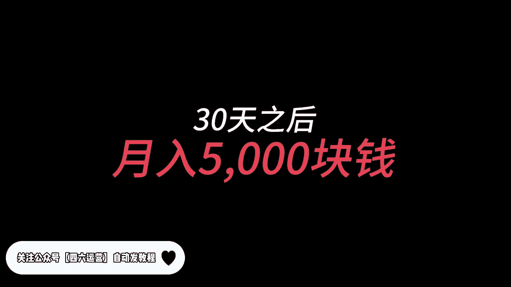

在小红书认真发布帖子的博主里面，月收入超过1000块钱的占到了57%，月收入超过5000块钱的占到了28%。

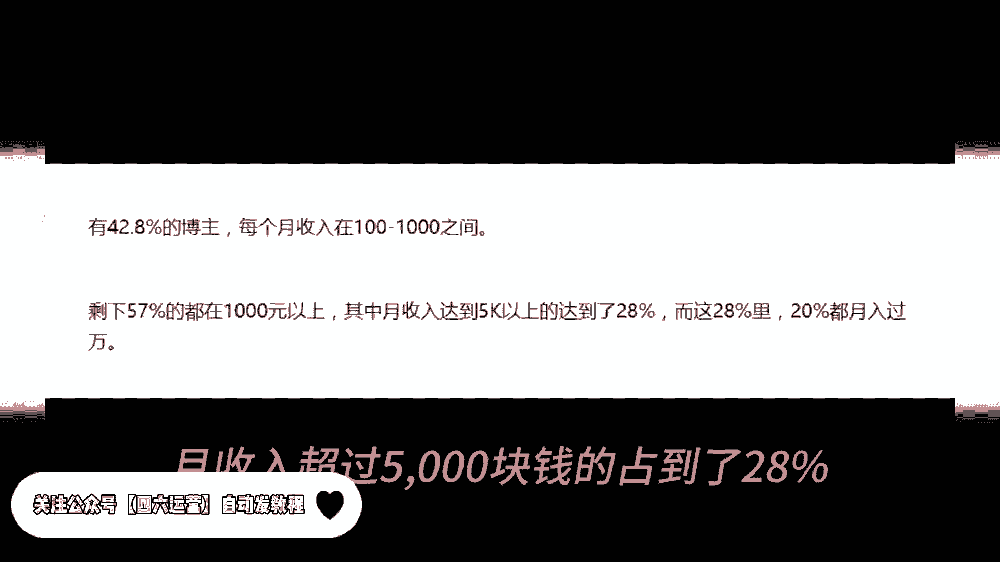

也就是说，只要你开始做了小红书，就有28%的概率，纯靠小红书就能养活你自己设置的先驱，我会在接下来的几分钟里，让你获得这28%的入场券，首先我们要知道小红书是一个什么样的平台。

它的本质是一个社交分享型平台，我们要注意里面的社交和分享，所以要为他人提供有价值的内容，是做起来一个小红书号的核心，所以有四类人是不适合做小红书的，第一不喜欢创作和表达，没有持续输出内容能力的人。

第二不善于检索阅读和总结信息的人，第三心理脆弱，容易放弃的人，第四没有执行力的人，这四条只要你占了一条，后面内容你都不用再听了，直接评论区找到我，先提高你的基础能力再说吧，如果你一条都不占，那么恭喜你。

基础能力是没有问题的，接下来我们会手把手教大家解决三个问题，第一如何从零开始起一个号，第二如何保证持续有高质量内容的输出，第三如何确保内容能够变成收益，这三个问题我会分别分为起号篇和变现篇。

两期讲给大家，本期是起号篇，起号第一件事情不是起名，不是搞头像，搞简介，而确定自己到底要卖什么赚钱，它决定了整个号的方向，我们做小红书不是为了做慈善，做分享，我们做小红书的唯一目的就是赚钱。

有些人辛辛苦苦运营了半天。

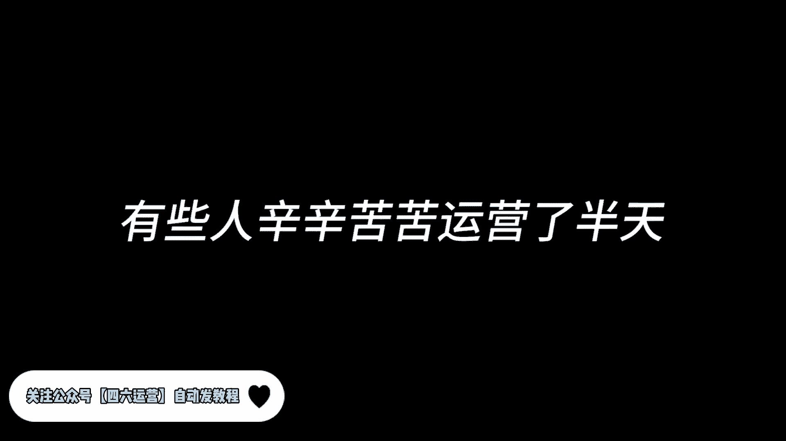

有了几千几万粉丝了，然后发现自己的方向赚不来钱，比如有些人喜欢做每日好好剧，分享每日读书打卡的号热度也很高，但没有什么商业价值，这种核心的问题就在于，一开始就没有想清楚，自己这个号到底要卖什么东西。

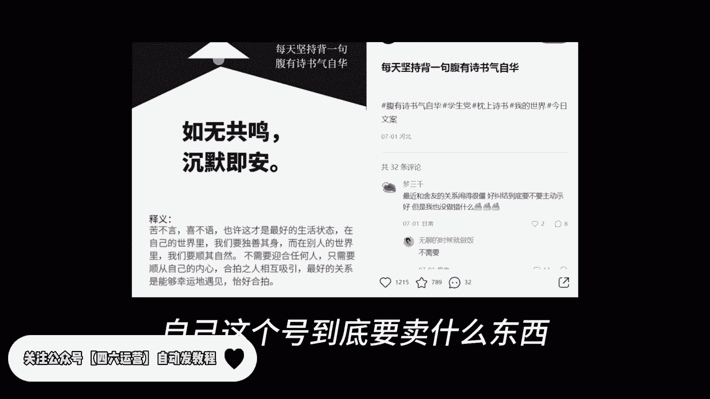

所以第一步你要确定的是，自己到底要卖什么产品，然后在这个方向上确定号怎么做，你要卖衣服，你就做传达号，你要卖付费课程，你就做培训号，你要卖吃的，那就做美食好，你自己擅长不擅长某个领域。

并不是你选择方向的依据，选择方向的依据是你要在这个方向上，第一能够持续创作内容，第二有产品可以交付，那就可以去做，至于擅长不擅长不擅长，你可以学呀，所有人刚起号的时候，都不可能比这个领域的大V更加擅长。

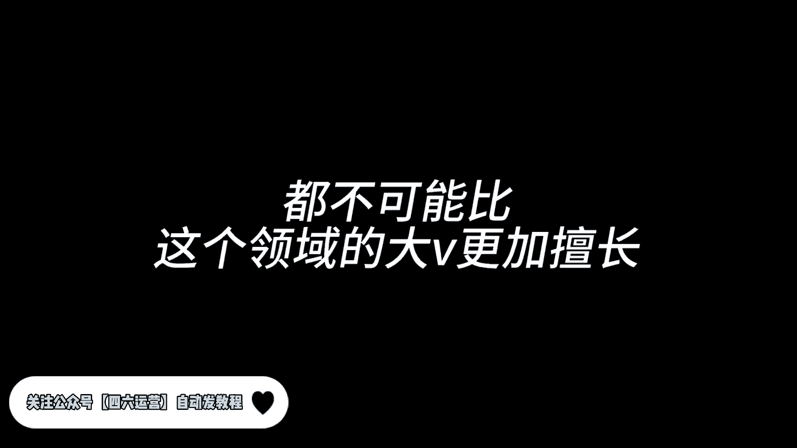

能力都是做着做着就起来了，就算你刚开始不懂传达，你做上200个传达的帖子出来。

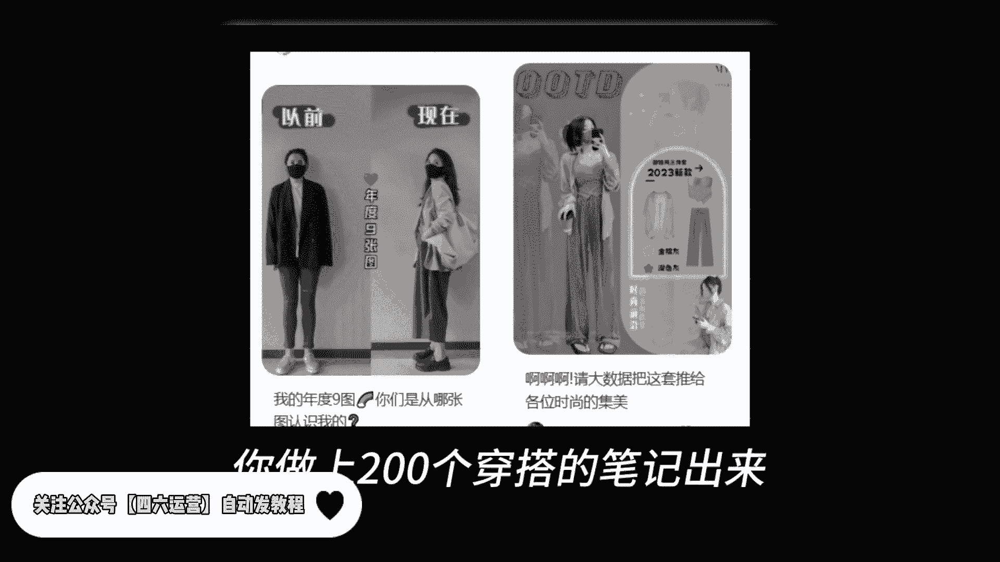

你还不能不会吗，如果实在不知道该做什么，这里可以给你一个参考，小红书里面最赚钱的领域是家居护肤，其次是情感健身健康，母婴和美食，其他领域的收入普遍都没有这些高，所以你在这里面随便挑一个。

你可以做就可以了，确定方向之后是一些基础的工作，第一个是起名，给你一个万能模板，要做的事情加标签，加个人昵称，要做的事情和标签之间要有一定的反差感，比如卖猪肉的转行医学生于宇，卖烧烤的下岗基金经理曾格。

抑郁的心理医生刘六，不会穿搭的女装店主，不会做饭的美食博主，不会骑自行车的女神，旅行达人，不会穿入的烧烤摊主，这种反差太好找了，如果不会搞的话，来评论区找我，我给你起都可以，第二头像随便弄。

别经常换就行。

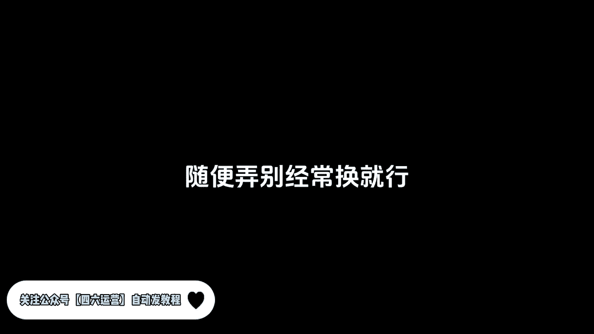

没有什么讲究，第三把默认小红书改成自己的微信号，这样后面有人私信你，你就可以直接告诉他加我小红书号就可以了，这样可以合规引流，第四简介还是万能模板身份。

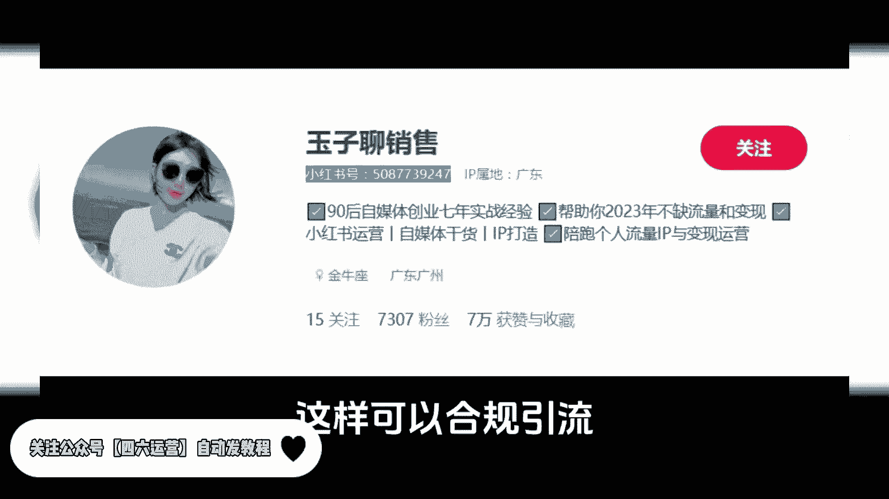

我是谁加，我在做什么。

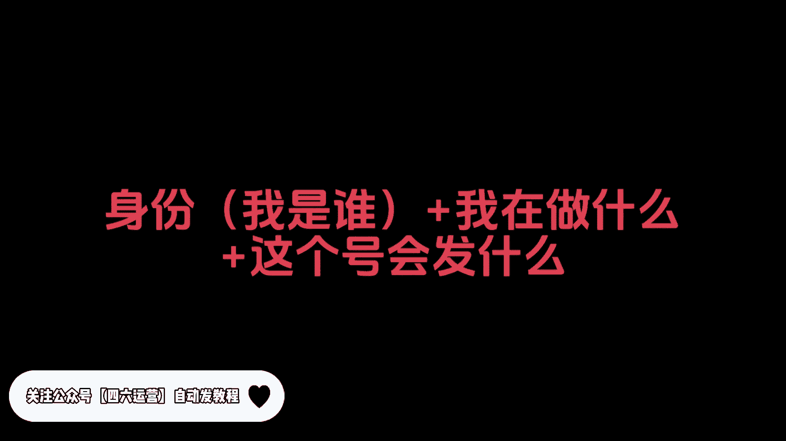

加这个号会发什么，比如说这个人身份是九零后自媒体创业者，做什么，帮人搞流量，搞变现，号里面会发什么。

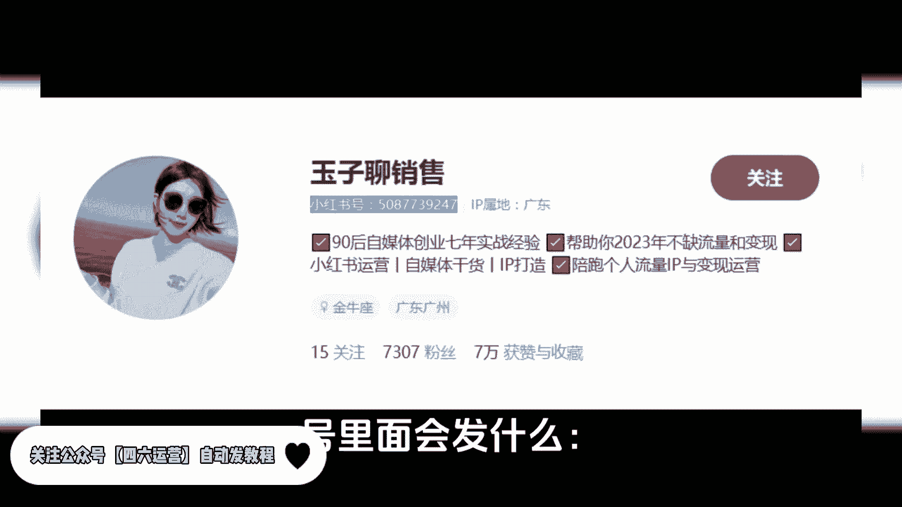

会发小红书，运营自媒体干货IP打造，第五是14下平台规则，第一禁止炫富，不要带给人焦虑，制造焦虑可以短期有流量，但长期来讲既会被平台打压，又不利于人设塑造，第二禁止直接引流。

帖子中间不能出现任何微信和公众号等信息，更不能出现二维码，合规的引流方式，以后我们会讲，也可以直接看评论区置顶就行，但是在你彻底了解之前，千万不要直接联动，直接引流。

对你的负面影响一定会大于你所得的收益，第三不要出现不文明言论。

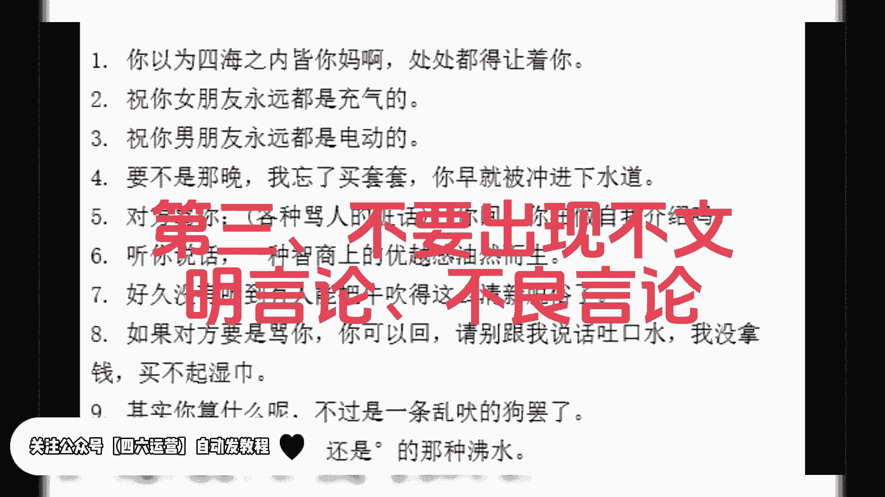

不良言论，第四不要过度擦边，第五不要抄袭大V的内容，可以借鉴选题，但不能抄写内容，第六可以发泄负能量，但不要宣传负能量，比如你可以说自己心情不好，但不要宣传人就应该抑郁不抑郁，不是正常人这样的观点。

到这里，所有基础工作都做完了，接下来是最重点的部分，如何做出好内容，如何把账号给做起来，做出好内容做起来。

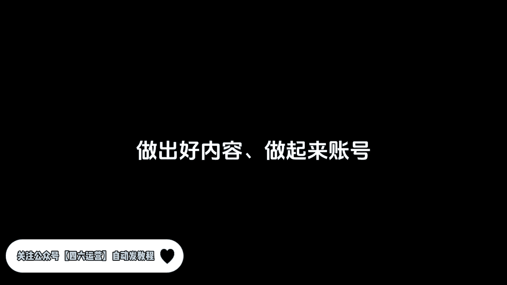

账号总共有五个方面，第一找到一个稳定的创作模式，进而找到一个稳定的素材来源，比如这个博主，他的创作模式就是每次做一道新菜分享给大家，植物的做法显然是无穷无尽的。

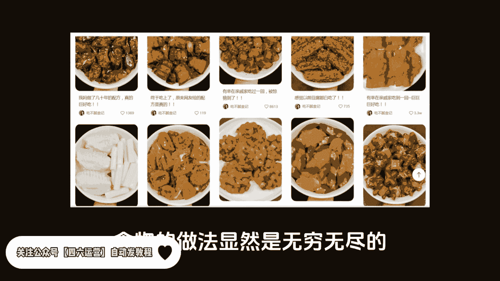

所以他这个模式可以保证长期持续稳定的更新，再比如这个人，你可以看到他的内容就是不同类型的衣服穿搭，衣服的类型款式，穿搭的方式是年年都不同，无穷无尽的，所以它也可以保证自己源源不断的。

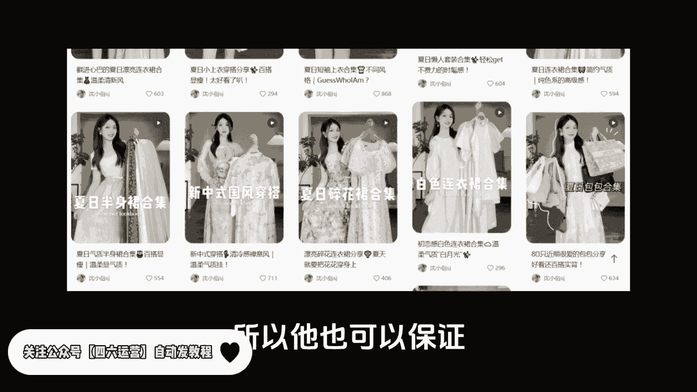

有输出的内容，每一个领域都有类似的创作模式，稍微研究一下对标账号，你就可以把它搞清楚，如果自己只是有感而发，或者根据自己的经验，人生经历知识去创作，你写个一二十篇恐怕就没东西写了。

所以你必须要找到一个稳定的创作模式，和素材的来源，找不到评论区找我，我给你找，第二内容必须有价值，要么能解决需求痛点，要么能引起情绪波动，如果别人想做红烧肉，但是不知道怎么做，你教会了他。

这就是解决了需求，如果他晚上刷了小红书的时候，肚子正在饿着，你给他提供了一个美食视频，这就能引起情绪波动，这二者同时都有算是满足底线要求的合格内容，只满足了一条属于低质量的内容都不满足，那就是毫无价值。

垃圾内容没有发出来，任何必要发出来也没什么用，但是即使是两条都满足的合格内容，也不一定有什么流量，自媒体发展到了现在，大家已经不是比的不是谁能合格了。

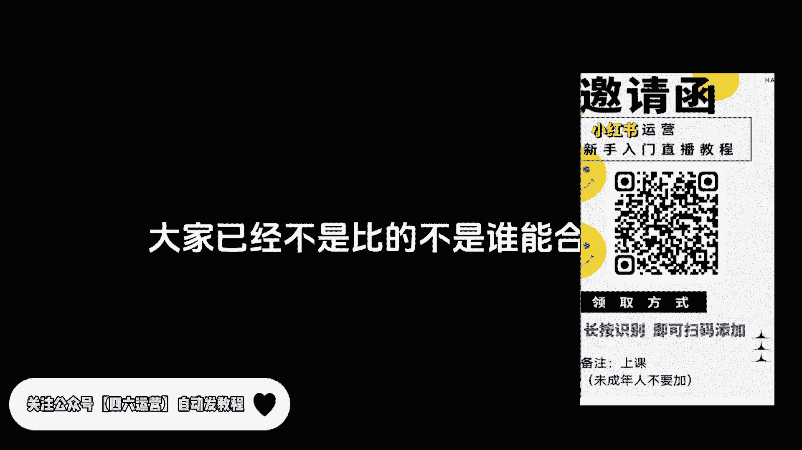

而是谁能考90分，不说红烧肉了，就算你想学黄焖大闸蟹，花式小龙虾，网上都有无线的教程给你看，用户晚上刷到的可能是成千上万个美食视频。

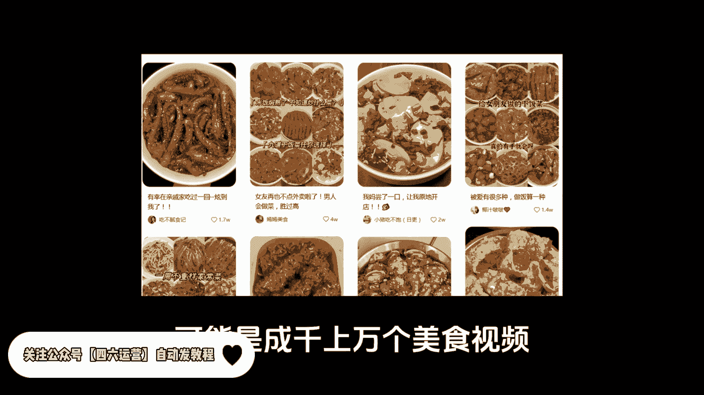

根本不差你一个，所以如果你要做满足需求的内容，你必须讲的比别人更清楚，更全面，更容易理解，更有帮助，如果你要做让人能情绪共鸣的内容，那你就必须更垂直，更有差异化，曾经你说自己是创业者，就能让人认同。

但现在你必须得说自己是大一在读，创业，985创业辍学创业，有这些标签才可以，曾经只要你的选题是小白，如何从零开始学会创业就可以了，但现在卖创业课的人呢，卷题都是负债，如何翻身，穷人如何翻身。

才能引起人的共鸣，在这个内容饱和的年代，情绪价值比内容本身更有价值，别人看见你的选题，至少有点进来的欲望，他才会点进来，比如我这边如果教小红书运营教程，那就没有什么爽点，也没有什么点进来的欲望。

但如果叫做小红书，如何从零开始，30天之后月入5000，看见之后阅读点击欲望会不会更强一些，但这并不代表只有前期价值就可以，如果你的内容只是看着爽，但解决不了人的痛点需求，那他可能只是流量比较高。

但你没办法变现收钱，比如张三生病了，你每天更新十个图，告诉他，我靠，要开心，要乐观，不要难过，然后他哈哈哈哈，笑完给你点了个赞，转头就给另外一个搞医学科普的人付费了，所以好的内容一定是。

同时既满足情绪需求和价值需求，而且这里会有一个雷。

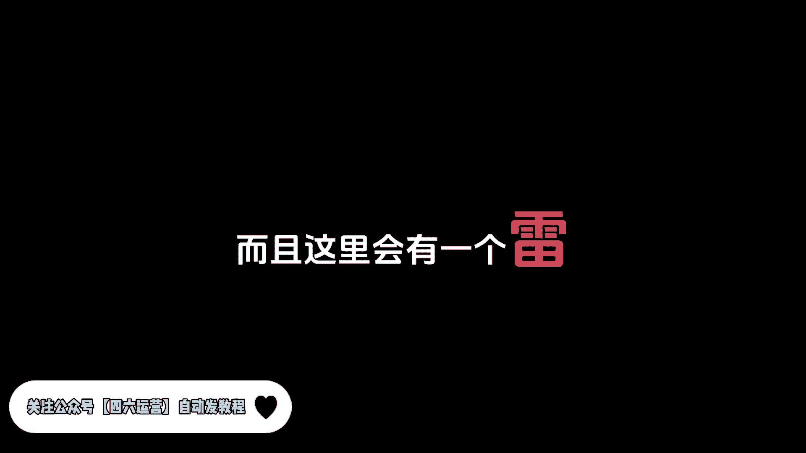

这里做干货内容的人，总是以为自己就能解决需求了，但是内容有干货和能解决需求。

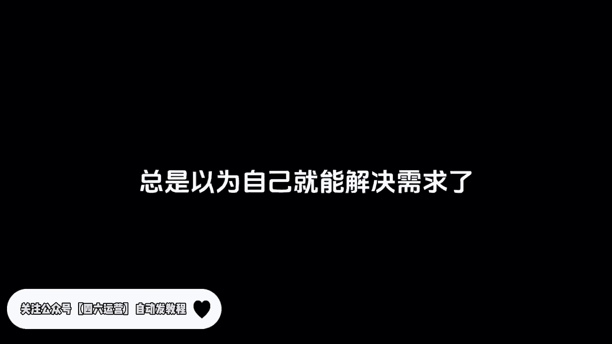

它不是一个东西，张三生病了，他最想知道是自己怎么治，能不能治好，多久能治好，有没有后遗症，你讲你为啥得这个病，你得这个病的原理是什么，人家不关心，你讲的再专业，再有干货都没有用。

所以准确的识别需求是很重要的，这是一种网感，你要慢慢培养，如果你翻了一大堆内容号，就是起不来，那八成是因为原因，内容不行，要么没有情绪，要么没有价值，自己回去分析分析原因，如果还是搞不清楚。

还是评论区找我，我给你看看，第三个是封面，既要引发用户兴趣，又要解决用户问题，情内容的情绪价值和痛点价值，全部都要体现在封面上，具体的操作因为因领域而异，比如说搞穿搭的照片又有个性亮眼，而且要养眼。

搞美食的图片拍出来有食欲就可以了，搞知识的要展示出最引人注目的观点，让别人能关注到你，如果你灵感迸发，想到了一个天才文案，写在封面上，靠着封面说不定就能爆一个帖子，这个我没有办法通过一个万能公式。

去让你百分之百的掌握怎么做封面，这是一种感觉，只能多去揣摩同领域的大号，然后自己去试，做的多了自然就会了，如果怎么做都搞不定，还是来找我看看就可以，第四账号，你要做出个人风格，这个牵扯到个人IP的问题。

后面我们会详细讲，这里就是说说白了就是让你懒一点，不要瞎折腾封面，不要乱换，一直用一套模板就可以了，视频的片头音乐不要乱换，一直用一套就行了，说话的风格不要刻意去学别人的。

按自己的习惯坚持表达下去就可以了，比如这个人，你看他所有的封面都是一个风格，时间长了就记住他了，第五是宁可减少数量，也要保证质量，如果能三天更一篇牛逼了，就不要一天更三篇垃圾了。

但是你要保证更新频率稳定，你不要两个月更一更，一个月之内一定要更一篇，如果一个月之内没有更新平台，就会觉得你断更了，流量会少很多的，到这里，如果今天讲的东西全部都搞定，坚持做下去，起号绝对不是问题。

变相关有五个后续变现，相关有五个问题，第一如何让同样的内容阅读量跳跃式的增长，第二个如何大规模跳跃式的涨粉，第三如何安全高效的引流和变现，第四如何让帖子发布一年后也能继续带来收入。

第五小红书群体的赚钱逻辑是什么，这五个问题在下一期变现篇中会详细讲，迫不及待的，想看的可以看评论置顶区就OK，做了几周甚至几个月。

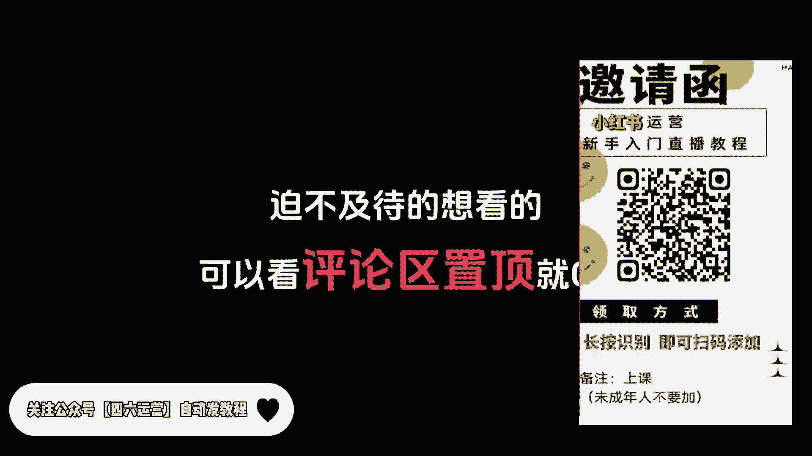

连1000粉都没有破的，评论区找我，我帮你看看号，所有人都告诉你，今年必须要做小红书，但从来没有人讲清楚到底怎么做，你以为做小红书就跟我二奶发朋友圈一样，随手一拍的照片，加上个令人感动的文案，刻字。

它就不断就能年入100万，结果发完作品你没5分钟就打开一看，卧槽怎么没有人看，真是老太太钻被窝给爷整笑了，今天我用一条视频讲清楚做小红书。

如何用一周时间快速起号，如果没有效果。

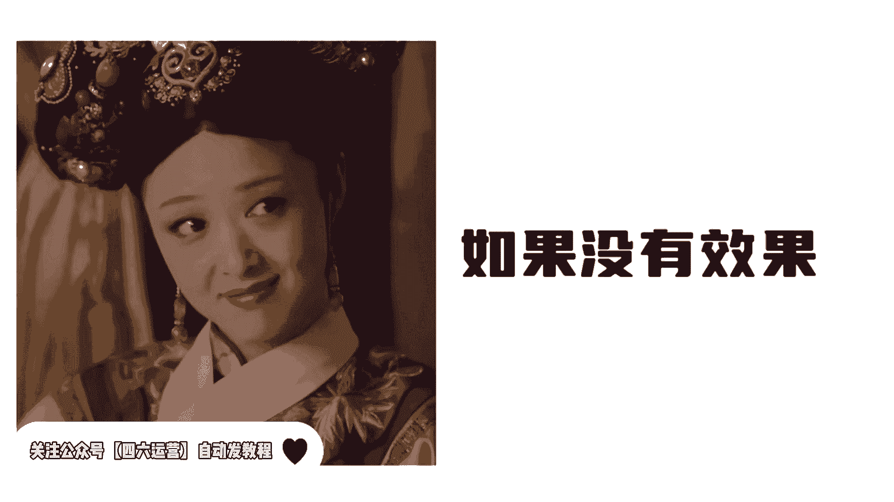

我倒立吃翔，第一步要明确你的定位，你是谁，你是做什么的，你能给用户带来什么价值，还有你的变现路径以及产品，第二步，找到你这个领域内最近30天的低粉豹纹笔记，你笔记的封面标题文案完全对标。

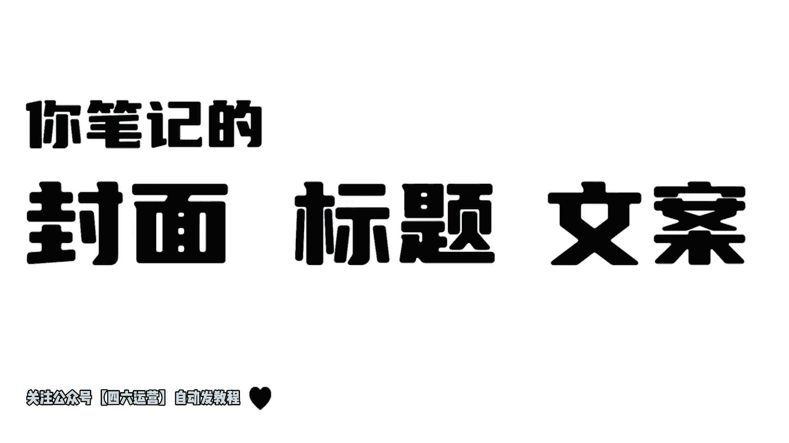

他们不要问，为什么同行已经替你测出了爆款结构不用，那真的就是小鲨鱼的手臂整理出来之后呢。

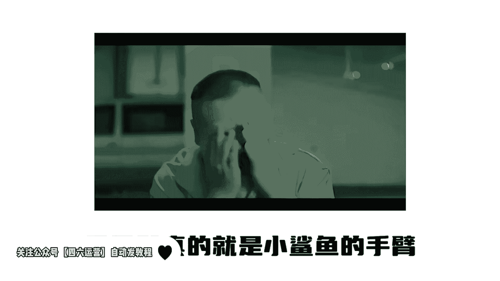

像我这样拉出来建立自己的选题库。

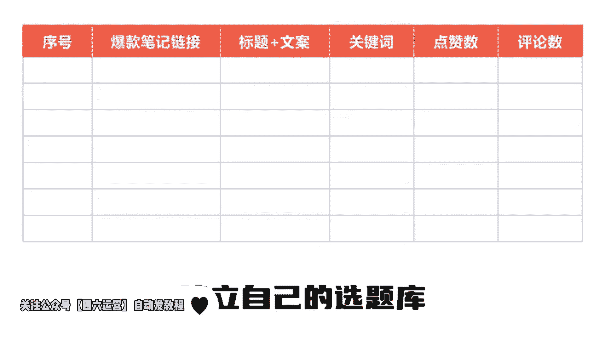

这样会保证之后你的账号不会轻易断更，第三步就是坚持且高效率的去发作品。

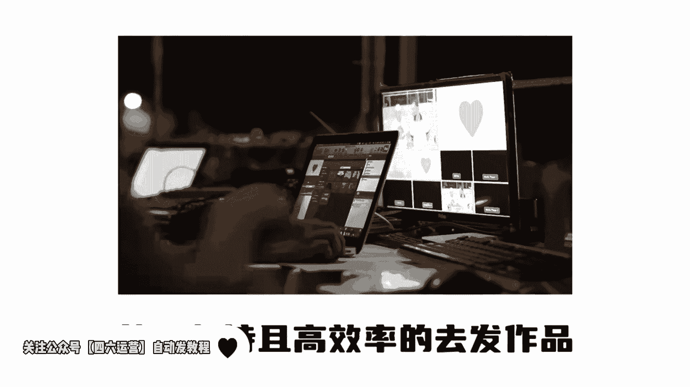

做小红书一定要矩阵起号，用数量博概率，一个账号一天两到三更不出。

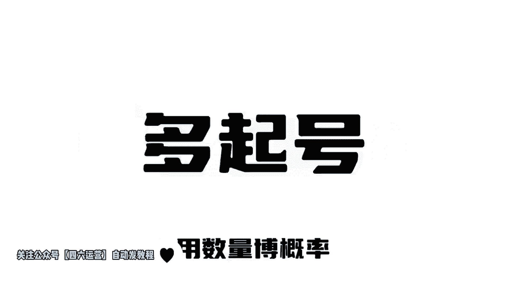

一周必出小爆款，最近小红书电商真的是太火了，看我关注的市面上那些付费社群就知道了，小红书不管是做无货源电商还是做虚拟资料，都是他们现在主力的售卖项目，我去年年底自己做的时候还没有这么火。

自己也是实操了三个店，挣了大概有十几万块钱，然后现在店已经给朋友接手做了，我等于是入个股，就拿点分成，上个月我也是出了一套实战免费的实战课程，在圈子里传的也是比较广，我决定现在录一个视频。

详细给大家拆解一下小红书电商到底怎么做，其实小红书电商就几个比较重要的流程，包括开店啊，选品上架，发笔记，搞流量，然后就是出售，我给大家一次性讲清楚，就是市面上任何小红书课程都是这个流程。

你就直接按着步骤，然后从零到盈利，就按照这个做，首先给大家讲一下，这个小红书无货源电商的整体的逻辑，它其实非常简单，就是我们从拼多多等第三方平台选产品，然后把链接挂在我们自己的小红书商城上。

价格上呢多加40%以上，这个自己定，然后发笔记引流量，有人买就从第三方平台发货，我们正中间这个差价呃，整个流程就三个步骤，开店选品流量，其中选品是核心。

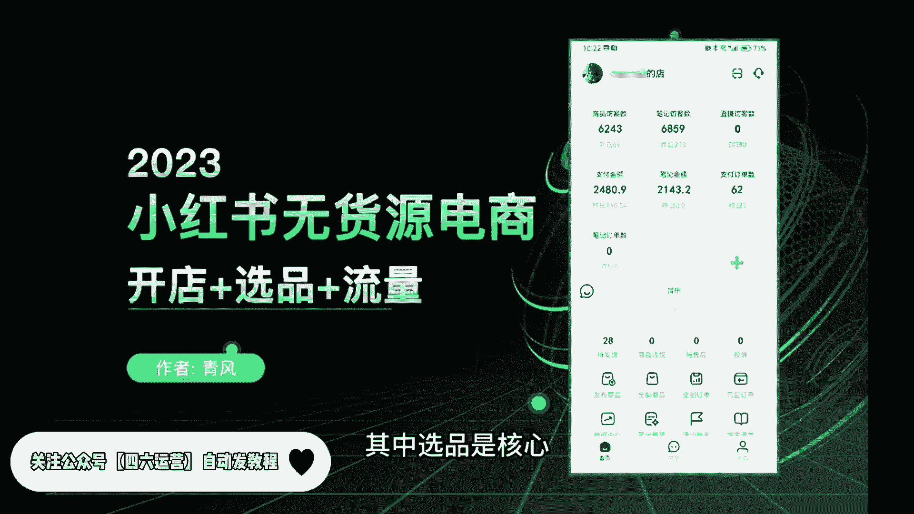

我们一步一步的来说，先说开店，开店是最简单的步骤了，直接用自己注册的这个小红书号开通，然后手机开通也可以，推荐是用电脑，因为开通完有一些这个必要设置，可以直接做完，官方网址，在这里只需要一个身份证。

按提示一步一步来呃，需要注意的是，开店分个人店，个体店和企业店，就普通人先开个人店就行了，个体店拿营业执照可以开三个店，就是后边我们要开多店的话，你可以选择升级个体店啊，企业店是开品牌店。

自己要有授权或者渠道，我建议新手先开一个个体店，玩熟就可以了，有经验的话可以做多账号，但是不是那种传统电商的铺货玩法，我们是多账号发笔记的矩阵玩法，那种店群模式不适合小红书这种种草的平台。

还有一些开店必须设置的东西，一个是支付宝，微信，这个是必须要开通的呃，开通以后别人才能付款下单，第二个是保证金，1000块钱，就是押金，退店的话全款退，第三个是平台要扣除5%的服务费。

第四个是各种软件费用，比如上架呀，一件代发呀等等，大概有0。5%每单，这个成本大家可以先开个店做做试试，就无货源的成本，其实已经算非常低的店铺开通以后。

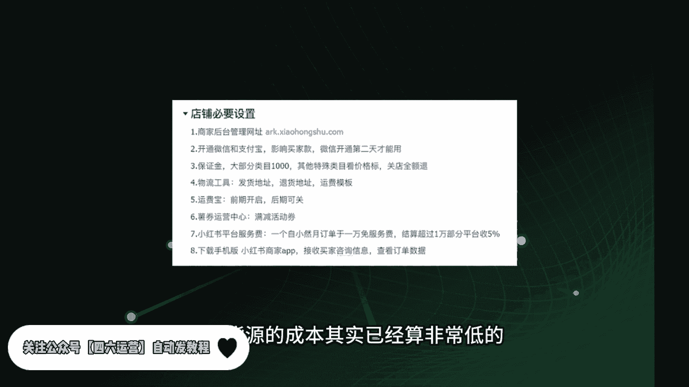

第二个步骤就是选品，选品就很直接了，我们就做女性相关的产品，因为小红书用户群体，就是18~34岁的女性，发作品就记住一点，别人发什么爆款，我们就发什么，就搬别的平台，爆了的东西，我们大概率也能报。

目前选品的方法就四种就足够大家用了，第一就是某宝的店铺畅销品，别人店铺卖的爆的品，你也拿来发，第二就是拼多多的畅销排行榜，就是经过数据验证的畅销品，选一些短期流行趋势爆款来发，第三是搬运抖音。

还有小红书博主的爆款平台发，我之前的这个店搬的抖音的，一个几万赞的爆款的裙子，就是开店第二天笔记就直接报了几百单，就不同平台之间它其实是有信息差的，他的作品能报你发，你也能，第四就是抖音精选联盟。

其实抖他就是抖店的畅销榜，和拼多多是一个原理，但是他需要这个开通橱窗，不过上面那三个选呃，这个选品的方法已经够用了。

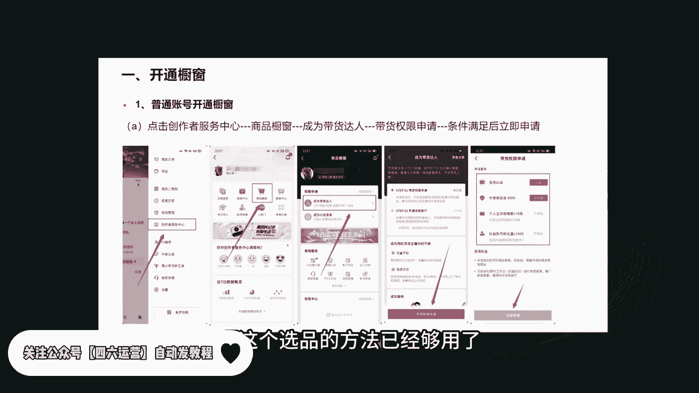

如果有抖电的同学也可以用这个方法，所以选品就是这么个逻辑，就是一定要选爆品，就大家一定不要自己乱发，永远不要相信自己的审美，一定要用别人和市面，市面这个市场测试出来的数据来为自己所用。

这样成功率就会高很多很多，这是最稳妥最省力的方式，比自己瞎琢磨强太多太多了，最后频选好了，就要说到流量，流量就是变现，因为我们能否爆单，就看笔记流量能否爆发，大家都知道这个小红书。

它不是淘宝那种传统电商，它是一个种草平台，它的流量来源不是靠你上架几千个那种产品，铺货铺出来的，而是靠发笔记的数量来的，只有多发笔记，笔记爆了才能有更多的人买你这个叫产品。

所以多发笔记就是唯一要做好的东西，每天坚持发就行了，而且小红书这种种草平台自然流量它非常好，非常公平，根本不用付费推广，付费的效果反而没那么好，发笔记的内容也很简单，就直接去下载对应这个产品的。

某宝或者是拼多多店铺的详情图，还有好的这个买家秀呃，文案就直接拿别人的改一下，你就以一个个人体验的视角给别人推荐种草，就实在不会，你先关注十个同行账号，别人怎么发，你就学着怎么发就行了。

等把一个店玩熟了，就可以多个店搞起来呃，多发笔记，把流量池子扩大就行了，呃市面上就是所有的培训呢，其实就这一套玩法，甚至他们有的还讲的根本就讲不清楚，就上面说的就是这个一个整个的大概流程。

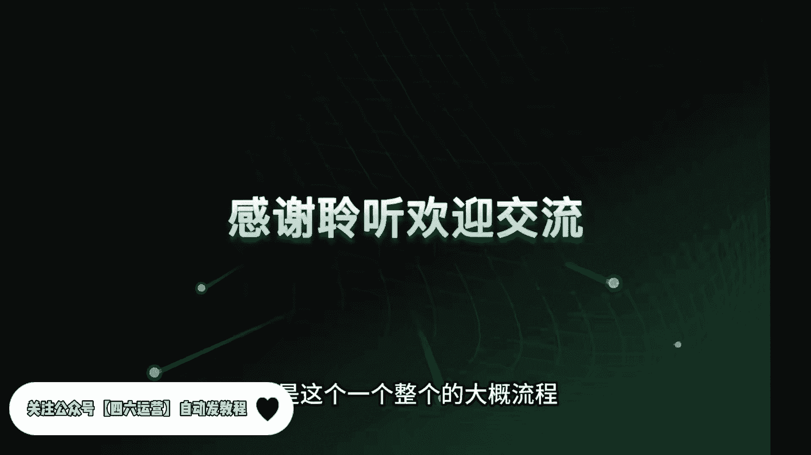

B友你要点赞，你要投币好不好。

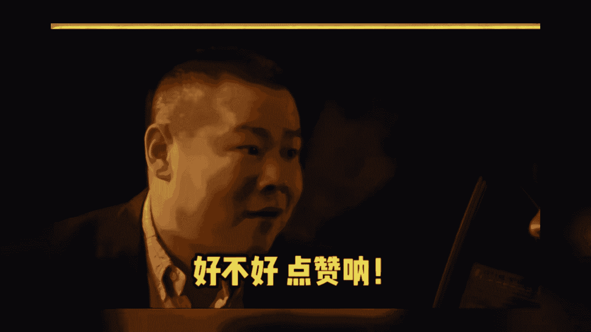

点赞呢，投币刷下一个视频吧，你的B站以后刷不到我了。

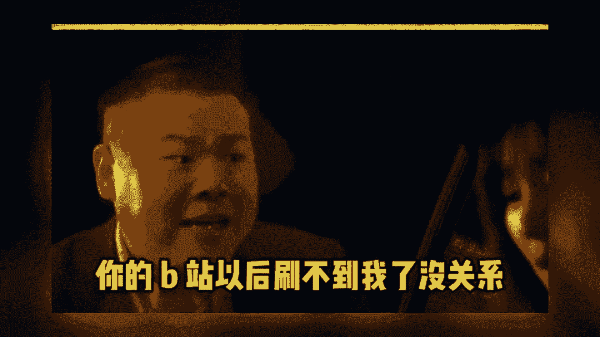

没关系，你要给别人投币啊，B友，碧瑶碧瑶，你每次都白嫖，我怎么活啊，碧瑶你这个逼占有我，啊啊啊啊啊。

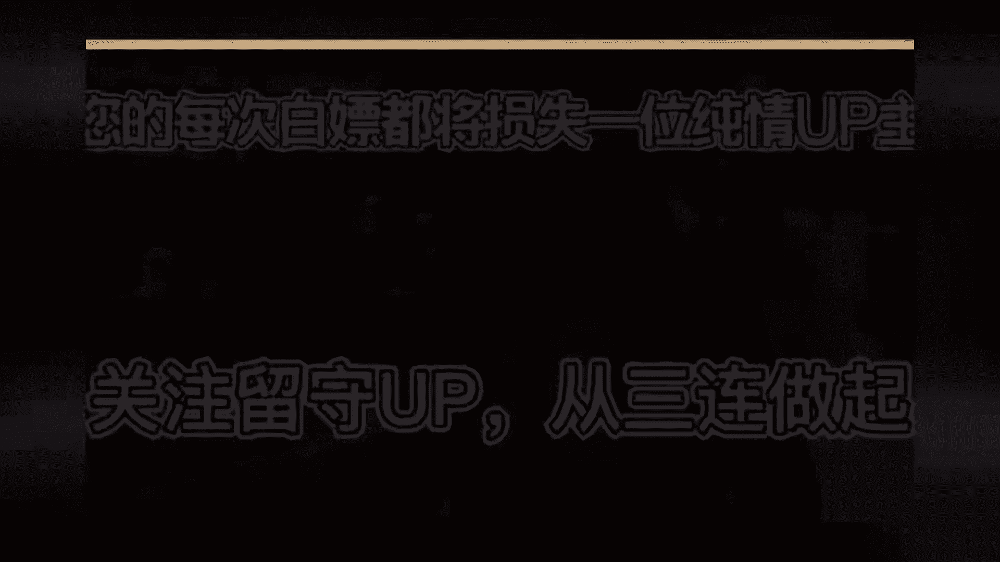

气死我了。

