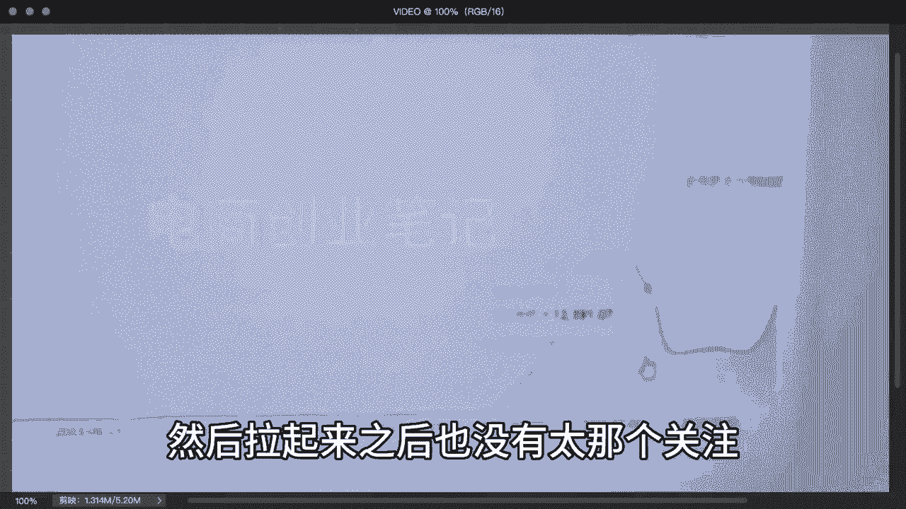

# 2024年做小红书怎么快速起号？小红书暴力起号实操教程分享，让你的账号快速涨粉变现，高口碑小红书运营教程，特别是新手小白，一定要知道的技巧！ - P2：店铺 - 能见面课 - BV1Lz421a7EE

像我们新起的一个小红书店铺啊，这个是女装店，为什么做女装店，因为在这个小红书上面，女装人群在70%到80%都是女性，而且一二线城市的人非常多，所以说我们做女装这个昨天全天卖了1万。

然后现在已经卖9000多了，看下订单数，看近30天啊，新店啊，现在支付金额是8万多。

我们直接看每日的一个成交量啊，7月2号还是零，7月3号到2400，4号到6000多，5号就拉到1万多啊，然后拉起来之后也没有太那个关注。

然后把运费宝给停掉了，就掉了两天，昨天又拉到1万啊，今天我感觉拉到2万应该没什么问题啊，相比我们做这个小红书店铺的话啊，基本上是零成本就可以去起练的，不需要你去S单，也不需要你去付费推广，利润的话。

我们比如说我们做这个女装的话，利润可以做到50%啊，我们直接看一下流量来源，流量大家就知道这个做的什么流量了，这都是免费流量，我们只需要去坚持去发笔记啊。

这个就可以了，然后我这里给大家整理了，小红书的一个开店资料，从小红书的一个开店啊，开店到怎么去注册，怎么去商品，怎么去上品，包括怎么去拍单啊，都给大家整理好，大家可以自己去领取一下啊。

还是非常建议大家可以开一个这个小红书店铺，自己当老板，视频制作不易，感谢大家三连关注支持一下。