# 2024年做小红书音怎么快速起号？5个步骤轻松起号：找账号-定形式-抄选题-测爆款-复制爆款！ - P1 - 中古巴 - BV1NesHe4EZT

要说最近什么项目最火啊，那就必须要提到小红书电商，最近几个月呢，几乎整个互联网都在讨论小红书电商，我关注的几个商业博主啊，包括一些付费社群都在讨论他，我朋友圈月入五位数甚至六位数的比比皆是。

这个项目在年初的时候，我其实就有让团队跟进测试，我还在市面上买了一些课程学习，到现在单人单店一个月也能做个一两万块吧，今天我就用一个视频详细的给大家拆解一下，就是小红书电商到底怎么玩。

我会把整个小红书电商的流程，包括一些注意点，比如怎么开店，怎么选品，怎么做流量，一次性给大家讲清楚，你甚至都不用再去看别的相关视频和培训了啊，你就跟着我的视频去按图索骥就足够，你在这个事情上开始盈利了。

视频的结尾呢我还会给大家准备一份资料，里面有我找的课程啊，对你运营小红书电商呢会有很大的帮助，有需要呢直接去拿就可以了，言归正传啊，整个项目的逻辑啊其实也非常简单，它就三件事，第一个呢开店，第二个选品。

第三个流量，我们一个一个来讲，先说开店呃，开店其实没什么好说的啊，首先就是打开小红书，然后点击左上角的菜单图标，再选择创作中心，然后点击更多服务这个选项，选择店铺，点击立即入住就可以了。

你就按他官方要求的提交资料入住就行了，我居然看到有人把小红书开店包装成一个项目，拿出来卖，居然还有不少人买，这也是很奇特，这里跟大家说一下小红书店铺的两种形式，个人店和企业店，其中个人店有两种。

分别是个人店和个体工商户店，个人店只需要身份证，加1000保证金就可以开通了，个体工商户呢还要多一个营业执照，企业店呢就多一点，企业店有三种呃，有包括那个普通的企业店，有专卖店和旗舰店。

企业店都需要营业执照，而且还要缴纳600的年费，我们刚开始运营小红书电商的时候，你直接选择个人店就可以了，我们实测下来，企业店和个人店一样。

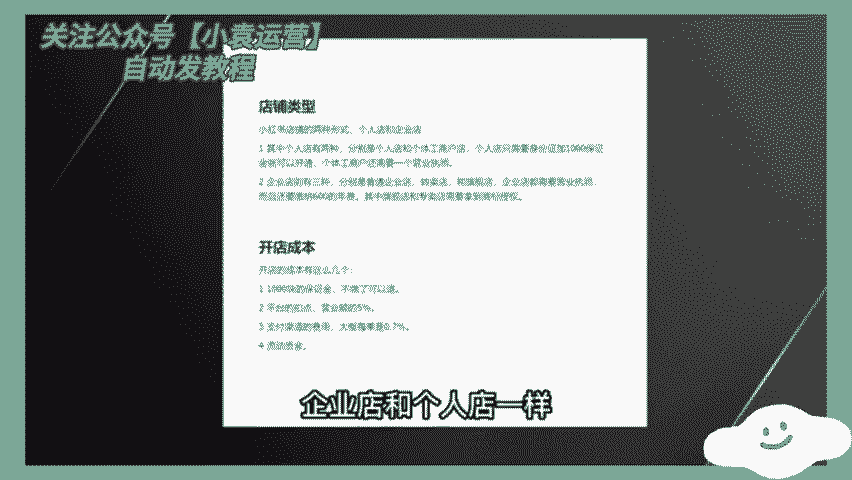

平台并没有对企业店有什么流量倾斜，唯一的区别是个人店你只能开一家，而一份营业执照呢，你可以开三个店，你一个店如果都没做好，你开再多的店都是没有用的，而且小红书电商啊，我觉得是不适合店群形式去做的。

这是因为小红书的流量机制，它的电商自然流占比非常低，那你铺再多的店，再多的货有什么用呢，所以只要你看到有博主跟你讲什么小红书店群，我都觉得是在扯淡，小红书是要做矩阵的啊，但不是店铺矩阵，而是账号矩阵。

这个后面在流量获取那里，我会跟大家细说，开店的成本呢有这么几个，第一个就是1000块钱的保证金啊，不做了可以退，第二个呢是平台的扣点营业额的5%，第三个呢是支付渠道的费用，大概呢每单是0。7%。

第四个就是自己的流动资金啊，一开始大家做呢可以用无货源的方式去做啊，对资金要求也不高，你刚开始呢准备个2000块，3000块完全够了呃，开完店以后呢，我们下一步就是选品，我们应该在小红书上卖什么的。

选品其实也简单啊哈，在其他平台上的爆款，大概率在小红书上也能爆，目前小红书呢我是推荐三个渠道进行选品的，第一个是通过某东，某宝上面找那种小红书平台调性的爆款产品，呃，身边有做电商的朋友。

他自己在某宝的店铺卖的爆款，搬到小红书上，第一篇笔记就开始出单，第二篇笔记单量就已经破百了，第二个呢是通过某音的那个精选联盟，你在某音的精选联盟排行榜，你可以看到现阶段哪些品卖的好。

只要符合小红书用户调性的产品，直接搬运测试就可以了，第三个就是某多多的这个销量排行榜，选择适合小红书的类目排行榜，从中选择相应的爆品搬运到小红书，整个选品的逻辑，就是我们要利用市场来帮助我们选品。

而不是自己在那瞎想，我们要借助大卖家的选品能力，来弥补自己选品上的不足，所以我们只要判断一个东西啊，就是这些排行榜上的爆品，是否跟小红书的人群有匹配的可能，如果有，我就搬过来测一下对吧。

相当于是借助了别人的能力来帮我们自己选屏，这样反而是最快捷而且是最稳妥的选品方式，肯定比你瞎测成功率要高很多，然后等你这个产品上架以后呢，就到了最重要的环节了，我们应该如何获取流量。

小红书它是个种草平台，你店铺九成以上的流量啊，都是来自你发的发的笔记，这就是为什么我之前说小红书不要铺店群，而要做账号矩阵，尽可能多的发笔记耗流量，它的通路就是用户通过你的笔记啊，对你推的产品产生兴趣。

然后到达你的店铺完成购买，你堆一堆店铺对吧，你铺一堆店铺一堆，还不如多发笔记，多发几篇笔记的这个效果好，所以怎么在小红书上发笔记对吧，就是你小红书电商是否成功的关键，小红书这个平台你直接发硬广。

我觉得效果非常差对吧，本来小红书的这个用户群体认知就比较高，你直接发广告，你没有办法获得信任的啊，更不要提转化了，你发笔记的时候一定要用一个素人的角度，你知道吧，就是用户的角度去切入。

站在用户的角度去做种草内容，而不是官方视角，这才是真正有效的呃，这种种草笔记怎么做其实也很简单，就是去各大平台的商品评论里找，比如某音某宝，某东的商品买家秀，找到好看的素材，你直接copy下来用嘛对吧。

文案呢在买家评价上去做修改，这些买家的评价就是商品用户的使用体验，天然的适合用来做这个中考笔记，而且可以说是取之不尽了啊，然后啊当你单个账号的sop跑通了是吧，我们就可以开始举证引流了啊。

通过批量上小红书账号，批量发布笔记给我们的店铺来引流，来放大，那基本上整个小红书的电商的运营啊，就是我上面分享的这些，外面不管多少钱的培训啊，3000块也好，6000块，1万块也好，其实就是这些东西。

有些培训可能还没有讲清楚啊，根据上面的几个点，我给大家准备了一份资料，里面包括了小红书账号的旗号运营的方法，以及一份小红书电商的视频课程，你如果打算经营小红书电商，你也不用看别的东西。

就跟着这份资料走足够你开始盈利了，有需要的啊，点赞加关注，在评论区回复红书电商，我分享给你一个新手，从零开始做小红书后，30天之后月入5000块钱有可能吗。

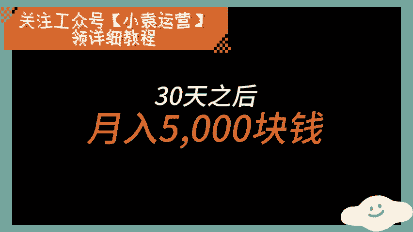

在小红书认真发布帖子的博主里面，月收入超过1000块钱的占到了57%。

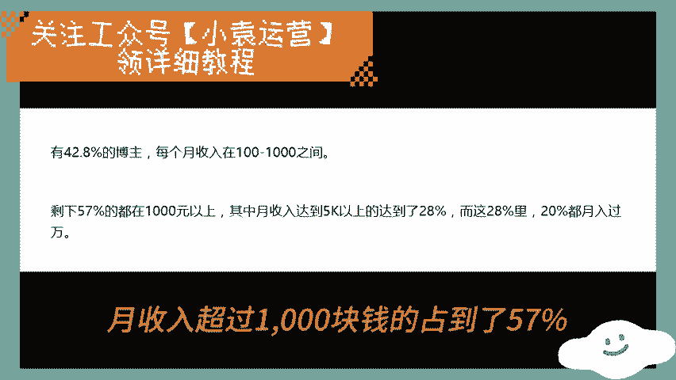

月收入超过5000块钱的占到了28%，也就是说，只要你开始做了小红书，就有28%的概率，纯靠小红书就能养活你自己设置的先驱，我会在接下来的几分钟里，让你获得这28%的入场券。

首先我们要知道小红书是个什么样的平台，它的本质是一个社交分享型平台，我们要注意里面的社交和分享，所以要为他人提供有价值的内容，是做起来一个小红书号的核心，所以有四类人是不适合做小红书的。

第一不喜欢创作和表达，没有持续输出内容能力的人，第二不善于检索阅读和总结信息的人，第三心理脆弱，容易放弃的人，第四没有执行力的人，这四条只要你占了一条，后面内容你都不用再听了，直接评论区找到我。

先提高你的基础能力再说吧，如果你一条都不占，那么恭喜你，基础能力是没有问题的，接下来我们会手把手教大家解决三个问题，第一如何从零开始起一个号，第二如何保证持续有高质量内容的输出。

第三如何确保内容能够变成收益，这三个问题我会分别分为起号篇和变现篇，两期讲给大家，本期是起号篇。

起号第一件事情不是起名，不是搞头像，搞简介，而确定自己到底要卖什么赚钱，它决定了整个号的方向，我们做小红书不是为了做慈善，做分享，我们做小红书的唯一目的就是赚钱。

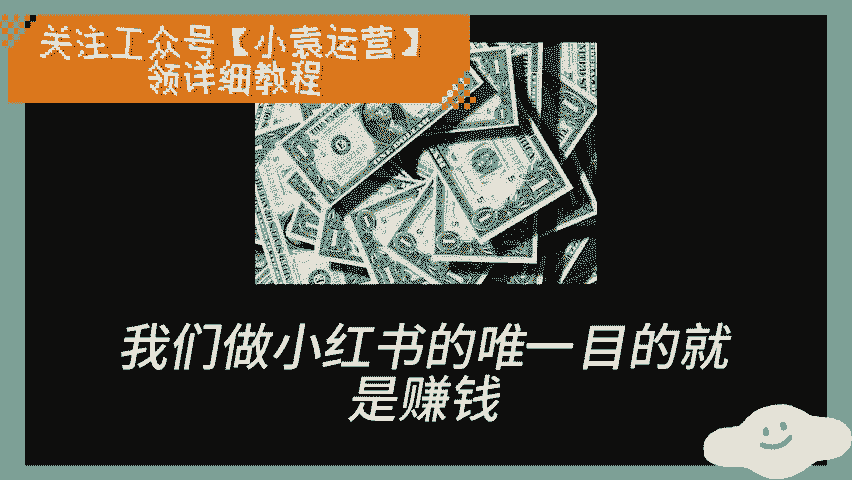

有些人辛辛苦苦运营了半天，有了几千几万粉丝了。

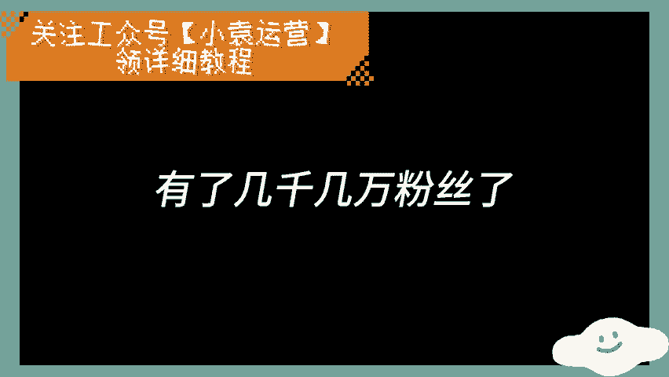

然后发现自己的方向赚不来钱，比如有些人喜欢做每日好剧，好剧分享每日读书，打卡的好，热度也很高，但没有什么商业价值，这种核心的问题就在于。

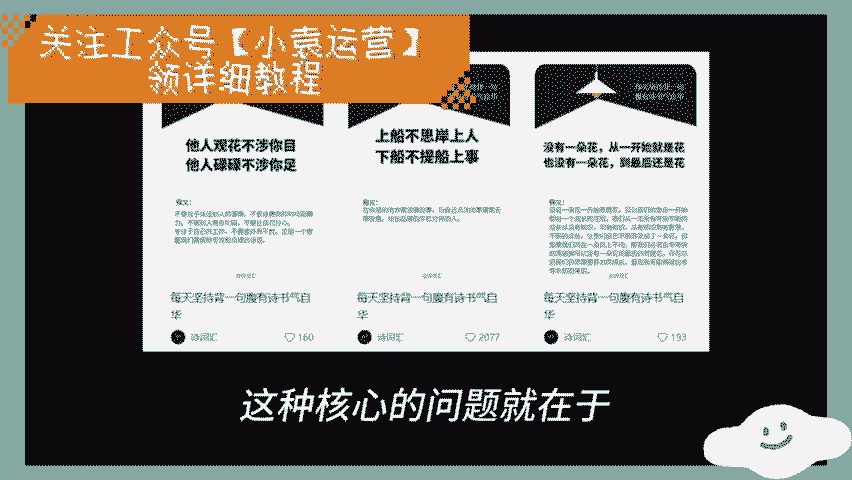

一开始就没有想清楚，自己这个号到底要卖什么东西，所以第一步你要确定的是，自己到底要卖什么产品，然后在这个方向上确定号怎么做，你要卖衣服，你就做穿搭号，你要卖付费课程，你就做培训号，你要卖吃的。

那就做美食好，你自己擅长不擅长某个领域，并不是你选择方向的依据，选择方向的依据是你要在这个方向上，第一能够持续创作内容，第二有产品可以交付，那就可以去做，至于擅长不擅长不擅长，你可以学呀。

所有人刚起号的时候，都不可能比这个领域的大V更加擅长，能力都是做着做着就起来了。

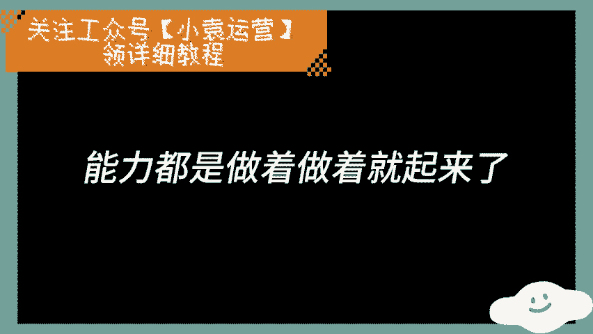

就算你刚开始不懂传达，你做上200个传达的帖子出来，你还不能不会吗。

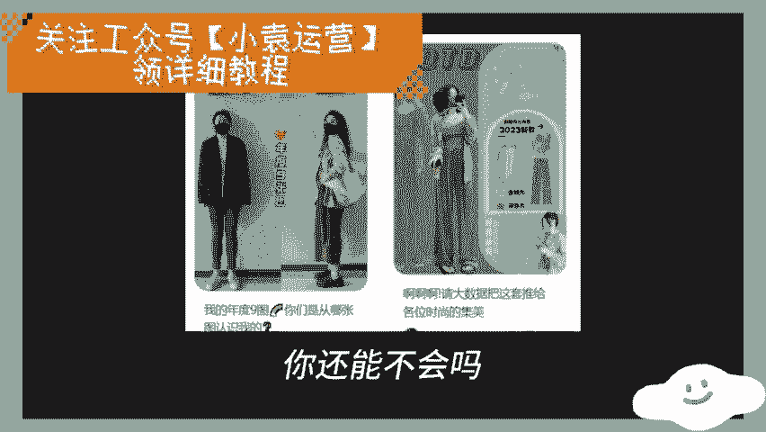

如果实在不知道该做什么，这里可以给你一个参考，小红书里面最赚钱的领域是家居护肤，其次是情感健身健康，母婴和美食，其他领域的收入普遍都没有这些高，所以你在这里面随便挑一个，你可以做的就可以了。

确定方向之后是一些基础的工作，第一个是起名，给你一个万能模板，要做的事情加标签，加个人昵称，要做的事情和标签之间要有一定的反差感，比如卖猪肉的转行医学生于宇，卖烧烤的下岗基金经理曾格。

抑郁的心理医生刘六，不会穿搭的女装店主，不会做饭的美食博主，不会骑自行车的女神，旅行达人，不会穿入的烧烤摊主，这种反差太好找了，如果不会搞的话，来评论区找我，我给你起都可以。

第二头像随便弄，别经常换就行，没有什么讲究，第三把默认小红书改成自己的微信号，这样后面有人私信你，你就可以直接告诉他加我小红书号就可以了。

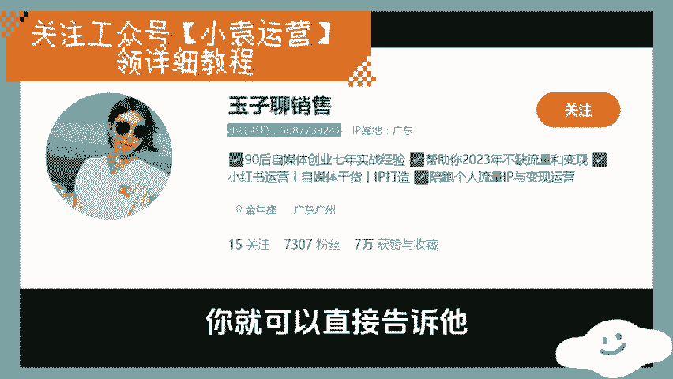

这样可以合规引流，第四简介还是万能模板身份，我是谁加，我在做什么，加这个号会发什么。

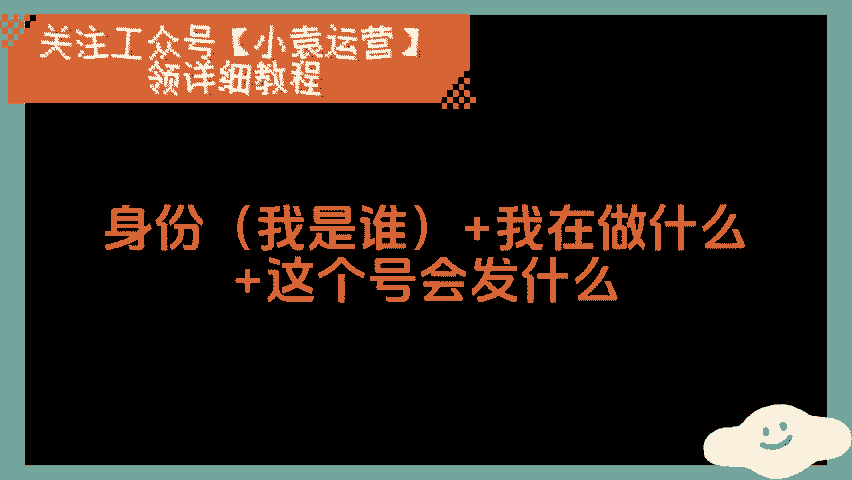

比如说这个人身份是九零后自媒体创业者，做什么，帮人搞流量，搞变现，号里面会发什么，会发小红书，运营自媒体干货IP打造。

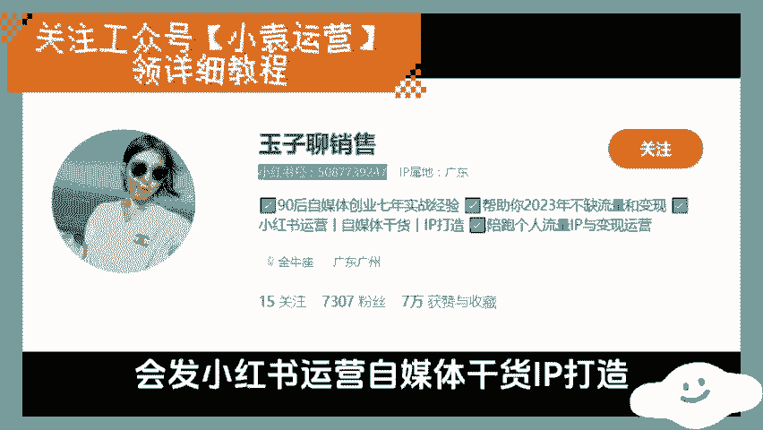

第五是14下平台规则，第一禁止炫富，不要带给人焦虑，制造焦虑可以短期有流量，但长期来讲既会被平台打压，又不利于人设数塑造，第二禁止直接引流，帖子中间不能出现任何微信和公众号等信息，更不能出现二维码。

合规的引流方式，以后我们会讲，也可以直接看评论区置顶就行，但是在你彻底了解之前，千万不要直接联动，直接引流，对你的负面影响一定会大于你所得的收益，第三不要出现不文明言论，不良言论，第四不要过度擦边。

第五不要抄袭大V的内容，可以借鉴选题，但不能抄写内容，第六可以发泄负能量，但不要宣传负能量，比如你可以说自己心情不好，但不要宣传人就应该抑郁不抑郁，不是正常人这样的观点，到这里，所有基础工作都做完了。

接下来是最重点的部分，如何做出好内容，如何把账号给做起来，做出好内容做起来，账号总共有五个方面，第一找到一个稳定的创作模式，进而找到一个稳定的素材来源，比如这个博主。

他的创作模式就是每次做一道新菜分享给大家，植物的做法显然是无穷无尽的，所以他这个模式可以保证长期持续稳定的更新，再比如这个人，你可以看到他的内容就是不同类型的衣服穿搭，衣服的类型款式。

穿搭的方式是年年都不同，无穷无尽的，所以它也可以保证自己源源不断的，有输出的内容，每一个领域都有类似的创作模式，稍微研究一下对标账号，你就可以把它搞清楚，如果自己只是有感而发，或者根据自己的经验。

人生经历知识去创作，你写个一二十篇恐怕就没东西写了，所以你必须要找到一个稳定的创作模式，和素材的来源，找不到评论区找我，我给你找，第二内容必须有价值，要么能解决需求痛点，要么能引起情绪波动。

如果别人想做红烧肉，但是不知道怎么做，你教会了他，这就是解决了需求，如果他晚上刷了小红书的时候，肚子正在饿着，你给他提供了一个美食视频，这就能引起情绪波动，这二者同时都有算是满足底线要求的合格内容。

只满足了一条属于低质量的内容都不满足，那就是毫无价值，垃圾内容没有发出来，任何必要发出来也没什么用，但是即使是两条都满足的合格内容，也不一定有什么流量，自媒体发展到了现在。

大家已经不是比的不是谁能合格了，而是谁能考90分，不说红烧肉了，就算你想学黄焖大闸蟹，花式小龙虾，网上都有无线的教程给你看，用户晚上刷到的可能是成千上万个美食视频，根本不差你一个。

所以如果你要做满足需求的内容，你必须讲的比别人更清楚，更全面，更容易理解，更有帮助，如果你要做让人能情绪共鸣的内容，那你就必须更垂直，更有差异化，曾经你说自己是创业者，就能让人认同。

但现在你必须得说自己是大一在读，创业，985创业辍学创业，有这些标签才可以，曾经只要你的选题是小白，如何从零开始学会创业就可以了，但现在卖创业课的人呢，选题都是负债，如何翻身，穷人如何翻身。

才能引起人的共鸣，在这个内容饱和的年代，情绪价值比内容本身更有价值，别人看见你的选题，至少有点进来的欲望，他才会点进来，比如我这边如果教小红书运营教程，那就没有什么爽点，也没有什么点进来的欲望。

但如果叫做小红书，如何从零开始，30天之后月入5000，看见之后阅读点击欲望会不会更强一些，但这并不代表只有前期价值就可以，如果你的内容只是看着爽，但解决不了人的痛点需求，那他可能只是流量比较高。

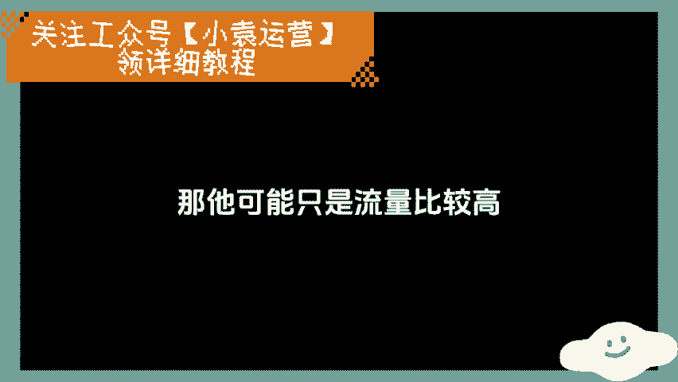

但你没办法变现收钱，比如张三生病了，你每天更新十个图。

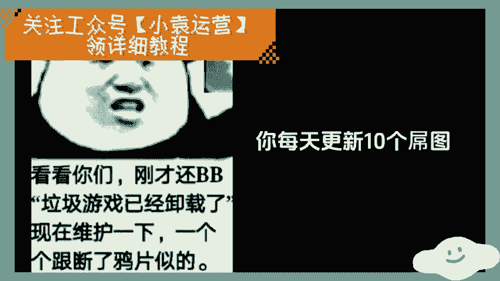

告诉他，我靠，要开心，要乐观，不要难过，然后他哈哈哈哈，笑完给你点了个赞，转头就给另外一个搞医学科普的人付费了，所以好的内容一定是，同时既满足情绪需求和价值需求，而且这里会有一个雷，这里做干货内容的人。

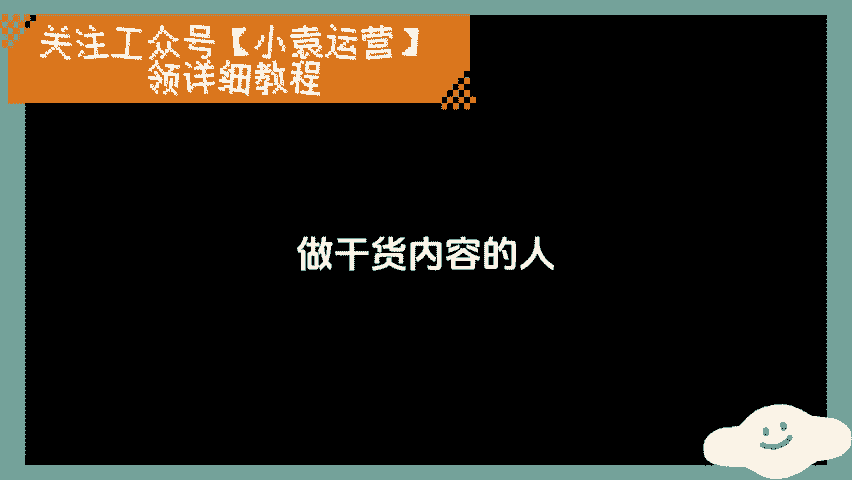

总是以为自己就能解决需求了，但是内容有干货和能解决需求，它不是一个东西，张三生病了，他最想知道是自己怎么治，能不能治好，多久能治好，有没有后遗症，你讲你为啥得这个病。

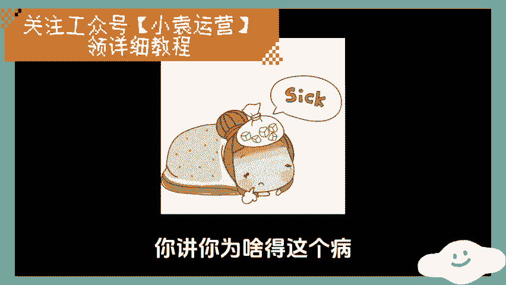

你得这个病的原理是什么，人家不关心，你讲的再专业，再有干货都没有用，所以准确的识别需求是很重要的，这是一种网感，你要慢慢培养，如果你发了一大堆内容号，就是起不来，那八成是因为原因，内容不行。

要么没有情绪，要么没有价值，自己回去分析分析原因，如果还是搞不清楚，还是评论区找我，我给你看看，第三个是封面，既要引发用户兴趣，又要解决用户问题，情内容的情绪价值和痛点价值，全部都要体现在封面上。

具体的操作因为因领域而异，比如说搞穿搭的照片又有个性亮眼，而且要养眼，搞美食的图片拍出来有食欲就可以了，搞知识的要展示出最引人注目的观点，让别人能关注到你，如果你灵感迸发，想到了一个天才文案。

写在封面上，靠着封面说不定就能爆一个帖子，这个我没有办法通过一个万能公式，去让你百分之百的掌握怎么做封面，这是一种感觉，只能多去揣摩同领域的大号，然后自己去试，做的多了自然就会了，如果怎么做都搞不定。

还是来找我看看就可以，第四账号，你要做出个人风格，这个牵扯到个人IP的问题，后面我们会详细讲，这里就是说说白了就是让你懒一点，不要瞎折腾封面，不要乱换，一直用一套模板就可以了，视频的片头音乐不要乱换。

一直用一套就行了，说话的风格不要刻意去学别人的，按自己的习惯坚持表达下去就可以了，比如这个人，你看他所有的封面都是一个风格，时间长了就记住他了，第五是宁可减少数量，也要保证质量，如果能三天更一篇牛逼了。

就不要一天更三篇垃圾了，但是你要保证更新频率稳定，你不要两个月更一更，一个月之内一定要更一篇，如果一个月之内没有更新平台，就会觉得你断更了，流量会少很多的，到这里，如果今天讲的东西全部都搞定。

坚持做下去，起号绝对不是问题，变相关有五个后续变现，相关有五个问题，第一如何让同样的内容阅读量跳跃式的增长，第二个如何大规模跳跃式的涨粉，第三如何安全高效的引流和变现。

第四如何让帖子发布一年后也能继续带来收入，第五小红书群体的赚钱逻辑是什么，这五个问题在下一期变现篇中会详细讲，迫不及待的，想看的可以看评论置顶区就OK，做了几周甚至几个月连1000粉都没有破的。

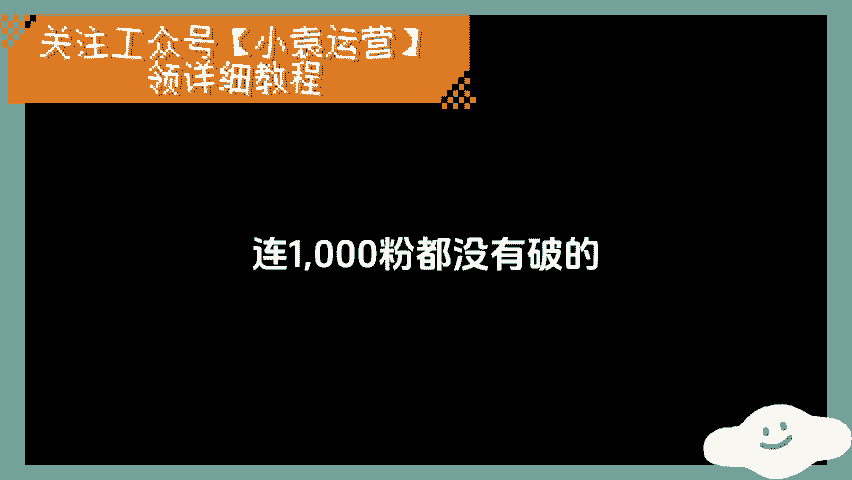

评论区找我。