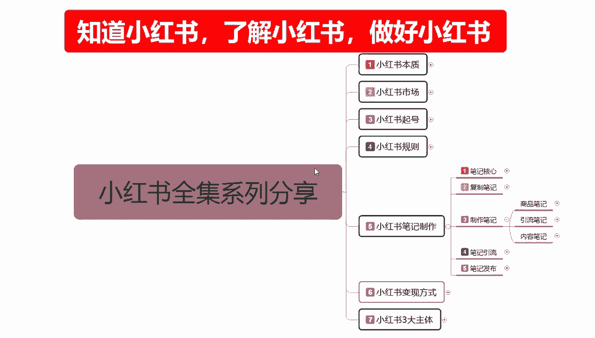
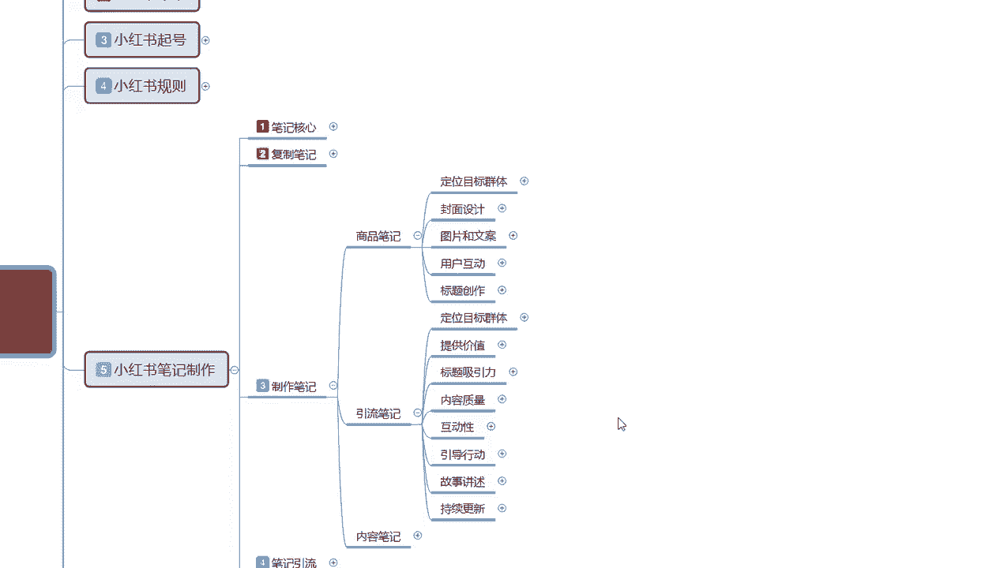
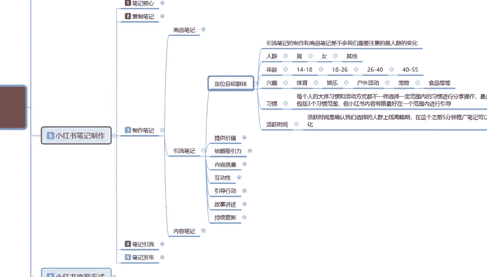
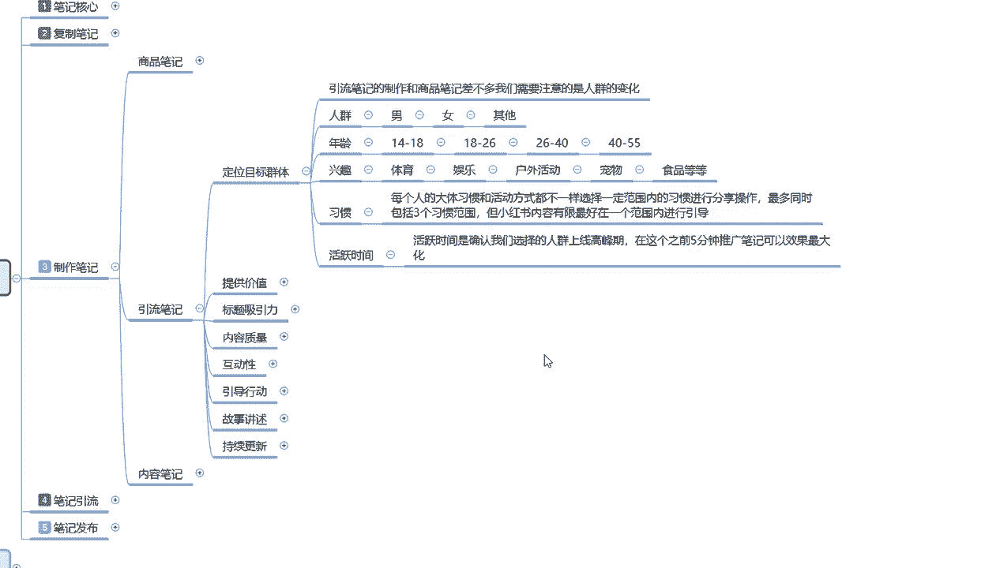

# 2024年做小红书音怎么快速起号？5个步骤轻松起号：找账号-定形式-抄选题-测爆款-复制爆款！ - P27：24、小红书【引流笔记】制作：定位目标群体 - b爱真的需要勇气 - BV1t5HSePEyD

大家好，这一节给大家分享的是小红书全集系列，第五大课时，小红书笔记制作的制作笔记，内容综合我们上一节课啊，已经给大家，把商品笔记整体制作的一个内容和方式啊，包括我们的一个组图和写选词。

已经给大家进行了一个讲解，这节课的话主要就是给大家讲解一下引流笔记。

我们怎么去操作，引流笔记的内容，说实话它显示的是比商品笔记的五个重点要多，但其实它的内容的话是差不多嗯，准确性来说的话，引流笔记的内容会比商品笔记内容少一点，为什么，因为引流笔记的话说。

说实话它和商品笔记共同之处有很多，主要的话就是说让大家了解一下，引流笔记和商品笔记之间的一个不同啊。

首先我们来了解一下什么是引流笔记，引流笔记的话在这个点啊，之前也给大家说过我们的一个笔记核心啊，父子笔记也好，或者其他的也好，因为我现在的话还没给大家讲，主要讲解到三呃，小红书三大的一个主体。

他们都是通过什么方式去操作的啊，这里的话给大家讲解一下引流笔记，首先第一个点也是定位目标群体。

引流笔记的一个定位目标群体啊，引流笔记的制作和商品笔记差不多，我们需要注意的是整体人群的一个变化啊，首先是人群男女，其他年龄性别，这个其实基本上没有太大的一个变化，包括性欲啊，体育娱乐，户外活动。

宠物食品等等啊，他整体的话就是一个习惯，每个人的大体习惯和活动方式他都是不一样，选择一定的范围的一个习惯进行操作，最多同时包括三个范围习惯，但小红书内容有限，最好在一个范围内进行引导，什么意思呢。

我们在选择他的兴趣的时候，啊最多选一个以我们去做引导，这个人群是最精准的，如果说你选了三个，你比方说体育也做，娱乐也多，户外也做，他们三个虽然说有观点对吧，他们三个是有关联的，可以做，但说整体效果的话。

说实话你没有单选一个出来，单做的一个效果好，体育就是体育，娱乐就是娱乐，户外活动就是户外活动，虽然说他们三个有关联，但他们的关联性的话没有那么强啊，最好的话就是选一个范围进行引导，然后活跃时间。

什么叫活跃时间，活跃时间是确认我们选择人群的上限，高峰期在这个之前5分钟推广笔记，可以效果最大化，什么意思呢，就说我们在笔记制作完成以后，我们的引流笔记制作完成以后，多的我就不给大家讲了。

因为上面这些东西的话，其实我已经给大家讲过了，活跃时间的一个发布时间，比小红书笔记发布的话，他有一个审核时间对吧，你这样你的一个属性全部做完以后的话，小红书他综综合的话，他还有一个审核时间。

5分钟之前推广效果是最好的，但是这个时间段我们说实话确实没办法，不是太好的去把握，因为你的小红书笔记做完以后的话，他还有一个时间审核，这个时间审核长的时候能达到几个小时，甚至到一天到两天。

短的时候可能就2分钟到3分钟，所以说这个点的话是非常不好把握的，在这里的话咳，我提醒大家一个点，就是说什么呢，一定要是新的笔记，他才不会出现这个困难的情况，如果说你全是复制的类内容的一个笔记。

我们去操作的话，你根本没办法把握，前5分钟的一个推广笔记时间，这个时间段大家在发布笔记的时候啊，你不管是引流也算也好，商品也好，其他笔记也好，其实都差不多，我们在发布的时候提前半小时去把笔记做好。

提前10分钟开始发布，基本上5分钟左右他都会推广出去，就可以达到在五人群的一个高峰期，前5分钟进行一个引流，10分钟是控点，10分钟以内，他不管是5分钟也好，2分钟也好，10分钟也好。

在这个时间段发现发数据就可以了，就是你的笔记已推出去了，小红书它会有一个强制弹框，懂意思吧，瞧不出他会有一个强制弹框，强制弹框，他的每针对每个人，每个类型，或者说嗯对你的老粉丝，老用户。

对你的关注等等之类，知道你发布了新的一个小红书笔记，让大家对产品也好，对内容也好，对我们的一个话术画本也好，进行了一个下一步了解，它会提升你的一个点击率啊，而且人非常多，但是这个里面有一个点啊。

呃你们需要去卡什么呢，呃高峰期小红书预览高峰期，但是这个里面有一个点啊，他每个人群年龄阶段，他所适用的一个高峰期时间段是不一样的啊，14岁到18岁也好，18岁到26，26~40，40~55。

他每个时间段的一个高峰期，时间段都不一样，你14~18，说实话，这帮人这帮小朋友也好，这帮学生也好啊，这帮无业游民也好，这帮休学的也好，但是你要搞清楚，小红书14~18的也是女性。

只是说他们有可能是不听话的女孩子，那一代她比较追求时尚啊，追求刺激，追求内容，那么他们在这个时间点的话，他们会去上学吗，对吧，你是要吸引学生还是去吸引流浪者，你要去考虑这个18~26。

那么你们要去考虑的是什么呢，是毕业的学生啊，是刚入职没多久的一个员工，毕业一段时间的以后，一个妇女还是家庭主妇，那26~40，那么他们的一个兴趣选择的话，你是要考虑他们是做额结婚没有啊。

这个都是根据产品去选的，或者是根据我们自己体验的一个价值观去选的，你把这些东西选好以后的话，你再对应他们的年龄，下属年龄时间线啊，浏览的高峰期，什么时候有空闲时间可以去玩手机，玩手机才能看小红书。

对不对，玩手机的时候，小红书的主动推广，他的一个广告才能植入进去，你们那我们要推广的时候，你要提前10分钟啊，记得他小红书有一篇我感兴趣的六来了，他才会点进来看，这也是小红书整个平台系统。

他所做的一种操作模式啊，为什么说现在能达到3亿的一个用户量，就是在这个地方他很会把握人心，这个呢就是整体的一个目标定位群体啊，看我们说实话，他和商品比的一个整体目标定位群体的话，其实大差不离。

只是我们那个选择重点不一样好吧，最主要的就是注意一个点活跃时间，你要弄清楚这帮人的活跃时间，然后再去翻引流笔记，引流笔记的话，它不是商品笔记，商品笔记需要去搜索引流笔记，你需要靠什么。

靠小红书平台主动的帮你去推，说说这个点才是最重要的活跃时间，那这一节分享呢就给大家讲到，这主体的内容的话，额让大家进行了解一下，下一节呢给大家讲解一下啊。

