# 2024年做小红书音怎么快速起号？5个步骤轻松起号：找账号-定形式-抄选题-测爆款-复制爆款！ - P2：小红书起号教程 - b爱真的需要勇气 - BV1t5HSePEyD

今天我们跟大家分享的是小红书，从0~1系列对标账号的筛选与运用，那么我接下来要讲的内容还是老规矩，都是一线的实战干货啊，我们大概预计花费一个小时跟大家做分享完毕，那么我们整个分四个板块去做一个分享。

第一个是了解对标账号，第二个呢是如何找到对标账号，第三个是如何运用对标账号，以及有效对标与无效对标，那我刚刚问了大家啊，我们怎么什么是对标账号啊，有一个人回答了说同赛道数据好能复制的。

那这个答案是否正确呢。

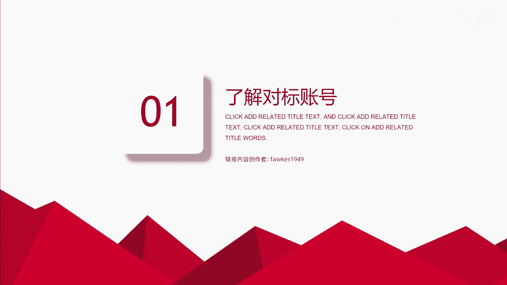

我们往后看啊，其实对标账号是什么啊，在我看来，对标账号其实是分狭义的理解和广义的理解，对标账号狭义的理解就是，未来你希望做成什么样的一个账号，给自己一个参考方向，一个前行的一个参照物。

那对标账号的广义理解呢，就是只要是账号内容，能够辅佐你来做出未来运营决策的，都可以作为对标账号，只是说广义的对标账号，你可能参考借鉴的是它的一个选题，一个标题，或者是他变现方式啊。

甚至引导客户添加你私欲的方式，那我们来看一个例子啊，为什么说我们要找对标账号，我们从学习美术到学习音乐啊，不管你学任何一种艺术，基本上啊临摹是第一步，我们可以看到啊，在美术学习的这个过程中啊。

像我就是学美术出身的啊，那这个呢就是美术生可能都画过的，一个大卫的一个头像，那我们发现一个事情啊，你们觉得一号大卫，2号大卫和3号大卫谁画的更好呢，123谁画的更好呢，所以我们会发现说，当你把大卫做成。

当成一个对标的一个头像去做的话，作为一个产品的话，有的人画出来是一号的样子，有的人画出来是2号的样子，有的人画出来是3号的样子，那么在这个过程中啊，在这个过程中，每个人本身他对艺术的一种感觉。

对产品的描述出来的形式就不一样，那也就意味着是什么，我们根据不同的描述，也可以选择2号，也可以学习一个3号，所以学习是最快的方式啊，那我们再往后看，那么什么叫广义的一个对标呢。

就像我们刚刚看到大卫一样啊，相同的一个大卫石膏，像不同的人画出不同的样子，那相同的产品，不同的人写出来的笔记给人的感觉也是不同的，那我们再看到偏狭义的一个对标啊，还是一个石石膏像，但是你会发现不同的人。

他的创作手法开始发生了区别，一号大卫它使用的是素描方式，2号大卫他使用的是油画方式，3号大卫他使用的是雕塑，二次创造的方式，所以相同的产品，不同人的展示方式也是不同的，那我们对账号的广义理解是什么呢。

再确定一下啊，就是对标账号的管理理解，就是内容能够辅助做，辅助自己做出未来运营决策的，它可能是标题，可能是选题，也可能是变现方式等参考，那像我们现在啊所看到的右边的这个图片。

就是我在小红书网页版搜索芒果啊，搜索出来的一些内容，那这个图片我第一眼我就发现了它的奥秘，我不知道你们有没有人感觉到啊，就是这一个一号内容，这一个2号内容和这一个3号内容，它都属于数据很好的内容。

一个3。7万点赞，一个4万点赞，一个3。3万点赞，而且他们表达的内容形式是一样的，就是吃芒果用什么样的一个方式是超级好用的，让我们再往后看啊，你会发现说这三篇笔记啊，他数据都很好。

而且他都只是讲用勺子吃芒果的这种方式，那我们可以看到这一篇笔记啊，3。7万的点赞，他是什么时候发布的呢，是4月19号啊，22年的4月19号，那这一篇笔记呢右边的这篇呢，它是22年5月18号发布的啊。

他的数据呢是4万的一个点赞，那我们再来看一下这一篇左边的笔记啊，是22年4月9号发布的，他是3。3万点赞，那么在这一篇笔记中，我们可以发现说他这这个作者艾特出来了，真正的原创，第一个发现这个方法的人啊。

他是22年的3月20号啊，他的数据是1。2万点赞，那我们发现说一个芒果的内容啊，被一个素人他发现了，但是被有敏锐的创作者进行了二次三次创作，拿到了不错的数据，那我们来看一下这四个人的数据结果啊。

一号发现这个就第一个发出芒果，可以用勺子吃啊，用用勺子吃芒果，比切芒果切盘要更加的方便快捷的人啊，他是38个粉丝，那么二次创作的啊，有的是138粉丝啊，有的是10万粉丝啊，有的是5。4万粉丝。

所以当我把芒果的这个事情拎出来之后，你们现在能够理解什么是一个基础的，一个对标了吗，啊芒果的这个案例就是在告诉大家，账号内容能够辅助自己做出未来的运营决策，可能是标题选题或者变现方式，那我们可以看到啊。

这四篇数据都很好的，内容中原创内容的标题是吃芒果的正确方式，那二次创造用的是终于找到芒果的正确吃法，太开心了啊，以及终于找到了芒果的正确打开方式，和吃芒果方法，超方便实用好用，请问一下这四个人。

他们有借鉴第一个原创的，吃芒果正确方式的这个标题吗，是没有的，对不对，所以他们借鉴的是什么，他们借鉴的是选题，就是我们来分享用勺子吃芒果这件事情，就能获得大量的流量，所以他们借鉴了选题。

那么我们再来看一下，我们切到这个网页版来看一下，来看一下这四个账号的一个实际情况啊。

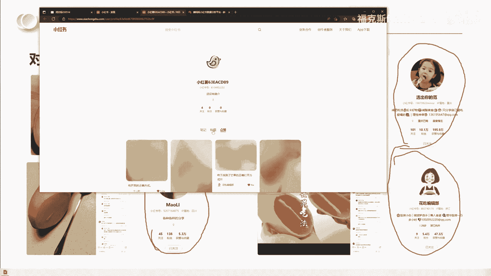

实际情况我告诉大家是什么样的呢，就是真正的原创的人，打他38个粉丝，他发了将近四五十篇笔记，但只有这一篇数据，OK而这一个138粉丝的，他是属于他真的啊，用了他看了他的笔记，他用了他的方法去吃芒果。

他也觉得很好，所以他也发了，但他不是真正的内容创作者，所以他也只有138个粉丝，而右边的这两位他们是真正的做内容的啊，做创作的，他们看懂了这些这个选题的一个数据，的一个有效性和爆发力。

所以他们进行了二次创作，所以他们做到了10万粉丝5万粉丝啊，但是我想问一下大家，吃芒果的，一个用勺子吃芒果的这样的一个方式的分享，他为什么会有这么多的点赞收藏呢，符不符合最开始跟大家说过的真诚分享。

友好互动，我真诚的分享了一个吃芒果的方式，所以我拿到了观众的友好互动好，那我们再来想一下啊，我们为什么要找对标账号呢，几个点啊，第一个点是对标账号，能够有效提供前行的参考方向，第二个对标账号的类型多样。

能够更快给我们找到内容的制作方向，第三个对标账号的数据代表着市场结果，可以提取精华，第四个制作出来的内容有对比，可以找到差距去缩小啊，就像我们前面所看到的大V1样，你有对比，你是去临摹的，有差距。

你就可以去缩小这个差距，但是如果你没有一个参照物，你都不知道你画的好还是不好，那么第五个就是我们可以借鉴选题啊，借鉴封面，借鉴优化思路的一个理解，第六个是依据对标账号的数据表现提取报点啊。

这个接着我们会细细的展开，那么右边有一幅名画啊，是小鸡吃米图，那我们可以看到啊，对标的过程中，我们还可能发现一种情况对吧，就是左边是被对标的啊，右边是我们有一些朋友啊，有一些朋友的一个结果是吧。

这个就变成了什么小鸡啄米图，我想问一下大家，这个叫有效对标吗，这个算对标吗，一个小鸡吃米图，一个小鸡啄米图，所以有对标，就能让你知道你哪个地方没有做好啊，而且大家在后面的一个制内容的创作过程中。

不要轻松的觉得说啊，我做了内容，我的标题跟他是一样的，所以我就能报，你真的看一下你的内容是不是像这两幅画一样，出现了巨大的理解差异，那为什么要们要去做对对标呢，就是第一个啊，从抄袭到超越啊。

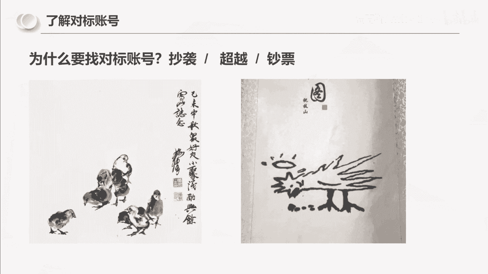

到超票，那么第二个点啊，我们来讲什么呢，讲如何找到对标账号。

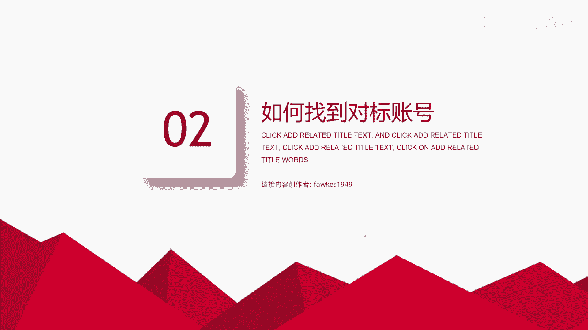

那么对标账的几种收集方式啊，我已经给大家罗列出来了，第一个是关键词查询法，用户名搜索结果，第二个是关键词查询法的笔记搜索结果，第三个是通过数据软件平台筛选，第四个是跨类目对标。

那我们第一个啊来看就是通过关键词的查询法，这个我们一般是用到手机端啊，我们在手机输入童装中啊，我们可以看到用户这一栏啊，可以看到用户这一栏，我们可以看到名字中包含童装的这些账号啊。

可以对它的内容进行进行一个检索，这里我讲一个知识点啊，讲一个知识点就是笔记数与粉丝量的对比，是账号运营能力的体现，是账号运营能力体现，我想问一下大家，A运营啊，100篇笔记增加了1万个粉丝，B运营啊。

500篇笔记增加了1万个粉丝啊，他们的目标用户都是一致的，拿到的目标都是一致，请问是A厉害还是B厉害，A厉害还是B厉害，好，我再跟大家强调一下啊，今天的知识点啊。

比技术与粉丝量的对比是账号运营能力的体现，所以我们在研究账号的过程中，我们尽可能多去看一下，他是如何通过少量的笔记来做到更多的粉丝啊，像我对吧，我通过29篇专修笔记做到了1万粉丝。

所以我每篇笔记的增粉量在300以上，那我们接着往下去看啊，对标账号的几种方式的，第二个点是关键词查询法啊，这个我们用网页版的小红书就好了，网页版的小红书啊，在网页版的小红书搜同专。

结果它会有一排关联词的出现啊，关联词出现，那这里有春夏春款啊，公主裙连衣裙，幼儿园穿搭等等啊，它是有关联词的自带关联词，那么通过关联词，我们可以去进一步啊，把童装这个类目进行深化啊，像连衣裙对吧。

会出现这么多的内容，像公主裙啊，又会出现公主群的一些笔记内容，那么第三种啊，我们对标账号的一个收集方式是什么呢，是通过数据软件平台进行一个筛选，好像数据软件里他们可以筛选博主，筛选笔记。

筛选实时的一个笔记版，低粉报文版啊，以及商品的七天15天的一个销量排行榜，这是第三种对标账号的收集方式，第四种对标的一个设计方式呢，它是跨类目的一个对标啊，我们借鉴的是标题是封面，是选题。

是运营方式甚至导流方式啊，这个我不具体展开，但是我们实际上是可以做到跨类目对标的啊，举个例子，我们看到这一篇笔记啊，它的标题是澄海玩具还比1688便宜，你敢相信吗，我想问一下大家啊，我们跨类目对标啊。

我们觉得这个标题很好的情况下，我们怎么样去写一篇母婴的标题，我再把这个标题念一遍，你们去构思一下怎么样去写母婴童装的标题，打在评论区好吗，他的这个标题是澄海玩具还比1688便宜，你敢相信吗。

大家思考一下啊，我们借鉴这一个标题的手法，去写一篇母音的标题，好这一篇标题是什么，是澄海玩具，还比1688便宜，你敢相信吗，那同理，我们是不是可以把澄海玩具这个词换掉啊，变成叉叉同砖啊。

还比1688便宜，你敢相信吗啊比如说这个啊，第二个这一个标题我们可以看到啊，这个标题是啥，是顺德本地人分享不踩雷系列啊，荣桂美食篇，那如果说我们觉得这个标题很好，我们把它对标到我们的母婴账号去做。

那就可以是什么，就是不是他的他这个标题的吸引人的点在哪里，在顺德本本地人分享啊，我不是美食达人啊，我不是乱七八糟带的啊，带货博主，我是本地人，分享让人天生觉得更真诚，那我们把这个标题套进去。

就变成了什么什么样的身份更真诚呢，比如说是童装对吧，那可能就是啊，童装啊或者叫童装产二代是吧，分享啊不踩雷系列，或者说10年童装人啊，分享不踩雷系列，他这个叫荣贵美食篇，那我们就可以说衣服材质篇啊。

这也是属于跨类目的，一个跨类目的一个对标和借鉴，那包括像这一篇笔记啊，4000多的点赞薅羊毛啦，1688婴童服装同源工厂便宜这么多啊，所以我们通过一些对标账号，可以是同赛道对标，也可以是差异的对标。

我们都可以给自己提供一个灵感，所以对标账户能够给大家提供更多的信息，为什么我们要通过对标账号，是因为什么，是因为实际上90%的事情，其实都有人想到要怎么做了，而90%的方法都已经有人在做了。

所以你们90%问题的答案，其实都在对标账号里，我问一下大家，童装有几种卖法，通过小红书是不是可以通过店铺挂车，是不是可以通过店铺引流，是不是可以通过群营销啊，我们把群插件对吧，上次跟大家讲解了。

所以说那我就看到了这个牧童妈妈童装，他都已经到第九个群了，而且有358人了，那我们是不是可以通过这个账号去加入他的群，去看他是怎么在群做成交的，同样的在陈先生童装供应链这个账号里啊，他有一篇置顶的笔记。

打开是这样的，就是这一张图啊，这这其实这个就是他的笔记内容，这个就是他一篇的笔记内容，这个不是他主页啊，这已经是他一篇笔记内容，他就画了一个圈，很多人找不到我们字母加数字，这个就是我们的朋友圈。

那这是不是通过主页置顶笔记啊，导流的一种方式，所以90%的答案其实都在对标账号里，那么对标账的使用意义啊，我们再来跟大家灌输一遍啊，接下来我们会继续让你们更深入的一个理解啊，第一个。

对标账号能够有效提供前行的参考方向啊，就是你的账号要怎么做，对标账的类型多样，能够更快的让我们找到制作方向，第三个对标账号的数据代表着市场结果，可以提取内容精华，第四个制作出来的内容有对比。

可以找到差距去缩小啊，第五个借鉴封面选题优化思路的理解，以及提取包点，那么综合用一句话来说啊，对标账号的使用意义是什么，对标账号的使用意义是让我们从偶然的，从偶然性的数据中找到必然性的规律。

大家把这句话打在评论上好吧，大家把这话打到评论区，加强你们的对这个知识的一个系数啊，从偶然性数据中找到必然性规律，大家把这句话打在评论区好吗，从偶然性数据中找到必然性规律。

为什么我们要从偶然性的一个数据中去，找到必然性的规律呢，是为了抬高笔记的数据下限，抬高笔记的数据下限，我们的笔记能否获得几千点赞甚至几万点赞，甚至上10万的点赞互动，这个是需要运气的。

但是你把你的笔记下限抬到几十个点赞，是可以通过自己的运营技巧和找对标，去完全实现的，所以我们找对标是从偶然性的数据中，找到必然性的规律，从而抬高笔记的数据下限，那么对标账号的一个学习收集习惯啊。

这里我跟大家分享一下，也是我自己把29篇笔记，做到1万粉丝所在用的一个方法，第一个动作是，同专，那你们通过刚刚所说的对标账号的寻找方式，找到你们觉得优秀的账号，关注他，关注它的作用是什么呢。

是你可以定时翻阅账号主页，查看是否有豹纹出现，趁热打铁，还记得刚刚那个芒果吗，从3月19号到4月20号到，4月20几号到5月份，连续四篇笔记全都爆了，但是如果是你们去分享芒果，有多少人能想到。

从芒果的用勺子吃芒果这种体验，翻出去创作内容呢，根本想不到，但是我们如果看到了别人这样的方式，他爆了，我们能不能赶紧去尝试做二次创作是可以的，所以说我们是定时翻阅账号主页，查看是否有豹纹出现，趁热打铁。

这是第一个动作啊，关注10~20个学习账号啊，定期去翻它的内容，如果他有很好的表现形式，创意方式，赶紧趁热打铁，第二个动作是什么，是在你们的小红书收藏里面，建立至少三个专辑文件夹。

建立三个专辑文件夹分别是什么，是标题灵感，标题灵感以及封面样式，封面样式啊，还有选题方向，选题方向啊，我问一下大家，你们觉得标题封面和选题这三个哪个重要，打在评论区好吗。

标题封面和选题这三个你们觉得哪个重要啊，我建议大家啊，建在自己的这个小红书的收藏夹里，建立至少三个专辑文件夹啊，分别是选题封面以及标题，因为优秀的内容数据，好的内容它本身就是市场检验出来的结果。

所以我们把好的东西的灵魂提取出来了，用在我们自己的身上，会让自己更快拿到结果，所以我们将日常刷到的笔记，有收获的进行分类就好了，不一定是要你做的类目，不一定是要你做的类目，明白吧，好那有人我看了一下啊。

有60%的人啊，认为封面重要，有20%的人认为标题重要啊，然后没有人认为选题重要啊，实际上我告诉大家啊，这三个其实都挺重要啊，都挺重要，当然按照小红书的推流逻辑，因为它不像抖音，他推荐一篇内容。

它会自动播放，它封面是推荐四篇笔记对吧，小红书的封面是推荐四篇笔记，所以我们必须把标题和U封面优化好，人家才会点进来，在你标题和封面没有优化好之前，那人家可能都不会打开这篇笔记了。

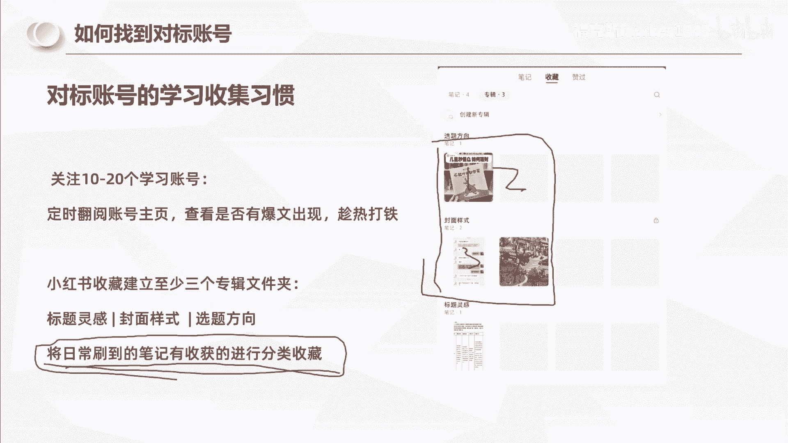

那我们第三个啊，我们来说什么呢。

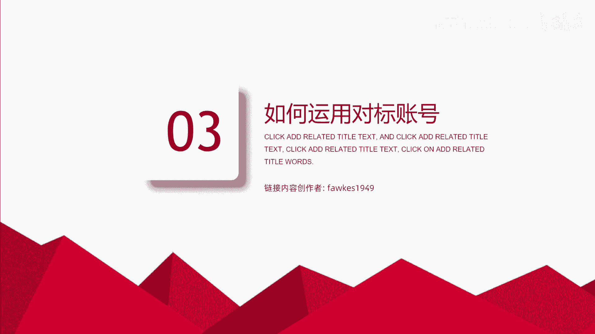

来说我们如何运用对标账号，运用对标账号，对标账号的灵活运用啊，这个地方我希望跟大家去共同创作啊，那我先告诉大家什么叫对标账号，什么叫对标账号的借鉴形式，那么如何运用对标账号呢。

我们要想把这个对标账号运用好，首先我们要知道怎么去分类啊，所以我们要找到合理的账号归类方式，找到多角度的表达方式，找到多身份的表达方式，最终找到适合自己的账号定位和表达方式，那这里啊我们来以童装举例。

以童装举例啊，找到合理的账号归类方式，我能想到的啊，比如说我们是可以按照展现场景去分类的，比如说我们去搜同专或者公主裙啊，等等一系列关键词，它出现的内容，我们是不是可以给他做一个场景的分类。

这一篇内容它是在室内拍摄的，还是室外拍摄的啊，第二个我们是不是可以做第二个分类，是他是有模特的还是无模特的啊，还有什么分类方式吗，大家想一下啊，大家动动脑筋，因为你们学会怎么去梳理账号。

怎么样去搭建这个账号的分类方式，当你知道怎么分类了，你就知道怎么样去看别人报的内容，那你知道怎么样看别人报的内容，去进行有效分类，那你就知道你的内容和别人的内容差在哪里，明白吗，所以我们第二个。

我们可以找到多角度的表达方式，第三个是什么，找到多身份的表达方式啊，比如说爸爸妈妈啊，这篇笔记的一个，发布这篇笔记的人是爸爸还是妈妈，还是外婆还是爷爷啊，或者说甚至是后妈，是不是，那我想问一下大家。

如果你们去发童装的内容，你们会选择什么方式去发布呢，是用妈妈我给孩子买了一件啊心爱的童装，还是说，作为后妈，我给孩子买六块九的衣服有错吗，还是说作为爷爷爷爷提前啊，孩子还没生爷爷就就已经把衣服买回来了。

你们觉得我刚刚的这三个方式哪个更吸引人啊，你们觉得我干的三个方式，后妈给孩子买一件有六块九的衣服有错吗啊，或者说我们能不能用，用其他的身份去做这样的一件事情，大家还记得一个有趣的故事吧。

有一个这个小朋友啊，拾金不昧啊，送给了警察叔叔啊，作业是不是，所以啊不同的内容你们看到之后，创作者的身份，他们可以进行一个分类啊，账号的展现形式可以分类，同样的啊。

像刚刚也有人在评论区说到产品做成九宫格啊，进行一个拼图，那这是不是属于一个表达方式的分类呢，那我们现在啊有人说了啊，我们可以通过九宫格分类，还有没有更多的方式想一下，肯定是有的，有方是一九宫格。

有方式二有方式三啊，有方是四九宫格，算是一种分类，对不对，那同样的，比如说我们在货架上展示货架，货架啊，以及以及戴老师说过的啊，我们去门店，对不对，戴老师不是说过，我们直接去合适的朋友的。

这个童装的门店去拍摄素材，是不是一种表达方式啊，以及什么，甚至仓库是不是等等等等，所以你们要知道怎么样去运用对标账号，首先你们要学会分类，然后你们就会发现有的身份，有的表现形式和有的展现场景。

他是天生有流量的，能理解吧，理解理解打个理解好吗，我打个666好吗，有收获，打个666好吗，有收获，打个666，我喝口水啊，那么这个地方，我带大家啊，我们去实际运用一下怎么样去寻找到对标账号。

来啊我们先讲先讲首先看一下啊，这个是手机端啊，比如说我们通过手机端搜同专啊，我们可以看到在用户端啊。

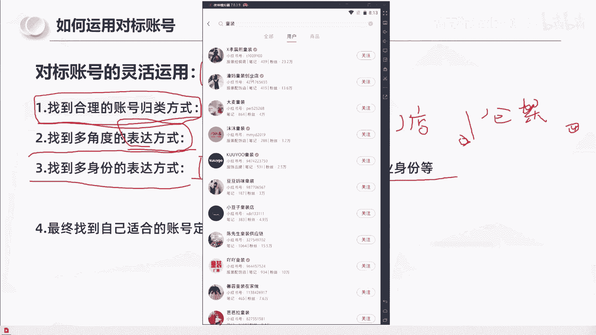

我们可以看到第一个账号他是400篇笔记。

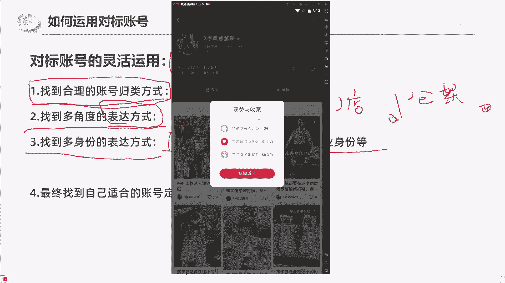

23万粉丝，每篇大概增长了600笔记啊，这个地方我把这个屏幕给大家拉大一点。

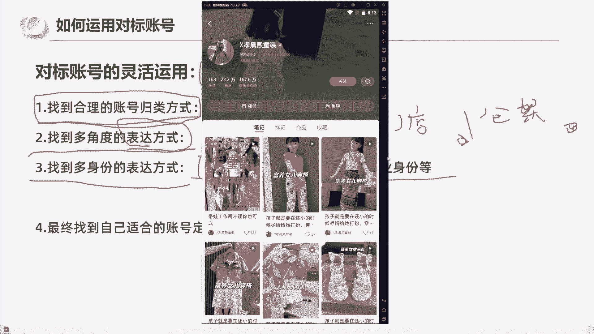

好你可以看到这一个这一个账号的数据啊，怎么样还可以啊，还可以啊，那么你发现没有，他用了他的这个内容啊，有一个共性，我不知道大家发现没有，就是他的所有的内容，他的封面都加了一句话，叫富养女儿穿搭。

富养女儿穿搭。

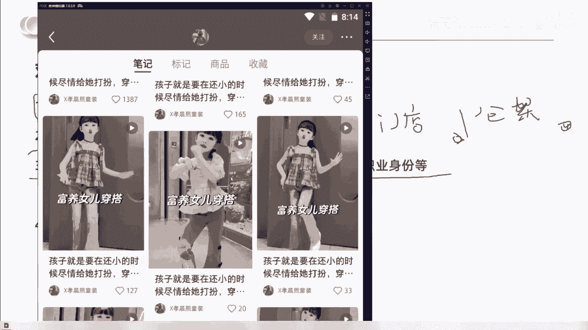

看到没有好，那我问一下大家啊。

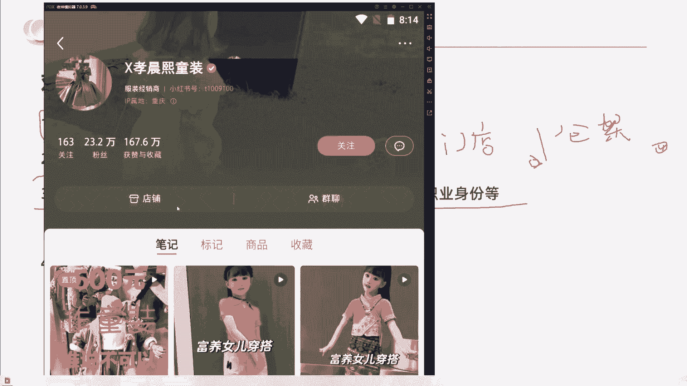

这些内容的展现形式是不是不一样的对吧。

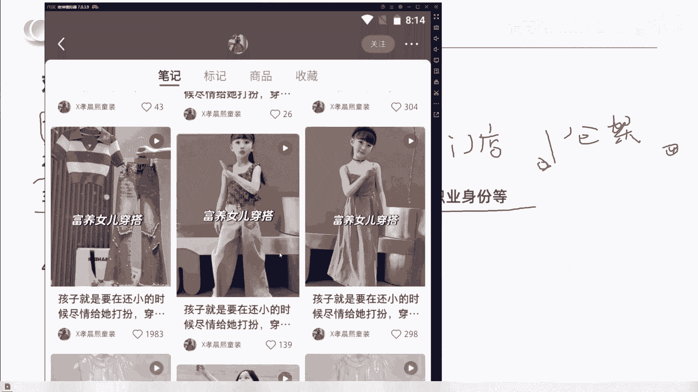

这个属于什么场景，这个属于我们来看一下什么场景啊。

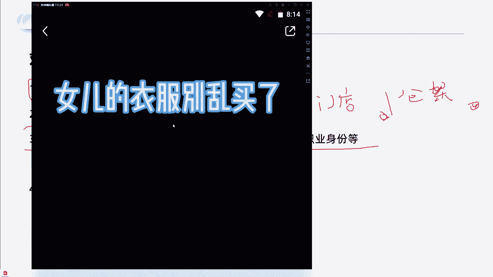

女儿的衣服别乱买了，这里都是整套搭配好的，喜欢就收藏关注吧，不然刷着刷着就不见了。

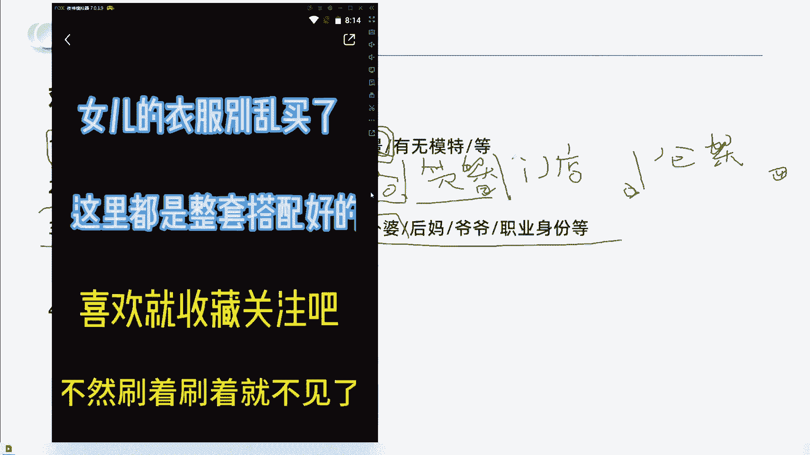

我的世界缤纷，这个属于室内，对不对。

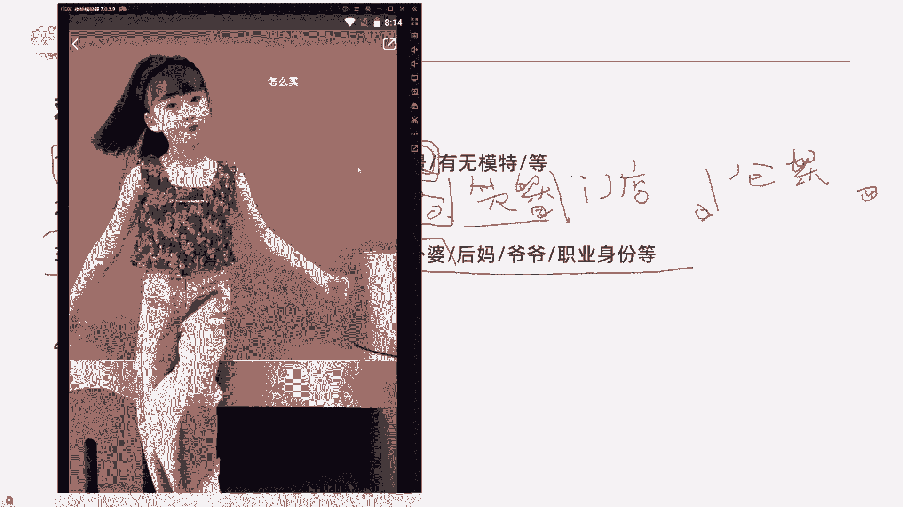

室内啊模特啊混剪，室内模特混剪，那么这个属于什么女儿的衣服。

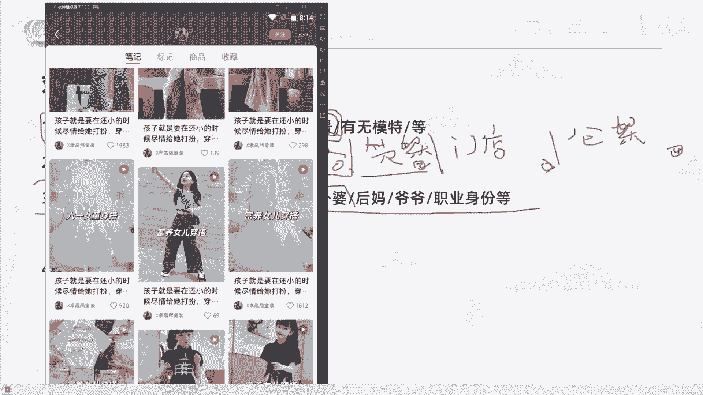

别乱买了，这里都是整套都挺好的。

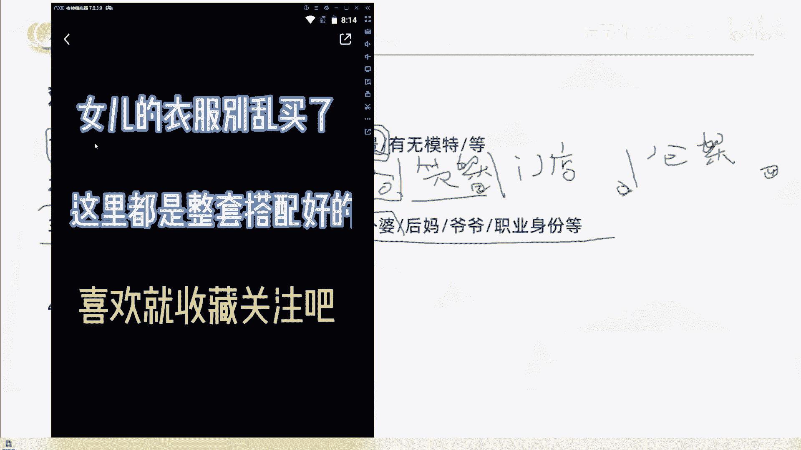

喜欢就是前面啊，还加了一段就不见了，这个属于什么，室内没有模特啊合集，室内没有模特合集。

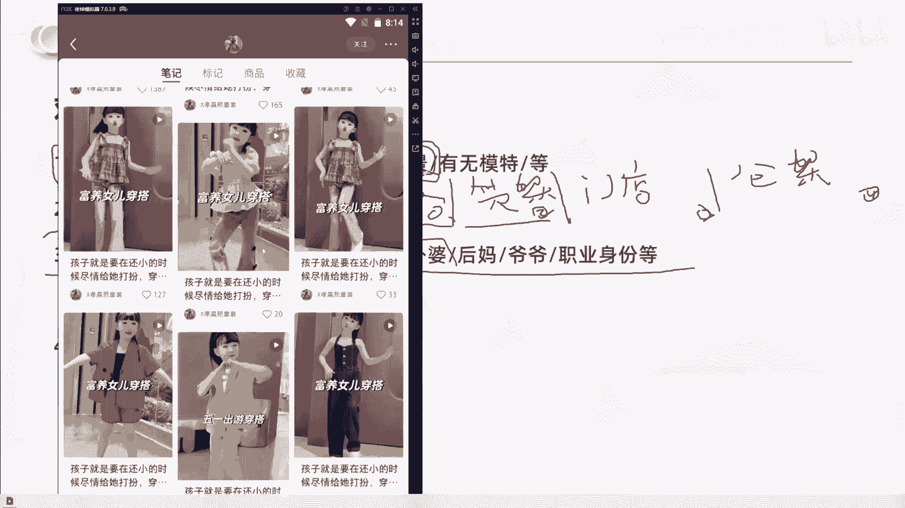

好这是一个账号啊，那我想问一下大家，你们在看这个账号的过程中，你能你们能告诉我是有模特的数据好，还是没模特的数据好吗，我带大家看一下这个账号啊，我们怎么去看账号，看一下大家啊。

就是要当我们去分析一个账号，我们就要看他数据高的内容，数据高的内容啊，像他这种账号，那就以以其1000啊，大几百为单位，这是我们看到的一篇啊，1200点赞的内容，这是有模特的对吧，而且是亲子专啊。

这里有篇4000的，这里有篇5000的，这个是什么啊，也是有模特的啊，而且他的标题还很重复，孩子就是要在还小的时候尽情给她打扮啊，这里一句话，富养女儿穿搭，好这有一篇1000的，看到没有。

他也用了同样的一句话，孩子就要在还小的时候尽情给她打扮，接着看我们看上千的内容啊。

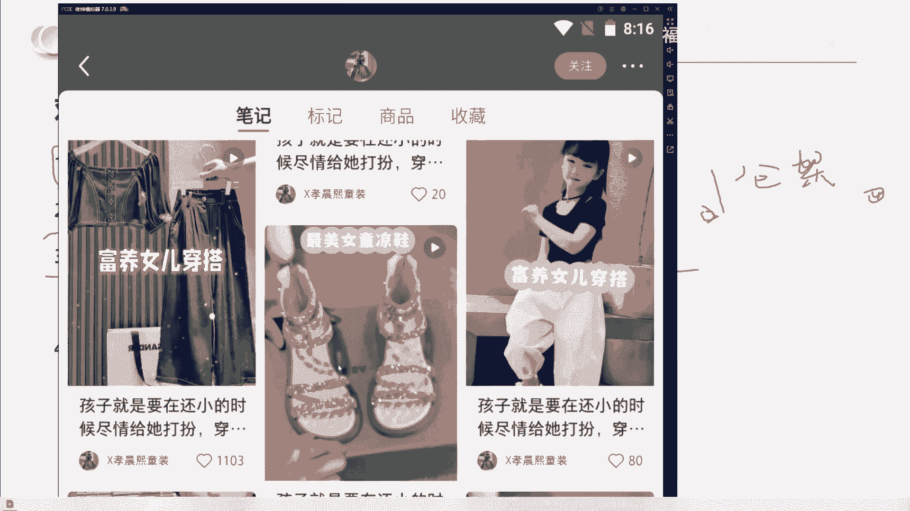

这个也上千了，然后这个呢就左边这个啊，他是这个也是属于应该是模特没有出镜的啊，这个封面是没有出镜的，好看到没有诶，这个地方看到没有，它是不是测试了一个什么情况，他测试了用虚拟卡通人物做封面，看到没有。

所以我们的出镜方式除了有人真人无人，还有什么，还有虚拟卡通，之前有人想到过虚拟卡通形象吗，是不是，那你会发现说他做了尝试，只是他的尝试结果怎么样不好啊，一个16个点赞，一个20个点赞。

那我们继续往后看啊，这两篇也是一样的，用的虚拟卡通人物100多点赞啊，七个点赞，所以从他这个数据啊，我们可以看出来虚拟卡通人物。

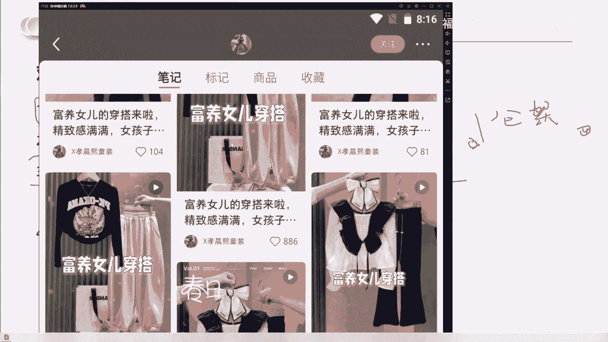

至少他测试的结果啊是放弃了，那我们再看一下这篇1000多点赞的，又是属于什么，属于真人出镜对吧，真人出镜，所以从目前这个账号的数据，我们能看出什么东西，就是他尝试了虚拟人物出镜。

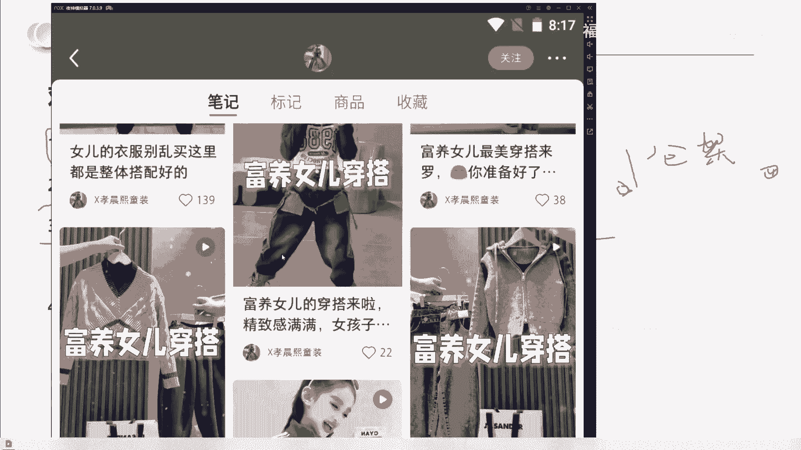

然后虚拟人物并没有拿到很好的数据，然后他一直在用富养女儿穿搭这六个字做内容，以及什么啊，以及尝试着人物出镜和成人物不出镜，那么根据数据比较好的笔记，我们可以发现啊，像这一篇4693个点赞。

他也是人物出镜，所以我问一下大家，是人物出镜的数据更好，出镜数据更好还是不出镜数据更好，出镜还是不出镜啊。

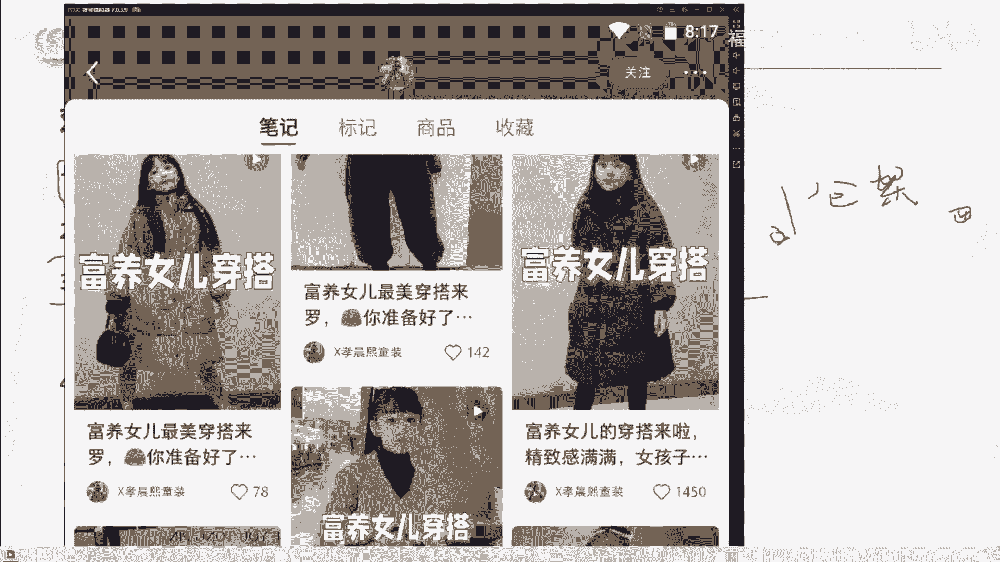

把你们的答案打在评论区好吗，像这个1450个点赞啊，是这个小朋友啊，穿的这个衣服是出境数据更好，还是不出境数据更好，出境还是不出境啊，所以你们要通过分析对标账号去归类啊，归类找结果。

找自己的一个内容方向，同样的我想告诉大家啊，其实这个人物他也是还有区分的。

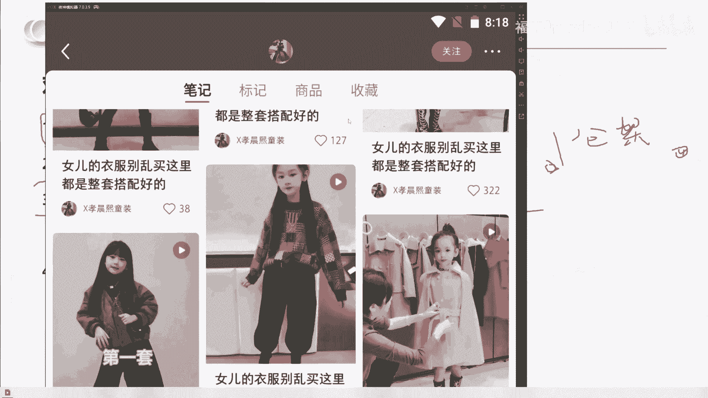

有的人物他有素人感，有的人物是模特感啊，所以也是我们可以去区分的，那这个账号我们就看到这里，我们再看第二个账号啊，这个账号是13。6万粉丝啊。

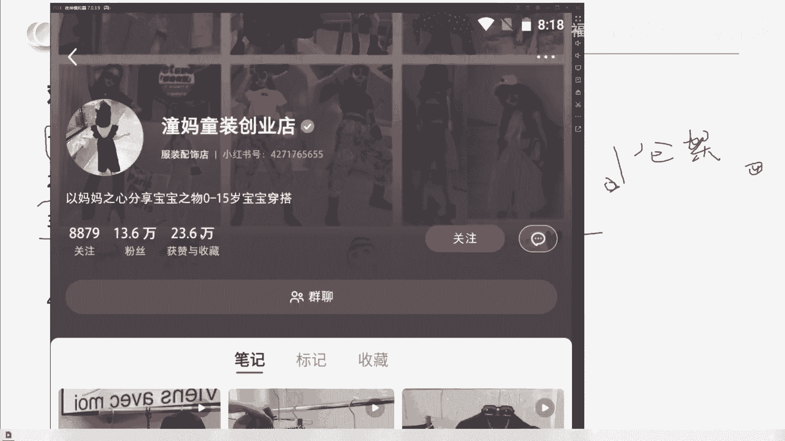

他总共是我看下多少篇内容啊。

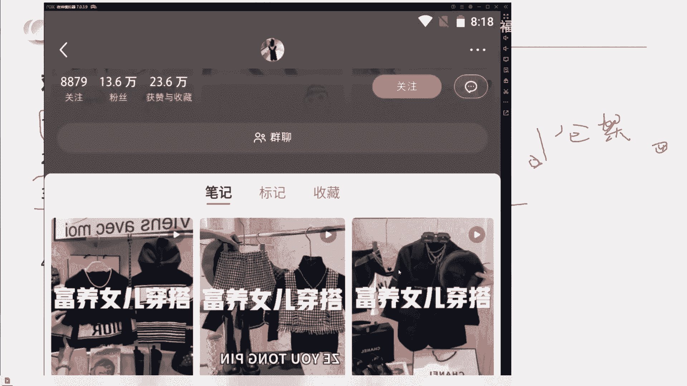

这个账号叫做童妈啊，女装童装创业店415篇笔记啊，13。6万粉丝，我们来看一下他的账号数据，他也是一样的，他用了富养女儿穿搭，看到没有，看到没有，大家这两家店啊，首先搜到两家店。

他们都把富养女儿穿搭放在了首页，我想问一下大家，这个是不是规律，是不是运营的规律，他们能做到十几20万粉丝，他们每一篇都把富养女儿川大打在封面上，是不是规律，是不是规律，那我想问一下大家。

你们知道富养女儿穿搭这六个字，打在这个封面上还有一个什么好处吗，她吸引什么人群，他吸引的是舍得为孩子花钱的人群，她是舍得为孩子花钱的人群，对不对，因为我是富养女儿，我不是穷养女儿。

所以它能吸引的就是舍得为孩子花钱的人群，我们可以看到他的内容啊，我们现在也在往下刷啊，比如说我们可以看到说4000多点赞的，这一篇笔记啊，他是孩子出镜啊，然后我们再往上看啊，像这两篇他是属于大人出境啊。

大人出境的数据就没有上千，我们再来看这个2600点赞啊，这个目前从封面上看没有人物出镜，这个8000点赞的看一下啊，这个是小朋友出镜，对不对，那你有没有发现一个点，就是他们的这个所谓的小朋友的模特。

其实她打扮出来是有一种高级感和精致感的，我觉得这个穿搭已经是不是传统的那种，小朋友的穿搭了，那么我们再看到右边这一篇，1212点赞的，他也是大人出镜，还是小孩出镜啊，大人出镜的数据更还是小数据更好。

那我们可以看到啊，这个1443，最右边这个啊富养女儿穿搭啊，她也是富养女儿穿搭，那中间的亲子装啊，数据没有更好，所以我们可以通过别人的数据，通过他们最爆的内容去看到我们的内容方向，是双人出镜还是儿子出。

儿童，孩子出镜还是母亲出镜，像这一篇六百九十九六百九百六十九点赞的，又是小朋友出镜啊，那我们是不是还可以做一个归类啊，比如说现在的三篇笔记中，这一篇它是属于一个户外场景，看到没有。

他应该是在类似于一个大堂前台的地方，这样一个充电宝，那我们是不是还可以去进行数据分析。

他究竟是在户外的表现数据好，还是室内的数据表现好，就是我们是在一个随机的场景数据好，还是在一个刻意的数据好啊，你像他也在尝试看到没有，像右边这个戴眼镜的这个笔记，他是在户外的一个停车场的场景中。

啊看到没有，1619点赞啊，他是在户外的一个场景中下雪啊，他这两篇笔记你们不要看啊。

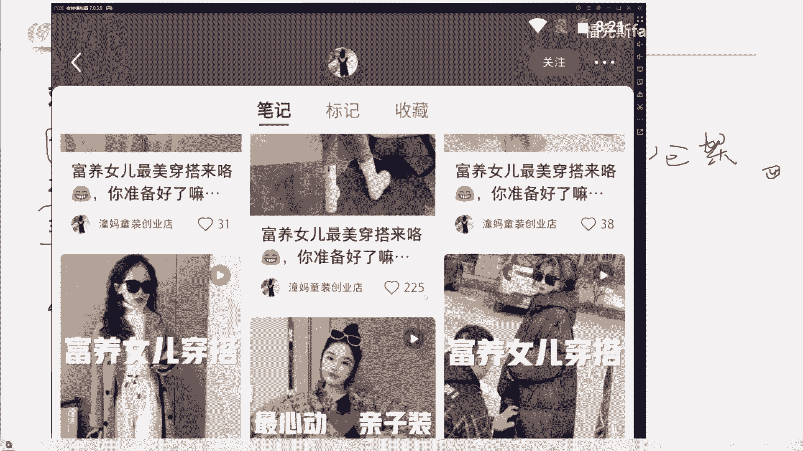

你们不要看这个笔记，只看数据，只看标题，这一篇458点赞的啊，爸爸给孩子穿衣服，和这个1619点赞的，爸爸给孩子穿衣服，我想问一下大家，爸爸给孩子穿衣服，这个动作爸爸被拍进去，他是有意的还是无意的。

大家打在评论区是有意的还是无意的。

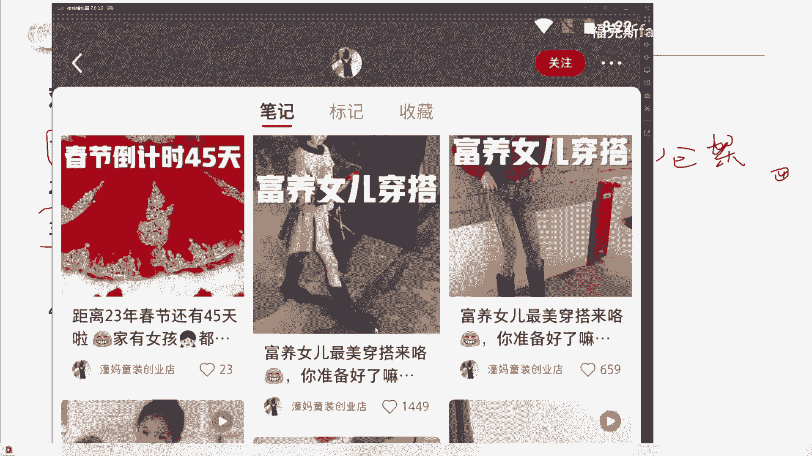

我们再继续看一下啊，啊包括这个啊，大家意识到没有，是有益的，因为在户外的环境中，爸爸给孩子穿衣服，这一张照片是比你在服装店，你穿好，站在那里像模特一样拍照，是更有场景感和真实感的。

所以这个运营其实我觉得它是一流的运营，它能够捕捉到我刚才所说的分类的场景的差异，那包括这一章啊，是小朋友也是在大胆走路的一个姿势，那我想问一下大家，这个是什么区别。

这个是不是动态动态封面和静态封面的区别，因为这个人物是明显拿着手机往前走，他是没有那种刻意感的，这是一个动态图，那我们再往往往往继续看，看到没有，这个1403的这个中间的这个笔记。

他是不是小朋友在等电梯的一个照片，它也是人往前走，所以这也是一个动态图，动态图啊，包括像这两篇啊，看到没有，他又报了一篇数据很好的，2700的，他是怎么报的，他是，拿着衣服，妈妈拿着衣服。

这个衣服没有挂在架子上啊，就是有一双女人的手拿着这件衣服，这是不是一种表达方式，是不是一个场景，有人物衔接的关系，在挑衣服的关系，那么他报了一篇2790的笔记之后，他又继续拍了一篇。

就是有人物在旁边准备取衣服的这个动态，所以所有的数据，好的内容都是值得你去仔细分析的，他是什么样的场景，它是有人还是没有人啊，他配了什么样的道具，他出了手没有出手，它是静态的还是动态的啊。

大家我问一下大家有没有收获，今天有没有收获，有收获打个有好吗，有收获打个有啊，所以我带大家，我们实实在在的去看别人的账号。

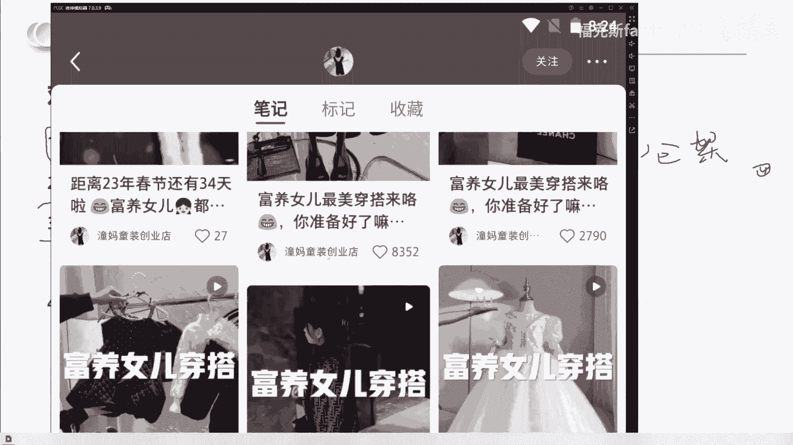

到底什么叫做对标。

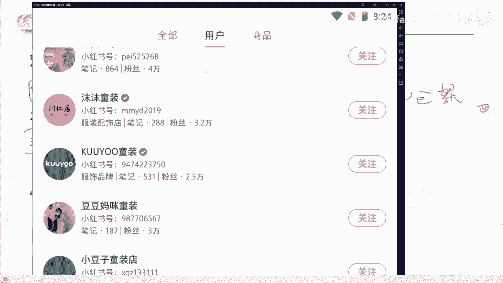

什么叫做对标，那我想问一下大家，像这种啊，像这种账号我们都可以看到，这种就属于什么无模特静态在服装店内拍的，我想问一下大家，他的数据好吗，他的数据好吗，知道为什么要找对标吗，知道为什么要找对标吗。

啊包括有人提到的合集合集就一定数据好吗啊。

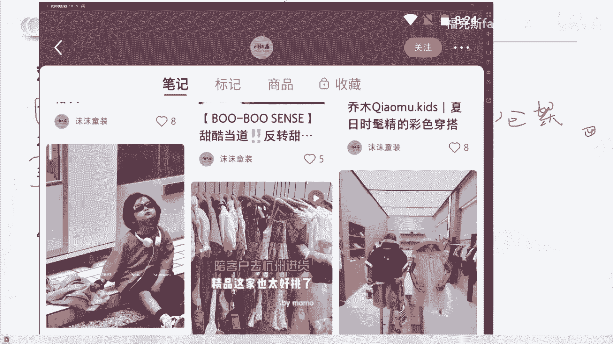

所以实际上有人刚刚在评论区打了一条弹幕啊，就是这个笑沉啊。

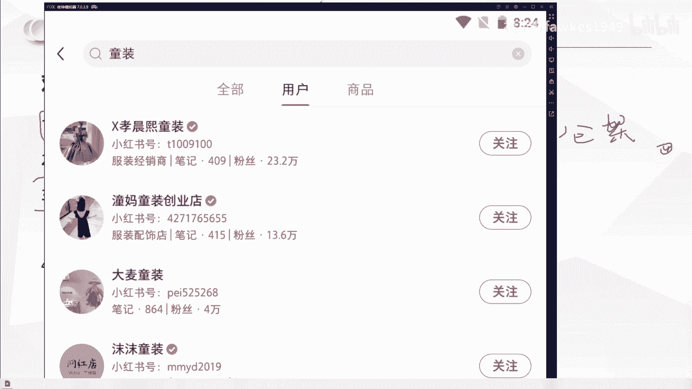

是模仿这个桐妈的哈。

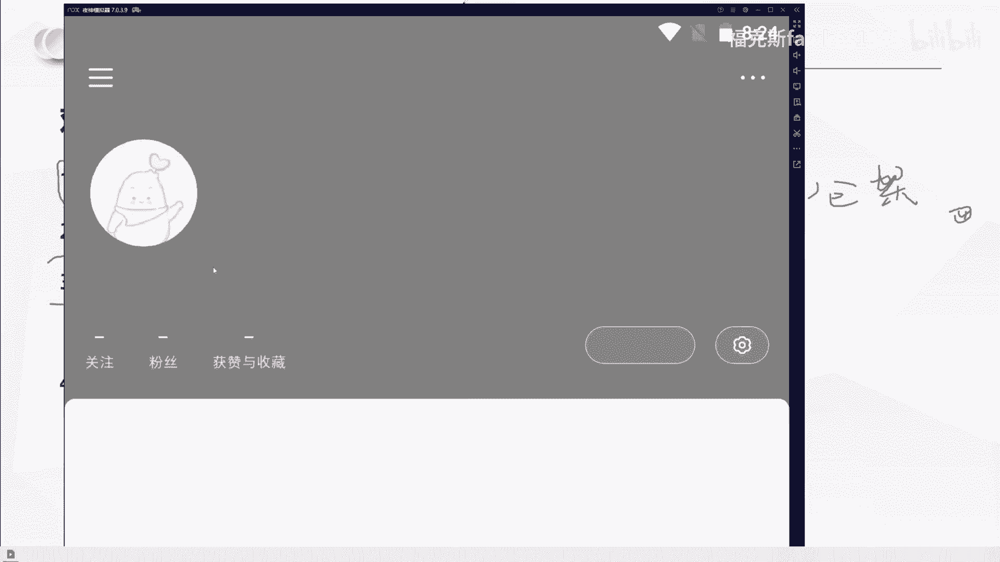

那实际上从运营水平来讲，桐妈的这个账号的运营水平肯定是最高的。

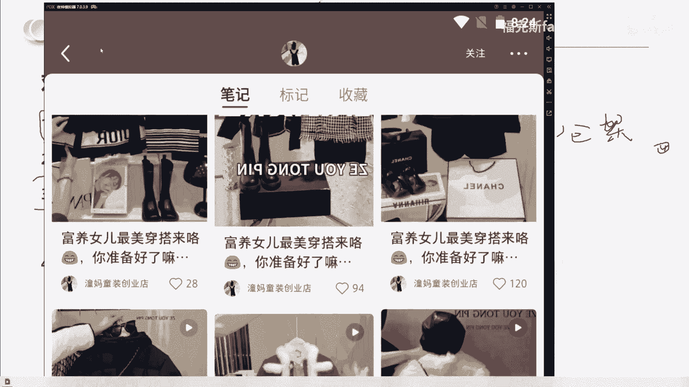

他确实有模仿的嫌疑，但是他模仿他只模仿了一个啥。

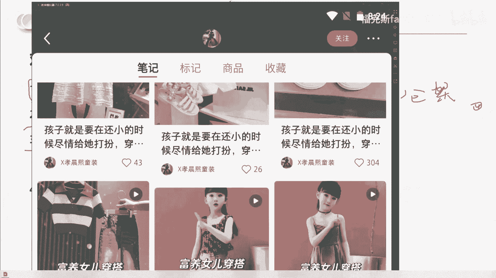

他只模仿了一个标题啊，比如说我要富养女儿穿搭，她没有学，真正的去把同妈的一些所有的运营思路给理解，没有像童妈一样去做多个角度的尝试，它所有的场景基本上都是在服装店里拍摄的。

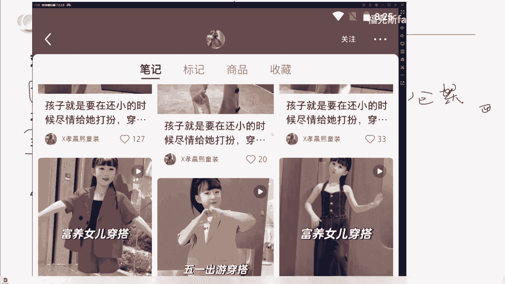

所以他有一种刻意感，而童妈她在干嘛，她一直在尝试是不是跟我当时做我的账号一样。

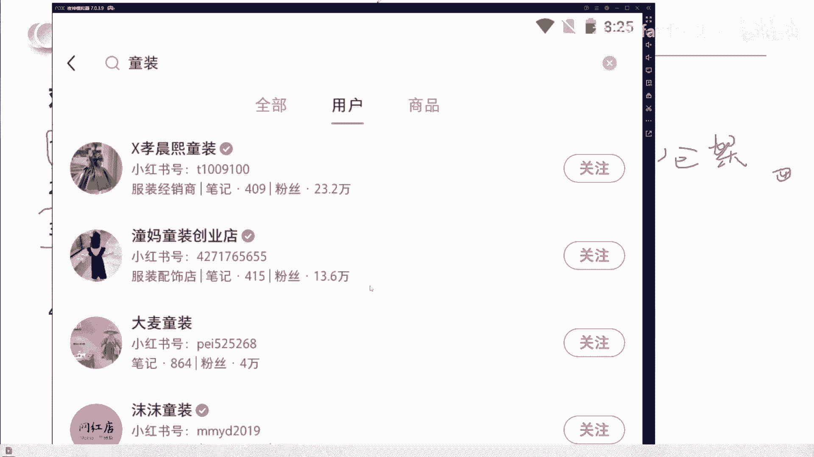

我不会因为说我的数据有400个点赞了哦，我就满意了。

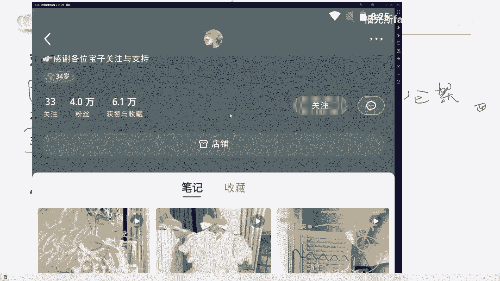

我把我的数据拉到上千点赞，我就满意了，不管怎么样，我们永远在尝试，永远在对标，那这一些账号，当他的数据不好的时候，我们是不是现在能发现原因了，我想问一下大家，为什么这个账号的数据不好。

你们能告诉我原因吗，是真的是因为他的古装风大家不喜欢吗，啊这个账号我觉得他的产品还是非常有特色的，非常有特色的啊。

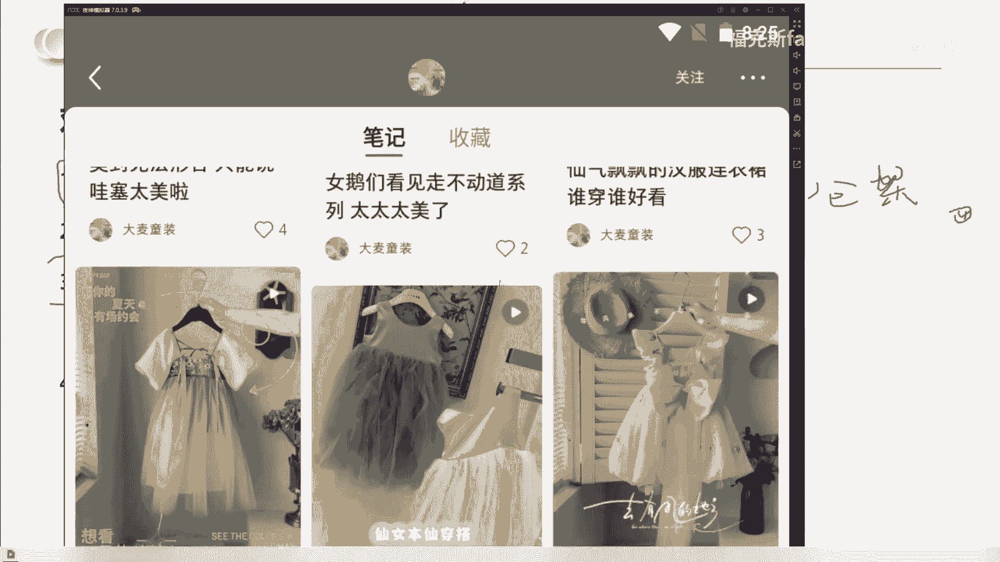

基本上都是属于这种裙子啊。

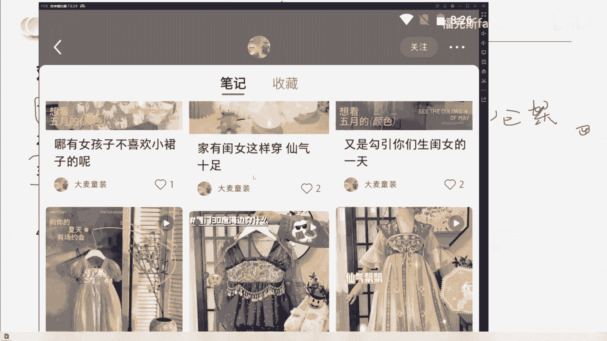

基本上他都是属于群子啊，我想问一下大家。

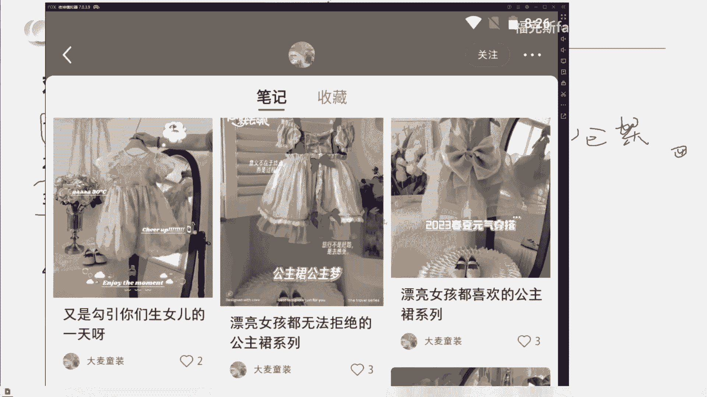

如果是你们这个账号是你们的，你们要怎么优化，现在脑子里有没有思路了，是不是这个人他是在把同样的一个事情啊，做了几十遍上百遍啊，就是把衣服挂在这里拍，他是不是也会有困扰啊，为什么我的数据这么差呀。

为什么我的点赞就三个四个呀，啊我可能运气好，有30个点赞，看到没有，他好不容易运气好。

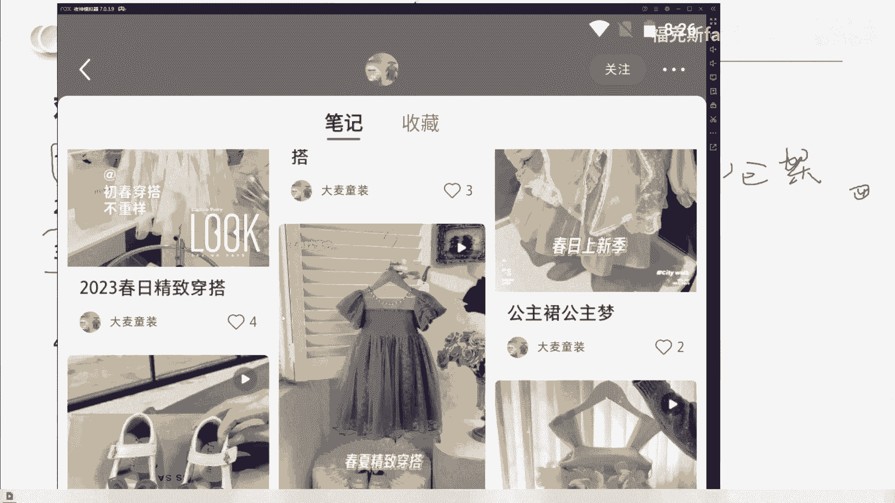

有一篇100个点赞了，而他的下限是多少是五。

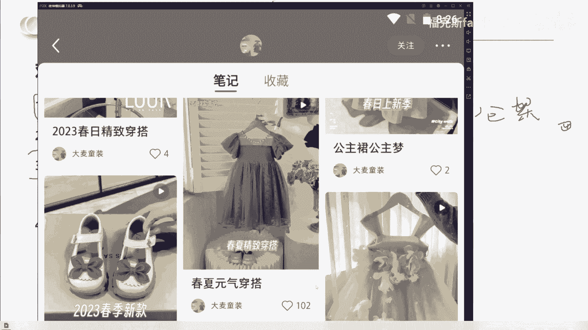

所以我刚刚前面给大家是不是讲过，我们去找对标，是提升账号的下限，从什么，从偶然性中找到必然性，明白吗，从偶然性中去找到必然性好，我们再继续看一下啊，像这种合集账号，对不对，那我想问一下大家。

这个合集账号他数据好吗，数据好吗，我们看一下啊，目前还可以啊，到这一条还可以啊，四个四个的合集啊，他的下限大概是上百赞的样子，这个是上百赞啊，上百赞它是属于444张图拼图的数据，哎看到没有看到没有。

这一条袜子，这一条袜子啊，他有4673个点赞，4673个点赞，在这一个场景中啊，左边的这个袜子，但是我想告诉你，这个商家的运营并没有很优秀，你们知道为什么吗，我想问一下大家，当你有一篇笔记。

能够出现4673个点赞的数据的时候，你们会想到什么操作啊，你们会想到什么操作，能告诉我吗，为什么我说这个运营啊，他并没有很优秀。

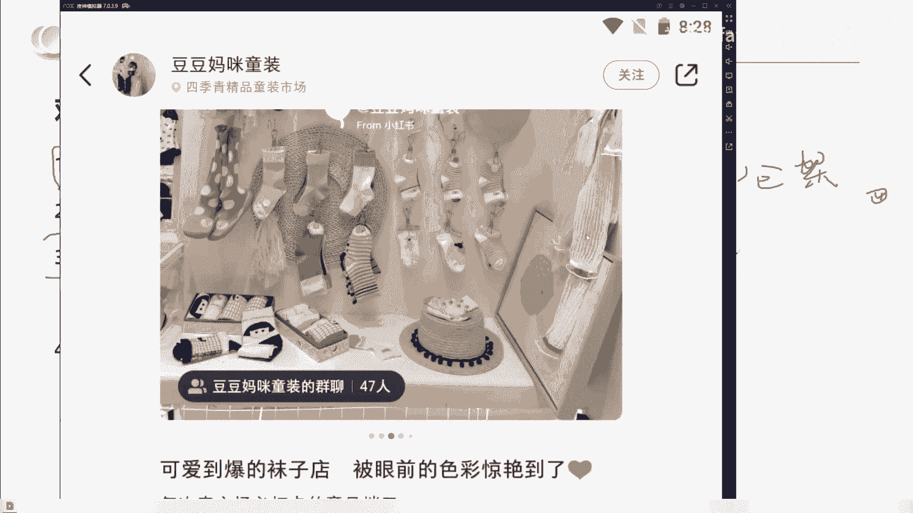

他绝对不算顶级S级的运营，我告诉大家结论啊，为什么，是因为它没有复制，你都知道这个角度有4673个点赞了，你为为什么不把这个角度，隔一段时间再发一次呢，对不对，而这一篇笔记如果我们是卖袜子的。

我们刷到了，我们是不是可以收藏到我们的专辑里面，作为封面的专辑，因为他这一篇我们去分析的话，是封面吸引人还是标题吸引人，所以我告诉大家，我们找对标不是一个今天一天做完的动作。

我们的对标和学习是一个持续的对坐，所以这一张图片对卖袜子的账号来说，是有绝对参考意义的，如果卖袜子的刷到这篇，他一段时间内去复制，这个一定是可以把下限提到几百个点赞的，大家相信吗。

好那我们继续往下去看啊，诶又有意思了哦，大家发现没有，这一篇笔记，最右边的这篇笔记，他有700多个点赞，还有700多个点赞，它是什么，它是把饰品挂到一起，我想问一下大家。

这个袜子和这个饰品它有没有关联性，有没有关联性，是不是属于我们把产品挂到一六，用一个45度角去拍摄出很多的产品，是不是有关联性，所以这是不是一个共性，我们是不是发到了一个惯性共性啊，包括他尝试的货架。

哎我们发现没有，这又有一篇啊，又有一篇500个点赞的，他是不是把这个饰品放到这样的一个角度对吧，陈列很多的情况下，是不是数据也挺好的，所以我们在分析别人的过程中，我们要找的什么，要找的是怎么样让数据好。

然后可复制提升自己的一个内容下限啊，那你相信他啊，他也不是说没有做尝试啊，看到没有，其实这一篇也是一样的，他也是一个袜子斜拍的角度，300多的点赞，他也做了尝试啊，比如说母亲拿着衣服拍好。

宝宝在在这个篮子里面拍啊，是不是也是一种方式啊，甚至货架，等等啊，所以这一个运营它的优点是什么呢，他会去尝试啊，会去尝试，但是他趁热打铁啊，和这个乘势追击的这个运营思维啊。

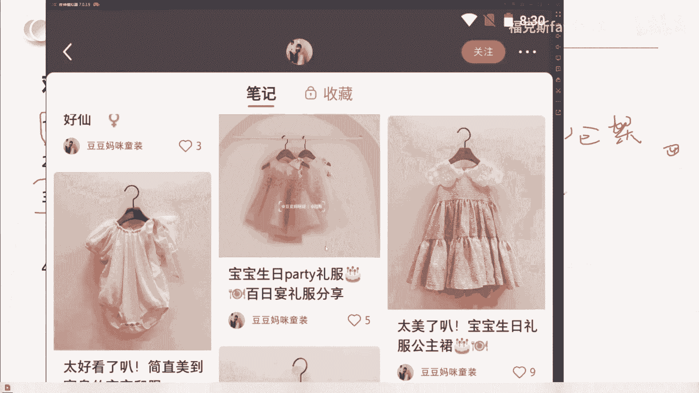

稍微差了一些，差了差了一些，所以啊我告诉大家，为什么说最后啊我们是要干嘛，我们是要找到适合自己的账号和定位，为什么我们要找到适合自己的，因为不是所有的表现形式都适合你，比如说我们看到的目前数据最好的啊。

她有一个可爱的女儿，对不对，在外面去拍摄，那如果你的孩子还是一个半个月大的baby，对不对，或者是已经是一个读高中的男孩子，你怎么去拍这样的内容，你是不是没有创作条件，对不对。

那同样的有的内容它是属于拍照好看的，有的内容它是视频创作出效果的，那如果你没有视频，那是不是不适合你，所以我们要通过种种的归类方式，和和这个角度的整理，去找到适合自己的账号定位和表达方式，能理解吧。

最后你们是要找到自己的账号定位和表达方式。

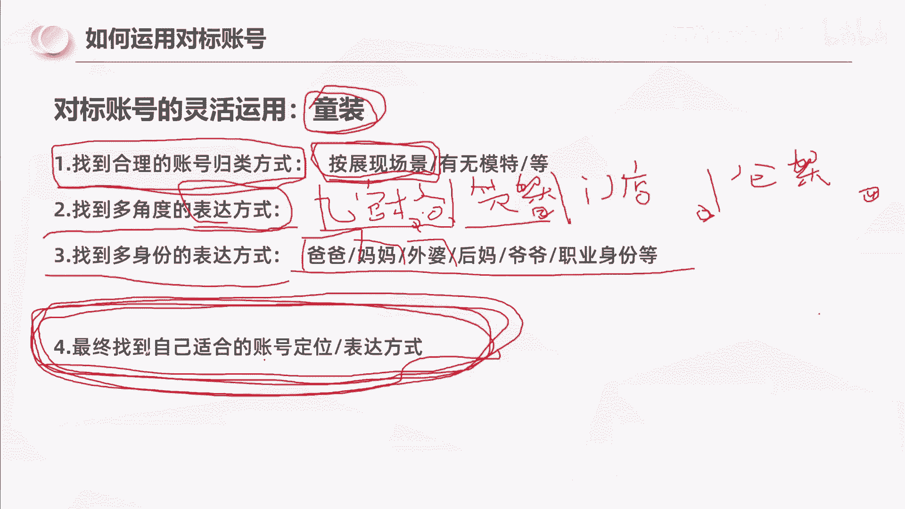

所以最后啊我跟大家讲一下。

有效对标和无效对标，因为你们在找的过程中呢，其实有可能会踩坑的啊，因为在我接触这么多商家的过程中，我发现了几个坑啊，第一个是什么，是他们找到一个大几10万的粉丝的账号，但是我们去看笔记的时候。

就是他这一篇，他这个账号可能就是20万点赞啊，20万赞啊，5万的粉丝看这个数据很牛逼，但是你看他的笔记，你会发现他最近的20篇笔记，可能就是五个点赞，十个点赞，那这种账号他其实是运营过早的账号。

他的积累是因为平台初期的红利，所以这种账号对你们来讲是没有对标价值的，所以我讲叫无效对标，那么第二个账号是啥，是粉丝量过大的账号，可能是平台选出来的案例账号，大家知道今年啊今年小红书平台要做直播。

选出来的案例账号是谁吗，把谁打在，把这个人的名字打在公屏上好吗，所以如果你要去对标，你要尽可能跳出平台的一个案例账号，因为平台的案例账号是你没有对标意义的，平台会用各种流量和资源去总结，去帮他打起来。

知道吧，第三个是啥，第三个是持续投放流量的账号，持续投放流量的账号，因为你们在刷的过程中，也有一部分笔记，右下角是有赞助标签的，那这种账号它能带来的流量不一定是自然流，而你如果是做自然流的情况下。

这种账号对你来说没有建议，如果你是打付费流，那赞助数据高的笔记肯定是对你有借鉴意义的，因为他只有这个笔记出效果，他才会持续去投这个笔记，大家能理解吧，第四个是啥，是也是比较容易踩的一个坑啊。

就是只有数据没有咨询的账号，就是在我们刚刚所看的这些账号里，其实我们可以通过他的评论区去看到，有人有没有人在下面评论，怎么买怎么买啊，在哪买多少钱，有这些评论意味着什么，意味着观众和消费者有购买欲。

如果没有，意味着这个东西只是点赞收藏高，所以不要去对标这种只有数据，没有咨询的以及什么，以及不要去对标近期数据不稳定的账号，为什么我在抖音，对不对，曾经有一个炫劳力士表的账号，是不是很牛逼啊。

导演叫小旦，是不是枯燥无味的生活啊，那当他把运营换了之后，这个账号数据一下就下来了，所以如果一个账号它的数据不稳定，那么你要意识到他是不是可能更换了运营，所以我们找对标啊，要先把对标账号拎出来。

再反问一下自己，这个账号是有效对标还是无效对标，把无效对标的账号剔除掉，然后找到我们的一个规律，那有效对标有什么特征呢，第一个特征是什么，是半年内数据优秀的账号，半年内数据优秀的账号。

因为他3年前就已经做了10万粉了，和三个月做1万粉，那肯定是后者对你的借鉴价值更大，因为3年前的运营方法和涨粉方式，可能更加的简单啊，第二个是粉丝增长速度快的算好，比如说你哪怕他现在只有1000个粉丝。

但是你发现他总共才发了半个月，一个星期，他七天15天就做到了1000粉丝啊，这种也是属于有运营人才在做才能做出来的，第三个是什么，是评论区咨询量大的账号，因为如果你的目标是卖货卖货卖产品。

那你就一定是要以评论区去判断，他的咨询量怎么样，是否有消费动因，那么第四个是什么，是我刚刚所说的数据下限高的账号，因为一个账号的运营是否优秀，我会看两个指标，第一个指标就是他粉丝增长的速度对吧。

比如说他是通过500篇笔记去做到1万粉丝，还是通过100篇笔记，他就能做到1万粉丝啊，这里还记得我用了多少篇笔记吗，我用了29篇笔记做到了1万粉丝啊，一个是这个水平的差异，第二个是看数据下限啊。

有的账号五个点赞，十个点赞啊，500个啊，十个十个啊，50个，那有的账号他是三百五百一千啊，三百五百一百，那你肯定是要去关注这种数据下限高的账号，因为你去获得几千几万个点赞是需要运气的。

但是你能够稳定的获得上百个点赞，这个是运营的实力在那里的，明白吧，嗯所以再次给大家啊去讲一下，所有自媒体平台的运营，其实就是这12个字，找对标，拆爆款，多尝试要坚持，那我今天跟大家详细讲的内容是什么。

是如何找对标，对不对，我们怎么样找到有效的对标，怎么样去通过对账号的一个分类方式，去套到这个账号中，去，找到数据下限高的表达方式，那么面对你们后面还有什么，还有猜爆款，还有多尝试以及什么。

以及要坚持再牛逼的运营啊，他牛逼也是需要尝试的，他不是把脑门一拍诶，我按这个方式拍会爆，我按那个方式拍去报，不是的，越牛逼的运营，他越会尊重这个市场的一个客观规律，为什么。

因为本身小红书每天就有大几10万的笔记，新的笔记投放到市场中，本身这个事事情这个笔记它能获得上千的点赞，就已经是千里挑一的了，就相当于什么就相当于什么，就相当于说小红书他是开卷考试，就像我啊。

我读书的时候，如果说你把我放在全年级第100名，那我考试成绩就在200名以内，但是我最牛逼一次，我考了全年级第59名，你们知道坐在我旁边的是谁吗，是全年级第19名，其实就是这个逻辑，小红书是开卷考试。

他的这一篇笔记已经在排名中拿到了好的排名，你就要去研究它，借鉴他，所以最后呢就是我们要说的坚持啊，再坚持好，今天的分享就到这里。

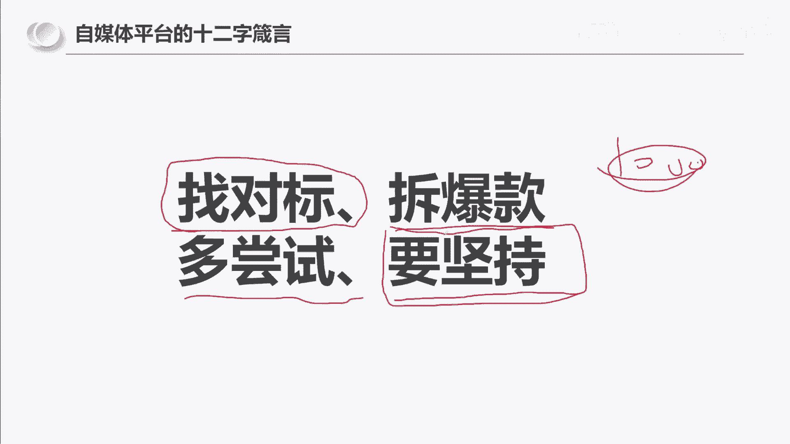

更多干货慢慢更新。