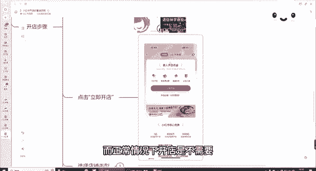
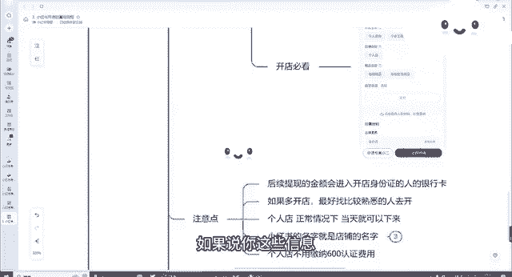

# 2024年做小红书音怎么快速起号？5个步骤轻松起号：找账号-定形式-抄选题-测爆款-复制爆款！ - P7：03.小红书开店的基础流程 - 我才不要像你 - BV1GyHSekE96

今天我们来讲一讲我们第三课程，小红书开店的一些基础的一些流程，我们如何去开通我们的个人店，个体店以及我们的一些旗舰店啊等等等等。

好吧，我们先从我们的个人店开始来讲呃，首先我们个人店的话是可以通过手机开通，也是可以通过电脑开通的，手机开通的话，我们就下载一个，我们我们可以用小红书本身的账号，也可以，或者说我们下载一个小红书的千帆。

我接下来也会跟大家具体来讲一讲小红书，千帆好吧，我们需要的需要的证件，需要你有一个身份证以及有一个银行卡呃，但是这个一定要是同一个人才行对吧，你身份证跟你银行卡绑定的是同一个人呃，这个是必要的条件。

因为他后续，所以说这个如果说大家是用自己家里面人，或者用亲戚绑定的这个身份证的，绑定这个账号的，所以说一定要找比较熟悉一点的对吧，要不然后续会考虑到一个经济纠纷等等对吧。

这是第一个，第二个呢就是我们开店过程中金利营的类目啊，其实可以前期随便选一个，先把店铺开通了再说，反正呃后面啊反正可以随时再改类目，因为我们叫如果说你想持续做的话，你要交交保证金对吧。

但是我们在开店的过程中，保证金可以先跳过，先不用交对吧，店铺可以随便取，后面我们后续我们再改都可以好吧，经营的地址呢也是可以随便填写的，这都没问题好吧。

那具体的开店步骤，我来跟大家来讲一讲怎么去操作。

首先第一步打开我们小红书的搜索栏，这是我们普通的系统，打开我们小红书搜索栏。

你看到了，这是我们小红书搜索栏，我们在上面搜索开店两个字。

搜索开店两个字，打开开店了，看到开店，我们搜索开店，这边有个小红书电商，小红书电商官方平台，点击开店，我们就点击这个就可以了好吧，点击开店之后。

点击你一即开店，这边跳出来之后，我们这边有个立即开店呃，我们可以先看一下。

比开店必要必看的一些材料费用，而正常情况下开店是不需要。

你如果说开个人店的话，不需要收费的，零元就可以开，开通了，服务费优惠，流量扶持必备工具。

选择立即开店，选择立即开店之后，我们选择店铺的类型对吧，我们前期我们可以先选择个人，选择个人店，那个人店的话只需要你有身份证，如果说你想开一个个体店的话，需要有营业执照以及运营人的身份证证件。

这个的话是支持一部分的类目的对吧，按但是如果说你想开通个人店。

后期也可以转为个人，个体工商户店都可以的好吧，如果说你是企业的话。

也可以开通企业店，但是企业的话可能会以额以及专卖店，可能会呃考虑到一个税务的问题好吧。

关于开通电，我们点击店铺选择完之后。

我们点击下一步对吧，它会里面会有很多店铺的介绍，我们就选择个人店。

选择嗯，你自己想要的店铺就可以了，选择完店铺之后，我们选择点击下一步。

点击下一步邀请码，我们可以跳过对吧，没有可以不填，这是关于服务商的呃。

我们填写其中的一些信息，身份证的正反面照片啊，以及我们这边可以选择属于零星小小额交易，依法无需要办理的。

以及如果说我们是农副产品的，需要办理的对吧，开店必备的，我们这里面也是有一些开店必备的个人身份，个体户的企业啦等等等等，电商我们去填写一些自己的一些信息就行了，很简单好吧不呃，有很多信息。

如果说你不需要可以跳过的，你可以先跳过对吧，我们选择个人身份，个体店电商用品就可以了，选择立即开店，正常情况下我们的店铺就可以开通了。

好吧，这是我们开店的步骤，那有几个注意点跟大家讲一讲，首先呃，后续提现的金额会进入开卡身份证人的银行卡，所以说这个就是刚刚跟大家讲过的，我们需要开卡人的身份证，跟我们的这个银行卡需要是同一个人。

好吧，呃以及我们如果说多开店的话，最好找熟悉的人来开对吧。

亲戚朋友啊，个人店，正常情况下呃，当天时间，如果说你这些信息填写的都没有问题的情况下。

当天他就可以下来了，小红书的名字也就是店铺的名字。

比如说需要注意的是提前查重对吧。

我们小红书店铺的名字也也可以提前，可以前前期可以先随便选一个，后面也可以改对吧，但是七天改一次，比如说你这个小红车名称叫111。

那你这个店铺名称就叫111的店，个人店不需要缴纳600块钱的证件费用呢。

好吧，这个是我们跟大家简单来聊一聊，个人店保证金的话，1000块钱大概在1000块钱左右，也不一定根据不同的类目来分好吧。

最低应该是1000块钱，这个有个平台的扣点，平台的扣点大概在每个月成交额的5%，因为基本上所有平台他都会有一个平台扣点，低于1万元的，是不收这个平台扣点的，一个自然月订单金额呃，结算额小于一元1万10。

平台免收技术服务费，懂我懂我说的意思吧，假如说你这一个月整体的收入在小于1万元的，成交额在小于1万元的，他是不收你的技术服务费的，结算额超过1万元，部分平台按5%收比。

比如说你今天啊这一个月成交额超过了2万，那你超额2万，那里就有其中的1万，你要收给平台一个5%的收服务费好吧，1万元的结算金额已减去退款金额，技术服务费小于5%的店铺，不享受5万元和以下的棉袄。

这个大概大家了解一下就可以了好吧，这个是关于个体店的。

个体店的一些部分，大家可以去开店呃。

了解一下，如果说你想开个体个体店的话，就需要我们实名小红书的账号呃。

以及加上我们的营业执照对吧，需要是同一个人的，就比如说你小红书是是是谁的营业执照的法人，营业执照上面的人最最好是同一个人，就要同一个人，然后我们可以通过手机开通手机，打开我们小红书的商家版。

目前也叫小红书千帆好吧，呃，小红书千帆给大家打一下吧，后续也会跟大家具体来介绍千帆，然后大家可以下载这个手机，开电脑，开通的话就开小红书呃，千帆千帆的官网就可以打开里面去注册了好吧，我们的专卖店旗舰店。

如果说你确实是有专卖店，旗舰店也是可以干到我们刚刚的步骤去开通的。

呃接下来讲一讲我们一些特殊的一些类目。

可能是比大家比较想了解的，比如说酒水啊，零食啊，水果啊这些需要有营业执照加食品经营许可证，加上品牌授权的这些基本上都需要的，但我建议大家就是，如果说你不是特别擅长于这几个行业，尽量就先别入局这些好吧。

美妆行业呢需要有化妆品备案凭证，家电行业的需要有3C认证证书，3C数码的需要有3C认证证书，其他的内幕的都有，具体的介绍，都能在我们小红书的内幕里面可以找到好吧，然后如果说大家有任何关于内幕不懂的吧。

我们接下来也会跟大家讲一讲，怎么去选择类目的问题好吧。

那我们今天这堂小红书开店的一些基础流程，主要是跟大家讲一讲如何去开店。

步骤操作的好吧。

