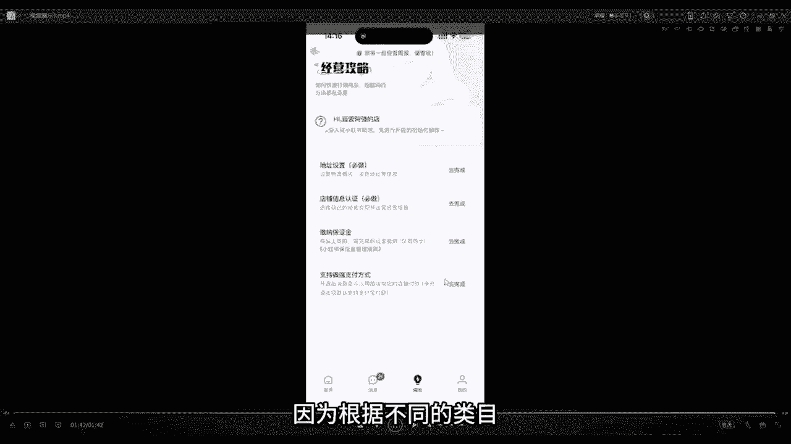
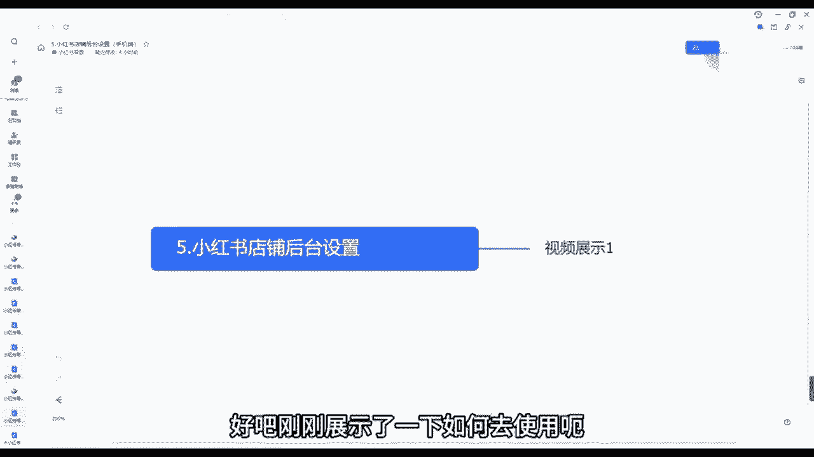

# 2024年做小红书音怎么快速起号？5个步骤轻松起号：找账号-定形式-抄选题-测爆款-复制爆款！ - P9：05.小红书后台的基础操作（手机端） - 我才不要像你 - BV1GyHSekE96

大家好，今天来跟大家来讲一讲小红书店铺后台，我们如何去通过手机端设置一些内容的好吧，然后我们会以视频的形式跟大家展示一下，首先呃我们打开的系统是这千帆系统，来给大家看一下小红书千帆，那大家能看得见吗。

小红书千帆的系统，直接我们到应用商店里面去搜索，小红书千帆就行了，这个是我们后台呃，基本上会操作的好吧，这直接到应用商店里面去搜搜搜索就可以了，我们打开之后，大家可以看到，我们打开之后。

我们正常是这个页面，这是我们创的一个新店，基本上没有什么操作的，这边有一个消息，我们点击消息，点击消息里面，这里面就是我们客服接待的一些通知，如果说有人问我们店铺的一些问题了，我们就可以在里面去回复他。

在里面去回复他，只是客服接待的一些通知啊，都是可以在里面看到的，以及我们配置客服啊等等等，这里面都可以看到，看到了吗，这是店铺的一些消息啊，一些通知啊，一些比如说你违规的通知啊等等，这里面都会有好吧。

然后我们打开我们的首页，这里面有个区初始化，我们这边可以去填写一些信息，以及我们这边有个全部工具，我们这边可以发布作品啊，笔记管理啊，电脑端啊等等等等，这边都可以，我们点击全部工具，这里面可以呃。

给大家看一下啊，点击全部工具，这边有发布作品，全部全部发布商品，我们可以发布新的商品，我们可以管理全部的商品，全部的订单对吧，售后的订单数据中心额商品笔记啊等等等等，这里面都可以。

以及我们发布商品的类目啊对吧，品牌类目啊，店铺的装修群管理呃，我们打开这边有个成长成长，这边正常情况下，我们先要去把这些给他完成对吧，才能继续后面的操作地址对吧，我们这边有个地址要填写我们的发货地址。

这是我们这是我们开店铺的第一操作，我们需要去填写我们的地址好吧，我们就点进去完成，在这个地方也是可以去填写地址的，看到了吗，地址呢我们这边可以，这个时候我已经填好了对吧，我们正常情况下可以去填填。

具体地址怎么填呢，这边可以看到我们联系人随便写，我们自己就可以了，地址中国大陆选择了应该在的地区，详细地址呢其实可以随便填，因为我们是做一件代发的嘛，我们这个地址是是可以随便填的好吧。

我们填写自己的手机号码，留给买买家留言，一定要之前有，这边是可以填写联系客服的，但是现在填联系联系不了了，我们一边填，一定要联系客服给地址好吧，这是就是影响到我们一些退货的一些问题。

如果说我们这边填线联系客服的话，他这边平台是不给通过的好吧，我们要在这个地方来填写地址好吧，然后我们填写完成之后，这边也可以填写我们的物流，物流板块对吧，我物流板块填写我们的名称。

继续去添添加就行了对吧，我们添加呃，这边是可以添加我们的付运费板块的，你可以选择，如果说大家看过抖店的这些应该都明白对吧，呃或者说你们不明白的话，我们可以添加运费模板。

就比如说你是新疆西藏这些不配送的对吧，我们可以直接选择不配种，如果说需要付费的对吧，买家承担邮费的，我们也可以去这边去选择非偏远地区的，或者说全国包邮的这些模板，我们可以它本身它会有系统默认的。

但是我们正常情况下就选择这个模板就行了，不是全国班游五嘛，因为这些地方我们都需要付邮费的好吧，这些邮费也是比较高的，我们就这是关于地址的选择，再看这边发布作品，看到了吧。

这个就是大家可能呃这边有一个优惠券，可以设置优惠券的，来给大家具体来跳一下，看一下，这边有个营销，这边有个优惠券活动报名对吧，点击进去，我们可以创建自己的优惠券对吧。

比如说你创建店铺通用的店铺通用的优惠券，指定商品的优惠券，店铺的新人券对吧，这些都是可以的，我们接下来也会跟大家具体来讲一讲，怎么去操作的，全网自动推广的对吧，正在生效的以及失效的等等。

这些都需要大家去了解的，这边填完之后呢，地址填完之后，店铺的认证信息对吧，我们需要去填写你是个人店啊，什么店啊填写，然后缴纳保证金，如果说大家想长期在呃我们这个平台做的话。

我建议大家还是需要去把保证金交了，我们这边一定要注意，一定要去把这个微信支付给它打开，以及我们的支付宝支付，按照它上面的流程对吧，你填写自己的身份证号码，你银行卡只要在这里面操作，我们就可以。

人家就可以通过微信支付，可以通过呃支付宝支付了好吧，我们补交补交我们的额店铺的保证金就可以了，因为根据不同的类目。

所以说他保证金也不一样，那这个就是我们今天的这个小红书店铺，后台手机端的一些操作，大家多去琢磨琢磨，多去摸索摸索，基本上这个是没什么太大难度的好吧，刚刚展示了一下如何去使用呃。

如何去设置地址呀，如何使用优惠券好吧。