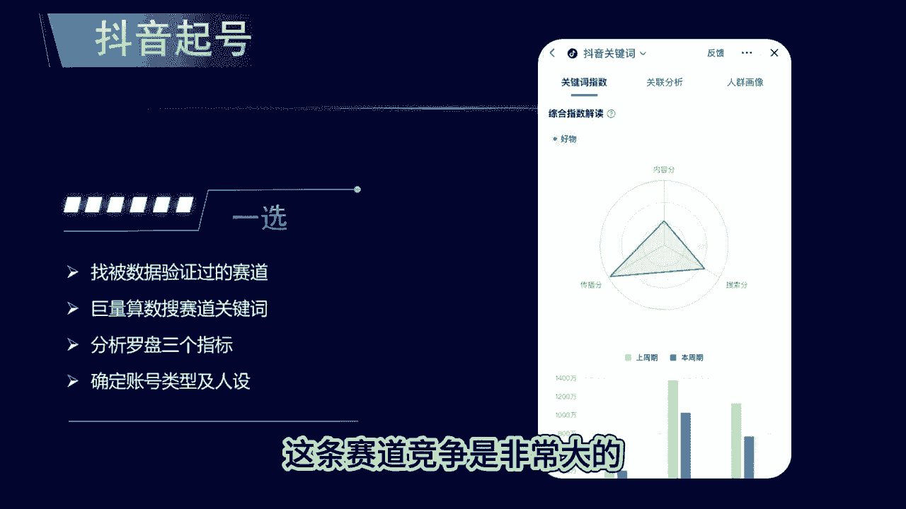
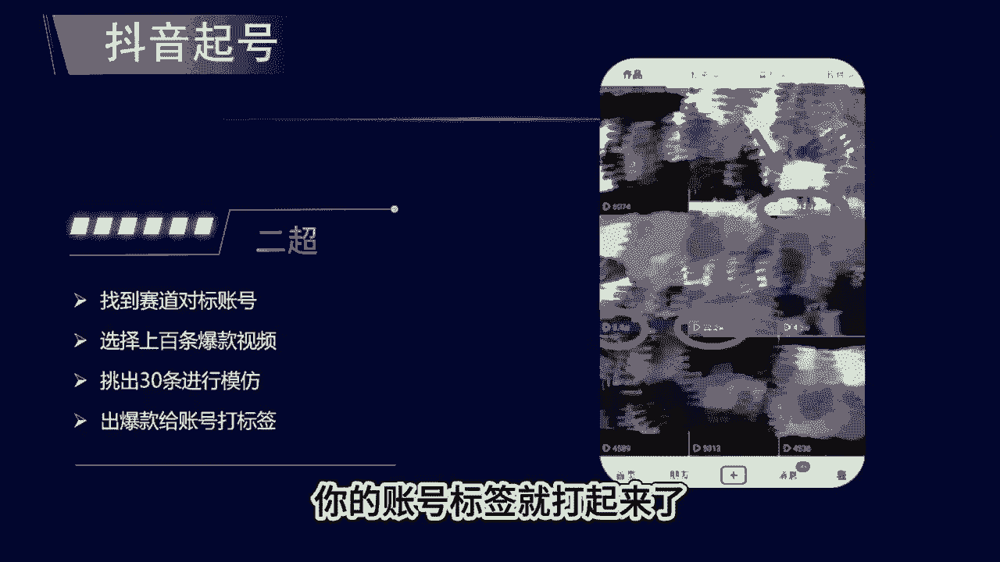
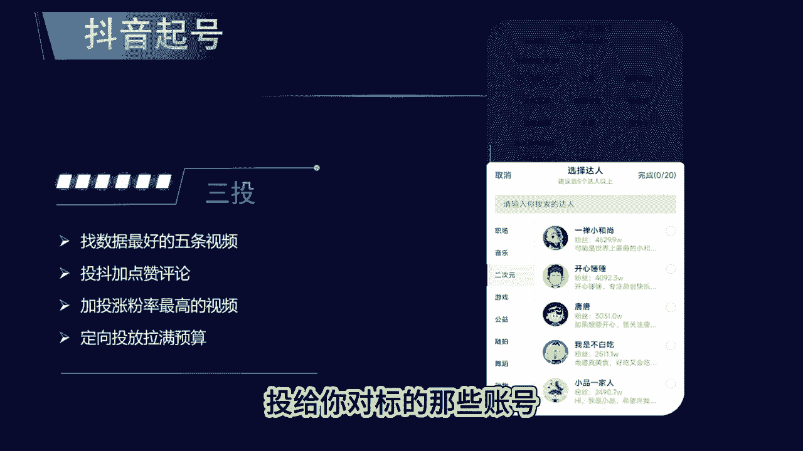

# 2024年做抖音怎么快速起号？3天养出一个高权重抖音账号，掌握这7点，抖音快速养号小技巧！ - P1 - 小栗子久 - BV1XC1eY6Eec

说一个比较残酷的内幕，能在抖音短时间起号的人，其实是掌握了普通人永远想不明白的四个窍门，做抖音就像一层窗户纸，很多人可能多少年都不知道怎么捅破，现在不少做抖音培训的，故意把这四个窍门复杂话去讲给你听。

听，到最后花了不少冤枉钱，也没搞明白到底要怎么做，这四个窍门简单来说其实就是一选二抄，三投四抄，下面我就详细拆解下视频，有些长可以收藏下来，慢慢看一选，就是找被数据验证过的爆款选题机，对标账号。

不管做任何事情，都是选择大于努力，这第一步，就把大部分想做好抖音的人给筛选掉了，那怎么寻找被数据验证过的好赛道呢，我们先在抖音上搜索巨量算数并进入，然后搜索你想做的赛道关键词，比如搜索好物。

再看一下这个分析罗盘，可以看到有内容分传播分搜索分三个指标，这三个指标的数值都是差不多的，说明创作的人非常多，这条赛道竞争是非常大的。

大家可以按照这个方式去搜索自己想做的赛道，然后确定自己的账号类型及人设，另外再给大家一个建议，做抖音就要想着从第一个粉丝开始变现。

所以一定要提前想好自己的变现方式，等粉丝多了再去思考变现体系，会错过很多机会，二超就是找到我们赛道的对标账号，然后找出他们十条最火的选题，这样找到上百条没问题，然后从里面挑出最火的30条文案。

用自己的话再写一遍，进行高度还原拍摄，那这30条视频中大概率会出现爆款，一旦有了爆款，你的账号标签就打起来了。

前期千万不要搞什么创新，模仿爆款就行了。

只要有了数据正向反馈，后面才有足够的动力，那如果发出来的视频数据不好又怎么办呢，这种情况就要用到三头了，我们在这30条视频中找到数据最好的五条，每条投放100斗家，直接投放点赞评论就可以。

因为投点赞评论的涨粉才是活粉结束后，我们找到其中涨粉率最高的视频，直接投放500斗家，如果涨粉量大于500，我们直接定向投放，拉满预算，选相思达人，投给你最标的那些账号。

基本上这条视频会帮你涨5000到1万粉。

而且粉丝非常精准，这个时候账号标签基本就打上了。

后面每个视频都能有个上万播放，这时账号算是起来了，最后一步就是抄，我们直接搜索抖音热点宝，点击观测，选择你的领域，比如科技官方会帮你筛选出最近一周，涨粉最快的科技账号，然后我们找粉丝不多。

且视频数据一般的账号，看他们突然爆了的视频，找到后就是开始超越了，这里要看两个数据，一是点赞，点赞多代表播放量高，数据好，二是收藏，因为点赞多不一定涨粉就多，但收藏量高，涨粉量也一定高。

一个视频有上万的收藏量，那这个账号至少能涨3000~5000的粉丝，所以我们找点赞和收藏高的视频。

再提取它们的内容价值点，并融合到自己的视频里面，比如收藏量高。

我们就模仿他的框架，点赞高，我们就模仿他的开头五秒，学会这些技巧，你也就离大博主又近了一步，做抖音不能只展现自己的想法，更要迎合算法想要的数据，最后我也给大家整理了一阵抖音。

起号指南及数十个行业的爆破选题，评论区留言学习领取好了，本期干货就到这里。